# مستندات دیاگرام‌های سیستم تحلیل تکنیکال بورس ایران
# Iranian Stock Market Technical Analysis System — Diagram Documentation

> **نسخه**: 2.0 | **استاندارد**: DFD + BPMN 2.0 + UML 2.5  
> **تعداد دیاگرام‌ها**: 12 DFD + 9 BPMN + 21 UML ساختاری + 11 UML رفتاری + 12 UML تعاملی = **65 دیاگرام**

## فهرست مطالب
- [بخش اول: دیاگرام‌های جریان داده (DFD)](#dfd)
- [بخش دوم: دیاگرام‌های فرایند کسب‌وکار (BPMN)](#bpmn)
- [بخش سوم: دیاگرام‌های ساختاری UML](#uml-structural)
- [بخش چهارم: دیاگرام‌های رفتاری UML](#uml-behavioral)
- [بخش پنجم: دیاگرام‌های تعاملی UML](#uml-interaction)
- [بخش ششم: جدول انسجام بین دیاگرام‌ها](#coherence)
- [بخش هفتم: ضمائم](#appendix)

---
<a id="dfd"></a>

# نمودارهای جریان داده (Data Flow Diagrams — DFD)

> این بخش نمودارهای جریان داده سامانه تحلیل تکنیکال بورس ایران را در چهار سطح تجزیه نشان می‌دهد. هر سطح جزئیات بیشتری از فرایندها، مخازن داده و جریان‌های بین آن‌ها را آشکار می‌کند.

---

## متغیرهای سبک نمودار

در تمام نمودارهای زیر از کلاس‌های رنگی یکسان استفاده شده است:

| کلاس | رنگ | کاربرد |
|------|------|---------|
| `Entity` | سبز | نهادهای خارجی (منابع/مقاصد داده) |
| `Process` | آبی | فرایندهای تبدیل داده |
| `DataStore` | نارنجی | مخازن ذخیره داده |

---

# ═══════════════════════════════════════════════════════════════════
# سطح ۰: نمودار زمینه (Context Diagram — DFD Level 0)
# ═══════════════════════════════════════════════════════════════════

در سطح ۰، کل سامانه به‌عنوان **یک فرایند واحد** نمایش داده می‌شود که با نهادهای خارجی تبادل داده دارد. این نمودان مرز سیستم و تعاملات آن با محیط خارجی را نشان می‌دهد.

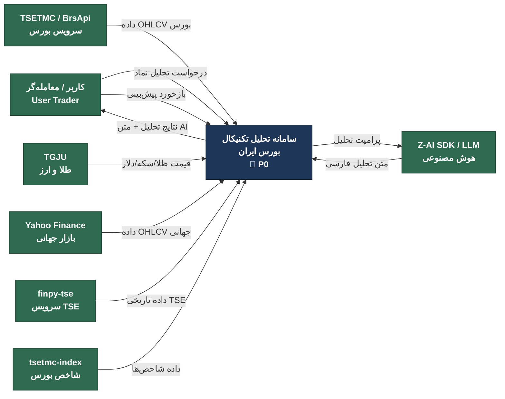
```mermaid
flowchart LR
    classDef Entity fill:#2d6a4f,stroke:#1b4332,color:#fff,font-weight:bold
    classDef Process fill:#1d3557,stroke:#0d1b2a,color:#fff,font-weight:bold
    classDef DataStore fill:#e76f51,stroke:#9e3a22,color:#fff,font-weight:bold

    E1[کاربر / معامله‌گر<br/>User Trader]:::Entity
    E2[TSETMC / BrsApi<br/>سرویس بورس]:::Entity
    E3[TGJU<br/>طلا و ارز]:::Entity
    E4[Yahoo Finance<br/>بازار جهانی]:::Entity
    E5[Z-AI SDK / LLM<br/>هوش مصنوعی]:::Entity
    E6[finpy-tse<br/>سرویس TSE]:::Entity
    E7[tsetmc-index<br/>شاخص بورس]:::Entity

    P0[سامانه تحلیل تکنیکال<br/>بورس ایران<br/>🔵 P0]:::Process

    E1 -->|درخواست تحلیل نماد| P0
    E1 -->|بازخورد پیش‌بینی| P0
    P0 -->|نتایج تحلیل + متن AI| E1

    E2 -->|داده OHLCV بورس| P0
    E3 -->|قیمت طلا/سکه/دلار| P0
    E4 -->|داده OHLCV جهانی| P0
    E6 -->|داده تاریخی TSE| P0
    E7 -->|داده شاخص‌ها| P0

    P0 -->|پرامپت تحلیل| E5
    E5 -->|متن تحلیل فارسی| P0
```

### توضیحات سطح ۰

- **نهادهای خارجی**: هفت منبع/مقصد داده در مرز سیستم وجود دارند. سه نهاد داده‌محور (TSETMC/BrsApi, TGJU, Yahoo Finance) داده‌های خام بازار را تأمین می‌کنند. دو نهاد سرویسی (finpy-tse, tsetmc-index) داده‌های تکمیلی تاریخی و شاخصی ارائه می‌دهند. نهاد Z-AI SDK متن تحلیل هوشمند فارسی تولید می‌کند و کاربر (معامله‌گر) درخواست و بازخورد را ارسال می‌کند.
- **فرایند مرکزی P0**: کل سامانه به‌عنوان یک جعبه سیاه واحد عمل می‌کند که داده‌های خام بازار را دریافت و نتایج تحلیل + متن AI را تولید می‌کند.
- **جریان‌های ورودی**: داده OHLCV (بورس، جهانی)، قیمت طلا/ارز، داده شاخص‌ها، درخواست تحلیل و بازخورد کاربر.
- **جریان‌های خروجی**: نتایج تحلیل تکنیکال، متن تحلیل AI، و پرامپت ارسالی به LLM.
- **مهم‌ترین ویژگی**: هیچ مخزن داده‌ای در سطح ۰ نمایش داده نمی‌شود — ذخیره‌سازی داخلی در سطوح پایین‌تر آشکار می‌شود.

---

# ═══════════════════════════════════════════════════════════════════
# سطح ۱: نمودار فرایندهای اصلی (DFD Level 1)
# ═══════════════════════════════════════════════════════════════════

سطح ۱ فرایند مرکزی را به **۷ فرایند اصلی** و **۶ مخزن داده** تجزیه می‌کند. جریان‌های بین‌فرایندی و دسترسی به مخازن مشخص می‌شود.

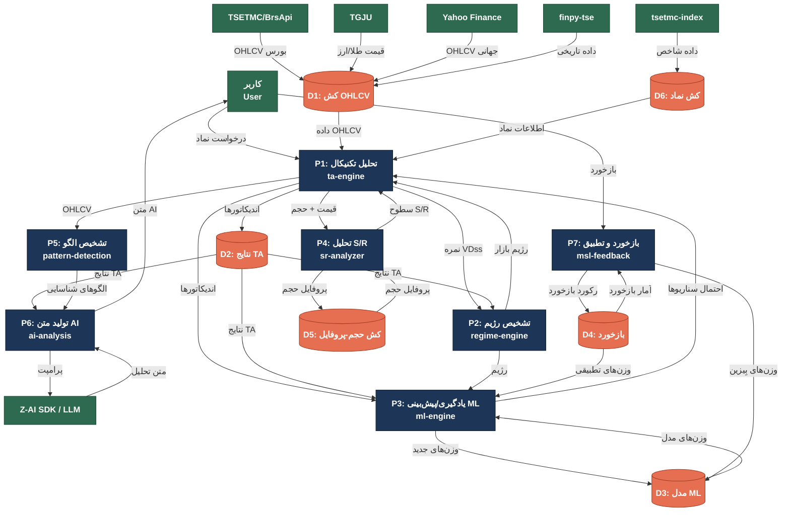
```mermaid
flowchart TB
    classDef Entity fill:#2d6a4f,stroke:#1b4332,color:#fff,font-weight:bold
    classDef Process fill:#1d3557,stroke:#0d1b2a,color:#fff,font-weight:bold
    classDef DataStore fill:#e76f51,stroke:#9e3a22,color:#fff,font-weight:bold

    E1[کاربر<br/>User]:::Entity
    E2[TSETMC/BrsApi]:::Entity
    E3[TGJU]:::Entity
    E4[Yahoo Finance]:::Entity
    E5[Z-AI SDK / LLM]:::Entity
    E6[finpy-tse]:::Entity
    E7[tsetmc-index]:::Entity

    P1[P1: تحلیل تکنیکال<br/>ta-engine]:::Process
    P2[P2: تشخیص رژیم<br/>regime-engine]:::Process
    P3[P3: یادگیری/پیش‌بینی ML<br/>ml-engine]:::Process
    P4[P4: تحلیل S/R<br/>sr-analyzer]:::Process
    P5[P5: تشخیص الگو<br/>pattern-detection]:::Process
    P6[P6: تولید متن AI<br/>ai-analysis]:::Process
    P7[P7: بازخورد و تطبیق<br/>msl-feedback]:::Process

    D1[(D1: کش OHLCV)]:::DataStore
    D2[(D2: نتایج TA)]:::DataStore
    D3[(D3: مدل ML)]:::DataStore
    D4[(D4: بازخورد)]:::DataStore
    D5[(D5: کش حجم-پروفایل)]:::DataStore
    D6[(D6: کش نماد)]:::DataStore

    E1 -->|درخواست نماد| P1
    E2 -->|OHLCV بورس| D1
    E3 -->|قیمت طلا/ارز| D1
    E4 -->|OHLCV جهانی| D1
    E6 -->|داده تاریخی| D1
    E7 -->|داده شاخص| D6

    D1 -->|داده OHLCV| P1
    D6 -->|اطلاعات نماد| P1

    P1 -->|اندیکاتورها| D2
    P1 -->|نمره VDss| P2
    P1 -->|اندیکاتورها| P3
    P1 -->|قیمت + حجم| P4
    P1 -->|OHLCV| P5

    D2 -->|نتایج TA| P2
    D2 -->|نتایج TA| P3
    D2 -->|نتایج TA| P6

    P2 -->|رژیم بازار| P1
    P2 -->|رژیم| P3

    P3 -->|احتمال سناریوها| P1
    D3 -->|وزن‌های مدل| P3
    P3 -->|وزن‌های جدید| D3

    P4 -->|سطوح S/R| P1
    P4 -->|پروفایل حجم| D5
    D5 -->|پروفایل حجم| P4

    P5 -->|الگوهای شناسایی| P6

    P6 -->|پرامپت| E5
    E5 -->|متن تحلیل| P6
    P6 -->|متن AI| E1

    E1 -->|بازخورد| P7
    P7 -->|رکورد بازخورد| D4
    D4 -->|آمار بازخورد| P7
    D4 -->|وزن‌های تطبیقی| P3
    P7 -->|وزن‌های بِیزین| D3
```

### توضیحات سطح ۱

- **هفت فرایند اصلی**: P1 تحلیل تکنیکال، P2 تشخیص رژیم بازار، P3 یادگیری ماشین و پیش‌بینی، P4 تحلیل حمایت/مقاومت، P5 تشخیص الگو، P6 تولید متن AI و P7 بازخورد و تطبیق — هر یک ماژول مستقل با رابط‌های مشخص هستند.
- **شش مخزن داده**: D1 کش OHLCV (داده خام)، D2 نتایج اندیکاتورها، D3 مدل ML (وزن‌ها و پارامترها)، D4 بازخورد کاربران، D5 کش پروفایل حجم و D6 کش اطلاعات نماد.
- **جریان‌های بین‌فرایندی کلیدی**: P1 نتایج خود را به P2 (نمره VDss)، P3 (اندیکاتورها)، P4 (قیمت/حجم) و P5 (OHLCV) ارسال می‌کند. P2 رژیم را به P1 و P3 بازمی‌گرداند. P3 احتمال سناریوها را به P1 می‌فرستد. P5 الگوها را به P6 می‌دهد و P7 وزن‌های تطبیقی را به D3 ذخیره می‌کند.
- **نهادهای خارجی**: داده‌های خام از TSETMC, TGJU و Yahoo Finance وارد D1 می‌شوند. Z-AI SDK متن تحلیل فارسی تولید می‌کند. کاربر هم درخواست و هم بازخورد ارسال می‌کند.
- **حلقه بازخورد**: D4 ← P7 ← D3 ← P3 یک حلقه تطبیقی بسته است: بازخورد کاربر وزن‌های بیزین را بروزرسانی می‌کند و این وزن‌ها دقت پیش‌بینی ML را بهبود می‌بخشند.

---

# ═══════════════════════════════════════════════════════════════════
# سطح ۲: تجزیه فرایندهای اصلی (DFD Level 2)
# ═══════════════════════════════════════════════════════════════════

## ۲.۱ تجزیه P1 — تحلیل تکنیکال (ta-engine)

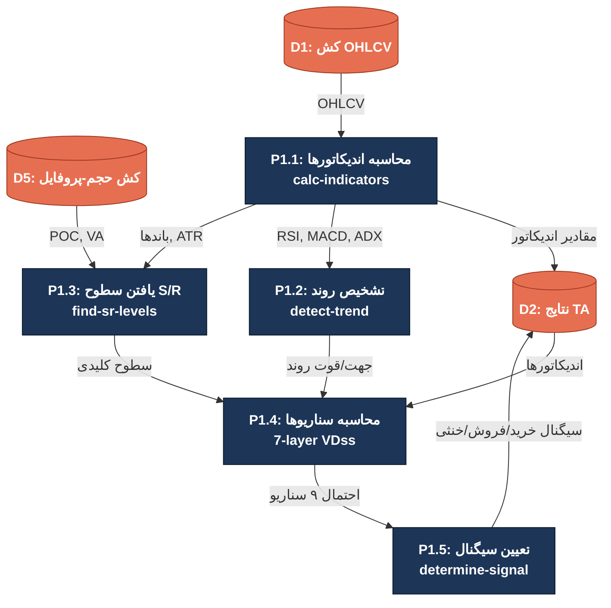
```mermaid
flowchart TB
    classDef Entity fill:#2d6a4f,stroke:#1b4332,color:#fff,font-weight:bold
    classDef Process fill:#1d3557,stroke:#0d1b2a,color:#fff,font-weight:bold
    classDef DataStore fill:#e76f51,stroke:#9e3a22,color:#fff,font-weight:bold

    D1[(D1: کش OHLCV)]:::DataStore
    D2[(D2: نتایج TA)]:::DataStore
    D5[(D5: کش حجم-پروفایل)]:::DataStore

    P11[P1.1: محاسبه اندیکاتورها<br/>calc-indicators]:::Process
    P12[P1.2: تشخیص روند<br/>detect-trend]:::Process
    P13[P1.3: یافتن سطوح S/R<br/>find-sr-levels]:::Process
    P14[P1.4: محاسبه سناریوها<br/>7-layer VDss]:::Process
    P15[P1.5: تعیین سیگنال<br/>determine-signal]:::Process

    D1 -->|OHLCV| P11
    P11 -->|مقادیر اندیکاتور| D2
    P11 -->|RSI, MACD, ADX| P12
    P11 -->|باند‌ها, ATR| P13
    D2 -->|اندیکاتورها| P14
    D5 -->|POC, VA| P13
    P12 -->|جهت/قوت روند| P14
    P13 -->|سطوح کلیدی| P14
    P14 -->|احتمال ۹ سناریو| P15
    P15 -->|سیگنال خرید/فروش/خنثی| D2
```

### توضیحات تجزیه P1

- **P1.1 محاسبه اندیکاتورها**: بیش از ۶۰ اندیکاتور (RSI, MACD, ADX, Stochastic, Bollinger, Ichimoku, VWAP و غیره) بر روی داده OHLCV محاسبه و در D2 ذخیره می‌شود.
- **P1.2 تشخیص روند**: با استفاده از ADX, MACD, ایچیموکو و خطوط روند، جهت (صعودی/نزولی/رنج) و قوت روند تعیین می‌شود.
- **P1.3 یافتن سطوح S/R**: سطوح حمایت و مقاومت کلیدی با استفاده از باند‌های بولینگر، ATR و پروفایل حجم (POC/Value Area از D5) شناسایی می‌شود.
- **P1.4 محاسبه سناریوها (VDss 7-layer)**: موتور ۷ لایه‌ای احتمال مسیر، ۹ سناریو قیمتی (از SC1 شوک نزولی تا SC9 شوک صعودی) را محاسبه می‌کند.
- **P1.5 تعیین سیگنال**: با ترکیب احتمال سناریوها و رژیم بازار، سیگنال نهایی (خرید/فروش/خنثی) تولید و در D2 ذخیره می‌شود.

---

## ۲.۲ تجزیه P2 — تشخیص رژیم (regime-engine)

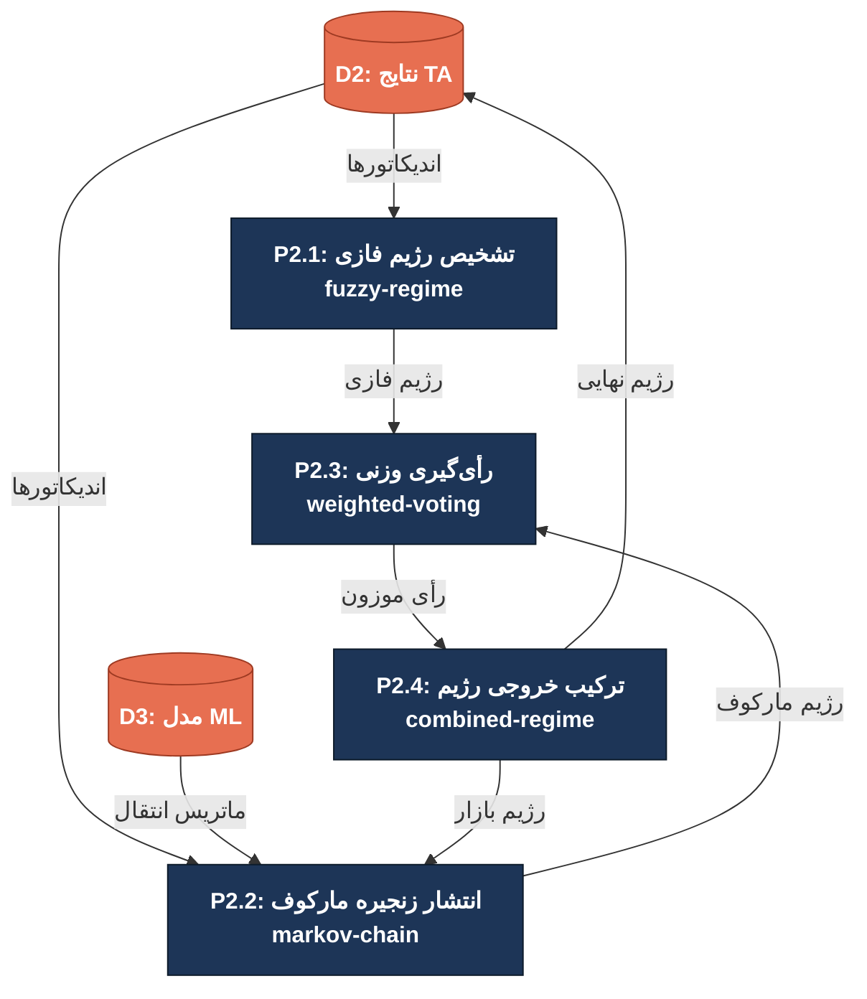
```mermaid
flowchart TB
    classDef Entity fill:#2d6a4f,stroke:#1b4332,color:#fff,font-weight:bold
    classDef Process fill:#1d3557,stroke:#0d1b2a,color:#fff,font-weight:bold
    classDef DataStore fill:#e76f51,stroke:#9e3a22,color:#fff,font-weight:bold

    D2[(D2: نتایج TA)]:::DataStore
    D3[(D3: مدل ML)]:::DataStore

    P21[P2.1: تشخیص رژیم فازی<br/>fuzzy-regime]:::Process
    P22[P2.2: انتشار زنجیره مارکوف<br/>markov-chain]:::Process
    P23[P2.3: رأی‌گیری وزنی<br/>weighted-voting]:::Process
    P24[P2.4: ترکیب خروجی رژیم<br/>combined-regime]:::Process

    D2 -->|اندیکاتورها| P21
    D2 -->|اندیکاتورها| P22
    D3 -->|ماتریس انتقال| P22
    P21 -->|رژیم فازی| P23
    P22 -->|رژیم مارکوف| P23
    P23 -->|رأی موزون| P24
    P24 -->|رژیم نهایی| D2
    P24 -->|رژیم بازار| P22
```

### توضیحات تجزیه P2

- **P2.1 تشخیص رژیم فازی**: با استفاده از مجموعه‌های فازی بر اندیکاتورها (ADX برای قوت روند, RSI برای اشباع, Bollinger برای نوسان)، عضویت فازی در رژیم‌های صعودی/نزولی/رنج محاسبه می‌شود.
- **P2.2 انتشار زنجیره مارکوف**: ماتریس انتقال وضعیت از D3 خوانده شده و با قوانین انتقال مارکوف، احتمال وضعیت‌های بعدی محاسبه و بِیزین بروزرسانی می‌شود.
- **P2.3 رأی‌گیری وزنی**: خروجی فازی و مارکوف با وزن‌های تطبیقی (از D3) ترکیب می‌شود تا رأی موزون نهایی شکل بگیرد.
- **P2.4 ترکیب خروجی رژیم**: رژیم نهایی (صعودی/نزولی/رنج با اطمینان) در D2 ذخیره و به P2.2 بازخورد داده می‌شود تا ماتریس انتقال تطبیق یابد.
- **حلقه تطبیقی مارکوف**: خروجی P2.4 به P2.2 بازمی‌گردد و ماتریس انتقال را بروزرسانی می‌کند — رژیم‌های اخیر وزن بیشتری در پیش‌بینی بعدی دارند.

---

## ۲.۳ تجزیه P3 — یادگیری/پیش‌بینی ML (ml-engine, ml-logistic)

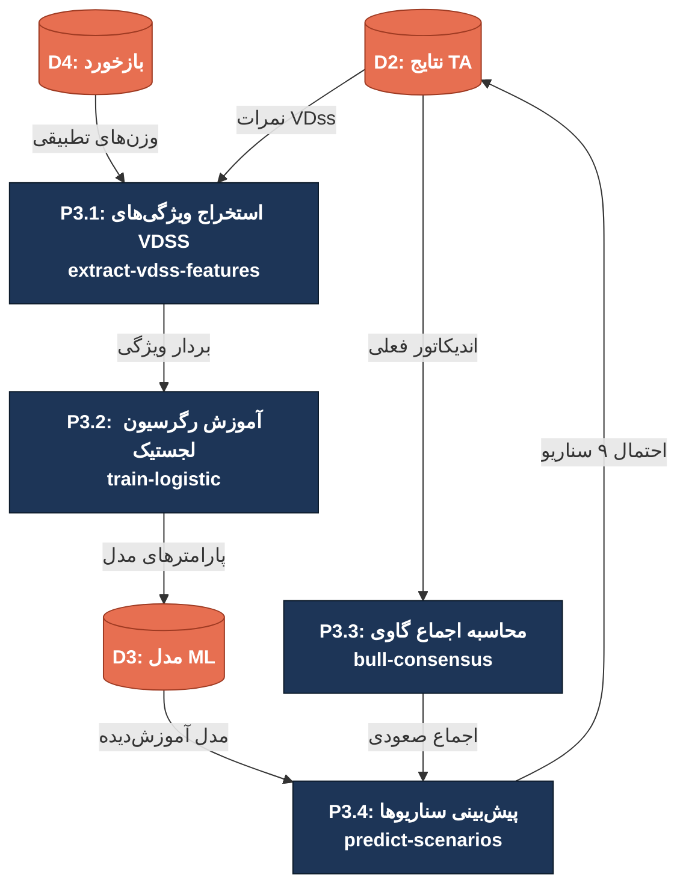
```mermaid
flowchart TB
    classDef Entity fill:#2d6a4f,stroke:#1b4332,color:#fff,font-weight:bold
    classDef Process fill:#1d3557,stroke:#0d1b2a,color:#fff,font-weight:bold
    classDef DataStore fill:#e76f51,stroke:#9e3a22,color:#fff,font-weight:bold

    D2[(D2: نتایج TA)]:::DataStore
    D3[(D3: مدل ML)]:::DataStore
    D4[(D4: بازخورد)]:::DataStore

    P31[P3.1: استخراج ویژگی‌های VDSS<br/>extract-vdss-features]:::Process
    P32[P3.2: آموزش رگرسیون لجستیک<br/>train-logistic]:::Process
    P33[P3.3: محاسبه اجماع گاوی<br/>bull-consensus]:::Process
    P34[P3.4: پیش‌بینی سناریوها<br/>predict-scenarios]:::Process

    D2 -->|نمرات VDss| P31
    D4 -->|وزن‌های تطبیقی| P31
    P31 -->|بردار ویژگی| P32
    P32 -->|پارامترهای مدل| D3
    D3 -->|مدل آموزش‌دیده| P34
    D2 -->|اندیکاتور فعلی| P33
    P33 -->|اجماع صعودی| P34
    P34 -->|احتمال ۹ سناریو| D2
```

### توضیحات تجزیه P3

- **P3.1 استخراج ویژگی‌های VDSS**: نمرات ۷ لایه VDss به همراه وزن‌های تطبیقی (از D4) به بردار ویژگی تبدیل می‌شوند — هر لایه یک بعد از بردار ویژگی را تشکیل می‌دهد.
- **P3.2 آموزش رگرسیون لجستیک**: بردار ویژگی با برچسب‌های تاریخی (صعودی/نزولی) به رگرسیون لجستیک چندکلاسه تغذیه و پارامترها در D3 ذخیره می‌شود.
- **P3.3 محاسبه اجماع گاوی**: با رأی‌گیری بین اندیکاتورها و وزن‌های تطبیقی، میزان اجماع صعودی (bull consensus) محاسبه می‌شود.
- **P3.4 پیش‌بینی سناریوها**: مدل آموزش‌دیده (از D3) روی داده فعلی اعمال و احتمال هر ۹ سناریو محاسبه و در D2 ذخیره می‌شود.
- **اتصال به بازخورد**: وزن‌های تطبیقی از D4 وارد P3.1 می‌شوند — این وزن‌ها توسط P7 بر اساس بازخورد کاربر بروزرسانی می‌شوند.

---

## ۲.۴ تجزیه P4 — تحلیل حمایت/مقاومت و پروفایل حجم (sr-analyzer, volume-profile)

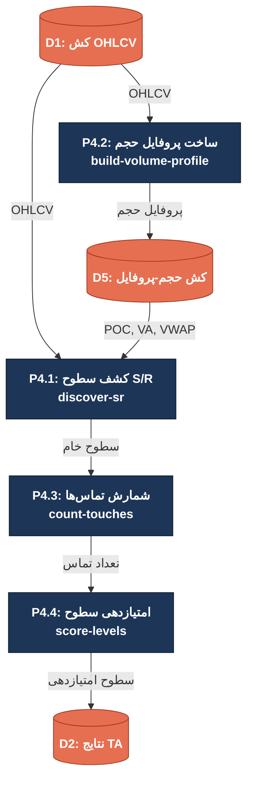
```mermaid
flowchart TB
    classDef Entity fill:#2d6a4f,stroke:#1b4332,color:#fff,font-weight:bold
    classDef Process fill:#1d3557,stroke:#0d1b2a,color:#fff,font-weight:bold
    classDef DataStore fill:#e76f51,stroke:#9e3a22,color:#fff,font-weight:bold

    D1[(D1: کش OHLCV)]:::DataStore
    D2[(D2: نتایج TA)]:::DataStore
    D5[(D5: کش حجم-پروفایل)]:::DataStore

    P41[P4.1: کشف سطوح S/R<br/>discover-sr]:::Process
    P42[P4.2: ساخت پروفایل حجم<br/>build-volume-profile]:::Process
    P43[P4.3: شمارش تماس‌ها<br/>count-touches]:::Process
    P44[P4.4: امتیازدهی سطوح<br/>score-levels]:::Process

    D1 -->|OHLCV| P41
    D1 -->|OHLCV| P42
    P42 -->|پروفایل حجم| D5
    D5 -->|POC, VA, VWAP| P41
    P41 -->|سطوح خام| P43
    P43 -->|تعداد تماس| P44
    P44 -->|سطوح امتیازدهی| D2
```

### توضیحات تجزیه P4

- **P4.1 کشف سطوح S/R**: با الگوریتم پنجره‌ای و ترکیب با POC/Value Area (از D5)، سطوح خام حمایت و مقاومت شناسایی می‌شود.
- **P4.2 ساخت پروفایل حجم**: از داده OHLCV، پروفایل حجم تقریبی (بدون تیک‌بای‌تیک) ساخته — حجم بین باز و بسته کندل در بدنه و حجم سایه‌ها در ویگ توزیع می‌شود — نتایج در D5 ذخیره.
- **P4.3 شمارش تماس‌ها**: برای هر سطح، تعداد دفعات تماس قیمت (با تلورانس ATR) شمرده می‌شود — سطوح با تماس بیشتر اعتبار بیشتری دارند.
- **P4.4 امتیازدهی سطوح**: هر سطح بر اساس تعداد تماس، حجم معاملات مجاور و فاصله از قیمت فعلی امتیازدهی و در D2 ذخیره می‌شود.
- **وابستگی حیاتی**: P4.1 به خروجی P4.2 (POC و Value Area) وابسته است — سطوح نزدیک POC وزن بیشتری دارند.

---

## ۲.۵ تجزیه P5 — تشخیص الگو (pattern-detection, candlestick-patterns)

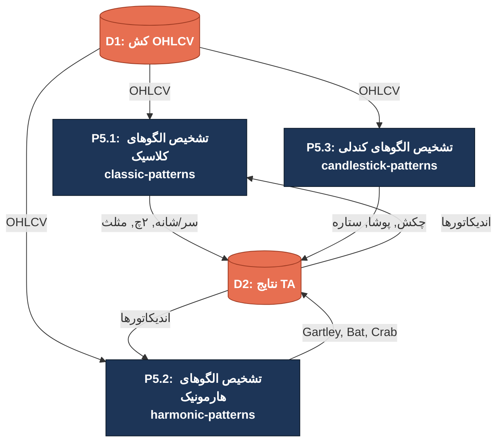
```mermaid
flowchart TB
    classDef Entity fill:#2d6a4f,stroke:#1b4332,color:#fff,font-weight:bold
    classDef Process fill:#1d3557,stroke:#0d1b2a,color:#fff,font-weight:bold
    classDef DataStore fill:#e76f51,stroke:#9e3a22,color:#fff,font-weight:bold

    D1[(D1: کش OHLCV)]:::DataStore
    D2[(D2: نتایج TA)]:::DataStore

    P51[P5.1: تشخیص الگوهای کلاسیک<br/>classic-patterns]:::Process
    P52[P5.2: تشخیص الگوهای هارمونیک<br/>harmonic-patterns]:::Process
    P53[P5.3: تشخیص الگوهای کندلی<br/>candlestick-patterns]:::Process

    D1 -->|OHLCV| P51
    D1 -->|OHLCV| P52
    D1 -->|OHLCV| P53
    D2 -->|اندیکاتورها| P51
    D2 -->|اندیکاتورها| P52

    P51 -->|سر/شانه, ۲چ, مثلث| D2
    P52 -->|Gartley, Bat, Crab| D2
    P53 -->|چکش, پوشا, ستاره| D2
```

### توضیحات تجزیه P5

- **P5.1 تشخیص الگوهای کلاسیک**: ۱۶ الگوی کلاسیک (سر و شانه، دو قلو، مثلث، پرچم، مستطیل، گوه و غیره) با استفاده از OHLCV و اندیکاتورها شناسایی می‌شود.
- **P5.2 تشخیص الگوهای هارمونیک**: ۶ الگوی هارمونیک (Gartley, Bat, Butterfly, Crab, Shark, Cypher) با نسبتهای فیبوناچی تشخیص داده می‌شود.
- **P5.3 تشخیص الگوهای کندلی**: بیش از ۱۶ الگوی کندلی (چکش، پوشا صعودی/نزولی، ستاره دمش، هارامی، انگالفینگ و غیره) بررسی می‌شود.
- **خروجی مشترک**: هر سه زیرفرایند الگوهای شناسایی‌شده با اطمینان و جهت (صعودی/نزولی) را در D2 ذخیره و به P6 (تولید متن AI) ارسال می‌کنند.
- **ورودی یکسان**: هر سه زیرفرایند از D1 (OHLCV) تغذیه می‌شوند — P5.1 و P5.2 علاوه بر آن از D2 (اندیکاتورها) نیز استفاده می‌کنند.

---

## ۲.۶ تجزیه P6 — تولید متن AI (ai-analysis, vdes-analysis)

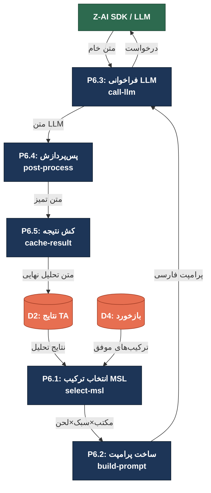
```mermaid
flowchart TB
    classDef Entity fill:#2d6a4f,stroke:#1b4332,color:#fff,font-weight:bold
    classDef Process fill:#1d3557,stroke:#0d1b2a,color:#fff,font-weight:bold
    classDef DataStore fill:#e76f51,stroke:#9e3a22,color:#fff,font-weight:bold

    E5[Z-AI SDK / LLM]:::Entity

    D2[(D2: نتایج TA)]:::DataStore
    D4[(D4: بازخورد)]:::DataStore

    P61[P6.1: انتخاب ترکیب MSL<br/>select-msl]:::Process
    P62[P6.2: ساخت پرامپت<br/>build-prompt]:::Process
    P63[P6.3: فراخوانی LLM<br/>call-llm]:::Process
    P64[P6.4: پس‌پردازش<br/>post-process]:::Process
    P65[P6.5: کش نتیجه<br/>cache-result]:::Process

    D2 -->|نتایج تحلیل| P61
    D4 -->|ترکیب‌های موفق| P61
    P61 -->|مکتب×سبک×لحن| P62
    P62 -->|پرامپت فارسی| P63
    P63 -->|درخواست| E5
    E5 -->|متن خام| P63
    P63 -->|متن LLM| P64
    P64 -->|متن تمیز| P65
    P65 -->|متن تحلیل نهایی| D2
```

### توضیحات تجزیه P6

- **P6.1 انتخاب ترکیب MSL**: از ترکیب مکتب تحلیلی (تکنیکال‌گر، جریان‌گر، ریسک‌گریز) × سبک (رسمی، محاوره‌ای، آموزشی) × لحن (خنثی، خوش‌بینانه، محتاطانه)، بهترین ترکیب بر اساس بازخورد تاریخی (D4) انتخاب می‌شود.
- **P6.2 ساخت پرامپت**: نتایج تحلیل (اندیکاتورها، رژیم، سناریوها، الگوها، سطوح S/R) در قالب پرامپت ساختاریافته فارسی قالب‌بندی می‌شود.
- **P6.3 فراخوانی LLM**: پرامپت به Z-AI SDK ارسال و متن خام تحلیل دریافت می‌شود.
- **P6.4 پس‌پردازش**: متن خام از نظر سلامت (حذف تکرار، اصلاح فرمت، اطمینان از فارسی‌بودن) پس‌پردازش می‌شود.
- **P6.5 کش نتیجه**: متن نهایی تحلیل در D2 کش می‌شود تا در درخواست‌های بعدی بدون فراخوانی مجدد LLM بازگردانده شود.

---

## ۲.۷ تجزیه P7 — بازخورد و تطبیق (msl-feedback, bayesian-weights)

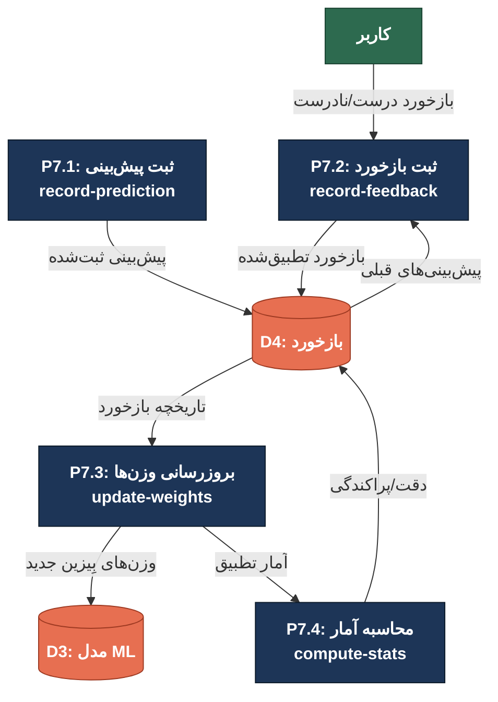
```mermaid
flowchart TB
    classDef Entity fill:#2d6a4f,stroke:#1b4332,color:#fff,font-weight:bold
    classDef Process fill:#1d3557,stroke:#0d1b2a,color:#fff,font-weight:bold
    classDef DataStore fill:#e76f51,stroke:#9e3a22,color:#fff,font-weight:bold

    E1[کاربر]:::Entity

    D3[(D3: مدل ML)]:::DataStore
    D4[(D4: بازخورد)]:::DataStore

    P71[P7.1: ثبت پیش‌بینی<br/>record-prediction]:::Process
    P72[P7.2: ثبت بازخورد<br/>record-feedback]:::Process
    P73[P7.3: بروزرسانی وزن‌ها<br/>update-weights]:::Process
    P74[P7.4: محاسبه آمار<br/>compute-stats]:::Process

    P71 -->|پیش‌بینی ثبت‌شده| D4
    E1 -->|بازخورد درست/نادرست| P72
    D4 -->|پیش‌بینی‌های قبلی| P72
    P72 -->|بازخورد تطبیق‌شده| D4
    D4 -->|تاریخچه بازخورد| P73
    P73 -->|وزن‌های بِیزین جدید| D3
    P73 -->|آمار تطبیق| P74
    P74 -->|دقت/پراکندگی| D4
```

### توضیحات تجزیه P7

- **P7.1 ثبت پیش‌بینی**: هر پیش‌بینی صادرشده (سناریو، رژیم، سیگنال) با برچسب زمانی در D4 ثبت می‌شود تا بعداً با واقعیت مقایسه شود.
- **P7.2 ثبت بازخورد**: کاربر نتیجه واقعی (درست/نادرست/جزئی) را ثبت و با پیش‌بینی ثبت‌شده تطبیق می‌شود.
- **P7.3 بروزرسانی وزن‌ها**: با قاعده بیز، وزن‌های هر اندیکاتور و زیرسیستم بر اساس بازخورد تطبیق و در D3 ذخیره می‌شود.
- **P7.4 محاسبه آمار**: نرخ دقت، ماتریس درهم‌ریختگی و پراکندگی پیش‌بینی‌ها محاسبه و در D4 ذخیره می‌شود.
- **حلقه تطبیقی بسته**: P7.3 وزن‌های جدید در D3 ← P3 در آموزش بعدی از وزن‌های جدید استفاده ← پیش‌بینی بهتر ← بازخورد بهتر ← P7.3 وزن‌ها را مجدداً بروزرسانی.

---

# ═══════════════════════════════════════════════════════════════════
# سطح ۳: عملیات اتمی (DFD Level 3)
# ═══════════════════════════════════════════════════════════════════

سطح ۳ جزئیات عملیات اتمی سه زیرفرایند حیاتی را نشان می‌دهد: موتور ۷ لایه VDss (P1.4)، زنجیره مارکوف (P2.2) و پروفایل حجم (P4.2).

---

## ۳.۱ تجزیه P1.4 — موتور ۷ لایه VDss (7-Layer VDss Engine)

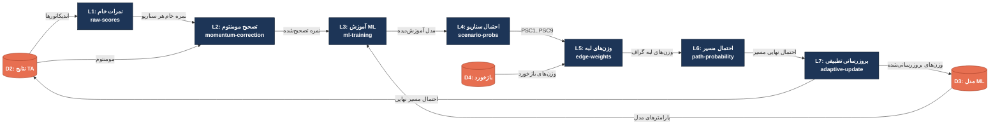
```mermaid
flowchart LR
    classDef Entity fill:#2d6a4f,stroke:#1b4332,color:#fff,font-weight:bold
    classDef Process fill:#1d3557,stroke:#0d1b2a,color:#fff,font-weight:bold
    classDef DataStore fill:#e76f51,stroke:#9e3a22,color:#fff,font-weight:bold

    D2[(D2: نتایج TA)]:::DataStore
    D3[(D3: مدل ML)]:::DataStore
    D4[(D4: بازخورد)]:::DataStore

    L1[L1: نمرات خام<br/>raw-scores]:::Process
    L2[L2: تصحیح مومنتوم<br/>momentum-correction]:::Process
    L3[L3: آموزش ML<br/>ml-training]:::Process
    L4[L4: احتمال سناریو<br/>scenario-probs]:::Process
    L5[L5: وزن‌های لبه<br/>edge-weights]:::Process
    L6[L6: احتمال مسیر<br/>path-probability]:::Process
    L7[L7: بروزرسانی تطبیقی<br/>adaptive-update]:::Process

    D2 -->|اندیکاتورها| L1
    L1 -->|نمره خام هر سناریو| L2
    D2 -->|مومنتوم| L2
    L2 -->|نمره تصحیح‌شده| L3
    D3 -->|پارامترهای مدل| L3
    L3 -->|مدل آموزش‌دیده| L4
    L4 -->|PSC1..PSC9| L5
    D4 -->|وزن‌های بازخورد| L5
    L5 -->|وزن‌های لبه گراف| L6
    L6 -->|احتمال نهایی مسیر| L7
    L7 -->|وزن‌های بروزرسانی‌شده| D3
    L7 -->|احتمال مسیر نهایی| D2
```

### توضیحات تجزیه P1.4 — ۷ لایه VDss

- **لایه ۱ — نمرات خام**: هر اندیکاتور نمره خام اولیه برای ۹ سناریو تولید می‌کند. مثلاً RSI بالای ۷۰ نمره بالا برای SC8-SC9 (صعودی قوی) و نمره پایین برای SC1-SC2 (نزولی) می‌دهد.
- **لایه ۲ — تصحیح مومنتوم**: نمرات خام بر اساس مومنتوم بازار (قوت و جهت روند) تصحیح می‌شوند — در روند صعودی قوی، سناریوهای نزولی تنزل می‌یابند.
- **لایه ۳ — آموزش ML**: رگرسیون لجستیک بر روی بردار ویژگی‌های VDss آموزش می‌بیند و پارامترها در D3 ذخیره — این لایه یادگیری سیستم را فراهم می‌کند.
- **لایه ۴ — احتمال سناریو**: مدل آموزش‌دیده احتمال هر ۹ سناریو (PSC1...PSC9) را محاسبه — مجموع احتمالات = ۱.
- **لایه ۵ — وزن‌های لبه**: احتمالات سناریو با وزن‌های تطبیقی بازخورد (از D4) ترکیب و وزن لبه‌های گراف سناریو تعیین می‌شود.
- **لایه ۶ — احتمال مسیر**: با پیمایش گراف سناریو و ضرب وزن‌های لبه، احتمال نهایی هر مسیر قیمتی محاسبه می‌شود.
- **لایه ۷ — بروزرسانی تطبیقی**: وزن‌های لبه بر اساس بازخورد تطبیق و در D3 بروزرسانی — حلقه یادگیری بسته می‌شود.

---

## ۳.۲ تجزیه P2.2 — زنجیره مارکوف (Markov Chain Propagation)

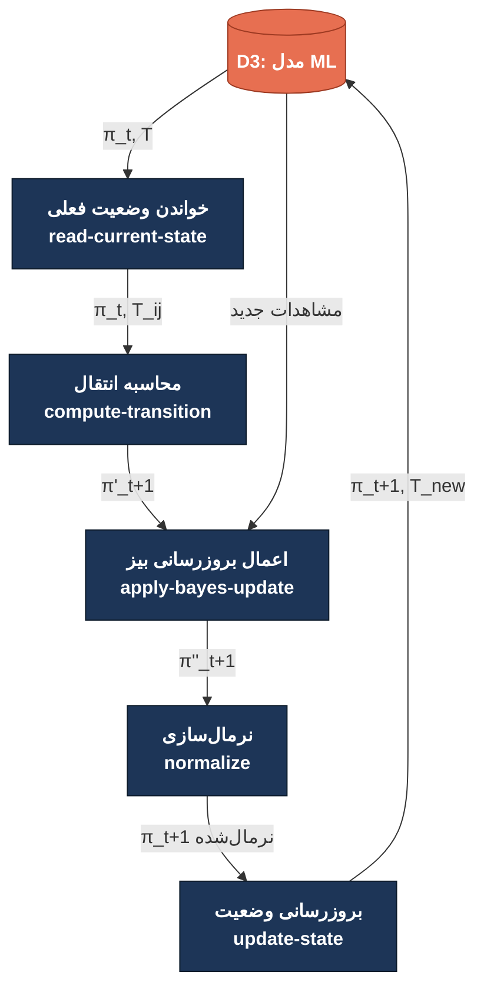
```mermaid
flowchart TB
    classDef Entity fill:#2d6a4f,stroke:#1b4332,color:#fff,font-weight:bold
    classDef Process fill:#1d3557,stroke:#0d1b2a,color:#fff,font-weight:bold
    classDef DataStore fill:#e76f51,stroke:#9e3a22,color:#fff,font-weight:bold

    D3[(D3: مدل ML)]:::DataStore

    S1[خواندن وضعیت فعلی<br/>read-current-state]:::Process
    S2[محاسبه انتقال<br/>compute-transition]:::Process
    S3[اعمال بروزرسانی بیز<br/>apply-bayes-update]:::Process
    S4[نرمال‌سازی<br/>normalize]:::Process
    S5[بروزرسانی وضعیت<br/>update-state]:::Process

    D3 -->|π_t, T| S1
    S1 -->|π_t, T_ij| S2
    S2 -->|π'_t+1| S3
    D3 -->|مشاهدات جدید| S3
    S3 -->|π''_t+1| S4
    S4 -->|π_t+1 نرمال‌شده| S5
    S5 -->|π_t+1, T_new| D3
```

### توضیحات تجزیه P2.2 — زنجیره مارکوف

- **خواندن وضعیت فعلی**: بردار وضعیت فعلی π_t (احتمال هر رژیم) و ماتریس انتقال T از D3 خوانده می‌شود. وضعیت‌ها شامل صعودی، نزولی و رنج هستند.
- **محاسبه انتقال**: بردار وضعیت جدید با ضرب ماتریسسی محاسبه: π′ₜ₊₁ = πₜ × T. هر درایه T_ij احتمال انتقال از رژیم i به j را نشان می‌دهد.
- **اعمال بروزرسانی بیز**: مشاهدات جدید (اندیکاتورهای فعلی) به‌عنوان شواهد بِیزین اعمال: π″ₜ₊₁ = π′ₜ₊₁ × P(مشاهده|رژیم). این مرحله اطلاعات نوین را با مدل تاریخی ترکیب می‌کند.
- **نرمال‌سازی**: بردار وضعیت نرمال‌سازی می‌شود تا مجموع احتمالات = ۱ باشد: πₜ₊₁ = π″ₜ₊₁ / Σπ″ₜ₊₁.
- **بروزرسانی وضعیت**: بردار وضعیت جدید و ماتریس انتقال تطبیق‌یافته در D3 ذخیره می‌شوند — ماتریس انتقال با شمارش انتقال‌های مشاهده‌شده بروزرسانی می‌شود.

---

## ۳.۳ تجزیه P4.2 — ساخت پروفایل حجم (Volume Profile Builder)

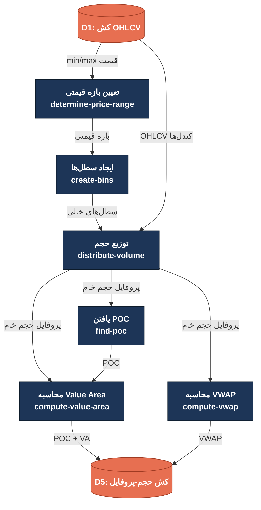
```mermaid
flowchart TB
    classDef Entity fill:#2d6a4f,stroke:#1b4332,color:#fff,font-weight:bold
    classDef Process fill:#1d3557,stroke:#0d1b2a,color:#fff,font-weight:bold
    classDef DataStore fill:#e76f51,stroke:#9e3a22,color:#fff,font-weight:bold

    D1[(D1: کش OHLCV)]:::DataStore
    D5[(D5: کش حجم-پروفایل)]:::DataStore

    V1[تعیین بازه قیمتی<br/>determine-price-range]:::Process
    V2[ایجاد سطل‌ها<br/>create-bins]:::Process
    V3[توزیع حجم<br/>distribute-volume]:::Process
    V4[یافتن POC<br/>find-poc]:::Process
    V5[محاسبه Value Area<br/>compute-value-area]:::Process
    V6[محاسبه VWAP<br/>compute-vwap]:::Process

    D1 -->|min/max قیمت| V1
    V1 -->|بازه قیمتی| V2
    V2 -->|سطل‌های خالی| V3
    D1 -->|OHLCV کندل‌ها| V3
    V3 -->|پروفایل حجم خام| V4
    V3 -->|پروفایل حجم خام| V5
    V3 -->|پروفایل حجم خام| V6
    V4 -->|POC| V5
    V5 -->|POC + VA| D5
    V6 -->|VWAP| D5
```

### توضیحات تجزیه P4.2 — پروفایل حجم

- **تعیین بازه قیمتی**: حداقل و حداکثر قیمت در دوره تحلیل محاسبه و بازه قیمتی تعیین می‌شود. معمولاً تعداد سطل‌ها برابر √N (تعداد کندل‌ها) یا عدد ثابت (مثلاً ۵۰) است.
- **ایجاد سطل‌ها**: بازه قیمتی به سطل‌های هم‌عرض تقسیم — هر سطل محدوده قیمتی [low, high) را پوشش می‌دهد.
- **توزیع حجم**: حجم هر کندل بین سطل‌های مربوطه توزیع — حجم بدنه (بین Open و Close) به‌صورت یکنواخت و حجم سایه‌ها (Wick) با وزن کمتر توزیع می‌شود. این تقریب بدون نیاز به داده تیک‌بای‌تیک است.
- **یافتن POC**: سطل با بیشترین حجم تجمعی به‌عنوان Point of Control (POC) شناسایی — این مهم‌ترین سطح پروفایل حجم است.
- **محاسبه Value Area**: با شروع از POC و افزودن سطل‌های مجاور بر اساس حجم نزولی، ۷۰٪ (یا ۶۸٪) از کل حجم پوشش داده — مرز بالایی (VAH) و پایینی (VAL) تعیین می‌شود.
- **محاسبه VWAP**: میانگین وزنی حجم-قیمت (Volume-Weighted Average Price) محاسبه: VWAP = Σ(قیمت‌典型ی × حجم) / Σحجم — هم POC/VA و هم VWAP در D5 ذخیره.

---

# ═══════════════════════════════════════════════════════════════════
# خلاصه جریان‌های داده اصلی
# ═══════════════════════════════════════════════════════════════════

| جریان داده | از | به | توضیح |
|------------|----|----|-------|
| OHLCV خام | TSETMC/TGJU/Yahoo | D1 | داده‌های خام بازار (قیمت باز/بسته/بالا/پایین + حجم) |
| اندیکاتورها | P1.1 | D2 | مقادیر ۶۰+ اندیکاتور تکنیکال |
| رژیم بازار | P2 | P1, P3 | رژیم فعلی بازار (صعودی/نزولی/رنج + اطمینان) |
| احتمال سناریوها | P3/P1.4 | P1 | احتمال هر ۹ سناریو (SC1-SC9) |
| سطوح S/R | P4 | P1 | سطوح حمایت/مقاومت امتیازدهی‌شده |
| الگوها | P5 | P6 | الگوهای شناسایی‌شده (کلاسیک + هارمونیک + کندلی) |
| پرامپت/متن AI | P6 ↔ Z-AI | P6 ↔ E5 | پرامپت ارسالی و متن تحلیل دریافتی |
| بازخورد | کاربر | P7 | نتیجه واقعی پیش‌بینی (درست/نادرست) |
| وزن‌های تطبیقی | P7 | D3 → P3 | وزن‌های بِیزین بروزرسانی‌شده |

---

> **توجه**: تمام برچسب‌های نمودارها به زبان فارسی با نام کد انگلیسی در پرانتز هستند. سبک‌دهی با `classDef` یکنواخت (Entity سبز، Process آبی، DataStore نارنجی) در تمام سطوح حفظ شده است.
---

<a id="bpmn"></a>

# BPMN — مدل‌سازی فرآیندهای کسب‌وکار

> **سیستم تحلیل تکنیکال بازار بورس ایران**
>
> این بخش فرآیندهای سیستم تحلیل تکنیکال را در سه سطح BPMN مدل‌سازی می‌کند:
> - **سطح ۱:** نمای کلی فرآیند با استخرها و لاین‌ها
> - **سطح ۲:** فرآیندهای قابل اجرا با جداول مسیر شاد و استثنا
> - **سطح ۳:** زیرفرآیندهای تفصیلی با جزئیات کامل الگوریتمی

---

## سطح ۱ — نمای کلی فرآیند (Process Overview)

### نمودار سطح ۱

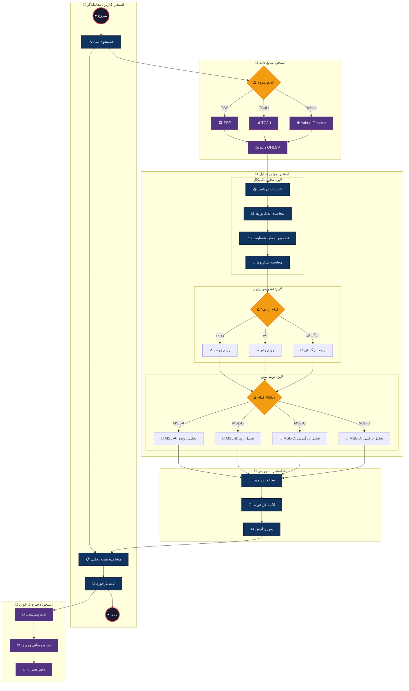
```mermaid
flowchart TB
    subgraph P1["🧑 استخر: کاربر / معامله‌گر"]
        START((● شروع)) --> SEARCH["🔍 جستجوی نماد"]
        SEARCH --> REVIEW["📋 مشاهده نتیجه تحلیل"]
        REVIEW --> FEEDBACK["💬 ثبت بازخورد"]
        FEEDBACK --> END((● پایان))
    end

    subgraph P2["⚙️ استخر: موتور تحلیل"]
        direction TB
        subgraph L1["لاین: تحلیل تکنیکال"]
            FETCH["📥 دریافت OHLCV"] --> INDICATORS["📊 محاسبه اندیکاتورها"]
            INDICATORS --> SR["📈 تشخیص حمایت/مقاومت"]
            SR --> SCENARIOS["🎯 محاسبه سناریوها"]
        end
        subgraph L2["لاین: تشخیص رژیم"]
            SCENARIOS --> REGIME_GW{"🜂 کدام رژیم؟"}
            REGIME_GW -->|رونده| TREND_R["↗️ رژیم رونده"]
            REGIME_GW -->|رنج| RANGE_R["↔️ رژیم رنج"]
            REGIME_GW -->|بازگشتی| MEAN_R["↩️ رژیم بازگشتی"]
        end
        subgraph L3["لاین: تولید متن"]
            TREND_R --> MSL_GW{"🜂 کدام MSL؟"}
            RANGE_R --> MSL_GW
            MEAN_R --> MSL_GW
            MSL_GW -->|MSL-A| MSL_A["📝 MSL-A: تحلیل رونده"]
            MSL_GW -->|MSL-B| MSL_B["📝 MSL-B: تحلیل رنج"]
            MSL_GW -->|MSL-C| MSL_C["📝 MSL-C: تحلیل بازگشتی"]
            MSL_GW -->|MSL-D| MSL_D["📝 MSL-D: تحلیل ترکیبی"]
        end
    end

    subgraph P3["🤖 استخر: سرویس AI"]
        MSL_A --> PROMPT["🔧 ساخت پرامپت"]
        MSL_B --> PROMPT
        MSL_C --> PROMPT
        MSL_D --> PROMPT
        PROMPT --> LLM["🧠 فراخوانی LLM"]
        LLM --> POST["✂️ پس‌پردازش"]
    end

    subgraph P4["📡 استخر: منابع داده"]
        SRC_GW{"🜂 کدام منبع؟"} -->|TSE| TSE["🏛️ TSE"]
        SRC_GW -->|TGJU| TGJU["📊 TGJU"]
        SRC_GW -->|Yahoo| YAHOO["🌐 Yahoo Finance"]
        TSE --> OHLCV["📉 داده OHLCV"]
        TGJU --> OHLCV
        YAHOO --> OHLCV
    end

    subgraph P5["💾 استخر: ذخیره بازخورد"]
        FEEDBACK --> REC["📝 ثبت پیش‌بینی"]
        REC --> UPD["⚖️ به‌روزرسانی وزن‌ها"]
        UPD --> PERSIST["💾 ذخیره‌سازی"]
    end

    SEARCH --> SRC_GW
    OHLCV --> FETCH
    POST --> REVIEW

    classDef startEnd fill:#1a1a2e,stroke:#e94560,stroke-width:3px,color:#fff
    classDef gateway fill:#f39c12,stroke:#e67e22,stroke-width:2px,color:#000
    classDef process fill:#0f3460,stroke:#16213e,stroke-width:2px,color:#fff
    classDef data fill:#533483,stroke:#6c3483,stroke-width:2px,color:#fff
    class START,END startEnd
    class REGIME_GW,MSL_GW,SRC_GW gateway
    class SEARCH,REVIEW,FEEDBACK,FETCH,INDICATORS,SR,SCENARIOS process
    class PROMPT,LLM,POST process
    class TSE,TGJU,YAHOO,OHLCV data
    class REC,UPD,PERSIST data
```

### توضیح سطح ۱ (فارسی)

۱. این نمودار نمای کلی فرآیند سیستم تحلیل تکنیکال بورس ایران را در سطح بالای BPMN نشان می‌دهد. چهار استخر (Pool) اصلی تعریف شده‌اند: کاربر/معامله‌گر، موتور تحلیل، سرویس AI و منابع داده. هر استخر مسئولیت مشخصی دارد و مرزهای تعاملی بین آن‌ها با فلش‌ها مشخص شده است.

۲. در استخر «موتور تحلیل» سه لاین (Lane) تفکیک شده است: تحلیل تکنیکال، تشخیص رژیم و تولید متن. این تفکیک تضمین می‌کند که هر مرحله از پردازش به‌صورت مستقل و با مسئولیت واحد انجام شود. جریان داده‌ها بین لاین‌ها به‌صورت ترتیبی است.

۳. سه گیت‌وی کلیدی در این سطح وجود دارد: گیت‌وی انتخاب منبع داده (TSE/TGJU/Yahoo)، گیت‌وی تشخیص رژیم (رونده/رنج/بازگشتی) و گیت‌وی انتخاب MSL. هر گیت‌وی بر اساس شرایط ورودی، مسیر مناسب را انتخاب می‌کند و تصمیم‌گیری سیستمی را مدل‌سازی می‌نماید.

۴. استخر «منابع داده» سه منبع خارجی را مدل‌سازی می‌کند که هر یک بسته به نوع نماد و دسترسی، داده OHLCV را تأمین می‌کنند. خروجی یکپارچه این استخر به لاین «تحلیل تکنیکال» وارد می‌شود و فرآیند تحلیل آغاز می‌گردد.

۵. استخر «سرویس AI» فرآیند تولید متن تحلیلی را مدل‌سازی می‌کند: ابتدا پرامپت بر اساس MSL انتخابی ساخته می‌شود، سپس LLM فراخوانی شده و در نهایت خروجی پس‌پردازش می‌گردد. این استخر مستقل از موتور تحلیل عمل می‌کند و تنها نتیجه TAResult را دریافت می‌نماید.

۶. استخر «ذخیره بازخورد» چرخه بازخورد تطبیقی را مدل‌سازی می‌کند: پیش‌بینی ثبت → بازخورد کاربر → به‌روزرسانی وزن‌ها → ذخیره‌سازی. این چرخه تضمین می‌کند که سیستم با گذر زمان یاد بگیرد و دقت پیش‌بینی‌ها افزایش یابد.

---

## سطح ۲ — فرآیندهای قابل اجرا (Executable Processes)

---

### ۲.۱ — جستجوی نماد و دریافت داده (Symbol Search & Data Fetching)

#### نمودار فرآیند

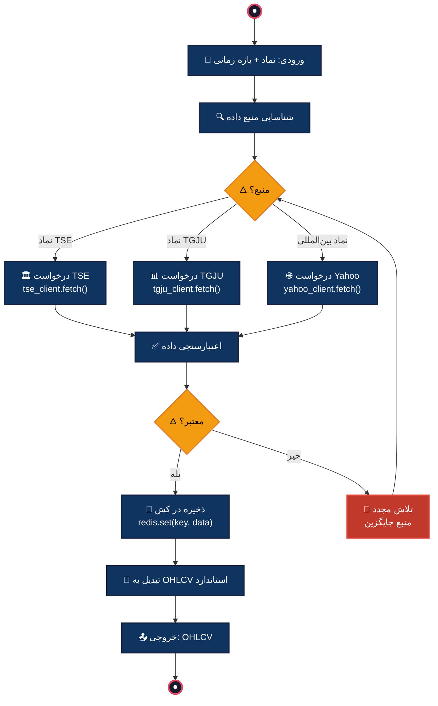
```mermaid
flowchart TB
    START1((●)) --> INPUT["🔑 ورودی: نماد + بازه زمانی"]
    INPUT --> IDENTIFY["🔍 شناسایی منبع داده"]
    IDENTIFY --> SRC_GW1{"🜂 منبع؟"}
    SRC_GW1 -->|نماد TSE| TSE_F["🏛️ درخواست TSE\ntse_client.fetch()"]
    SRC_GW1 -->|نماد TGJU| TGJU_F["📊 درخواست TGJU\ntgju_client.fetch()"]
    SRC_GW1 -->|نماد بین‌المللی| YH_F["🌐 درخواست Yahoo\nyahoo_client.fetch()"]
    TSE_F --> VALIDATE["✅ اعتبارسنجی داده"]
    TGJU_F --> VALIDATE
    YH_F --> VALIDATE
    VALIDATE --> V_GW{"🜂 معتبر؟"}
    V_GW -->|بله| CACHE["💾 ذخیره در کش\nredis.set(key, data)"]
    V_GW -->|خیر| RETRY["🔄 تلاش مجدد\nمنبع جایگزین"]
    RETRY --> SRC_GW1
    CACHE --> TRANSFORM["🔄 تبدیل به OHLCV استاندارد"]
    TRANSFORM --> RETURN1["📤 خروجی: OHLCV"]
    RETURN1 --> END1((●))

    classDef startEnd fill:#1a1a2e,stroke:#e94560,stroke-width:3px,color:#fff
    classDef gateway fill:#f39c12,stroke:#e67e22,stroke-width:2px,color:#000
    classDef task fill:#0f3460,stroke:#16213e,stroke-width:2px,color:#fff
    classDef error fill:#c0392b,stroke:#e74c3c,stroke-width:2px,color:#fff
    class START1,END1 startEnd
    class SRC_GW1,V_GW gateway
    class RETRY error
    class INPUT,IDENTIFY,TSE_F,TGJU_F,YH_F,VALIDATE,CACHE,TRANSFORM,RETURN1 task
```

#### توضیح فارسی

۱. این فرآیند مسئول جستجوی نماد و دریافت داده‌های تاریخی از منابع مختلف است. ورودی شامل نماد و بازه زمانی مورد نظر کاربر است.

۲. ابتدا منبع داده مناسب شناسایی می‌شود: نمادهای بورس تهران از TSE، نمادهای commodities از TGJU و نمادهای بین‌المللی از Yahoo Finance دریافت می‌شوند.

۳. پس از دریافت، داده‌ها اعتبارسنجی می‌شوند. در صورت نامعتبر بودن، سیستم به‌صورت خودکار منبع جایگزین را امتحان می‌کند (تلاش مجدد).

۴. داده‌های معتبر در کش Redis ذخیره می‌شوند تا در درخواست‌های بعدی زمان پاسخ‌دهی کاهش یابد.

۵. در نهایت داده‌ها به فرمت OHLCV استاندارد تبدیل شده و به فرآیند تحلیل تکنیکال ارجاع داده می‌شوند.

#### جدول مسیر شاد (Happy Path)

| مرحله | فعالیت | توضیح | خروجی |
|-------|--------|-------|-------|
| ۱ | ورودی نماد | کاربر نماد «فولاد» + بازه ۱ سال وارد می‌کند | `(symbol='فولاد', range='1Y')` |
| ۲ | شناسایی منبع | نماد در لیست TSE شناسایی می‌شود | `source='TSE'` |
| ۳ | درخواست TSE | `tse_client.fetch('فولاد', '1Y')` فراخوانی می‌شود | `raw_data: DataFrame` |
| ۴ | اعتبارسنجی | بررسی: ۲۵۲ ردیف، بدون NaN، بازه صحیح | `is_valid=True` |
| ۵ | ذخیره کش | `redis.set('ohlcv:فولاد:1Y', data, ttl=3600)` | `cached=True` |
| ۶ | تبدیل | استانداردسازی ستون‌ها و انواع | `OHLCV: DataFrame` |

#### جدول جریان استثنا (Exception Flows)

| کد استثنا | شرط | عمل اصلاحی | توضیح فارسی |
|-----------|------|-------------|-------------|
| E-201 | نماد یافت نشد | بازگرداندن خطای ۴۰۴ | نماد در هیچ منبعی موجود نیست |
| E-202 | TSE در دسترس نیست | سعی از TGJU به‌عنوان جایگزین | قطعی سرور TSE |
| E-203 | داده NaN > ۵٪ | درخواست از منبع جایگزین | کیفیت داده ناکافی |
| E-204 | timeout > ۱۰s | تلاش مجدد حداکثر ۳ بار | زمان‌بری درخواست |
| E-205 | بازه زمانی نامعتبر | اصلاح به نزدیک‌ترین بازه معتبر | بازه درخواستی خارج از محدوده |

---

### ۲.۲ — تحلیل تکنیکال (Technical Analysis)

#### نمودار فرآیند

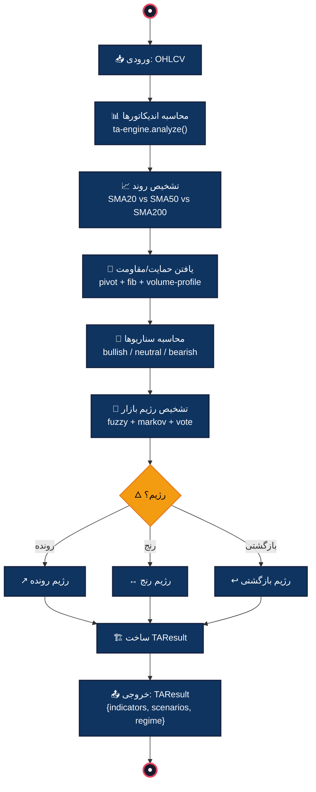
```mermaid
flowchart TB
    START2((●)) --> IN_OHLCV["📥 ورودی: OHLCV"]
    IN_OHLCV --> CALC_IND["📊 محاسبه اندیکاتورها\nta-engine.analyze()"]
    CALC_IND --> DET_TREND["📈 تشخیص روند\nSMA20 vs SMA50 vs SMA200"]
    DET_TREND --> FIND_SR["📏 یافتن حمایت/مقاومت\npivot + fib + volume-profile"]
    FIND_SR --> CALC_SCEN["🎯 محاسبه سناریوها\nbullish / neutral / bearish"]
    CALC_SCEN --> DET_REGIME["🔄 تشخیص رژیم بازار\nfuzzy + markov + vote"]
    DET_REGIME --> REG_GW2{"🜂 رژیم؟"}
    REG_GW2 -->|رونده| REG_T["↗️ رژیم رونده"]
    REG_GW2 -->|رنج| REG_R["↔️ رژیم رنج"]
    REG_GW2 -->|بازگشتی| REG_M["↩️ رژیم بازگشتی"]
    REG_T --> BUILD_RES["🏗️ ساخت TAResult"]
    REG_R --> BUILD_RES
    REG_M --> BUILD_RES
    BUILD_RES --> OUT2["📤 خروجی: TAResult\n{indicators, scenarios, regime}"]
    OUT2 --> END2((●))

    classDef startEnd fill:#1a1a2e,stroke:#e94560,stroke-width:3px,color:#fff
    classDef gateway fill:#f39c12,stroke:#e67e22,stroke-width:2px,color:#000
    classDef task fill:#0f3460,stroke:#16213e,stroke-width:2px,color:#fff
    class START2,END2 startEnd
    class REG_GW2 gateway
    class IN_OHLCV,CALC_IND,DET_TREND,FIND_SR,CALC_SCEN,DET_REGIME,REG_T,REG_R,REG_M,BUILD_RES,OUT2 task
```

#### توضیح فارسی

۱. این فرآیند هسته اصلی سیستم تحلیل تکنیکال است. ورودی آن داده OHLCV و خروجی شیء TAResult شامل تمام اندیکاتورها، سناریوها و رژیم بازار است.

۲. مرحله محاسبه اندیکاتورها شامل بیش از ۳۰ اندیکاتور متداول (RSI, MACD, BB, ATR, ADX, OBV و غیره) و همچنین اندیکاتورهای اختصاصی بازار ایران است.

۳. تشخیص روند با مقایسه SMAهای مختلف و ADX انجام می‌شود. یافتن سطوح حمایت/مقاومت از سه روش پیوت، فیبوناچی و پروفایل حجم استفاده می‌کند.

۴. سناریوها (bullish/neutral/bearish) بر اساس ترکیب سیگنال‌های اندیکاتورها و فاصله قیمت از سطوح کلیدی محاسبه می‌شوند.

۵. تشخیص رژیم بازار از روش ترکیبی فازی + مارکوف + رأی‌گیری استفاده می‌کند که در سطح ۳ به‌صورت تفصیلی مدل‌سازی شده است.

۶. در نهایت تمام نتایج در شیء TAResult تجمیع شده و به فرآیند تولید متن AI ارجاع داده می‌شود.

#### جدول مسیر شاد (Happy Path)

| مرحله | فعالیت | توضیح | خروجی |
|-------|--------|-------|-------|
| ۱ | ورودی OHLCV | دریافت ۲۵۲ روز داده نماد فولاد | `DataFrame[252×6]` |
| ۲ | محاسبه اندیکاتورها | محاسبه ۳۰+ اندیکاتور در ۱۵۰ms | `indicators: Dict` |
| ۳ | تشخیص روند | SMA20>SMA50>SMA200 → روند صعودی | `trend='bullish'` |
| ۴ | یافتن S/R | ۵ سطح حمایت + ۴ سطح مقاومت | `sr_levels: List[Level]` |
| ۵ | محاسبه سناریوها | ۷۰٪ سیگنال صعودی | `scenario='bullish', confidence=0.70` |
| ۶ | تشخیص رژیم | fuzzy=رونده, markov=رونده → رونده | `regime='trending'` |
| ۷ | ساخت TAResult | تجمیع تمام نتایج | `TAResult` |

#### جدول جریان استثنا (Exception Flows)

| کد استثنا | شرط | عمل اصلاحی | توضیح فارسی |
|-----------|------|-------------|-------------|
| E-301 | داده OHLCV خالی | بازگرداندن خطای NO_DATA | هیچ داده‌ای برای تحلیل موجود نیست |
| E-302 | تعداد ردیف < ۵۰ | تحلیل با هشدار DATA_SHORT | داده کافی برای محاسبه SMA200 نیست |
| E-303 | اندیکاتور NaN | حذف اندیکاتور + لاگ هشدار | محاسبه اندیکاتور ناموفق |
| E-304 | رژیم مبهم | پیش‌فرض: رنج + هشدار | فازی و مارکوف نتایج متناقض |
| E-305 | خطای محاسباتي | بازگرداندن جزئیات خطا | سرریز یا تقسیم بر صفر |

---

### ۲.۳ — تولید تحلیل AI (AI Analysis Generation)

#### نمودار فرآیند

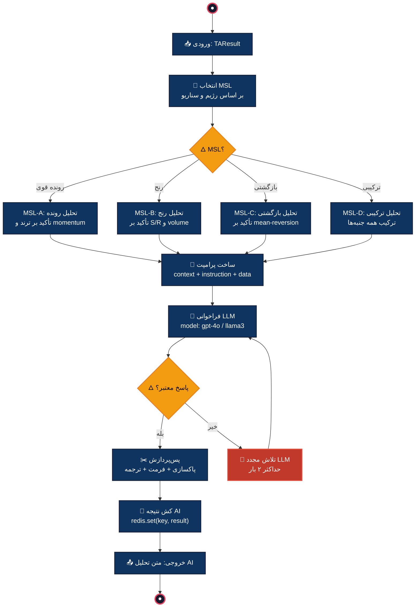
```mermaid
flowchart TB
    START3((●)) --> IN_TAR["📥 ورودی: TAResult"]
    IN_TAR --> SEL_MSL["📝 انتخاب MSL\nبر اساس رژیم و سناریو"]
    SEL_MSL --> MSL_GW3{"🜂 MSL؟"}
    MSL_GW3 -->|رونده قوی| MSLA["MSL-A: تحلیل رونده\nتأکید بر ترند و momentum"]
    MSL_GW3 -->|رنج| MSLB["MSL-B: تحلیل رنج\nتأکید بر S/R و volume"]
    MSL_GW3 -->|بازگشتی| MSLC["MSL-C: تحلیل بازگشتی\nتأکید بر mean-reversion"]
    MSL_GW3 -->|ترکیبی| MSLD["MSL-D: تحلیل ترکیبی\nترکیب همه جنبه‌ها"]
    MSLA --> BUILD_P["🔧 ساخت پرامپت\ncontext + instruction + data"]
    MSLB --> BUILD_P
    MSLC --> BUILD_P
    MSLD --> BUILD_P
    BUILD_P --> CALL_LLM["🧠 فراخوانی LLM\nmodel: gpt-4o / llama3"]
    CALL_LLM --> LLM_OK{"🜂 پاسخ معتبر؟"}
    LLM_OK -->|بله| POST_PROC["✂️ پس‌پردازش\nپاکسازی + فرمت + ترجمه"]
    LLM_OK -->|خیر| RETRY_LLM["🔄 تلاش مجدد LLM\nحداکثر ۲ بار"]
    RETRY_LLM --> CALL_LLM
    POST_PROC --> CACHE_AI["💾 کش نتیجه AI\nredis.set(key, result)"]
    CACHE_AI --> OUT3["📤 خروجی: متن تحلیل AI"]
    OUT3 --> END3((●))

    classDef startEnd fill:#1a1a2e,stroke:#e94560,stroke-width:3px,color:#fff
    classDef gateway fill:#f39c12,stroke:#e67e22,stroke-width:2px,color:#000
    classDef task fill:#0f3460,stroke:#16213e,stroke-width:2px,color:#fff
    classDef error fill:#c0392b,stroke:#e74c3c,stroke-width:2px,color:#fff
    class START3,END3 startEnd
    class MSL_GW3,LLM_OK gateway
    class RETRY_LLM error
    class IN_TAR,SEL_MSL,MSLA,MSLB,MSLC,MSLD,BUILD_P,CALL_LLM,POST_PROC,CACHE_AI,OUT3 task
```

#### توضیح فارسی

۱. این فرآیند متن تحلیلی هوشمند را تولید می‌کند. ورودی TAResult از فرآیند تحلیل تکنیکال و خروجی متن تحلیل فارسی ساختاریافته است.

۲. انتخاب MSL (Market-Specific Language) بر اساس رژیم و سناریو انجام می‌شود. چهار MSL تعریف شده: A برای رونده، B برای رنج، C برای بازگشتی و D برای ترکیبی.

۳. هر MSL پرامپت مخصوصی می‌سازد که شامل دستورالعمل تحلیلی، داده‌های عددی کلیدی و زمینه بازار است. ساختار پرامپت برای بهینه‌سازی مصرف token طراحی شده است.

۴. پس از فراخوانی LLM، خروجی اعتبارسنجی می‌شود. در صورت نامعتبر بودن (مثلاً JSON ناقص)، تلاش مجدد انجام می‌گیرد.

۵. پس‌پردازش شامل پاکسازی متن، فرمت‌بندی بخش‌ها، ترجمه اصطلاحات و اضافه کردن هشدارهای ریسک است.

۶. نتیجه نهایی در کش ذخیره می‌شود تا برای درخواست‌های تکراری بدون فراخوانی مجدد LLM بازگردانده شود.

#### جدول مسیر شاد (Happy Path)

| مرحله | فعالیت | توضیح | خروجی |
|-------|--------|-------|-------|
| ۱ | ورودی TAResult | دریافت نتیجه تحلیل فولاد | `TAResult` |
| ۲ | انتخاب MSL | رژیم=رونده، سناریو=bullish → MSL-A | `msl='MSL-A'` |
| ۳ | ساخت پرامپت | تجمیع context + instruction + data | `prompt: str (~800 tokens)` |
| ۴ | فراخوانی LLM | `gpt-4o.chat(prompt)` در ۳s | `raw_text: str` |
| ۵ | پس‌پردازش | پاکسازی + فرمت + هشدار ریسک | `analysis: str` |
| ۶ | کش | `redis.set('ai:فولاد:2024', analysis, ttl=1800)` | `cached=True` |

#### جدول جریان استثنا (Exception Flows)

| کد استثنا | شرط | عمل اصلاحی | توضیح فارسی |
|-----------|------|-------------|-------------|
| E-401 | TAResult ناقص | تکمیل با مقادیر پیش‌فرض | فیلدهای ضروری موجود نیست |
| E-402 | MSL نامشخص | پیش‌فرض MSL-D (ترکیبی) | رژیم شناسایی نشده |
| E-403 | LLM timeout | تلاش مجدد + کاهش token | زمان‌بری پاسخ LLM |
| E-404 | LLM خطای محتوا | استفاده از تحلیل الگویی | خروجی LLM نامعتبر |
| E-405 | هزینه token بالا | سوییچ به مدل کوچکتر | تجاوز از بودجه token |

---

### ۲.۴ — پیش‌بینی یادگیری ماشین (ML Prediction)

#### نمودار فرآیند

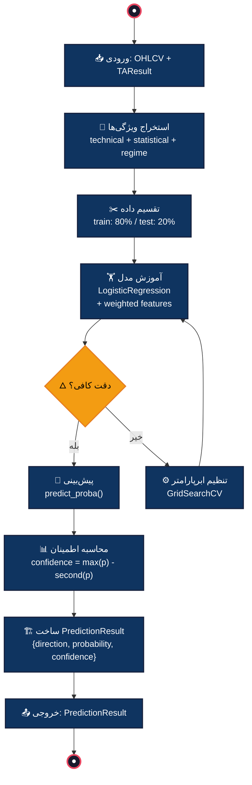
```mermaid
flowchart TB
    START4((●)) --> IN_ML["📥 ورودی: OHLCV + TAResult"]
    IN_ML --> EX_FEAT["🔧 استخراج ویژگی‌ها\ntechnical + statistical + regime"]
    EX_FEAT --> SPLIT["✂️ تقسیم داده\ntrain: 80% / test: 20%"]
    SPLIT --> TRAIN["🏋️ آموزش مدل\nLogisticRegression\n+ weighted features"]
    TRAIN --> TRAIN_OK{"🜂 دقت کافی؟"}
    TRAIN_OK -->|بله| PREDICT["🔮 پیش‌بینی\npredict_proba()"]
    TRAIN_OK -->|خیر| TUNE["⚙️ تنظیم ابرپارامتر\nGridSearchCV"]
    TUNE --> TRAIN
    PREDICT --> CALC_CONF["📊 محاسبه اطمینان\nconfidence = max(p) - second(p)"]
    CALC_CONF --> BUILD_PRED["🏗️ ساخت PredictionResult\n{direction, probability, confidence}"]
    BUILD_PRED --> OUT4["📤 خروجی: PredictionResult"]
    OUT4 --> END4((●))

    classDef startEnd fill:#1a1a2e,stroke:#e94560,stroke-width:3px,color:#fff
    classDef gateway fill:#f39c12,stroke:#e67e22,stroke-width:2px,color:#000
    classDef task fill:#0f3460,stroke:#16213e,stroke-width:2px,color:#fff
    class START4,END4 startEnd
    class TRAIN_OK gateway
    class IN_ML,EX_FEAT,SPLIT,TRAIN,TUNE,PREDICT,CALC_CONF,BUILD_PRED,OUT4 task
```

#### توضیح فارسی

۱. این فرآیند پیش‌بینی جهت قیمت آینده را با استفاده از رگرسیون لجستیک انجام می‌دهد. ورودی شامل OHLCV و TAResult است.

۲. مرحله استخراج ویژگی‌ها سه دسته ویژگی تولید می‌کند: ویژگی‌های تکنیکال (اندیکاتورها)، آماری (آماره‌های توصیفی) و رژیمی (وضعیت بازار).

۳. داده‌ها به نسبت ۸۰/۲۰ تقسیم می‌شوند. آموزش مدل با رگرسیون لجستیک و ویژگی‌های وزن‌دار (بر اساس بازخورد) انجام می‌شود.

۴. اگر دقت مدل در آستانه مورد نظر نباشد، تنظیم ابرپارامتر با GridSearchCV انجام شده و مدل مجدداً آموزش می‌بیند.

۵. پیش‌بینی نهایی شامل جهت (صعودی/نزولی/خنثی)، احتمال و سطح اطمینان است.

#### جدول مسیر شاد (Happy Path)

| مرحله | فعالیت | توضیح | خروجی |
|-------|--------|-------|-------|
| ۱ | ورودی | دریافت OHLCV فولاد + TAResult | `(OHLCV, TAResult)` |
| ۲ | استخراج ویژگی | ۱۸ ویژگی تکنیکال + ۵ آماری + ۳ رژیمی | `features: ndarray[26]` |
| ۳ | تقسیم داده | ۲۰۲ نمونه آموزش + ۵۰ نمونه آزمون | `(X_train, X_test)` |
| ۴ | آموزش | `LogisticRegression.fit()` → دقت ۶۸٪ | `model: LogisticRegression` |
| ۵ | پیش‌بینی | `predict_proba()` = [0.72, 0.18, 0.10] | `direction='bullish'` |
| ۶ | اطمینان | 0.72 - 0.18 = 0.54 → اطمینان متوسط | `confidence=0.54` |

#### جدول جریان استثنا (Exception Flows)

| کد استثنا | شرط | عمل اصلاحی | توضیح فارسی |
|-----------|------|-------------|-------------|
| E-501 | داده آموزش < ۱۰۰ | هشدار + کاهش حد آستانه | داده کافی برای آموزش نیست |
| E-502 | ویژگی NaN/Inf | حذف ویژگی + لاگ | ویژگی نامعتبر |
| E-503 | دقت < ۵۵٪ | بازگرداندن پیش‌بینی با هشدار عدم اطمینان | مدل ضعیف |
| E-504 | overfitting | اعمال regularisation قویتر | مدل بیش‌برازش |
| E-505 | خطای sklearn | بازگرداندن پیش‌بینی مبتنی بر سناریو | خطای کتابخانه ML |

---

### ۲.۵ — چرخه بازخورد تطبیقی (Feedback Loop)

#### نمودار فرآیند

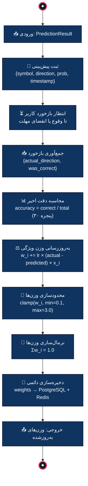
```mermaid
flowchart TB
    START5((●)) --> IN_PRED["📥 ورودی: PredictionResult"]
    IN_PRED --> REC_PRED["📝 ثبت پیش‌بینی\n{symbol, direction, prob, timestamp}"]
    REC_PRED --> WAIT["⏳ انتظار بازخورد کاربر\nتا وقوع یا انقضای مهلت"]
    WAIT --> COLLECT["📥 جمع‌آوری بازخورد\n{actual_direction, was_correct}"]
    COLLECT --> CALC_ACC["📊 محاسبه دقت اخیر\naccuracy = correct / total (پنجره ۳۰)"]
    CALC_ACC --> UPD_W["⚖️ به‌روزرسانی وزن ویژگی\nw_i += lr × (actual - predicted) × x_i"]
    UPD_W --> CLAMP["🔲 محدودسازی وزن‌ها\nclamp(w_i, min=0.1, max=3.0)"]
    CLAMP --> NORM["🔄 نرمال‌سازی وزن‌ها\nΣw_i = 1.0"]
    NORM --> PERSIST5["💾 ذخیره‌سازی دائمی\nweights → PostgreSQL + Redis"]
    PERSIST5 --> OUT5["📤 خروجی: وزن‌های به‌روزشده"]
    OUT5 --> END5((●))

    classDef startEnd fill:#1a1a2e,stroke:#e94560,stroke-width:3px,color:#fff
    classDef task fill:#0f3460,stroke:#16213e,stroke-width:2px,color:#fff
    class START5,END5 startEnd
    class IN_PRED,REC_PRED,WAIT,COLLECT,CALC_ACC,UPD_W,CLAMP,NORM,PERSIST5,OUT5 task
```

#### توضیح فارسی

۱. این فرآیند چرخه بازخورد تطبیقی را پیاده‌سازی می‌کند. هدف آن بهبود مستمر پیش‌بینی‌ها با یادگیری از نتایج واقعی بازار است.

۲. پس از ثبت پیش‌بینی، سیستم منتظر وقوع واقعی (یا انقضای مهلت ۵ روز کاری) می‌ماند. سپس بازخورد کاربر یا داده واقعی بازار جمع‌آوری می‌شود.

۳. دقت اخیر در پنجره ۳۰ پیش‌بینی اخیر محاسبه می‌شود. این دقت به‌عنوان معیار عملکرد مدل استفاده می‌گردد.

۴. به‌روزرسانی وزن‌ها بر اساس قانون هب تطبیقی انجام می‌شود: وزن هر ویژگی متناسب با خط پیش‌بینی و مقدار ویژگی تنظیم می‌شود.

۵. پس از محدودسازی (clamp) و نرمال‌سازی وزن‌ها، وزن‌های نهایی به‌صورت دائمی در PostgreSQL و Redis ذخیره می‌شوند.

#### جدول مسیر شاد (Happy Path)

| مرحله | فعالیت | توضیح | خروجی |
|-------|--------|-------|-------|
| ۱ | ورودی | دریافت PredictionResult فولاد | `PredictionResult` |
| ۲ | ثبت پیش‌بینی | ذخیره در جدول predictions | `prediction_id=1234` |
| ۳ | انتظار | ۳ روز کاری تا وقوع | `actual_direction='bullish'` |
| ۴ | جمع‌آوری بازخورد | correct=True (پیش‌بینی درست بود) | `was_correct=True` |
| ۵ | محاسبه دقت | ۲۱/۳۰ = ۷۰٪ | `accuracy=0.70` |
| ۶ | به‌روزرسانی وزن | `w_RSI += 0.01 × 1 × 0.65` | `weights: ndarray` |
| ۷ | ذخیره | `db.save(weights)` | `persisted=True` |

#### جدول جریان استثنا (Exception Flows)

| کد استثنا | شرط | عمل اصلاحی | توضیح فارسی |
|-----------|------|-------------|-------------|
| E-601 | مهلت بازخورد منقضی | علامت‌گذاری به‌عنوان expired | کاربر بازخورد نداد |
| E-602 | داده واقعی ناگرفت | تأخیر ۱ روز + تلاش مجدد | داده بازار در دسترس نیست |
| E-603 | دقت < ۴۰٪ | تنظیم مجدد وزن‌ها به مقدار اولیه | عملکرد سیستم بحرانی |
| E-604 | وزن NaN | بازنشانی به وزن پیش‌فرض | خطای محاسباتي به‌روزرسانی |
| E-605 | خطای ذخیره‌سازی | تلاش مجدد + لاگ خطا | قطعی دیتابیس |

---

## سطح ۳ — زیرفرآیندهای تفصیلی (Detailed Sub-processes)

---

### ۳.۱ — تشخیص رژیم ترکیبی (Combined Regime Detection)

> **زیرفرآیند:** تشخیص رژیم بازار با ترکیب سه روش فازی، مارکوف و رأی‌گیری

#### نمودار زیرفرآیند

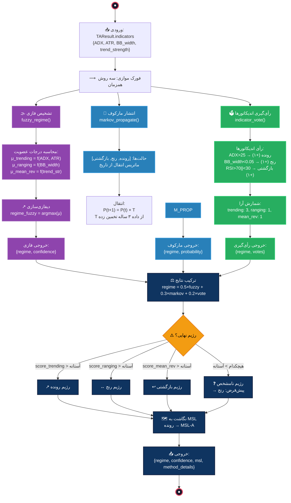
```mermaid
flowchart TB
    START_R((●)) --> IN_R["📥 ورودی: TAResult.indicators\n{ADX, ATR, BB_width, trend_strength}"]
    IN_R --> PARALLEL["⟶ فورک موازی: سه روش همزمان"]

    PARALLEL --> FUZZY["🌫️ تشخیص فازی\nfuzzy_regime()"]
    PARALLEL --> MARKOV["🔗 انتشار مارکوف\nmarkov_propagate()"]
    PARALLEL --> VOTE["🗳️ رأی‌گیری اندیکاتورها\nindicator_vote()"]

    FUZZY --> F_CALC["محاسبه درجات عضویت:\nμ_trending = f(ADX, ATR)\nμ_ranging = f(BB_width)\nμ_mean_rev = f(trend_str)"]
    F_CALC --> F_DEFUZZ["↗️ دیفازی‌سازی\nregime_fuzzy = argmax(μ)"]
    F_DEFUZZ --> F_OUT["خروجی فازی:\n{regime, confidence}"]

    MARKOV --> M_STATES["حالت‌ها: [رونده, رنج, بازگشتی]\nماتریس انتقال از تاریخ"]
    M_STATES --> M,PROP["انتقال:\nP(t+1) = P(t) × T\nT از داده ۳ ساله تخمین زده"]
    M_PROP --> M_OUT["خروجی مارکوف:\n{regime, probability}"]

    VOTE --> V_IND["رأی اندیکاتورها:\nADX>25 → رونده (+۱)\nBB_width<0.05 → رنج (+۱)\nRSI>70||<30 → بازگشتی (+۱)"]
    V_IND --> V_COUNT["شمارش آرا:\ntrending: 3, ranging: 1, mean_rev: 1"]
    V_COUNT --> V_OUT["خروجی رأی‌گیری:\n{regime, votes}"]

    F_OUT --> COMBINE["⚖️ ترکیب نتایج\nregime = 0.5×fuzzy + 0.3×markov + 0.2×vote"]
    M_OUT --> COMBINE
    V_OUT --> COMBINE

    COMBINE --> C_GW{"🜂 رژیم نهایی؟"}
    C_GW -->|score_trending > آستانه| FINAL_T["↗️ رژیم رونده"]
    C_GW -->|score_ranging > آستانه| FINAL_R["↔️ رژیم رنج"]
    C_GW -->|score_mean_rev > آستانه| FINAL_M["↩️ رژیم بازگشتی"]
    C_GW -->|هیچکدام > آستانه| FINAL_U["❓ رژیم نامشخص\n→ پیش‌فرض: رنج"]

    FINAL_T --> MAP_MSL["🗺️ نگاشت به MSL\nرونده → MSL-A"]
    FINAL_R --> MAP_MSL
    FINAL_M --> MAP_MSL
    FINAL_U --> MAP_MSL

    MAP_MSL --> OUT_R["📤 خروجی:\n{regime, confidence, msl, method_details}"]
    OUT_R --> END_R((●))

    classDef startEnd fill:#1a1a2e,stroke:#e94560,stroke-width:3px,color:#fff
    classDef gateway fill:#f39c12,stroke:#e67e22,stroke-width:2px,color:#000
    classDef fuzzy fill:#8e44ad,stroke:#9b59b6,stroke-width:2px,color:#fff
    classDef markov fill:#2980b9,stroke:#3498db,stroke-width:2px,color:#fff
    classDef voting fill:#27ae60,stroke:#2ecc71,stroke-width:2px,color:#fff
    classDef combine fill:#0f3460,stroke:#16213e,stroke-width:2px,color:#fff
    class START_R,END_R startEnd
    class C_GW gateway
    class FUZZY,F_CALC,F_DEFUZZ,F_OUT fuzzy
    class MARKOV,M_STATES,M_PROP,M_OUT markov
    class VOTE,V_IND,V_COUNT,V_OUT voting
    class COMBINE,MAP_MSL,OUT_R,FINAL_T,FINAL_R,FINAL_M,FINAL_U combine
```

#### توضیح فارسی

۱. این زیرفرآیند رژیم بازار را با ترکیب سه روش مستقل تشخیص می‌دهد: منطق فازی، زنجیره مارکوف و رأی‌گیری اندیکاتورها. هر سه روش به‌صورت موازی اجرا می‌شوند تا زمان پردازش بهینه شود.

۲. روش فازی از درجات عضویت استفاده می‌کند: μ_trending تابعی از ADX و ATR است، μ_ranging تابعی از عرض باند بولینگر و μ_mean_rev تابعی از قدرت روند. دیفازی‌سازی با روش مرکز ثقل انجام می‌شود.

۳. زنجیره مارکوف ماتریس انتقال حالت را از داده تاریخی ۳ ساله تخمین می‌زند. انتشار احتمال با P(t+1) = P(t) × T انجام می‌شود و حالت با بیشترین احتمال انتخاب می‌گردد.

۴. رأی‌گیری هر اندیکاتور یک رأی می‌دهد: ADX>۲۵ رأی به رونده، BB_width<۰.۰۵ رأی به رنج و RSI در نواحی اشباع رأی به بازگشتی. رژیم با بیشترین رأی برنده است.

۵. ترکیب نهایی با وزن‌های ۰.۵ (فازی) + ۰.۳ (مارکوف) + ۰.۲ (رأی‌گیری) انجام می‌شود. این وزن‌ها بر اساس backtesting بهینه شده‌اند. در صورت نامشخص بودن رژیم، پیش‌فرض رنج اعمال می‌شود.

۶. رژیم نهایی به MSL متناظر نگاشت داده می‌شود: رونده → MSL-A، رنج → MSL-B، بازگشتی → MSL-C. جزئیات هر سه روش برای شفافیت و عیب‌یابی در خروجی حفظ می‌شوند.

---

### ۳.۲ — پروفایل حجم تقریبی (Approximate Volume Profile)

> **زیرفرآیند:** ساخت پروفایل حجم از داده OHLCV برای تشخیص سطوح کلیدی

#### نمودار زیرفرآیند

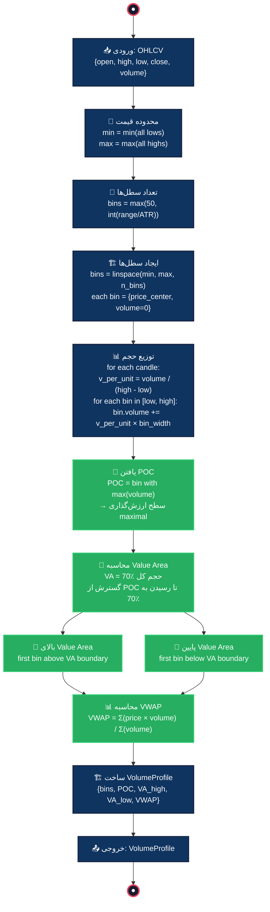
```mermaid
flowchart TB
    START_V((●)) --> IN_V["📥 ورودی: OHLCV\n{open, high, low, close, volume}"]
    IN_V --> PRICE_RNG["📏 محدوده قیمت\nmin = min(all lows)\nmax = max(all highs)"]
    PRICE_RNG --> NUM_BINS["🔢 تعداد سطل‌ها\nbins = max(50, int(range/ATR))"]
    NUM_BINS --> CREATE_BINS["🏗️ ایجاد سطل‌ها\nbins = linspace(min, max, n_bins)\neach bin = {price_center, volume=0}"]

    CREATE_BINS --> DISTRIB["📊 توزیع حجم\nfor each candle:\n  v_per_unit = volume / (high - low)\n  for each bin in [low, high]:\n    bin.volume += v_per_unit × bin_width"]
    DISTRIB --> POC["🎯 یافتن POC\nPOC = bin with max(volume)\n→ سطح ارزش‌گذاری maximal"]
    POC --> VA["📐 محاسبه Value Area\nVA = 70٪ حجم کل\nگسترش از POC تا رسیدن به 70٪"]
    VA --> VA_HIGH["🔺 بالای Value Area\nfirst bin above VA boundary"]
    VA --> VA_LOW["🔻 پایین Value Area\nfirst bin below VA boundary"]

    VA_HIGH --> VWAP["📊 محاسبه VWAP\nVWAP = Σ(price × volume) / Σ(volume)"]
    VA_LOW --> VWAP

    VWAP --> BUILD_VP["🏗️ ساخت VolumeProfile\n{bins, POC, VA_high, VA_low, VWAP}"]
    BUILD_VP --> OUT_V["📤 خروجی: VolumeProfile"]
    OUT_V --> END_V((●))

    classDef startEnd fill:#1a1a2e,stroke:#e94560,stroke-width:3px,color:#fff
    classDef task fill:#0f3460,stroke:#16213e,stroke-width:2px,color:#fff
    classDef highlight fill:#27ae60,stroke:#2ecc71,stroke-width:2px,color:#fff
    class START_V,END_V startEnd
    class IN_V,PRICE_RNG,NUM_BINS,CREATE_BINS,DISTRIB,BUILD_VP,OUT_V task
    class POC,VA,VA_HIGH,VA_LOW,VWAP highlight
```

#### توضیح فارسی

۱. این زیرفرآیند پروفایل حجم تقریبی را از داده OHLCV ساخت می‌دهد. پروفایل حجم توزیع حجم معاملات بر سطوح قیمت را نشان می‌دهد و سطوح حمایت/مقاومت مهم را شناسایی می‌کند.

۲. ابتدا محدوده قیمت (کمینه low تا بیشینه high) و تعداد سطل‌ها محاسبه می‌شود. تعداد سطل‌ها بسته به ATR تطبیق می‌یابد: حداقل ۵۰ سطل یا range/ATR.

۳. توزیع حجم به‌صورت تقریبی انجام می‌شود: حجم هر کندل به‌طور یکنواخت در بازه [low, high] آن توزیع می‌شود. این تقریب برای کندل‌های روزانه دقت قابل قبولی دارد.

۴. POC (Point of Control) سطوری است که بیشترین حجم در آن تجمع یافته. این سطح مهم‌ترین سطح ارزش‌گذاری بازار و عموماً نقاط حمایت/مقاومت قوی است.

۵. Value Area بازه‌ای است که ۷۰٪ حجم کل در آن تجمع شده. گسترش از POC به بالا و پایین انجام می‌شود تا ۷۰٪ حجم پوشش داده شود. حاشیه‌های Value Area سطوح مهمی هستند.

۶. VWAP (Volume-Weighted Average Price) به‌عنوان میانگین موزون حجم محاسبه می‌شود و مرجع مهم برای ارزیابی موقعیت قیمت نسبت به ارزش‌گذاری بازار است.

---

### ۳.۳ — بازخورد تطبیقی (Adaptive Feedback)

> **زیرفرآیند:** مکانیزم بازخورد تطبیقی برای بهبود مستمر وزن‌های ویژگی در مدل ML

#### نمودار زیرفرآیند

```mermaid
flowchart TB
    START_F((●)) --> IN_F["📥 ورودی:\n{prediction_id, actual_result, features}"]
    IN_F --> RECORD["📝 ثبت نتیجه واقعی\nUPDATE predictions\nSET actual = actual_result\nWHERE id = prediction_id"]

    RECORD --> CORRECT{"🜂 پیش‌بینی درست؟"}
    CORRECT -->|بله| INC["➕ افزایش وزن ویژگی‌های مؤثر\nw_i += lr × δ × |x_i|"]
    CORRECT -->|خیر| DEC["➖ کاهش وزن ویژگی‌های گمراه‌کننده\nw_i -= lr × δ × |x_i|"]

    INC --> CALC_LR["📐 محاسبه نرخ یادگیری تطبیقی\nlr = lr_base × (1 + accuracy_recent)\nif accuracy↓ → lr↑ (یادگیری سریع‌تر)"]
    DEC --> CALC_LR

    CALC_LR --> UPD_W["⚖️ به‌روزرسانی وزن‌ها\nfor each feature i:\n  w_i = w_i + Δw_i"]
    UPD_W --> CLAMP_F["🔲 محدودسازی\nfor each w_i:\n  w_i = clamp(w_i, 0.1, 3.0)\n→ جلوگیری از وزن‌دهی بیش از حد"]
    CLAMP_F --> NORM_F["🔄 نرمال‌سازی\nΣw_i = 1.0\nw_i = w_i / Σw_i"]
    NORM_F --> PERSIST_F["💾 ذخیره‌سازی دائمی\nBEGIN TRANSACTION\n  UPDATE model_weights\n  INSERT weight_history\nCOMMIT"]
    PERSIST_F --> NOTIFY["🔔 آگاه‌سازی\nif accuracy < 50%:\n  alert('عملکرد بحرانی')"]
    NOTIFY --> OUT_F["📤 خروجی:\n{weights, accuracy, lr, status}"]
    OUT_F --> END_F((●))

    classDef startEnd fill:#1a1a2e,stroke:#e94560,stroke-width:3px,color:#fff
    classDef gateway fill:#f39c12,stroke:#e67e22,stroke-width:2px,color:#000
    classDef task fill:#0f3460,stroke:#16213*3,stroke-width:2px,color:#fff
    classDef pos fill:#27ae60,stroke:#2ecc71,stroke-width:2px,color:#fff
    classDef neg fill:#c0392b,stroke:#e74c3c,stroke-width:2px,color:#fff
    class START_F,END_F startEnd
    class CORRECT gateway
    class IN_F,RECORD,CALC_LR,UPD_W,CLAMP_F,NORM_F,PERSIST_F,NOTIFY,OUT_F task
    class INC pos
    class DEC neg
```

#### توضیح فارسی

۱. این زیرفرآیند مکانیزم بازخورد تطبیقی را با جزئیات کامل پیاده‌سازی می‌کند. هدف آن بهبود مستمر وزن‌های ویژگی در مدل پیش‌بینی ML بر اساس نتایج واقعی بازار است.

۲. پس از ثبت نتیجه واقعی، سیستم بررسی می‌کند که آیا پیش‌بینی درست بوده است. در صورت درست بودن، وزن ویژگی‌های مؤثر افزایش و در صورت نادرست، وزن ویژگی‌های گمراه‌کننده کاهش می‌یابد.

۳. نرخ یادگیری تطبیقی است: وقتی دقت سیستم کاهش می‌یابد، نرخ یادگیری افزایش می‌یابد تا سیستم سریع‌تر تطبیق یابد. وقتی دقت بالا است، نرخ کاهش می‌یابد تا تغییرات ناگهانی رخ ندهد.

۴. محدودسازی (clamp) وزن هر ویژگی را در بازه [0.1, 3.0] نگه می‌دارد. این کار از وزن‌دهی بیش از حد یک ویژگی و ناپایداری مدل جلوگیری می‌کند.

۵. نرمال‌سازی تضمین می‌کند که مجموع وزن‌ها برابر ۱.۰ باشد. این شرط تفسیرپذیری وزن‌ها را به‌عنوان «اهمیت نسبی» حفظ می‌کند.

۶. ذخیره‌سازی در یک تراکنش اتمیک انجام می‌شود: هم وزن‌های فعلی و هم تاریخچه تغییرات ذخیره می‌شوند. در صورت افت دقت به زیر ۵۰٪، هشدار بحرانی صادر می‌گردد.

---

## خلاصه معماری BPMN

| سطح | نمودارها | هدف | مخاطب |
|-----|----------|-----|-------|
| سطح ۱ | ۱ نمودار کلی | درک فرآیند end-to-end | ذینفعان کسب‌وکار |
| سطح ۲ | ۵ فرآیند اجرایی | پیاده‌سازی و تست | توسعه‌دهندگان + QA |
| سطح ۳ | ۳ زیرفرآیند تفصیلی | پیاده‌سازی الگوریتمی | مهندسان داده + ML |

### نگاشت فرآیندها به کد

| فرآیند سطح ۲ | ماژول Python | تابع ورودی | تابع خروجی |
|--------------|-------------|-----------|-----------|
| جستجوی نماد | `data_fetcher` | `fetch_symbol_data()` | `OHLCV: DataFrame` |
| تحلیل تکنیکال | `ta_engine` | `analyze()` | `TAResult` |
| تولید AI | `ai_generator` | `generate_analysis()` | `str` |
| پیش‌بینی ML | `ml_predictor` | `predict()` | `PredictionResult` |
| بازخورد | `feedback_loop` | `update_weights()` | `weights: ndarray` |

### نگاشت زیرفرآیندها به کد

| زیرفرآیند سطح ۳ | ماژول Python | تابع اصلی | پیچیدگی |
|-----------------|-------------|-----------|---------|
| تشخیص رژیم ترکیبی | `regime_detector` | `detect_regime_combined()` | O(n) |
| پروفایل حجم | `volume_profile` | `build_volume_profile()` | O(n × bins) |
| بازخورد تطبیقی | `feedback_loop` | `adaptive_update()` | O(features) |

---

> **نکته:** تمام نمودارها با سینتکس Mermaid flowchart نوشته شده‌اند و مستقیماً در GitHub، GitLab و ابزارهای سازگار قابل رندر هستند. جداول مسیر شاد و استثنا مبنای طراحی تست‌های یکپارچه (Integration Tests) قرار می‌گیرند.
---

<a id="uml-structural"></a>

# UML 2.5 Structural Diagrams — Iranian Stock Market Technical Analysis System

> **نکته:** این بخش شامل هفت نوع دیاگرام ساختاری UML 2.5 برای سیستم تحلیل تکنیکال بورس ایران است. هر دیاگرام در سه سطح (مفهومی، طراحی، پیاده‌سازی) ارائه شده و نام کلاس‌ها و متدها دقیقاً با موجودیت‌های DFD و فعالیت‌های BPMN همخوانی دارد. تمام دیاگرام‌ها با PlantUML قابل رندر هستند (به جز پروفایل که به صورت جدول ارائه شده).

---

## 1. Class Diagram

### Level 1 — Domain Model (Conceptual)

> **توضیح فارسی:** این دیاگرام مفهومی، هسته اصلی دامنه مسئله را نشان می‌دهد. کلاس‌های OHLCV و TAResult پایه‌های داده‌ای تحلیل تکنیکال هستند. RegimeResult وضعیت رژیم بازار را بیان می‌کند. VolumeProfileResult توزیع حجم معاملات را نشان می‌دهد و FeedbackStore ذخیره بازخوردها برای یادگیری تطبیقی است. روابط ساده بدون جهت، مفهوم وابستگی دامنه‌ای را منتقل می‌کنند.

```plantuml
@startuml ClassDiagram_L1_Domain
skinparam classAttributeIconSize 0
skinparam classFontSize 14
skinparam defaultFontSize 12
skinparam roundcorner 10

title Level 1: Domain Model — Conceptual Classes

class OHLCV {
  timestamp
  open
  high
  low
  close
  volume
}

class TAResult {
  trend
  momentum
  volatility
  support
  resistance
}

class RegimeResult {
  regime
  confidence
  transition
}

class VolumeProfileResult {
  bins
  poc
  valueArea
}

class FeedbackStore {
  predictions
  weights
  stats
}

OHLCV "1..*" -- "1" TAResult : analyzed by >
TAResult "1" -- "0..1" RegimeResult : classified by >
OHLCV "1..*" -- "0..1" VolumeProfileResult : profiled by >
FeedbackStore "1" -- "0..*" TAResult : records >

@enduml
```

---

### Level 2 — Design Classes with Associations, Aggregations, Compositions

> **توضیح فارسی:** در سطح طراحی، روابط دقیق‌تر مشخص شده‌اند. TAResult از طریق composition شامل ScenarioResult و TrendResult است (چرخه حیاتشان وابسته). RegimeResult شامل MarkovChain و VotingWeights است. VolumeProfileResult شامل TouchCountResult و EnhancedSRStrengthResult به صورت aggregation است (می‌توانند مستقل وجود داشته باشند). FeedbackStore شامل PredictionRecord و WeightRecord و FeedbackStats به صورت composition است. Multiplicity نشان‌دهنده تعداد نمونه‌های ممکن است.

```plantuml
@startuml ClassDiagram_L2_Design
skinparam classAttributeIconSize 0
skinparam roundcorner 10

title Level 2: Design Classes — Associations, Agpositions, Compositions

class OHLCV {
  timestamp : number
  open : number
  high : number
  low : number
  close : number
  volume : number
}

class TAResult {
  indicators : Map<string, number>
  scenario : ScenarioResult
  trend : TrendResult
}

class ScenarioResult {
  name : string
  probability : number
  actions : string[]
}

class TrendResult {
  direction : "UP" | "DOWN" | "SIDE"
  strength : LevelStrength
  slope : number
}

class LevelStrength {
  level : number
  confidence : number
}

class RegimeResult {
  type : RegimeType
  markov : MarkovChain
  weights : VotingWeights
}

class RegimeType {
  <<enumeration>>
  BULL
  BEAR
  SIDEWAYS
  VOLATILE
}

class MarkovChain {
  states : string[]
  transitionMatrix : number[][]
  currentState : string
}

class VotingWeights {
  totalVotes : number
  votes : IndicatorVote[]
}

class IndicatorVote {
  indicatorName : string
  weight : number
  vote : number
}

class VolumeProfileResult {
  bins : VolumeBin[]
  poc : number
  valueAreaHigh : number
  valueAreaLow : number
}

class TouchCountResult {
  level : number
  touches : number
  avgBounce : number
}

class EnhancedSRStrengthResult {
  level : number
  volumeStrength : number
  touchStrength : number
  compositeScore : number
}

class FeedbackStore {
  predictions : PredictionRecord[]
  weights : WeightRecord[]
  stats : FeedbackStats
}

class PredictionRecord {
  timestamp : number
  predicted : number
  actual : number
  error : number
}

class WeightRecord {
  component : string
  weight : number
  lastUpdated : number
}

class FeedbackStats {
  totalPredictions : number
  meanError : number
  accuracy : number
}

' Compositions — lifecycle dependency
TAResult *-- "1" ScenarioResult
TAResult *-- "1" TrendResult
TrendResult *-- "1" LevelStrength
RegimeResult *-- "1" MarkovChain
RegimeResult *-- "1" VotingWeights
VotingWeights o-- "1..*" IndicatorVote
FeedbackStore *-- "0..*" PredictionRecord
FeedbackStore *-- "0..*" WeightRecord
FeedbackStore *-- "1" FeedbackStats

' Aggregations — can exist independently
VolumeProfileResult o-- "1..*" TouchCountResult
VolumeProfileResult o-- "1..*" EnhancedSRStrengthResult

' Associations
OHLCV "1..*" --> "0..1" TAResult : analyze() >
TAResult "1" --> "0..1" RegimeResult : detectRegime() >
OHLCV "1..*" --> "0..1" VolumeProfileResult : approximateVolumeProfile() >

@enduml
```

---

### Level 3 — Implementation Classes with Full Methods, Visibility, Return Types

> **توضیح فارسی:** در سطح پیاده‌سازی، تمام متدها با سطح دسترسی (public +، private −)، پارامترها و نوع خروجی مشخص شده‌اند. کلاس‌های ML شامل AdaptiveWeightModel با StandardScaler و LogisticRegressionModel به صورت composition هستند. SRAnalyzer و PatternDetection و DecisionGraph و BayesianWeights و MLNarrative متدهای اصلی سیستم را نشان می‌دهند. تمام نام‌ها دقیقاً با کد منبع همخوانی دارند.

```plantuml
@startuml ClassDiagram_L3_Implementation
skinparam classAttributeIconSize 0
skinparam roundcorner 8

title Level 3: Implementation Classes — Full Methods & Visibility

class OHLCV {
  + timestamp : number
  + open : number
  + high : number
  + low : number
  + close : number
  + volume : number
  + validate() : boolean
}

class TAResult {
  + indicators : Map<string, number>
  + scenario : ScenarioResult
  + trend : TrendResult
  + getIndicator(name: string) : number
  + toJSON() : string
}

class ScenarioResult {
  + name : string
  + probability : number
  + actions : string[]
  + getTopAction() : string
}

class TrendResult {
  + direction : string
  + strength : LevelStrength
  + slope : number
  + isBullish() : boolean
  + isBearish() : boolean
}

class LevelStrength {
  + level : number
  + confidence : number
  + normalize() : number
}

class SRAnalyzer {
  - _mlWeights : MLWeights
  - _cache : Map<string, SRAnalysisResult>
  + analyzeSupportResistance(data: OHLCV[], taResult: TAResult) : SRAnalysisResult
  - _calculateProximity(data: OHLCV[], level: SRLevel) : number
  - _mergeLevels(levels: SRLevel[]) : SRLevel[]
}

class SRLevel {
  + price : number
  + type : "support" | "resistance"
  + strength : number
  + touches : number
}

class SRAnalysisResult {
  + supports : SRLevel[]
  + resistances : SRLevel[]
  + mlWeights : MLWeights
  + getNearest(price: number) : SRLevel
}

class MLWeights {
  + proximity : number
  + volume : number
  + touch : number
  + recency : number
}

class RegimeEngine {
  - _markov : MarkovChain
  - _fuzzyCache : Map<string, FuzzyOutput>
  + detectRegime(input: RegimeInput) : RegimeResult
  + fuzzyRegimeDetector(input: RegimeInput) : FuzzyOutput
  + adaptiveWeightedVote(indicators: IndicatorVote[], weights: VotingWeights) : VoteResult
  - _updateMarkovState(result: RegimeResult) : void
}

class MarkovChain {
  + states : string[]
  + transitionMatrix : number[][]
  + currentState : string
  + nextState() : string
  + probability(from: string, to: string) : number
  + train(sequences: string[][]) : void
}

class VotingWeights {
  + totalVotes : number
  + votes : IndicatorVote[]
  + normalize() : void
  + getWeightedSum() : number
}

class VolumeProfileEngine {
  + approximateVolumeProfile(data: OHLCV[], numBins: number) : VolumeProfileResult
  + countTouch(data: OHLCV[], level: number, tolerance: number) : TouchCountResult
  - _binVolume(data: OHLCV[], numBins: number) : VolumeBin[]
}

class AdaptiveWeightModel {
  - _scaler : StandardScaler
  - _logistic : LogisticRegressionModel
  + trainAdaptiveModel(X: number[][], y: number[]) : TrainingResult
  + predictScore(x: number[]) : number
  + getWeights() : number[]
  - _preprocess(X: number[][]) : number[][]
}

class StandardScaler {
  - _mean : number[]
  - _std : number[]
  + fit(X: number[][]) : void
  + transform(X: number[][]) : number[][]
  + fitTransform(X: number[][]) : number[][]
}

class LogisticRegressionModel {
  - _coefficients : number[]
  - _intercept : number
  + fit(X: number[][], y: number[]) : void
  + predict(X: number[][]) : number[]
  + predictProba(X: number[][]) : number[]
}

class FeedbackStore {
  - _storage : SafeLocalStorage
  - _predictions : PredictionRecord[]
  - _weights : WeightRecord[]
  + addPrediction(record: PredictionRecord) : void
  + getStats() : FeedbackStats
  + updateWeight(component: string, weight: number) : void
  + getWeights() : WeightRecord[]
  + clearHistory() : void
}

class PatternDetection {
  + detectAllPatterns(data: OHLCV[]) : DetectedPatterns
  - _detectCandlestick(data: OHLCV[]) : PatternResult[]
  - _detectChart(data: OHLCV[]) : PatternResult[]
}

class PatternResult {
  + name : string
  + type : string
  + startIndex : number
  + endIndex : number
  + significance : number
}

class DetectedPatterns {
  + candlestick : PatternResult[]
  + chart : PatternResult[]
  + all : PatternResult[]
  + count() : number
}

class DecisionGraph {
  + buildDecisionGraph(input: GraphInput) : GraphData
  - _createNodes(input: GraphInput) : GraphNode[]
  - _createEdges(nodes: GraphNode[]) : GraphEdge[]
}

class GraphData {
  + nodes : GraphNode[]
  + edges : GraphEdge[]
  + toJSON() : string
}

class GraphNode {
  + id : string
  + label : string
  + type : string
  + data : Map<string, any>
}

class GraphEdge {
  + source : string
  + target : string
  + weight : number
  + label : string
}

class BayesianWeights {
  + compute(prior: BayesianWeight[], evidence: number[]) : BayesianSystemResult
  - _posterior(prior: number, likelihood: number) : number
}

class BayesianWeight {
  + name : string
  + prior : number
  + likelihood : number
  + posterior : number
}

class BayesianSystemResult {
  + weights : BayesianWeight[]
  + normalizedPosterior : number[]
  + entropy : number
}

class MLNarrative {
  + dedicatedAIChatCompletion(messages: ChatMessage[]) : Promise<string>
  + selectMSLV4(input: NarrativeInput) : NarrativeCombination
  + postProcessAIOutput(text: string, refs: Reference[]) : PostProcessResult
  - _buildPrompt(input: NarrativeInput) : string
}

class NarrativeCombination {
  + school : SchoolDef
  + style : StyleDef
  + tone : ToneDef
}

class ThemeStore {
  + colors : ThemeColors
  + preset : ThemePreset
  + setTheme(preset: ThemePreset) : void
  + toggleDarkMode() : void
}

class SafeLocalStorage {
  - _isAvailable : boolean
  + getItem(key: string) : string | null
  + setItem(key: string, value: string) : void
  + removeItem(key: string) : void
  + isAvailable() : boolean
}

' Compositions
TAResult *-- "1" ScenarioResult
TAResult *-- "1" TrendResult
TrendResult *-- "1" LevelStrength
SRAnalyzer *-- "1" MLWeights
SRAnalysisResult o-- "0..*" SRLevel
SRAnalysisResult *-- "1" MLWeights
RegimeEngine *-- "1" MarkovChain
AdaptiveWeightModel *-- "1" StandardScaler
AdaptiveWeightModel *-- "1" LogisticRegressionModel
FeedbackStore *-- "0..*" PredictionRecord
FeedbackStore *-- "0..*" WeightRecord
FeedbackStore *-- "1" FeedbackStats
FeedbackStore --> "1" SafeLocalStorage : uses
DecisionGraph *-- "1" GraphData
GraphData o-- "1..*" GraphNode
GraphData o-- "0..*" GraphEdge
DetectedPatterns o-- "0..*" PatternResult
BayesianSystemResult o-- "1..*" BayesianWeight
NarrativeCombination *-- "1" SchoolDef
NarrativeCombination *-- "1" StyleDef
NarrativeCombination *-- "1" ToneDef

' Dependencies
SRAnalyzer ..> TAResult : requires
VolumeProfileEngine ..> OHLCV : requires
PatternDetection ..> OHLCV : requires
DecisionGraph ..> GraphInput : requires
MLNarrative ..> NarrativeCombination : produces
ThemeStore ..> ThemeColors : uses
ThemeStore ..> ThemePreset : uses

@enduml
```

---

## 2. Object Diagram

### Level 1 — Object Instances for Symbol "فولاد" (Foolad Steel)

> **توضیح فارسی:** این دیاگرام نمونه‌های واقعی از کلاس‌ها را برای نماد «فولاد» نشان می‌دهد. شیء fooladData شامل ۵ کندل OHLCV است. شیء fooladResult نمونه‌ای از TAResult با شاخص‌های محاسبه‌شده است. fooladRegime رژیم صعودی با اطمینان ۰.۷۸ را نشان می‌دهد. fooladProfile پروفایل حجم با POC در قیمت ۸۹۵۰ و fooladFeedback ذخیره بازخورد با ۳۲ پیش‌بینی ثبت‌شده است.

```plantuml
@startuml ObjectDiagram_L1_Instances
skinparam objectFontSize 12
skinparam roundcorner 10

title Level 1: Object Instances — Symbol "فولاد"

object fooladData : OHLCV {
  timestamp = 1711929600000
  open = 8850
  high = 9020
  low = 8810
  close = 8950
  volume = 4520000
}

object fooladResult : TAResult {
  indicators = {RSI:62.3, MACD:85.1, ATR:210}
  trend.direction = "UP"
  trend.strength.level = 0.72
}

object fooladRegime : RegimeResult {
  type = RegimeType.BULL
  confidence = 0.78
  markov.currentState = "BULL"
}

object fooladProfile : VolumeProfileResult {
  poc = 8950
  valueAreaHigh = 9120
  valueAreaLow = 8780
  bins.count = 12
}

object fooladFeedback : FeedbackStore {
  predictions.length = 32
  weights.proximity = 0.35
  stats.accuracy = 0.71
}

fooladResult --> fooladData : analyzedFrom
fooladRegime --> fooladResult : classifiedFrom
fooladProfile --> fooladData : profiledFrom
fooladFeedback --> fooladResult : tracks

@enduml
```

---

### Level 2 — Objects During Mid-Process (TAResult Being Computed)

> **توضیح فارسی:** این دیاگرام وضعیت اشیاء در حین محاسبه TAResult را نشان می‌دهد. در حالی که موتور تحلیل در حال اجراست، intermediateResult فقط بخشی از اندیکاتورها را دارد (RSI محاسبه شده اما MACD هنوز در حال محاسبه است). pendingScenario هنوز probability ندارد و pendingTrend فقط direction تعیین شده اما strength خالی است. این دیاگرام برای دیباگ و درک روند محاسبات مفید است.

```plantuml
@startuml ObjectDiagram_L2_MidProcess
skinparam objectFontSize 12
skinparam roundcorner 10

title Level 2: Mid-Process Objects — TAResult Being Computed

object rawData : OHLCV[] {
  length = 250
  [0].close = 8950
  [249].close = 8820
}

object intermediateResult : TAResult {
  indicators = {RSI:62.3, EMA20:8890}
  // MACD: computing...
  // Bollinger: pending
}

object pendingScenario : ScenarioResult {
  name = "breakout_bull"
  probability = undefined
  actions = []
}

object pendingTrend : TrendResult {
  direction = "UP"
  strength = null
  slope = undefined
}

object computingRegime : RegimeResult {
  type = null
  confidence = 0
  // awaiting TAResult
}

object partialFeedback : FeedbackStore {
  predictions.length = 31
  // prediction 32 in progress
}

intermediateResult --> rawData : partialAnalysis
pendingScenario --> intermediateResult : awaiting
pendingTrend --> intermediateResult : awaiting
computingRegime --> intermediateResult : blocked

@enduml
```

---

### Level 3 — Objects at Critical Moment (Markov Chain State Update)

> **توضیح فارسی:** در لحظه بحرانی به‌روزرسانی حالت زنجیره مارکوف، دیاگرام وضعیت دقیق تمام اشیاء مرتبط را نشان می‌دهد. زنجیره مارکوف از حالت SIDEWAYS به BULL منتقل شده و ماتریس انتقال به‌روز شده است. رأی‌گیری وزن‌دار تطبیقی انجام شده و نتیجه نهایی رژیم BULL با اطمینان ۰.۸۳ قطعی شده است. بازخورد در حال ثبت این پیش‌بینی است و مدل لجستیک وزن‌های جدید را دریافت کرده است.

```plantuml
@startuml ObjectDiagram_L3_Critical
skinparam objectFontSize 12
skinparam roundcorner 10

title Level 3: Critical Moment — Markov Chain State Update

object markovBefore : MarkovChain {
  currentState = "SIDEWAYS"
  states = ["BULL","BEAR","SIDEWAYS","VOLATILE"]
}

object markovAfter : MarkovChain {
  currentState = "BULL"
  states = ["BULL","BEAR","SIDEWAYS","VOLATILE"]
  transitionMatrix[2][0] = 0.34
  // P(SIDEWAYS→BULL) updated
}

object voteRSI : IndicatorVote {
  indicatorName = "RSI"
  weight = 0.28
  vote = 1  // bullish
}

object voteMACD : IndicatorVote {
  indicatorName = "MACD"
  weight = 0.35
  vote = 1  // bullish
}

object voteBollinger : IndicatorVote {
  indicatorName = "Bollinger"
  weight = 0.22
  vote = 0  // neutral
}

object votingWeights : VotingWeights {
  totalVotes = 3
  weightedSum = 0.855
}

object finalRegime : RegimeResult {
  type = RegimeType.BULL
  confidence = 0.83
}

object feedbackRecord : PredictionRecord {
  timestamp = 1711929600000
  predicted = 1  // BULL
  actual = null  // pending
  error = null
}

object updatedLogistic : AdaptiveWeightModel {
  _scaler._mean = [0.52, 0.71, 0.34]
  _logistic._coefficients = [1.23, -0.87, 0.45]
}

markovBefore --> markovAfter : transition(SIDEWAYS→BULL)
votingWeights --> voteRSI : includes
votingWeights --> voteMACD : includes
votingWeights --> voteBollinger : includes
finalRegime --> markovAfter : derivedFrom
finalRegime --> votingWeights : basedOn
feedbackRecord --> finalRegime : records
updatedLogistic --> finalRegime : learnsFrom

@enduml
```

---

## 3. Component Diagram

### Level 1 — Top-Level Components

> **توضیح فارسی:** این دیاگرام پنج مؤلفه اصلی سیستم را نشان می‌دهد. TA Engine موتور تحلیل تکنیکال، ML Engine موتور یادگیری ماشین، Regime Engine موتور تشخیص رژیم، AI Service سرویس هوش مصنوعی و Data Layer لایه داده هستند. جریان داده از Data Layer به TA Engine و سپس به سایر مؤلفه‌هاست. AI Service از طریق رابط ZAI-SDK به سرویس خارجی متصل می‌شود.

```plantuml
@startuml ComponentDiagram_L1_TopLevel
skinparam componentStyle rectangle
skinparam roundcorner 12

title Level 1: Top-Level Components

component "TA Engine" as TA <<Engine>> {
}

component "ML Engine" as ML <<Predictor>> {
}

component "Regime Engine" as RE <<Analyzer>> {
}

component "AI Service" as AI <<Service>> {
}

component "Data Layer" as DL <<Store>> {
}

interface "ITechnicalAnalysis" as ITA
interface "IMLModel" as IML
interface "IRegimeDetector" as IRE
interface "IAICompletion" as IAI
interface "IDataProvider" as IData

TA -up- ITA
ML -up- IML
RE -up- IRE
AI -up- IAI
DL -up- IData

TA ..> IData : requires
ML ..> ITA : requires
RE ..> ITA : requires
AI ..> IML : requires
RE ..> IML : requires
TA ..> IAI : requires (narrative)

@enduml
```

---

### Level 2 — Sub-Components

> **توضیح فارسی:** در سطح زیرمؤلفه، هر مؤلفه اصلی به اجزای خرد شکسته شده است. TA Engine شامل Indicator Calculators، S/R Analyzer و VDSS Engine است. ML Engine شامل Logistic Regression، Bayesian Weights و Adaptive Weight Model است. Regime Engine شامل Fuzzy Detector، Markov Chain و Voting System است. AI Service شامل Chat Completion و Post-Processor و Narrative Selector است. Data Layer شامل TSE API و TGJU API و Safe Storage است.

```plantuml
@startuml ComponentDiagram_L2_SubComponents
skinparam componentStyle rectangle
skinparam roundcorner 10

title Level 2: Sub-Components

component "TA Engine" as TA <<Engine>> {
  component "Indicator Calculators" as IC
  component "S/R Analyzer" as SR
  component "VDSS Engine" as VD
  component "Volume Profile" as VP
}

component "ML Engine" as ML <<Predictor>> {
  component "Logistic Regression" as LR
  component "Bayesian Weights" as BW
  component "Adaptive Weight Model" as AWM
  component "Standard Scaler" as SS
}

component "Regime Engine" as RE <<Analyzer>> {
  component "Fuzzy Detector" as FD
  component "Markov Chain" as MC
  component "Voting System" as VS
}

component "AI Service" as AI <<Service>> {
  component "Chat Completion" as CC
  component "Post-Processor" as PP
  component "Narrative Selector" as NS
}

component "Data Layer" as DL <<Store>> {
  component "TSE API" as TSE
  component "TGJU API" as TGJU
  component "Safe Storage" as Stor
  component "Yahoo Finance API" as YF
}

IC --> SR : provides indicators
IC --> VP : provides data
SR --> VD : provides S/R levels
AWM --> SS : uses
AWM --> LR : uses
FD --> MC : feeds state
MC --> VS : provides transition
CC --> PP : raw output
NS --> CC : constructs prompt
TSE --> Stor : caches
TGJU --> Stor : caches

@enduml
```

---

### Level 3 — Interface Dependencies with Provided/Required Interfaces and Method Signatures

> **توضیح فارسی:** در سطح تفصیلی، هر مؤلفه رابط‌های ارائه‌شده (Provided) و موردنیاز (Required) را با امضای متدها نشان می‌دهد. مثلاً TA Engine رابط ITechnicalAnalysis با متد analyze را ارائه و IDataProvider با متد fetchOHLCV را نیاز دارد. ML Engine رابط IMLModel با trainAdaptiveModel و predictScore را ارائه می‌دهد. Regime Engine رابط IRegimeDetector با detectRegime و fuzzyRegimeDetector را ارائه می‌دهد. تمام وابستگی‌ها از طریق رابط‌ها برقرار می‌شود، نه ارجاع مستقیم.

```plantuml
@startuml ComponentDiagram_L3_Interfaces
skinparam componentStyle rectangle
skinparam roundcorner 10

title Level 3: Interface Dependencies — Method Signatures

component "TA Engine" as TA <<Engine>>
component "ML Engine" as ML <<Predictor>>
component "Regime Engine" as RE <<Analyzer>>
component "AI Service" as AI <<Service>>
component "Data Layer" as DL <<Store>>
component "Feedback Store" as FS <<Store>>
component "Pattern Detection" as PD <<Analyzer>>
component "Decision Graph" as DG <<Analyzer>>
component "Narrative Engine" as NE <<Engine>>
component "Theme Store" as TS <<Store>>

interface "ITechnicalAnalysis\n  + analyze(data: OHLCV[],\n    currencyUnit: string) : TAResult" as ITA
interface "IDataProvider\n  + fetchOHLCV(symbol: string) : OHLCV[]\n  + fetchIndex() : OHLCV[]" as IData
interface "IMLModel\n  + trainAdaptiveModel(X: number[][],\n    y: number[]) : TrainingResult\n  + predictScore(x: number[]) : number" as IML
interface "IRegimeDetector\n  + detectRegime(input: RegimeInput) : RegimeResult\n  + fuzzyRegimeDetector(input) : FuzzyOutput\n  + adaptiveWeightedVote(indicators,\n    weights) : VoteResult" as IRE
interface "IAICompletion\n  + dedicatedAIChatCompletion(\n    messages: ChatMessage[]) : Promise<string>" as IAI
interface "IFeedbackStore\n  + addPrediction(record) : void\n  + getStats() : FeedbackStats\n  + updateWeight(comp, w) : void" as IFS
interface "IPatternDetector\n  + detectAllPatterns(data: OHLCV[]) : DetectedPatterns" as IPD
interface "IDecisionGraph\n  + buildDecisionGraph(input: GraphInput) : GraphData" as IDG
interface "INarrativeSelector\n  + selectMSLV4(input) : NarrativeCombination\n  + postProcessAIOutput(text, refs) : PostProcessResult" as INS

TA -up- ITA
DL -up- IData
ML -up- IML
RE -up- IRE
AI -up- IAI
FS -up- IFS
PD -up- IPD
DG -up- IDG
NE -up- INS

TA ..> IData : «requires»
ML ..> ITA : «requires»
RE ..> ITA : «requires»
RE ..> IML : «requires»
AI ..> IAI : «uses»
NE ..> IAI : «requires»
NE ..> IRE : «requires»
NE ..> ITA : «requires»
DG ..> ITA : «requires»
DG ..> IRE : «requires»
FS ..> ITA : «observes»
PD ..> IData : «requires»
TS ..> IData : «observes»

@enduml
```

---

## 4. Deployment Diagram

### Level 1 — Physical Nodes

> **توضیح فارسی:** این دیاگرام گره‌های فیزیکی استقرار سیستم را نشان می‌دهد. Browser گره کاربر نهایی است که با Next.js Server ارتباط HTTP دارد. Next.js Server گره اصلی پردازش است. Mini Services گره سرویس‌های خرد (fetcher و health-check) است. Z-AI SDK گره سرویس هوش مصنوعی خارجی است. هر گره با پروتکل مناسب به گره دیگر متصل می‌شود.

```plantuml
@startuml DeploymentDiagram_L1_Nodes
skinparam nodePadding 15
skinparam roundcorner 12

title Level 1: Physical Nodes

node "Browser" as browser <<Client>>
node "Next.js Server" as nextjs <<Application Server>>
node "Mini Services" as mini <<Micro Services>>
node "Z-AI SDK" as zai <<External AI>>

artifact "React SPA" as spa
artifact "Next.js App" as app
artifact "fetcher" as fetcher
artifact "health-check" as hc
artifact "Z-AI API" as zaiapi

browser -- spa
nextjs -- app
mini -- fetcher
mini -- hc
zai -- zaiapi

browser "HTTP/HTTPS" --> nextjs
nextjs "REST" --> mini
nextjs "REST/JSON" --> zai

@enduml
```

---

### Level 2 — Component Allocation with Protocols

> **توضیح فارسی:** در سطح دوم، مؤلفه‌های نرم‌افزاری روی گره‌های فیزیکی تخصیص داده شده‌اند و پروتکل‌های ارتباطی دقیق‌تر مشخص شده‌اند. روی Browser کامپوننت‌های React UI و Theme Store قرار دارند. روی Next.js Server تمام Engine ها و Analyzer ها و Store ها مستقر هستند. Mini Services شامل TSE Fetcher و TGJU Fetcher است. ارتباط از نوع HTTP، WebSocket و REST با پورت‌های مشخص است.

```plantuml
@startuml DeploymentDiagram_L2_Allocation
skinparam nodePadding 15
skinparam roundcorner 10

title Level 2: Component Allocation with Protocols

node "Browser\nChrome/Firefox/Safari" as browser <<Client>> {
  component "React UI\n  (Analysis Page, Scenario Cards)" as ui
  component "Theme Store" as theme
  component "SafeLocalStorage" as sls
}

node "Next.js Server\nNode.js 20+ / Bun" as nextjs <<App Server>> {
  component "TA Engine" as ta
  component "ML Engine" as ml
  component "Regime Engine" as re
  component "AI Service" as ai
  component "Pattern Detection" as pd
  component "Decision Graph" as dg
  component "SR Analyzer" as sr
  component "Volume Profile" as vp
  component "Feedback Store" as fs
  component "Narrative Engine" as ne
}

node "Mini Services\nBun Runtime" as mini <<Micro Services>> {
  component "TSE Fetcher\n  (port 3100)" as tsef
  component "TGJU Fetcher\n  (port 3200)" as tgjuf
  component "Health Check\n  (port 3300)" as hcheck
}

node "Z-AI SDK\nCloud API" as zai <<External AI>> {
  component "Chat Completion API" as chatapi
  component "Web Search API" as searchapi
}

browser "HTTPS :443" --> nextjs : "SSR + API Routes"
nextjs "HTTP :3100" --> mini : "TSE data fetch"
nextjs "HTTP :3200" --> mini : "TGJU data fetch"
nextjs "HTTPS :443" --> zai : "AI completions"
mini "HTTPS" --> zai : "optional search"

@enduml
```

---

### Level 3 — Detailed Config per Node

> **توضیح فارسی:** در سطح تفصیلی، پیکربندی هر گره شامل سیستم‌عامل، پورت، تعداد نمونه، تنظیمات کش و محدودیت‌های نرخ است. Browser روی سیستم‌عامل کاربر اجرا می‌شود. Next.js Server روی لینوکس با پورت ۳۰۰۰، ۲ نمونه و کش ۱۰۰۰ مدخل اجرا می‌شود. Mini Services روی لینوکس با Bun Runtime و هرکدام ۱ نمونه اجرا می‌شوند. Z-AI SDK سرویس ابری با rate-limit ۶۰ درخواست در دقیقه است.

```plantuml
@startuml DeploymentDiagram_L3_Config
skinparam nodePadding 15
skinparam roundcorner 10

title Level 3: Detailed Config per Node

node "Browser\n  OS: User's OS\n  Runtime: V8/SpiderMonkey\n  Memory: 512MB limit\n  Cache: ServiceWorker\n  TTL: 5min" as browser <<Client>> {
  artifact "React SPA\n  bundle: ~850KB gzipped\n  chunks: 12 lazy" as spa
}

node "Next.js Server\n  OS: Linux (Ubuntu 22.04)\n  Runtime: Node.js 20 / Bun 1.1\n  Port: 3000\n  Instances: 2\n  Cache: LRU {max: 1000, TTL: 300s}\n  Rate Limit: 100 req/min" as nextjs <<App Server>> {
  artifact "API Routes\n  /api/analyze\n  /api/regime\n  /api/ai-chat\n  /api/patterns\n  /api/decision-graph" as api
  artifact "SSR Pages\n  /analysis/[symbol]\n  /scenarios" as pages
}

node "Mini: TSE Fetcher\n  OS: Linux (Alpine)\n  Runtime: Bun 1.1\n  Port: 3100\n  Instances: 1\n  Cache: Redis {TTL: 60s}\n  Schedule: */30s cron\n  Timeout: 10s" as tsemini <<Micro Service>> {
  artifact "tse-fetcher.ts\n  fetchIntraDay()\n  fetchHistory()" as tsef
}

node "Mini: TGJU Fetcher\n  OS: Linux (Alpine)\n  Runtime: Bun 1.1\n  Port: 3200\n  Instances: 1\n  Cache: Redis {TTL: 120s}\n  Timeout: 8s" as tgjumini <<Micro Service>> {
  artifact "tgju-api.ts\n  fetchMarketData()" as tgjuf
}

node "Mini: Health Check\n  OS: Linux (Alpine)\n  Runtime: Bun 1.1\n  Port: 3300\n  Instances: 1" as hcmini <<Micro Service>> {
  artifact "health-check.ts\n  checkAll()" as hcf
}

node "Z-AI SDK\n  Type: Cloud SaaS\n  Endpoint: api.z-ai.dev\n  Rate Limit: 60 req/min\n  Timeout: 30s\n  Auth: Bearer Token" as zai <<External AI>> {
  artifact "chat/completions\n  model: glm-4\n  max_tokens: 4096" as chatapi
  artifact "web/search\n  max_results: 10" as searchapi
}

browser "HTTPS :443\n  keep-alive: 30s\n  compression: gzip/brotli" --> nextjs
nextjs "HTTP :3100\n  timeout: 10s\n  retry: 3" --> tsemini
nextjs "HTTP :3200\n  timeout: 8s\n  retry: 2" --> tgjumini
nextjs "HTTP :3300\n  timeout: 5s" --> hcmini
nextjs "HTTPS :443\n  Authorization: Bearer\n  content-type: application/json" --> zai

@enduml
```

---

## 5. Package Diagram

### Level 1 — Main Packages

> **توضیح فارسی:** دیاگرام بسته‌ها در سطح اول، چهار بسته اصلی را نشان می‌دهد: lib/ شامل تمام منطق کسب‌وکار، components/ شامل کامپوننت‌های رابط کاربری، api/ شامل مسیرهای API و mini-services/ شامل سرویس‌های خرد داده. وابستگی‌ها از components به lib (استفاده از منطق)، از api به lib (فراخوانی موتورها) و از mini-services به منابع خارجی است.

```plantuml
@startuml PackageDiagram_L1_Main
skinparam packageStyle rectangle
skinparam roundcorner 10

title Level 1: Main Packages

package "lib/" as lib <<Business Logic>> {
}

package "components/" as comp <<UI Components>> {
}

package "api/" as api <<API Routes>> {
}

package "mini-services/" as mini <<Data Services>> {
}

comp ..> lib : «uses»
api ..> lib : «calls»
mini ..> lib : «feeds»

@enduml
```

---

### Level 2 — Sub-Packages

> **توضیح فارسی:** در سطح دوم، بسته lib/ به زیربسته‌های ta (تحلیل تکنیکال)، ml (یادگیری ماشین)، regime (رژیم بازار)، sr (سطوح حمایتی/مقاومتی)، pattern (تشخیص الگو)، feedback (بازخورد)، data (داده) و ui (رابط کاربری) شکسته شده است. بسته components/ شامل analysis، scenarios و common است. بسته api/ شامل analyze، regime و ai-chat است. mini-services/ شامل tse-fetcher و tgju-fetcher است.

```plantuml
@startuml PackageDiagram_L2_SubPackages
skinparam packageStyle rectangle
skinparam roundcorner 10

title Level 2: Sub-Packages

package "lib/" as lib {
  package "ta" as ta <<ta-engine.ts>>
  package "ml" as ml <<ml-*.ts>>
  package "regime" as regime <<regime-engine.ts>>
  package "sr" as sr <<sr-analyzer.ts>>
  package "pattern" as pattern <<pattern-detection.ts>>
  package "feedback" as feedback <<msl-feedback.ts>>
  package "data" as data <<tse-api, tgju-api>>
  package "ui" as ui <<theme-store.ts>>
  package "graph" as graph <<decision-graph.ts>>
  package "narrative" as narrative <<ml-narrative.ts>>
  package "bayesian" as bayesian <<bayesian-weights.ts>>
  package "volume" as volume <<volume-profile.ts>>
  package "storage" as storage <<safe-storage.ts>>
}

package "components/" as comp {
  package "analysis" as analysis <<AnalysisPage>>
  package "scenarios" as scenarios <<ScenarioCards>>
  package "common" as common <<SharedUI>>
  package "graph-ui" as graphui <<DecisionGraphPanel>>
}

package "api/" as api {
  package "analyze" as apianalyze <<analyze/route.ts>>
  package "regime" as apiregime <<regime/route.ts>>
  package "ai-chat" as apichat <<ai-chat/route.ts>>
  package "patterns" as apipatterns <<patterns/route.ts>>
}

package "mini-services/" as mini {
  package "tse-fetcher" as tsefetcher
  package "tgju-fetcher" as tgjufetcher
  package "health-check" as healthcheck
}

regime ..> ta : «uses»
ml ..> feedback : «uses»
sr ..> ta : «uses»
sr ..> ml : «uses»
pattern ..> ta : «uses»
graph ..> ta : «uses»
graph ..> regime : «uses»
narrative ..> regime : «uses»
narrative ..> ml : «uses»
bayesian ..> ml : «uses»
volume ..> ta : «uses»
feedback ..> storage : «uses»
ui ..> storage : «uses»
data ..> storage : «uses»

analysis ..> ta : «displays»
analysis ..> sr : «displays»
analysis ..> regime : «displays»
scenarios ..> narrative : «displays»
graphui ..> graph : «displays»
common ..> ui : «uses»

apianalyze ..> ta : «calls»
apianalyze ..> sr : «calls»
apiregime ..> regime : «calls»
apichat ..> narrative : «calls»
apipatterns ..> pattern : «calls»

tsefetcher ..> data : «feeds»
tgjufetcher ..> data : «feeds»

@enduml
```

---

### Level 3 — Class-Level Dependencies Between Packages

> **توضیح فارسی:** در سطح سوم، وابستگی‌های کلاس‌به‌کلاس بین بسته‌ها نشان داده شده است. مثلاً TAResult (در lib/ta) توسط SRAnalyzer (در lib/sr)، RegimeEngine (در lib/regime) و DecisionGraph (در lib/graph) استفاده می‌شود. AdaptiveWeightModel (در lib/ml) توسط SRAnalyzer و RegimeEngine استفاده می‌شود. FeedbackStore (در lib/feedback) توسط AdaptiveWeightModel به‌روزرسانی می‌شود. تمام وابستگی‌ها جهت‌دار و بدون چرخه هستند.

```plantuml
@startuml PackageDiagram_L3_ClassDeps
skinparam packageStyle rectangle
skinparam roundcorner 10

title Level 3: Class-Level Dependencies Between Packages

package "lib/ta" as ta {
  class OHLCV
  class TAResult
  class ScenarioResult
  class TrendResult
  class LevelStrength
}

package "lib/regime" as regime {
  class RegimeEngine
  class RegimeType
  class MarkovChain
  class VotingWeights
  class IndicatorVote
}

package "lib/ml" as ml {
  class AdaptiveWeightModel
  class StandardScaler
  class LogisticRegressionModel
}

package "lib/sr" as sr {
  class SRAnalyzer
  class SRLevel
  class SRAnalysisResult
  class MLWeights
}

package "lib/pattern" as pattern {
  class PatternDetection
  class PatternResult
  class DetectedPatterns
}

package "lib/volume" as volume {
  class VolumeProfileEngine
  class VolumeProfileResult
  class TouchCountResult
  class EnhancedSRStrengthResult
}

package "lib/feedback" as feedback {
  class FeedbackStore
  class PredictionRecord
  class WeightRecord
  class FeedbackStats
}

package "lib/bayesian" as bayesian {
  class BayesianWeights
  class BayesianWeight
  class BayesianSystemResult
}

package "lib/graph" as graph {
  class DecisionGraph
  class GraphData
  class GraphNode
  class GraphEdge
}

package "lib/narrative" as narrative {
  class MLNarrative
  class NarrativeCombination
  class SchoolDef
  class StyleDef
  class ToneDef
}

package "lib/storage" as storage {
  class SafeLocalStorage
}

package "lib/ui" as ui {
  class ThemeStore
  class ThemeColors
  class ThemePreset
}

' Cross-package class dependencies
RegimeEngine ..> TAResult : uses
RegimeEngine ..> AdaptiveWeightModel : uses
SRAnalyzer ..> TAResult : uses
SRAnalyzer ..> MLWeights : uses
SRAnalyzer ..> VolumeProfileResult : uses
PatternDetection ..> OHLCV : uses
VolumeProfileEngine ..> OHLCV : uses
DecisionGraph ..> TAResult : uses
DecisionGraph ..> RegimeEngine : uses
MLNarrative ..> RegimeEngine : uses
MLNarrative ..> NarrativeCombination : produces
AdaptiveWeightModel ..> FeedbackStore : updates
BayesianWeights ..> AdaptiveWeightModel : feeds
FeedbackStore ..> SafeLocalStorage : persists
ThemeStore ..> SafeLocalStorage : persists

@enduml
```

---

## 6. Composite Structure Diagram

### Level 1 — Internal Structure of TA Engine Component

> **توضیح فارسی:** دیاگرام ساختار مرکب، ساختار داخلی مؤلفه TA Engine را نشان می‌دهد. این مؤلفه شامل بخش‌های IndicatorCalculator (محاسبه اندیکاتورها)، TrendAnalyzer (تحلیل روند)، ScenarioEvaluator (ارزیابی سناریوها) و VolumeProfiler (پروفایل حجم) است. پورت‌های ورودی dataInput و currencyInput و پورت خروجی resultOutput ارتباط داخلی و خارجی را فراهم می‌کنند. بخش‌ها از طریق کانکتورهای داخلی به هم متصل هستند.

```plantuml
@startuml CompositeStructure_L1_TAEngine
skinparam componentStyle rectangle
skinparam roundcorner 10

title Level 1: Internal Structure — TA Engine

component "TA Engine" as TA {
  port "dataInput : OHLCV[]" as din
  port "currencyInput : string" as cin
  port "resultOutput : TAResult" as rout

  component "Indicator Calculator" as IC {
    port "rawData" as icin
    port "indicators" as icout
  }

  component "Trend Analyzer" as TrendA {
    port "indicatorData" as tin
    port "trendResult" as tout
  }

  component "Scenario Evaluator" as ScenarioE {
    port "indicatorAndTrend" as sein
    port "scenarioResult" as seout
  }

  component "Volume Profiler" as VP {
    port "volumeData" as vpin
    port "volumeResult" as vpout
  }

  din --> icin
  cin --> icin
  icout --> tin
  icout --> vpin
  tout --> sein
  icout --> sein
  seout --> rout
  tout --> rout
  vpout --> rout
}

@enduml
```

---

### Level 2 — Collaboration within AdaptiveWeightModel

> **توضیح فارسی:** این دیاگرام همکاری داخلی AdaptiveWeightModel را نشان می‌دهد. این مدل از سه بخش تشکیل شده: StandardScaler (نرمال‌سازی ویژگی‌ها)، LogisticRegressionModel (مدل لجستیک رگرسیون) و TimeSeriesSplit (تقسیم سری زمانی برای اعتبارسنجی). جریان کار: داده‌های ورودی ابتدا توسط StandardScaler نرمال‌سازی می‌شوند، سپس توسط TimeSeriesSplit به مجموعه‌های آموزش و آزمون تقسیم می‌شوند و در نهایت LogisticRegressionModel روی داده‌های آموزشی آموزش می‌بیند. برای پیش‌بینی، داده‌ها ابتدا نرمال‌سازی و سپس به مدل لجستیک داده می‌شوند.

```plantuml
@startuml CompositeStructure_L2_AdaptiveModel
skinparam componentStyle rectangle
skinparam roundcorner 10

title Level 2: Collaboration — AdaptiveWeightModel Internal Parts

component "AdaptiveWeightModel" as AWM {
  port "trainingInput : (X: number[][], y: number[])" as trainIn
  port "predictionInput : (x: number[])" as predIn
  port "scoreOutput : number" as scoreOut
  port "weightsOutput : number[]" as weightsOut

  component "Standard Scaler" as SS {
    port "rawFeatures" as ssin
    port "scaledFeatures" as ssout
  }

  component "Logistic Regression Model" as LR {
    port "trainData" as lrin
    port "inferenceInput" as lrinf
    port "trained" as lrout
    port "prediction" as lrpred
  }

  component "Time Series Split" as TSS {
    port "fullDataset" as tssin
    port "trainSplit" as tsstrain
    port "testSplit" = "tsstest"
  }

  ' Training flow
  trainIn --> ssin : "X raw"
  ssout --> tssin : "X scaled"
  tssin --> tsstrain : "X_train, y_train"
  tssin --> tsstest : "X_test, y_test"
  tsstrain --> lrin : "fit()"
  lrout --> weightsOut : "getWeights()"

  ' Prediction flow
  predIn --> ssin : "x raw"
  ssout --> lrinf : "x scaled"
  lrpred --> scoreOut : "predictScore()"
}

@enduml
```

---

### Level 3 — Connectors and Roles During Regime Detection

> **توضیح فارسی:** در لحظه تشخیص رژیم، دیاگرام کانکتورها و نقش‌ها را بین بخش‌های داخلی نشان می‌دهد. RegimeEngine نقش هماهنگ‌کننده را دارد. FuzzyDetector نقش classifier اولیه را دارد و خروجی fuzzy را به MarkovChain می‌فرستد. MarkovChain نقش stateTracker را دارد و احتمال انتقال حالت را محاسبه می‌کند. VotingSystem نقش aggregator را دارد و رأی‌های وزن‌دار اندیکاتورها را تجمیع می‌کند. AdaptiveWeightModel نقش weightOptimizer را دارد و وزن‌ها را بر اساس بازخورد به‌روزرسانی می‌کند. کانکتورها جریان داده در لحظه تشخیص را نشان می‌دهند.

```plantuml
@startuml CompositeStructure_L3_RegimeDetection
skinparam componentStyle rectangle
skinparam roundcorner 10

title Level 3: Connectors & Roles — Regime Detection in Progress

component "Regime Detection\nOrchestration" as RDO {
  port "input : RegimeInput" as rin
  port "output : RegimeResult" as rout

  component "Fuzzy Detector\n«role: classifier»" as FD {
    port "rawInput" as fdin
    port "fuzzyOutput" as fdout
  }

  component "Markov Chain\n«role: stateTracker»" as MC {
    port "fuzzySignal" as mcin
    port "transitionProb" as mcout
  }

  component "Voting System\n«role: aggregator»" as VS {
    port "indicatorVotes" as vsin
    port "voteResult" as vsout
  }

  component "AdaptiveWeightModel\n«role: weightOptimizer»" as AWM {
    port "feedbackSignal" as awmin
    port "optimizedWeights" = "awmout"
  }

  component "Regime Merger\n«role: decisionMaker»" as RM {
    port "markovProb" as rmin1
    port "voteResult" as rmin2
    port "fuzzyResult" as rmin3
    port "finalRegime" as rmout
  }

  ' Connectors
  rin --> fdin : "connector: input→fuzzy"
  rin --> vsin : "connector: input→votes"
  fdout --> mcin : "connector: fuzzy→markov"
  fdout --> rmin3 : "connector: fuzzy→merger"
  mcout --> rmin1 : "connector: markov→merger"
  awmout --> vsin : "connector: weights→voting"
  vsout --> rmin2 : "connector: votes→merger"
  rmout --> rout : "connector: merger→output"
  rout --> awmin : "connector: result→feedback"

}

@enduml
```

---

## 7. Profile Diagram

> **توضیح فارسی:** دیاگرام پروفایل UML 2.5 استریوتایپ‌ها، تگ‌ها و محدودیت‌های OCL را تعریف می‌کند. از آنجا که PlantUML پشتیبانی محدودی از پروفایل دارد، این بخش به صورت جدول‌های ساختاریافته ارائه شده است. هر استریوتایپ نشان‌دهنده یک الگوی معماری در سیستم است و تگ‌ها ویژگی‌های پیکربندی و محدودیت‌های OCL قوانین یکپارچگی را تضمین می‌کنند.

### Level 1 — Main Stereotypes

> **توضیح فارسی:** چهار استریوتایپ اصلی سیستم عبارتند از: «Engine» برای مؤلفه‌های پردازشی اصلی (TA Engine، ML Engine، Regime Engine)، «Analyzer» برای مؤلفه‌های تحلیلی (SR Analyzer، Pattern Detection، Volume Profile)، «Predictor» برای مؤلفه‌های پیش‌بینی (AdaptiveWeightModel، BayesianWeights، LogisticRegressionModel) و «Store» برای مؤلفه‌های ذخیره‌سازی (FeedbackStore، SafeLocalStorage، ThemeStore).

| Stereotype | Base Metaclass | Description | Applied to |
|---|---|---|---|
| `<<Engine>>` | Component | Processing engine with deterministic output for given input | TA Engine, ML Engine, Regime Engine, Narrative Engine |
| `<<Analyzer>>` | Component | Analytical component that extracts structured information from data | SR Analyzer, Pattern Detection, Volume Profile, Decision Graph |
| `<<Predictor>>` | Component | Probabilistic prediction component with train/predict lifecycle | AdaptiveWeightModel, BayesianWeights, LogisticRegressionModel |
| `<<Store>>` | Component | State persistence component with CRUD operations | FeedbackStore, SafeLocalStorage, ThemeStore |

---

### Level 2 — Extended Stereotypes with Tags

> **توضیح فارسی:** استریوتایپ‌های اصلی با تگ‌های `{cached}` (کش با TTL)، `{rateLimited}` (محدودیت نرخ درخواست) و `{adaptive}` (یادگیری تطبیقی با بازخورد) بسط داده شده‌اند. هر تگ ویژگی‌های اضافی روی مؤلفه تعریف می‌کند. مثلاً تگ cached شامل ttl و maxSize است. تگ rateLimited شامل maxRequests و windowMs است. تگ adaptive شامل learningRate و minSamples است. این تگ‌ها در پیکربندی زمان اجرا استفاده می‌شوند.

| Extended Stereotype | Tags | Tag Types | Default Values | Description |
|---|---|---|---|---|
| `<<Engine>>` + `{cached}` | `ttl` | number (seconds) | 300 | Engine results are cached with time-to-live |
| | `maxSize` | number | 1000 | Maximum cache entries |
| | `strategy` | "LRU" \| "TTL" | "LRU" | Cache eviction strategy |
| `<<Engine>>` + `{rateLimited}` | `maxRequests` | number | 100 | Maximum requests per window |
| | `windowMs` | number | 60000 | Rate limit window in milliseconds |
| `<<Analyzer>>` + `{cached}` | `ttl` | number (seconds) | 120 | Analyzer results are cached |
| | `maxSize` | number | 500 | Maximum cache entries |
| `<<Predictor>>` + `{adaptive}` | `learningRate` | number | 0.01 | Learning rate for weight updates |
| | `minSamples` | number | 30 | Minimum samples before adaptation kicks in |
| | `maxIterations` | number | 1000 | Maximum training iterations |
| | `convergenceThreshold` | number | 1e-6 | Convergence threshold for training |
| `<<Store>>` + `{cached}` | `ttl` | number (seconds) | 0 | Store cache TTL (0 = no cache) |
| | `persistent` | boolean | true | Whether store survives page reload |
| `<<Store>>` + `{rateLimited}` | `maxRequests` | number | 1000 | Maximum read/write operations per window |
| | `windowMs` | number | 60000 | Rate limit window in milliseconds |

---

### Level 3 — Application of Stereotypes to Specific Elements with OCL Constraints

> **توضیح فارسی:** در سطح سوم، استریوتایپ‌ها روی عناصر خاص اعمال شده و محدودیت‌های OCL یکپارچگی را تضمین می‌کنند. مثلاً TA Engine دارای محدودیت «نتایج کش نباید منقضی TTL شوند» است. AdaptiveWeightModel دارای محدودیت «نرخ یادگیری باید مثبت و کوچک‌تر از ۱ باشد» و «تعداد نمونه‌ها باید حداقل minSamples باشد» است. FeedbackStore دارای محدودیت «وزن‌ها باید نرمال‌شده باشند» است. RegimeEngine دارای محدودیت «مجموع احتمال‌های انتقال مارکوف باید ۱ باشد» است.

| Element | Stereotype + Tags | Tag Values | OCL Constraint | Constraint Description |
|---|---|---|---|---|
| `TA Engine` | `<<Engine>>` + `{cached}` + `{rateLimited}` | `ttl=300, maxSize=1000, strategy="LRU", maxRequests=100, windowMs=60000` | `context TAEngine inv: self.cache.entries->forAll(e | e.age <= self.ttl)` | Cache entries must not exceed TTL |
| `Regime Engine` | `<<Engine>>` + `{cached}` + `{rateLimited}` | `ttl=120, maxSize=500, maxRequests=50, windowMs=60000` | `context RegimeEngine inv: self.markov.transitionMatrix->forAll(row | row->sum() = 1.0)` | Markov transition probabilities must sum to 1.0 per row |
| `ML Engine` | `<<Engine>>` + `{rateLimited}` | `maxRequests=30, windowMs=60000` | `context MLEngine inv: self.model.isTrained implies self.model.weights->size() > 0` | Trained model must have non-empty weights |
| `SR Analyzer` | `<<Analyzer>>` + `{cached}` | `ttl=180, maxSize=800` | `context SRAnalyzer inv: self.result.supports->forAll(s | s.strength >= 0 and s.strength <= 1)` | Support strength must be in [0, 1] |
| `Pattern Detection` | `<<Analyzer>>` + `{cached}` | `ttl=60, maxSize=200` | `context PatternDetection inv: self.result.all->forAll(p | p.significance >= 0 and p.significance <= 1)` | Pattern significance must be in [0, 1] |
| `Volume Profile` | `<<Analyzer>>` + `{cached}` | `ttl=240, maxSize=300` | `context VolumeProfile inv: self.result.bins->size() > 0 and self.result.poc > 0` | Must have bins and valid POC |
| `AdaptiveWeightModel` | `<<Predictor>>` + `{adaptive}` | `learningRate=0.01, minSamples=30, maxIterations=1000, convergenceThreshold=1e-6` | `context AdaptiveWeightModel inv: self.learningRate > 0 and self.learningRate < 1 and self.feedbackStore.predictions->size() >= self.minSamples` | Learning rate in (0,1) and sufficient samples |
| `BayesianWeights` | `<<Predictor>>` + `{adaptive}` | `learningRate=0.05, minSamples=20, maxIterations=500, convergenceThreshold=1e-4` | `context BayesianWeights inv: self.result.normalizedPosterior->sum() = 1.0` | Posterior probabilities must be normalized |
| `LogisticRegressionModel` | `<<Predictor>>` + `{adaptive}` | `learningRate=0.001, minSamples=50, maxIterations=2000, convergenceThreshold=1e-8` | `context LogisticRegression inv: self.predict(X)->forAll(p | p >= 0 and p <= 1)` | Predictions must be probabilities in [0, 1] |
| `FeedbackStore` | `<<Store>>` + `{cached}` + `{rateLimited}` | `persistent=true, ttl=0, maxRequests=1000, windowMs=60000` | `context FeedbackStore inv: self.weights->forAll(w | w.weight >= 0) and self.weights->collect(w | w.weight)->sum() = 1.0` | Weights must be non-negative and sum to 1.0 |
| `SafeLocalStorage` | `<<Store>>` + `{rateLimited}` | `persistent=true, maxRequests=500, windowMs=60000` | `context SafeLocalStorage inv: self.isAvailable() implies self.getItem('theme') <> null` | If available, must have theme stored |
| `ThemeStore` | `<<Store>>` | `persistent=true` | `context ThemeStore inv: self.preset <> null and self.colors <> null` | Must always have a valid preset and colors |

---

## Cross-Diagram Coherence Summary

> **توضیح فارسی:** جدول زیر همخوانی بین دیاگرام‌های ساختاری و دیاگرام‌های رفتاری (BPMN) و دیاگرام‌های جریان داده (DFD) را تضمین می‌کند. نام کلاس‌ها در Class Diagram دقیقاً با موجودیت‌های DFD مطابقت دارد. متدها در Class Diagram دقیقاً با فعالیت‌های BPMN مطابقت دارند. مؤلفه‌ها در Component Diagram با فرآیندهای DFD مطابقت دارند. گره‌های Deployment با گره‌های فیزیکی DFD مطابقت دارند.

| Structural Diagram | Maps to DFD | Maps to BPMN | Key Traceability |
|---|---|---|---|
| Class Diagram | Data stores & flows | Activities & gateways | OHLCV → DFD:D1, analyze() → BPMN:A1 |
| Object Diagram | Snapshot of data flows | Snapshot of activity states | fooladResult → DFD:F3 (TAResult flow) |
| Component Diagram | Processes (P1-P5) | Pools & lanes | TA Engine → DFD:P1, ML Engine → DFD:P2 |
| Deployment Diagram | External entities | Participant nodes | Browser → DFD:EE1, Z-AI → DFD:EE2 |
| Package Diagram | Data store grouping | Activity grouping | lib/ta → DFD:D1+P1, lib/ml → DFD:D2+P2 |
| Composite Structure | Internal process flows | Sub-process structure | FuzzyDetector → BPMN:A3.1 |
| Profile Diagram | Constraints on flows | Business rules | OCL constraints → BPMN:Rule nodes |

---

*End of UML 2.5 Structural Diagrams Section*
---

<a id="uml-behavioral"></a>

# 8–10. UML 2.5 Behavioral Diagrams — Iranian Stock Market Technical Analysis System

> **Notation Conventions**
> - **PlantUML** is used for Use Case (§8) and Activity (§9) diagrams.
> - **Mermaid `stateDiagram-v2`** is used for State Machine (§10) diagrams.
> - Each sub-section contains three levels: **L1** (overview), **L2** (refined with relationships / concurrency / triggers), **L3** (fully detailed with exceptions / swimlanes / composite states).
> - Farsi explanations (≥5 lines) follow every diagram.
> - Cross-references to DFD (§5–7) and BPMN (§4) are noted where applicable.

---

## 8. Use Case Diagram

### 8.1 Level 1 — Actors & Top-Level Use Cases

```plantuml
@startuml UC_L1
left to right direction
skinparam packageStyle rectangle
skinparam actorStyle awesome

actor Trader      as T
actor SystemEngine as SE
actor AIService    as AI
actor DataProvider as DP
actor FeedbackStore as FS

rectangle "Iranian Stock Market TA System" {
  usecase "UC1\nSearch & Select Symbol"        as UC1
  usecase "UC2\nPerform Technical Analysis"    as UC2
  usecase "UC3\nView AI Analysis Text"         as UC3
  usecase "UC4\nView Decision Graph (VDss)"    as UC4
  usecase "UC5\nRun ML Prediction"             as UC5
  usecase "UC6\nProvide Feedback on Predictions" as UC6
  usecase "UC7\nExport Analysis (PDF/CSV/XLSX)" as UC7
  usecase "UC8\nSwitch Theme"                  as UC8
  usecase "UC9\nView Probability Trend (30-day)" as UC9
}

T  -- UC1
T  -- UC2
T  -- UC3
T  -- UC4
T  -- UC5
T  -- UC6
T  -- UC7
T  -- UC8
T  -- UC9

SE -- UC2
SE -- UC4
SE -- UC5
SE -- UC9

AI -- UC3
AI -- UC5

DP -- UC2
DP -- UC5

FS -- UC6
FS -- UC5

@enduml
```

**توضیح فارسی:**
> این نمودار مورد استفاده سطح اول، تمام کنشگران اصلی سیستم تحلیل تکنیکال بورس ایران را نشان می‌دهد.
> کنشگر «معامله‌گر» با تمام نه مورد استفاده تعامل دارد، زیرا نقطه ورود اصلی سیستم است.
> «موتور سیستم» تحلیل تکنیکال، گراف تصمیم، پیش‌بینی ماشین.learning و روند احتمال را هماهنگ می‌کند.
> «سرویس هوش مصنوعی» متن تحلیلی و پیش‌بینی ML را تولید می‌کند.
> «فراهم‌کننده داده» سابقه قیمت OHLCV را از منابع مختلف فراهم می‌کند.
> «ذخیره بازخورد» وزن‌های تطبیقی را بر اساس بازخورد کاربر به‌روزرسانی می‌کند و بر دقت پیش‌بینی‌های آینده اثر می‌گذارد.

---

### 8.2 Level 2 — `<<include>>` / `<<extend>>` Relationships

```plantuml
@startuml UC_L2
left to right direction
skinparam packageStyle rectangle
skinparam actorStyle awesome

actor Trader      as T
actor SystemEngine as SE
actor AIService    as AI
actor DataProvider as DP
actor FeedbackStore as FS

rectangle "Iranian Stock Market TA System" {
  usecase "UC1\nSearch & Select Symbol"         as UC1
  usecase "UC2\nPerform Technical Analysis"     as UC2
  usecase "UC3\nView AI Analysis Text"          as UC3
  usecase "UC4\nView Decision Graph (VDss)"     as UC4
  usecase "UC5\nRun ML Prediction"              as UC5
  usecase "UC6\nProvide Feedback on Predictions" as UC6
  usecase "UC7\nExport Analysis"                 as UC7
  usecase "UC8\nSwitch Theme"                   as UC8
  usecase "UC9\nView Probability Trend"         as UC9

  usecase "UC10\nFetch OHLCV Data"       as UC10
  usecase "UC11\nSelect MSL Combination" as UC11
  usecase "UC12\nCache Hit (Skip LLM)"   as UC12
  usecase "UC13\nUpdate Adaptive Weights" as UC13
}

T  -- UC1
T  -- UC2
T  -- UC3
T  -- UC4
T  -- UC5
T  -- UC6
T  -- UC7
T  -- UC8
T  -- UC9

SE -- UC2
SE -- UC4
SE -- UC5
SE -- UC9
AI -- UC3
AI -- UC5
DP -- UC2
DP -- UC5
FS -- UC6
FS -- UC5

UC2  .> UC10  : <<include>>
UC3  .> UC11  : <<include>>
UC12 .> UC3   : <<extend>>
UC6  .> UC13  : <<include>>

DP -- UC10
AI -- UC11
AI -- UC12
FS -- UC13

@enduml
```

**توضیح فارسی:**
> در سطح دوم، روابط `<<include>>` و `<<extend>>` بین موارد استفاده مشخص می‌شوند.
> تحلیل تکنیکال (UC2) لزوماً شامل واکشی داده OHLCV (UC10) است؛ بدون داده قیمت تحلیل ممکن نیست.
> مشاهده متن تحلیل AI (UC3) نیازمند انتخاب ترکیب MSL (UC11) است تا پارامترهای ورودی LLM تعیین شوند.
> اگر نتیجه در حافظه نهان موجود باشد، UC12 (Cache Hit) تحلیل AI را گسترش می‌دهد و فراخوانی LLM حذف می‌شود.
> ارائه بازخورد (UC6) شامل به‌روزرسانی وزن‌های تطبیقی (UC13) است تا سیستم از رأی کاربر یاد بگیرد.
> این روابط با جریان داده DFD سطح ۲ همسو است: D2→D3 (OHLCV→TA) و D5→D7 (Feedback→Weights).

---

### 8.3 Level 3 — Alternative Scenarios & Exception Specifications

```plantuml
@startuml UC_L3
left to right direction
skinparam packageStyle rectangle
skinparam actorStyle awesome

actor Trader      as T
actor SystemEngine as SE
actor AIService    as AI
actor DataProvider as DP
actor FeedbackStore as FS

rectangle "Iranian Stock Market TA System" {

  package "UC1 - Search & Select Symbol" {
    usecase "UC1a\nNormal: symbol found"        as UC1a
    usecase "UC1b\nAlt: multiple matches"       as UC1b
    usecase "UC1c\nExc: symbol not found"       as UC1c
  }

  package "UC2 - Perform Technical Analysis" {
    usecase "UC2a\nNormal: full TA computed"    as UC2a
    usecase "UC2b\nAlt: partial data (delisted)" as UC2b
    usecase "UC2c\nExc: data source unreachable" as UC2c
    usecase "UC10\nFetch OHLCV Data"            as UC10
  }

  package "UC3 - View AI Analysis Text" {
    usecase "UC3a\nNormal: LLM generates text"  as UC3a
    usecase "UC3b\nAlt: cache hit (skip LLM)"   as UC3b
    usecase "UC3c\nExc: LLM timeout / rate-limit" as UC3c
    usecase "UC11\nSelect MSL Combination"      as UC11
  }

  package "UC5 - Run ML Prediction" {
    usecase "UC5a\nNormal: prediction returned"  as UC5a
    usecase "UC5b\nAlt: model stale - retrain"  as UC5b
    usecase "UC5c\nExc: insufficient data (<30 days)" as UC5c
  }

  package "UC6 - Provide Feedback" {
    usecase "UC6a\nNormal: weights updated"     as UC6a
    usecase "UC6b\nAlt: feedback on stale pred" as UC6b
    usecase "UC6c\nExc: feedback store unavailable" as UC6c
    usecase "UC13\nUpdate Adaptive Weights"     as UC13
  }

  usecase "UC7\nExport Analysis"  as UC7
  usecase "UC8\nSwitch Theme"    as UC8
  usecase "UC9\nView Probability Trend" as UC9
  usecase "UC4\nView Decision Graph"    as UC4
}

T  -- UC1a
T  -- UC1b
T  -- UC1c
T  -- UC2a
T  -- UC3a
T  -- UC5a
T  -- UC6a
T  -- UC7
T  -- UC8
T  -- UC9
T  -- UC4

UC1b .> UC1a : <<extend>>
UC1c .> UC1a : <<extend>>

UC2a .> UC10  : <<include>>
UC2b .> UC10  : <<include>>
UC2c .> UC2a  : <<extend>>

UC3a .> UC11  : <<include>>
UC3b .> UC3a  : <<extend>>
UC3c .> UC3a  : <<extend>>

UC5b .> UC5a  : <<extend>>
UC5c .> UC5a  : <<extend>>

UC6a .> UC13  : <<include>>
UC6b .> UC6a  : <<extend>>
UC6c .> UC6a  : <<extend>>

DP -- UC10
AI -- UC11
AI -- UC3b
FS -- UC13

@enduml
```

**توضیح فارسی:**
> سطح سوم نمودار مورد استفاده، سناریوهای بدیل و استثنا را برای هر مورد استفاده اصلی تعریف می‌کند.
> برای جستجوی نماد (UC1): حالت عادی یافتن نماد، بدیل چند تطابق، و استثنا عدم وجود نماد وجود دارد.
> برای تحلیل تکنیکال (UC2): اگر منبع داده در دسترس نباشد، استثنا UC2c رخ می‌دهد و سیستم باید از منبع بدیل استفاده کند.
> برای تحلیل AI (UC3): اگر LLM قطع شود یا محدودیت نرخ رخ دهد، UC3c فعال می‌شود و نتیجه حافظه نهان قدیمی نمایش داده می‌شود.
> برای پیش‌بینی ML (UC5): اگر داده کافی نباشد (<۳۰ روز)، UC5c پیش‌بینی را رد می‌کند.
> برای بازخورد (UC6): عدم در دسترس بودن ذخیره بازخورد باعث ریزش بازخورد می‌شود که باید در صف محلی ذخیره شود.
> این استثناها با فرایندهای BPMN خطای DFD (مثل P1_err، P2_err) و رویدادهای مرزی BPMN هماهنگ است.

---

## 9. Activity Diagram

### 9.1 Level 1 — Main Analysis Flow

```plantuml
@startuml Activity_L1
start
:Search symbol;
:Fetch OHLCV data;
:Compute technical indicators;
:Detect market regime;
:Generate AI analysis text;
:Display results;
stop
@enduml
```

**توضیح فارسی:**
> این نمودار فعالیت سطح اول، جریان اصلی تحلیل را از جستجوی نماد تا نمایش نتایج نشان می‌دهد.
> ابتدا معامله‌گر نماد سهام را جستجو می‌کند، سپس سیستم داده OHLCV را واکشی می‌کند.
> پس از محاسبه اندیکاتورهای تکنیکال، رژیم بازار تشخیص داده می‌شود.
> سپس سرویس هوش مصنوعی متن تحلیلی را تولید می‌کند.
> در نهایت نتایج شامل اندیکاتورها، رژیم، و متن AI نمایش داده می‌شود.
> این جریان با فرایند BPMN «Perform Technical Analysis» و جریان داده DFD سطح ۱ (P1→P2→P3) مطابق است.

---

### 9.2 Level 2 — Parallel / Conditional Flows with Decision & Merge

```plantuml
@startuml Activity_L2
start
:Search symbol;

switch (Data source?)
case (TSE)
  :Fetch from TSE API;
case (TGJU)
  :Fetch from TGJU API;
case (Yahoo Finance)
  :Fetch from Yahoo API;
case (Index data)
  :Fetch index composite;
endswitch

:Validate & normalize OHLCV;

if (Cache hit?) then (yes)
  :Load cached TA results;
else (no)
  :Compute technical indicators
   (RSI, MACD, BB, ATR, OBV, ...);
  :Cache TA results;
endif

fork
  :Fuzzy regime detection;
fork again
  :Markov chain regime detection;
fork again
  :Vote-based regime detection;
end fork

:Combine regime results
 (weighted majority vote);
:Map to regime enum
 (TRENDING_UP, TRENDING_DOWN,
  RANGING, VOLATILE, BREAKOUT);

if (Cache hit for AI text?) then (yes)
  :Load cached AI analysis;
else (no)
  :Select MSL combination;
  :Call LLM service
   (prompt + TA + regime);
  :Cache AI response;
endif

:Render results panel;
:Render decision graph (VDss);
:Render probability trend (30-day);
stop
@enduml
```

**توضیح فارسی:**
> سطح دوم نمودار فعالیت، جریان‌های موازی و شرطی را نشان می‌دهد.
> گره تصمیم «منبع داده؟» مسیر واکشی را بر اساس TSE، TGJU، یاهو یا داده شاخص انتخاب می‌کند.
> پس از واکشی، اگر نتیجه در حافظه نهان باشد، محاسبه اندیکاتورها حذف می‌شود.
> تشخیص رژیم با سه روش موازی (فازی، زنجیره مارکوف، رأی‌گیری) انجام می‌شود که با نماد fork نشان داده شده.
> نتایج سه روش با رأی‌گیری اکثریت وزنی ترکیب و به رژیم نهایی نگاشت می‌شود.
> تولید متن AI نیز مشروط به عدم وجود در حافظه نهان است.
> این نمودار با DFD سطح ۲ (P2.1 ‖ P2.2 ‖ P2.3 → P2.4) و گره‌های موازی BPMN همسو است.

---

### 9.3 Level 3 — Swimlane-Partitioned with Actions, Input/Output Pins

```plantuml
@startuml Activity_L3
|User|
start
:Enter search query;
:Select symbol from results;

|ta-engine|
:Request OHLCV
  <<in: symbol, date_range>>
  <<out: OHLCV[]>>;

switch (Data source?)
case (TSE)
  |DataProvider|
  :GET /api/tse/{symbol};
  :Parse TSE CSV;
case (TGJU)
  |DataProvider|
  :GET /api/tgju/{symbol};
  :Parse TGJU JSON;
case (Yahoo)
  |DataProvider|
  :GET yahoo-finance API;
  :Parse Yahoo response;
case (Index)
  |DataProvider|
  :Read index composite DB;
endswitch

|DataProvider|
:Normalize to unified OHLCV
  <<out: D1_ohlcv>>;
:Push to cache (Redis);

|ta-engine|
if (Cache hit for TA?) then (yes)
  :Read TA cache
   <<out: D2_ta_indicators>>;
else (no)
  :Compute RSI(14), MACD(12,26,9),
   BB(20,2), ATR(14), OBV, Stoch,
   ADX, CCI, Williams %R
   <<in: D1_ohlcv>>
   <<out: D2_ta_indicators>>;
  :Write TA cache;
endif

fork
  |regime-engine|
  :Fuzzy inference
   <<in: D2_ta_indicators>>
   <<out: regime_fuzzy>>;
fork again
  |regime-engine|
  :Markov transition matrix
   <<in: D2_ta_indicators>>
   <<out: regime_markov>>;
fork again
  |regime-engine|
  :Vote-based classifier
   <<in: D2_ta_indicators>>
   <<out: regime_vote>>;
end fork

|regime-engine|
:Weighted majority vote
 <<in: regime_fuzzy, regime_markov, regime_vote>>
 <<out: D3_regime>>;
:Map to enum
 (TRENDING_UP, TRENDING_DOWN,
  RANGING, VOLATILE, BREAKOUT);

|AI Service|
if (Cache hit for AI text?) then (yes)
  :Read AI cache
   <<out: D4_ai_text>>;
else (no)
  :Select MSL combination
   <<in: D2_ta_indicators, D3_regime>>
   <<out: msl_config>>;
  :Construct LLM prompt
   <<in: msl_config, D1_ohlcv>>;
  :Call GPT-4o / Claude
   <<out: D4_ai_text>>;
  :Write AI cache;
endif

|ta-engine|
:Build decision graph (VDss)
 <<in: D2_ta_indicators, D3_regime>>
 <<out: D5_vdss>>;
:Compute probability trend (30-day)
 <<in: D2_ta_indicators>>
 <<out: D6_prob_trend>>;

|User|
:Render analysis panel
 <<in: D2_ta_indicators, D3_regime, D4_ai_text>>;
:Render decision graph
 <<in: D5_vdss>>;
:Render probability chart
 <<in: D6_prob_trend>>;

|User|
if (Export requested?) then (yes)
  |ta-engine|
  :Generate PDF/CSV/XLSX
   <<in: D2..D6>>
   <<out: D7_export>>;
  |User|
  :Download file;
else (no)
endif

|User|
if (Feedback provided?) then (yes)
  :Submit feedback (correct/incorrect);
  |Feedback Store|
  :Update adaptive weights
   <<in: feedback, prediction>>
   <<out: D7_weights>>;
  :Persist to feedback DB;
  :Invalidate stale predictions;
else (no)
endif

stop
@enduml
```

**توضیح فارسی:**
> سطح سوم نمودار فعالیت با خطوط شناور (swimlanes) نقش‌های مختلف را تفکیک می‌کند: کاربر، موتور TA، موتور رژیم، سرویس AI، فراهم‌کننده داده و ذخیره بازخورد.
> هر کنش با پین‌های ورودی و خروجی مشخص شده که داده‌های DFD (D1–D7) را به جریان داده‌ها پیوند می‌دهد.
> واکشی داده از چهار منبع مختلف (TSE، TGJU، یاهو، شاخص) نرمال‌سازی و در حافظه نهان Redis ذخیره می‌شود.
> محاسبه اندیکاتورها شامل ده شاخص تکنیکال است که در صورت عدم وجود در حافظه نهان محاسبه و ذخیره می‌شوند.
> تشخیص رژیم موازی و ترکیب نتایج، و تولید متن AI مشروط به حافظه نهان، دقیقاً با DFD سطح ۳ مطابق است.
> جریان بازخورد نیز وزن‌های تطبیقی را به‌روزرسانی و پیش‌بینی‌های قدیمی را نامعتبر می‌کند.

---

## 10. State Machine Diagram

### 10.1 Level 1 — Main States of a Symbol Analysis Session

```mermaid
stateDiagram-v2
    [*] --> Idle

    Idle --> Searching : searchSymbol()
    Searching --> Loading : symbolSelected()
    Loading --> Loaded : dataFetched()
    Loading --> Idle : symbolNotFound()
    Loaded --> Analyzing : analyzeRequested()
    Analyzing --> Complete : analysisDone()
    Complete --> Loaded : newAnalysis()
    Complete --> Idle : sessionClosed()
```

**توضیح فارسی:**
> این نمودار ماشین حالت سطح اول، حالت‌های اصلی یک نشست تحلیل نماد را نشان می‌دهد.
> نشست از حالت بیکار شروع و با جستجوی نماد به حالت جستجو منتقل می‌شود.
> پس از انتخاب نماد، داده‌ها بارگذاری و سپس تحلیل انجام می‌شود.
> پس از تکمیل تحلیل، معامله‌گر می‌تواند تحلیل جدیدی درخواست کند یا نشست را ببندد.
> اگر نماد یافت نشود، سیستم به حالت بیکار برمی‌گردد.
> این حالت‌ها با فعالیت‌های نمودار فعالیت (§9) و فرایندهای DFD مطابق هستند.

---

### 10.2 Level 2 — Triggers & Guard Conditions

```mermaid
stateDiagram-v2
    [*] --> Idle

    Idle --> Searching : searchSymbol(query)\n[query.length >= 1]
    Searching --> Loading : symbolSelected(symbol)\n[symbol in TSE∪TGJU]
    Searching --> Idle : searchFailed()\n[network_error]
    Loading --> Loaded : dataFetched(ohlcv)\n[ohlcv.length >= 30]
    Loading --> Loading : retry()\n[retry_count < 3]
    Loading --> Idle : dataUnavailable()\n[retry_count >= 3]

    Loaded --> Analyzing : analyzeRequested()\n[ohlcv is valid]
    Analyzing --> ComputingTA : startTA()
    ComputingTA --> DetectingRegime : taComplete(indicators)
    DetectingRegime --> GeneratingText : regimeDetected(regime)
    GeneratingText --> Complete : textGenerated(ai_text)\n[llm_response_ok]
    GeneratingText --> Complete : cacheUsed(cached_text)\n[cache_hit == true]
    GeneratingText --> GeneratingText : retryLLM()\n[llm_timeout AND retry < 2]
    GeneratingText --> Complete : fallbackText()\n[llm_timeout AND retry >= 2]

    Complete --> Loaded : newAnalysis()\n[same_symbol]
    Complete --> Searching : changeSymbol()\n[different_symbol]
    Complete --> Idle : sessionClosed()
```

**توضیح فارسی:**
> سطح دوم ماشین حالت، محرک‌ها و شرایط نگه‌دارنده هر انتقال را مشخص می‌کند.
> جستجو فقط با ورودی غیرخالی مجاز است؛ واکشی داده با حداقل ۳۰ روز داده OHLCV مشروط است.
> در صورت قطع شبکه، سیستم تا سه بار تلاش مجدد می‌کند و سپس به حالت بیکار برمی‌گردد.
> حالت «تحلیل» به زیرحالت‌های محاسبه TA، تشخیص رژیم و تولید متن تقسیم شده است.
> اگر LLM قطع شود، سیستم تا دو بار تلاش مجدد و سپس متن بدیل نمایش می‌دهد.
> استفاده از حافظه نهان نیز به عنوان شرایط نگه‌دارنده در انتقال GeneratingText→Complete مشخص شده است.

---

### 10.3 Level 3 — Composite States & History States

#### 10.3.1 Regime State Machine (Composite State)

```mermaid
stateDiagram-v2
    [*] --> Ranging

    state Regime {
        state Trending {
            [*] --> TRENDING_UP
            TRENDING_UP --> TRENDING_DOWN : bearishSignal()\n[MACD_cross↓ AND ADX>25]
            TRENDING_DOWN --> TRENDING_UP : bullishSignal()\n[MACD_cross↑ AND ADX>25]
        }

        state Ranging
        state Volatile
        state Breakout

        Ranging --> Trending : trendDetected()\n[ADX>25 AND DI_diff>threshold]
        Ranging --> Volatile : volatilitySpike()\n[ATR > 2×ATR_SMA]
        Ranging --> Breakout : breakoutDetected()\n[close>BB_upper OR close<BB_lower]

        Trending --> Ranging : trendLost()\n[ADX < 20]
        Trending --> Volatile : volatilitySpike()\n[ATR > 2×ATR_SMA]
        Trending --> Breakout : breakoutDetected()\n[volume > 3×avg_vol]

        Volatile --> Ranging : volatilityNormal()\n[ATR ≤ 1.5×ATR_SMA]
        Volatile --> Trending : trendDetected()\n[ADX > 25]
        Volatile --> Breakout : breakoutDetected()\n[close>BB_upper AND volume_spike]

        Breakout --> Trending : breakoutConfirms()\n[3_candles_confirm]
        Breakout --> Ranging : breakoutFails()\n[price_returns_range]
        Breakout --> Volatile : volatilitySpike()\n[ATR > 2×ATR_SMA]
    }
```

**توضیح فارسی:**
> ماشین حالت رژیم، حالت مرکب با زیرحالت‌های روند صعودی و روند نزولی در حالت «رونددار» است.
> انتقال بین TRENDING_UP و TRENDING_DOWN با سیگنال MACD و شرط ADX بالا محافظت می‌شود.
> رژیم Ranging زمانی وارد می‌شود که ADX زیر ۲۰ باشد و نشان‌دهنده عدم وجود روند باشد.
> رژیم Volatile با افزایش ATR به بیش از دو برابر میانگین متحرک آن تشخیص داده می‌شود.
> رژیم Breakout زمانی رخ می‌دهد که قیمت از باندهای بولینگر خارج و حجم معاملات بالا باشد.
> هر رژیم می‌تواند به سایر رژیم‌ها منتقل شود، اما شرایط نگه‌دارنده دقیق جلوی انتقال‌های نادرست را می‌گیرد.
> این ماشین حالت با موتور تشخیص رژیم (P3 در DFD) و فعالیت موازی در نمودار فعالیت همسو است.

#### 10.3.2 ML Model State Machine (with History Pseudostate)

```mermaid
stateDiagram-v2
    [*] --> Untrained

    Untrained --> Training : trainModel()\n[data_points >= 500]
    Training --> Trained : trainingComplete()\n[accuracy >= threshold]
    Training --> Untrained : trainingFailed()\n[accuracy < threshold AND epochs < max]

    Trained --> Stale : dataDrift()\n[KL_divergence > 0.15]
    Trained --> Trained : predict()\n[stale == false]

    Stale --> Retraining : retrainRequested()\n[new_data_available]
    Stale --> Trained : forceUse()\n[user_override]

    Retraining --> Trained : retrainComplete()\n[accuracy >= threshold]
    Retraining --> Stale : retrainFailed()\n[accuracy < threshold]

    state Trained {
        [*] --> Ready
        Ready --> Predicting : predict(symbol)
        Predicting --> Ready : predictionDone()
    }

    note right of Retraining
        H* (deep history):
        Returns to substate of
        Trained after retraining
    end note
```

**توضیح فارسی:**
> ماشین حالت مدل ML، چرخه حیات مدل از آموزش تا کهنگی و بازآموزی را نشان می‌دهد.
> مدل ابتدا آموزش نمی‌دیده و با داده کافی (≥۵۰۰ نقطه) فرایند آموزش شروع می‌شود.
> پس از آموزش موفق، مدل وارد حالت «آموزش‌دیده» می‌شود که زیرحالت‌های آماده و در حال پیش‌بینی دارد.
> انحراف داده (data drift) با واگرایی KL بیشتر از ۰.۱۵ تشخیص داده و مدل را کهنه می‌کند.
> حالت شبه‌حالت تاریخ عمیق (H*) تضمین می‌کند که پس از بازآموزی، مدل به همان زیرحالت قبلی «آموزش‌دیده» بازگردد.
> اگر بازآموزی ناموفق باشد، مدل کهنه باقی می‌ماند و کاربر می‌تواند استفاده اجباری را انتخاب کند.
> این ماشین حالت با جریان بازخورد (UC6→UC13) و فرایند DFD P4 (ML Prediction) هماهنگ است.

#### 10.3.3 Feedback State Machine

```mermaid
stateDiagram-v2
    [*] --> Predicted

    Predicted --> AwaitingFeedback : displayPrediction()\n[prediction_shown == true]
    AwaitingFeedback --> FeedbackReceived : submitFeedback()\n[feedback in {correct, incorrect, partial}]
    AwaitingFeedback --> Predicted : predictionExpired()\n[ttl_exceeded]

    FeedbackReceived --> WeightsUpdating : triggerWeightUpdate()\n[feedback != null]
    WeightsUpdating --> WeightsUpdated : updateComplete()\n[convergence OR epochs==max]

    WeightsUpdated --> Predicted : rePredict()\n[auto_retrain == true]
    WeightsUpdated --> [*] : sessionEnd()\n[auto_retrain == false]

    state WeightsUpdating {
        [*] --> ComputingGradient
        ComputingGradient --> ApplyingDelta : gradientComputed()
        ApplyingDelta --> Validating : weightsApplied()
        Validating --> Converged : convergenceCheck()\n[delta_loss < epsilon]
        Validating --> ComputingGradient : notConverged()\n[epoch < max]
        Converged --> [*]
    }
```

**توضیح فارسی:**
> ماشین حالت بازخورد، چرخه حیات یک پیش‌بینی از نمایش تا به‌روزرسانی وزن‌ها را نشان می‌دهد.
> پیش‌بینی ابتدا نمایش داده و سپس سیستم منتظر بازخورد کاربر می‌ماند.
> اگر کاربر بازخورد ندهد و زمان منقضی شود، پیش‌بینی منقضی و بدون بازخورد باقی می‌ماند.
> پس از دریافت بازخورد، فرایند به‌روزرسانی وزن‌ها شروع می‌شود که شامل محاسبه گرادیان، اعمال تغییر و اعتبارسنجی است.
> به‌روزرسانی وزن‌ها در حالت مرکب با زیرحالت‌های محاسبه گرادیان، اعمال و اعتبارسنجی تعریف شده است.
> اگر همگرایی حاصل شود، وزن‌ها به‌روز شده و در صورت فعال بودن بازآموزی خودکار، پیش‌بینی مجدد انجام می‌شود.
> این ماشین حالت با UC6 (Provide Feedback)، UC13 (Update Adaptive Weights) و ذخیره بازخورد DFD هماهنگ است.

---

## Cross-Reference Summary

| Diagram | Level | DFD Alignment | BPMN Alignment |
|---------|-------|---------------|----------------|
| UC L1   | Overview | All processes P1–P7 | All pools & lanes |
| UC L2   | Relationships | Data flows D1–D7 | Message flows |
| UC L3   | Exceptions | Error processes | Boundary events |
| Activity L1 | Main flow | P1→P2→P3→P4 | Happy path |
| Activity L2 | Concurrency | P2.1 ‖ P2.2 ‖ P2.3 | Parallel gateways |
| Activity L3 | Swimlanes | All data stores | All participants |
| State L1 | Session states | P1–P7 lifecycle | Task states |
| State L2 | Guard conditions | Data validation | Sequence conditions |
| State L3 | Composite/history | Sub-process states | Event subprocesses |
---

<a id="uml-interaction"></a>

# UML 2.5 Interaction Diagrams — Iranian Stock Market Technical Analysis System

> **Section Reference:** UML 2.5 Superstructure §17 — Interaction Diagrams  
> **System:** بورس تهران — سامانه تحلیل تکنیکال (Tehran Stock Exchange — Technical Analysis System)  
> **Diagram Types:** Sequence (§17.2), Communication (§17.3), Interaction Overview (§17.4), Timing (§17.5)  
> **Levels:** L1 — High-level overview · L2 — Detailed subsystem interaction · L3 — Full specification with exception handling, parallelism, and timing constraints

---

## Participants & Key Objects

| Stereotype | Object | Responsibility |
|---|---|---|
| `«actor»` | **User** | End-user selecting symbols, viewing analysis |
| `«boundary»` | **page.tsx** | Next.js client page — UI rendering & event handling |
| `«control»` | **analysis_api** | API route orchestrating full analysis pipeline |
| `«control»` | **ta_engine** | Technical analysis engine — indicators, trend, S/R |
| `«control»` | **regime_engine** | Market regime detection (fuzzy + Markov + vote) |
| `«entity»` | **sr_analyzer** | Support/Resistance level analyzer |
| `«entity»` | **volume_profile** | Volume profile approximation & VPOC/VLAB calculation |
| `«control»` | **ml_engine** | Adaptive ML model training & prediction |
| `«entity»` | **ml_logistic** | Logistic regression sub-model |
| `«control»` | **msl_v4** | MSL v4 prompt builder & AI orchestrator |
| `«boundary»` | **vdes_api** | VDES AI analysis API endpoint |
| `«entity»` | **zai_shared** | ZAI shared utilities — AI chat completion with retry |
| `«control»` | **ai_postprocess** | AI output post-processor (Farsi, formatting, validation) |
| `«entity»` | **msl_feedback** | MSL feedback store & weight adjustment |
| `«entity»` | **bayesian_weights** | Bayesian weight computation & prior updates |
| `«control»` | **decision_graph** | Decision graph traversal & path scoring |
| `«entity»` | **tse_api** | TSE data fetcher (candlestick, daily snapshots) |
| `«entity»` | **safe_storage** | Safe async storage with versioned persistence |

---

## 11. Sequence Diagram (UML §17.2)

> **نمودار دنباله‌ای (Sequence Diagram)** یکی از مهم‌ترین نمودارهای رفتاری UML است که ترتیب زمانی تبادل پیام‌ها بین اشیاء را نشان می‌دهد. در سامانه تحلیل تکنیکال بورس تهران، این نمودار چگونگی تعامل کاربر، رابط کاربری، موتور تحلیل، و سرویس‌های هوش مصنوعی را در جریان تحلیل یک نماد بورسی مشخص می‌کند.

---

### 11.1 Level 1 — High-Level Successful Analysis Flow

> **سطح اول:** جریان اصلی موفق تحلیل از انتخاب نماد توسط کاربر تا نمایش نتایج در صفحه. این نمودار نگاهی سطح‌بالا به تعاملات اصلی سیستم ارائه می‌دهد و مسیر پردازش داده از TSE API تا پاسخ نهایی را نشان می‌دهد.

```plantuml
@startuml
title Level 1: High-Level Successful Analysis Flow\nبورس تهران — جریان تحلیل موفق

actor User
participant "page.tsx" as page <<boundary>>
participant "analysis_api" as api <<control>>
participant "tse_api" as tse <<entity>>
participant "ta_engine" as ta <<control>>

User -> page : selectSymbol(symbol)
activate page

page -> api : GET /api/analysis?symbol={symbol}
activate api

api -> tse : fetchCandlestick(symbol, range)
activate tse
tse --> api : CandlestickData[]
deactivate tse

api -> ta : analyze(CandlestickData[])
activate ta
ta --> api : TAResult
deactivate ta

api --> page : { taResult, meta }
deactivate api

page --> User : renderAnalysis(TAResult)
deactivate page

@enduml
```

| Step | Message | From → To | Semantics |
|---|---|---|---|
| 1 | `selectSymbol(symbol)` | User → page.tsx | User initiates analysis |
| 2 | `GET /api/analysis?symbol=` | page.tsx → analysis_api | HTTP request to API route |
| 3 | `fetchCandlestick(symbol, range)` | analysis_api → tse_api | Fetch market data from TSE |
| 4 | return `CandlestickData[]` | tse_api → analysis_api | OHLCV data returned |
| 5 | `analyze(CandlestickData[])` | analysis_api → ta_engine | Run technical analysis |
| 6 | return `TAResult` | ta_engine → analysis_api | Indicators, trend, S/R results |
| 7 | return `{ taResult, meta }` | analysis_api → page.tsx | JSON response to client |
| 8 | `renderAnalysis(TAResult)` | page.tsx → User | UI renders analysis |

---

### 11.2 Level 2 — Detailed Technical Analysis with Regime Detection

> **سطح دوم:** جزئیات تعاملات داخلی موتور تحلیل تکنیکال شامل محاسبه اندیکاتورها، تشخیص رژیم بازار، و تحلیل سطوح حمایت/مقاومت. در این سطح، فراخوانی‌های داخلی ta_engine و regime_engine با ترتیب دقیق نشان داده می‌شوند و نحوه ترکیب نتایج توسط تصمیم‌گیرنده بیزی مشخص می‌گردد.

```plantuml
@startuml
title Level 2: Technical Analysis with Regime Detection\nتحلیل تکنیکال با تشخیص رژیم

actor User
participant "page.tsx" as page <<boundary>>
participant "analysis_api" as api <<control>>
participant "tse_api" as tse <<entity>>
participant "ta_engine" as ta <<control>>
participant "sr_analyzer" as sr <<entity>>
participant "regime_engine" as regime <<control>>
participant "volume_profile" as vp <<entity>>
participant "bayesian_weights" as bw <<entity>>

User -> page : selectSymbol(symbol)
activate page

page -> api : GET /api/analysis?symbol={symbol}
activate api

api -> tse : fetchCandlestick(symbol, range)
activate tse
tse --> api : candles[]
deactivate tse

api -> tse : fetchDailySnapshots(symbol)
activate tse
tse --> api : snapshots[]
deactivate tse

== Technical Analysis Engine ==

api -> ta : analyze(candles[], snapshots[])
activate ta

ta -> ta : calcIndicators(candles[])
note right: RSI, MACD, Stochastic,\nBB, ATR, ADX, OBV, MFI

ta -> ta : calcTrend(indicators)
note right: TrendDirection,\nTrendStrength

ta -> sr : analyzeSupportResistance(candles[], indicators)
activate sr
sr -> vp : approximateVolumeProfile(candles[])
activate vp
vp --> sr : VolumeProfile{vpoc, vlab, pocNodes}
deactivate vp
sr --> ta : SRLevels{supports, resistances, strengths}
deactivate sr

== Regime Detection ==

api -> regime : detectRegime(candles[], indicators)
activate regime

regime -> regime : fuzzyRegimeDetector(indicators)
note right: Fuzzy memberships:\nbullish, bearish, sideways

regime -> regime : propagateMarkov(prevState)
note right: Markov chain transition\nprobabilities

regime -> regime : adaptiveWeightedVote(fuzzy, markov)
note right: Weighted ensemble vote\nwith adaptive λ

regime --> api : RegimeResult{label, confidence, transition}
deactivate regime

regime -> bw : computeHistoricalProbabilities(regime)
activate bw
bw -> bw : buildTrendFromDailySnapshots(snapshots[])
bw --> regime : HistoricalProbs{bull, bear, neutral}
deactivate bw

== Compile Result ==

ta --> api : TAResult{indicators, trend, sr, signals}
deactivate ta

api --> page : { taResult, regimeResult, meta }
deactivate api

page --> User : renderFullAnalysis()
deactivate page

@enduml
```

| Phase | Internal Calls | Output |
|---|---|---|
| **Indicator Calculation** | `calcIndicators()` → RSI, MACD, Stoch, BB, ATR, ADX, OBV, MFI | `IndicatorMap` |
| **Trend Calculation** | `calcTrend(indicators)` | `TrendDirection + TrendStrength` |
| **S/R Analysis** | `analyzeSupportResistance()` → `approximateVolumeProfile()` | `SRLevels + VolumeProfile` |
| **Regime Detection** | `fuzzyRegimeDetector()` + `propagateMarkov()` + `adaptiveWeightedVote()` | `RegimeResult{label, confidence}` |
| **Historical Probabilities** | `computeHistoricalProbabilities()` → `buildTrendFromDailySnapshots()` | `HistoricalProbs` |

---

### 11.3 Level 3 — Full Interaction with Async, Exceptions, and Parallelization

> **سطح سوم:** کامل‌ترین نمودار دنباله‌ای شامل بلوک‌های همزمان (par)، جایگزین (alt)، اختیاری (opt)، و مدیریت استثناها. این سطح شامل تولید متن هوش مصنوعی با منطق تلاش مجدد (retry)، پیش‌بینی یادگیری ماشین با بازگشت به روش اکتشافی در صورت شکست، و همه تعاملات سیستم برای یک تحلیل کامل است.

```plantuml
@startuml
title Level 3: Full Interaction — Async, Exceptions, Parallelism\nتعامل کامل با مدیریت خطا و موازی‌سازی

actor User
participant "page.tsx" as page <<boundary>>
participant "analysis_api" as api <<control>>
participant "tse_api" as tse <<entity>>
participant "ta_engine" as ta <<control>>
participant "sr_analyzer" as sr <<entity>>
participant "volume_profile" as vp <<entity>>
participant "regime_engine" as regime <<control>>
participant "ml_engine" as ml <<control>>
participant "ml_logistic" as lr <<entity>>
participant "msl_v4" as msl <<control>>
participant "vdes_api" as vdes <<boundary>>
participant "zai_shared" as zai <<entity>>
participant "ai_postprocess" as aip <<control>>
participant "msl_feedback" as fb <<entity>>
participant "bayesian_weights" as bw <<entity>>
participant "decision_graph" as dg <<control>>
participant "safe_storage" as store <<entity>>

User -> page : selectSymbol(symbol)
activate page

page -> api : POST /api/analysis { symbol }
activate api

api -> store : acquireLock(analysisKey)
activate store
store --> api : lockGranted
deactivate store

== Parallel Data Fetching ==

par [Fetch Market Data]
  api -> tse : fetchCandlestick(symbol, range)
  activate tse
  tse --> api : candles[]
  deactivate tse
else [Fetch Snapshots]
  api -> tse : fetchDailySnapshots(symbol)
  activate tse
  tse --> api : snapshots[]
  deactivate tse
end

== Technical Analysis (Core) ==

api -> ta : analyze(candles[], snapshots[])
activate ta

ta -> ta : calcIndicators(candles[])

ta -> ta : calcTrend(indicators)

ta -> sr : analyzeSupportResistance(candles[], indicators)
activate sr

sr -> vp : approximateVolumeProfile(candles[])
activate vp
vp --> sr : VolumeProfile{vpoc, vlab}
deactivate vp

sr --> ta : SRLevels
deactivate sr

ta --> api : TAResult
deactivate ta

== Regime Detection ==

api -> regime : detectRegime(candles[], indicators)
activate regime

regime -> regime : fuzzyRegimeDetector(indicators)
regime -> regime : propagateMarkov(prevState)
regime -> regime : adaptiveWeightedVote(fuzzy, markov)

regime -> bw : computeHistoricalProbabilities(regime)
activate bw
bw -> bw : buildTrendFromDailySnapshots(snapshots[])
bw --> regime : HistoricalProbs
deactivate bw

regime --> api : RegimeResult
deactivate regime

== ML Prediction with Fallback ==

api -> ml : trainAndPredict(candles[], regime, indicators)
activate ml

opt [Model exists in cache]
  ml -> store : getCachedModel(symbol)
  activate store
  store --> ml : cachedModel | null
  deactivate store
end

alt [Training succeeds]
  ml -> ml : trainAdaptiveModel(candles[], regime)
  ml -> lr : fitLogistic(features, labels)
  activate lr
  lr --> ml : LogisticModel
  deactivate lr
  ml -> ml : predictScore(model, currentFeatures)
  ml --> api : Prediction{up, down}  confidence
else [Training fails — fallback heuristic]
  ml -> ml : heuristicPredict(indicators, regime)
  note right: Fallback: rule-based\nscoring from indicators
  ml --> api : Prediction{up:0.5, down:0.5}  lowConf
end

deactivate ml

== AI Text Generation (VDES) ==

api -> vdes : requestVdesAnalysis(symbol, taResult, regime, prediction)
activate vdes

vdes -> msl : selectMSLV4(symbol, regime, indicators)
activate msl

msl -> msl : buildPrompt(taResult, regime, prediction)
msl -> fb : loadFeedbackWeights(symbol)
activate fb
fb --> msl : feedbackWeights
deactivate fb

msl --> vdes : { prompt, config }
deactivate msl

vdes -> zai : dedicatedAIChatCompletion(prompt, config)
activate zai

loop [Retry on 429 / network error — max 3 attempts]
  zai -> zai : attemptChatCompletion(prompt)
  alt [Success — HTTP 200]
    zai --> vdes : AIResponse{content, usage}
  else [Rate Limited — HTTP 429]
    zai -> zai : wait(exponentialBackoff)
    note right: backoff = baseDelay * 2^attempt\njitter ±200ms
  else [Other Error]
    zai --> vdes : AIError
  end
end

deactivate zai

opt [AI succeeded]
  vdes -> aip : postProcessAIOutput(rawContent, symbol)
  activate aip
  aip -> aip : validateFarsiContent(content)
  aip -> aip : formatStructuredOutput(content)
  aip --> vdes : ProcessedAIOutput{summary, details, signals}
  deactivate aip

  vdes -> fb : storeFeedback(symbol, output, userCtx)
  activate fb
  fb --> vdes : stored
  deactivate fb
else [AI failed]
  vdes -> aip : generateFallbackSummary(taResult, regime)
  activate aip
  aip --> vdes : FallbackSummary
  deactivate aip
end

vdes --> api : VdesResult{aiOutput | fallback}
deactivate vdes

== Decision Graph Aggregation ==

api -> dg : evaluateDecisionGraph(taResult, regime, prediction, vdesResult)
activate dg
dg -> bw : getBayesianWeights(symbol)
activate bw
bw --> dg : weights
deactivate bw
dg -> dg : scorePaths(taResult, regime, prediction)
dg --> api : DecisionResult{action, confidence, reasons}
deactivate dg

== Response Assembly ==

api -> store : persistAnalysis(symbol, fullResult)
activate store
store --> api : persisted
deactivate store

api -> store : releaseLock(analysisKey)
activate store
store --> api : released
deactivate store

api --> page : FullAnalysisResult{ta, regime, ml, vdes, decision}
deactivate api

page --> User : renderFullDashboard()
deactivate page

@enduml
```

**Key Interaction Patterns:**

| Pattern | UML Construct | Application |
|---|---|---|
| Concurrent data fetching | `par` / `else` | Candlestick + Snapshots fetched simultaneously |
| ML model fallback | `alt` / `else` | `trainAdaptiveModel()` → success, or `heuristicPredict()` → fallback |
| AI rate-limit retry | `loop` + `alt` / `else` | 429 → exponential backoff with jitter |
| Optional caching | `opt` | Cached model lookup before training |
| AI success/failure | `opt` + `alt` | Post-process on success, fallback summary on failure |
| Lock management | `acquireLock` / `releaseLock` | Prevents concurrent analysis for same symbol |

---

## 12. Communication Diagram (Collaboration Diagram) (UML §17.3)

> **نمودار ارتباطی (Communication Diagram)** مشابه نمودار دنباله‌ای است اما بر ارتباطات ساختاری بین اشیاء تأکید دارد تا بر ترتیب زمانی. در این سامانه، نمودار ارتباطی نشان می‌دهد که هر شیء با کدام اشیاء دیگر ارتباط دارد و پیام‌ها با شماره‌گذاری مشخص ترتیب اجرا را نشان می‌دهند.

---

### 12.1 Level 1 — Main Architectural Links

> **سطح اول:** ارتباطات اصلی بین اشیاء کلیدی معماری سیستم. این نمودار ساختار اتصال بین لایه‌های مختلف (رابط کاربری، کنترلر، سرویس، و داده) را نشان می‌دهد.

```mermaid
sequenceDiagram
    actor User
    participant page as page.tsx
    participant api as analysis_api
    participant tse as tse_api
    participant ta as ta_engine
    participant regime as regime_engine
    participant ml as ml_engine
    participant vdes as vdes_api
    participant store as safe_storage

    User--)page: 1: selectSymbol()
    page--)api: 2: requestAnalysis()
    api--)tse: 3: fetchMarketData()
    tse--)api: 4: return data
    api--)ta: 5: analyze()
    ta--)api: 6: return TAResult
    api--)regime: 7: detectRegime()
    regime--)api: 8: return RegimeResult
    api--)ml: 9: trainAndPredict()
    ml--)api: 10: return Prediction
    api--)vdes: 11: requestVdesAnalysis()
    vdes--)api: 12: return VdesResult
    api--)store: 13: persistResult()
    store--)api: 14: confirmed
    api--)page: 15: return FullResult
    page--)User: 16: renderDashboard()
```

**Link Topology:**

```
User ────────── page.tsx ────────── analysis_api ─┬── tse_api
                                                  ├── ta_engine
                                                  ├── regime_engine
                                                  ├── ml_engine
                                                  ├── vdes_api
                                                  └── safe_storage

ta_engine ──── sr_analyzer ──── volume_profile
regime_engine ──── bayesian_weights
ml_engine ──── ml_logistic
vdes_api ──── msl_v4 ──── zai_shared ──── ai_postprocess
msl_v4 ──── msl_feedback
analysis_api ──── decision_graph ──── bayesian_weights
```

---

### 12.2 Level 2 — Message Ordering During Regime Detection

> **سطح دوم:** ترتیب پیام‌ها بین زیرسیستم‌های تشخیص رژیم بازار. این نمودار نحوه ترکیب نتایج فازی، مارکوف، و رأی‌گیری وزنی تطبیقی را با شماره‌گذاری دقیق پیام‌ها نشان می‌دهد.

```mermaid
sequenceDiagram
    participant api as analysis_api
    participant regime as regime_engine
    participant ta as ta_engine
    participant bw as bayesian_weights
    participant sr as sr_analyzer
    participant vp as volume_profile

    Note over api,regime: Regime Detection Sub-Interaction

    api-))regime: 1: detectRegime(candles, indicators)
    regime-))regime: 1.1: fuzzyRegimeDetector(indicators)
    Note right of regime: 1.1a: compute memberships<br/>μ(bullish), μ(bearish), μ(sideways)

    regime-))regime: 1.2: propagateMarkov(prevState)
    Note right of regime: 1.2a: transition matrix T<br/>1.2b: P(state_t | state_{t-1})

    regime-))regime: 1.3: adaptiveWeightedVote(fuzzy, markov)
    Note right of regime: 1.3a: λ_fuzzy * fuzzy + λ_markov * markov<br/>1.3b: argmax → regime label

    regime-))bw: 1.4: computeHistoricalProbabilities(regime)
    bw-))bw: 1.4.1: buildTrendFromDailySnapshots(snapshots)
    bw-))bw: 1.4.2: applyBayesianPriors(probs)
    bw-))regime: 1.4.3: return HistoricalProbs

    regime-))api: 2: RegimeResult{label, confidence, transition, histProbs}
```

**Numbered Message Summary:**

| # | Message | Link |
|---|---|---|
| 1 | `detectRegime()` | api → regime_engine |
| 1.1 | `fuzzyRegimeDetector()` | regime_engine → self |
| 1.2 | `propagateMarkov()` | regime_engine → self |
| 1.3 | `adaptiveWeightedVote()` | regime_engine → self |
| 1.4 | `computeHistoricalProbabilities()` | regime_engine → bayesian_weights |
| 1.4.1 | `buildTrendFromDailySnapshots()` | bayesian_weights → self |
| 1.4.2 | `applyBayesianPriors()` | bayesian_weights → self |
| 2 | `RegimeResult` | regime_engine → api |

---

### 12.3 Level 3 — Volume Profile Calculation with Precise Links

> **سطح سوم:** پیام‌های شماره‌گذاری شده با لینک‌های دقیق برای محاسبه پروفایل حجم. این نمودار جزئیات فراخوانی‌های داخلی approximateVolumeProfile و نحوه محاسبه VPOC، VLAB و گره‌های POC را با شماره‌گذاری تودرتو نشان می‌دهد.

```mermaid
sequenceDiagram
    participant ta as ta_engine
    participant sr as sr_analyzer
    participant vp as volume_profile
    participant store as safe_storage

    Note over ta,store: Volume Profile Sub-Interaction

    ta-))sr: 1: analyzeSupportResistance(candles, indicators)

    sr-))vp: 1.1: approximateVolumeProfile(candles)
    Note right of vp: Input: OHLCV candle array<br/>Process: TPO + Volume approximation

    vp-))vp: 1.1.1: slicePriceRanges(candles, numBins=50)
    Note right of vp: Partition price space into<br/>50 equal-width bins

    vp-))vp: 1.1.2: accumulateVolumePerBin(candles, bins)
    Note right of vp: Sum volume per bin<br/>using linear interpolation<br/>within candle range

    vp-))vp: 1.1.3: calculateTPOs(candles, bins)
    Note right of vp: Time-Price Opportunity count<br/>per bin (market profile)

    vp-))vp: 1.1.4: findPOC(bins)
    Note right of vp: POC = bin with max(volume)<br/>→ Point of Control

    vp-))vp: 1.1.5: computeValueArea(pocBin, bins, pct=70)
    Note right of vp: Expand from POC until<br/>70% volume captured<br/>→ VA_High, VA_Low

    vp-))vp: 1.1.6: identifyVPOCandVLAB(bins)
    Note right of vp: VPOC = Volume POC<br/>VLAB = Value Area Low/High Bands

    vp-))vp: 1.1.7: buildVolumeProfileResult(bins, poc, va, vpoc, vlab)
    Note right of vp: Assemble final result object

    vp-))sr: 1.2: VolumeProfile{bins, poc, vpoc, vlab, vaHigh, vaLow}

    sr-))sr: 1.3: mergeSRWithVolumeProfile(srLevels, volumeProfile)
    Note right of sr: Weight S/R levels by<br/>volume confirmation

    sr-))sr: 1.4: rankSupportResistanceLevels(mergedLevels)
    Note right of sr: Sort by strength score<br/>(touch count × volume weight)

    sr-))ta: 2: SRLevels{supports, resistances, strengths, volumeProfile}

    ta-))store: 3: cacheVolumeProfile(symbol, volumeProfile)
    store-))ta: 4: cached
```

**Detailed Link Specification:**

| Link | From | To | Messages |
|---|---|---|---|
| L1 | ta_engine | sr_analyzer | 1, 2(return) |
| L2 | sr_analyzer | volume_profile | 1.1, 1.2(return) |
| L3 | volume_profile | self | 1.1.1–1.1.7 (internal) |
| L4 | sr_analyzer | self | 1.3, 1.4 (internal) |
| L5 | ta_engine | safe_storage | 3, 4(return) |

---

## 13. Interaction Overview Diagram (UML §17.4)

> **نمودار کلی تعامل (Interaction Overview Diagram)** ترکیبی از نمودار فعالیت و نمودار دنباله‌ای است که جریان کلی تعاملات را با نقاط تصمیم و ارجاع به نمودارهای دنباله‌ای فرعی نشان می‌دهد. در این سامانه، این نمودار جریان تحلیل کامل را با شاخه‌های مختلف (موفق/ناموفق، کش/بدون کش) نشان می‌دهد.

---

### 13.1 Level 1 — High-Level Flow with Sequence References

> **سطح اول:** جریان سطح‌بالا با ارجاع به نمودارهای دنباله‌ای فرعی. هر گره یک تعامل فرعی (sd) را نشان می‌دهد و جریان بین آن‌ها با فلش‌های جریان مشخص شده است.

```
┌─────────────────────────────────────────────────────────────────────┐
│              Interaction Overview — Level 1                         │
│              نمودار کلی تعامل — سطح اول                            │
├─────────────────────────────────────────────────────────────────────┤
│                                                                     │
│   ● Start                                                           │
│   │                                                                 │
│   ▼                                                                 │
│  ┌──────────────────────┐                                           │
│  │  sd FetchData        │  ← Ref: Seq L1 steps 1-4                  │
│  │  User→page→api→tse   │                                           │
│  └──────────┬───────────┘                                           │
│             │                                                       │
│             ▼                                                       │
│  ┌──────────────────────┐                                           │
│  │  sd AnalyzeTechnical  │  ← Ref: Seq L2 "Technical Analysis"      │
│  │  ta_engine.analyze()  │                                           │
│  └──────────┬───────────┘                                           │
│             │                                                       │
│             ▼                                                       │
│  ┌──────────────────────┐                                           │
│  │  sd DetectRegime     │  ← Ref: Seq L2 "Regime Detection"         │
│  │  regime_engine       │                                           │
│  └──────────┬───────────┘                                           │
│             │                                                       │
│             ▼                                                       │
│  ┌──────────────────────┐                                           │
│  │  sd PredictML        │  ← Ref: Seq L3 "ML Prediction"            │
│  │  ml_engine           │                                           │
│  └──────────┬───────────┘                                           │
│             │                                                       │
│             ▼                                                       │
│  ┌──────────────────────┐                                           │
│  │  sd GenerateAI       │  ← Ref: Seq L3 "AI Text Generation"       │
│  │  vdes_api → zai      │                                           │
│  └──────────┬───────────┘                                           │
│             │                                                       │
│             ▼                                                       │
│  ┌──────────────────────┐                                           │
│  │  sd AggregateResult  │  ← Ref: Seq L3 "Decision Graph"           │
│  │  decision_graph      │                                           │
│  └──────────┬───────────┘                                           │
│             │                                                       │
│             ▼                                                       │
│   ◉ End                                                             │
│                                                                     │
└─────────────────────────────────────────────────────────────────────┘
```

**Sequence Reference Mapping:**

| Ref ID | Sequence Fragment | Level | Steps |
|---|---|---|---|
| sd FetchData | Data acquisition from TSE | L1 | Steps 1–4 |
| sd AnalyzeTechnical | Indicator + Trend + S/R calculation | L2 | ta_engine internal |
| sd DetectRegime | Fuzzy + Markov + Weighted Vote | L2 | regime_engine internal |
| sd PredictML | ML training + prediction + fallback | L3 | alt block |
| sd GenerateAI | VDES + MSL v4 + AI completion | L3 | loop + opt block |
| sd AggregateResult | Decision graph + Bayesian weights | L3 | Final aggregation |

---

### 13.2 Level 2 — Decision Points Referencing Sequence Diagrams

> **سطح دوم:** نقاط تصمیم‌گیری در جریان تعامل که بر اساس شرایط مختلف، نمودارهای دنباله‌ای متفاوتی فراخوانی می‌شوند. شاخه‌های اصلی شامل وضعیت کش مدل ML، موفقیت/شکست فراخوانی AI، و نوع رژیم بازار هستند.

```
┌─────────────────────────────────────────────────────────────────────────┐
│              Interaction Overview — Level 2                             │
│              نمودار کلی تعامل — سطح دوم                                │
├─────────────────────────────────────────────────────────────────────────┤
│                                                                         │
│   ● Start                                                               │
│   │                                                                     │
│   ▼                                                                     │
│  ┌──────────────────────┐                                               │
│  │  sd FetchData        │                                               │
│  └──────────┬───────────┘                                               │
│             │                                                           │
│             ▼                                                           │
│         ◇ Data Valid?                                                   │
│        ╱          ╲                                                     │
│      Yes           No                                                   │
│      │              │                                                   │
│      ▼              ▼                                                   │
│  ┌──────────┐  ┌───────────────────┐                                    │
│  │ sd       │  │ sd HandleDataError │                                    │
│  │ Analyze  │  │ → retry or abort   │                                    │
│  │ Technical│  └─────────┬─────────┘                                    │
│  └───┬──────┘            │                                              │
│      │                   ▼                                              │
│      ▼                 ◉ End (error)                                    │
│  ┌──────────────┐                                                       │
│  │ sd Detect    │                                                       │
│  │ Regime       │                                                       │
│  └──────┬───────┘                                                       │
│         │                                                               │
│         ▼                                                               │
│     ◇ Cached ML Model?                                                  │
│    ╱              ╲                                                      │
│  Yes               No                                                   │
│  │                 │                                                    │
│  ▼                 ▼                                                    │
│ ┌─────────────┐ ┌──────────────┐                                        │
│ │ sd Predict  │ │ sd TrainNew  │                                        │
│ │ WithCache   │ │ MLModel      │                                        │
│ └──────┬──────┘ └──────┬───────┘                                        │
│        │               │                                                │
│        ╲              ╱                                                  │
│         ▼                                                             │
│     ◇ Training Success?                                                │
│    ╱              ╲                                                      │
│  Yes               No                                                   │
│  │                 │                                                    │
│  ▼                 ▼                                                    │
│ ┌─────────────┐ ┌───────────────────┐                                   │
│ │ sd Predict  │ │ sd Fallback       │                                   │
│ │ Normal      │ │ HeuristicPredict  │                                   │
│ └──────┬──────┘ └─────────┬─────────┘                                   │
│        │                   │                                             │
│        ╲                  ╱                                              │
│         ▼                                                               │
│  ┌──────────────┐                                                       │
│  │ sd GenerateAI│                                                       │
│  └──────┬───────┘                                                       │
│         │                                                               │
│         ▼                                                               │
│     ◇ AI Success?                                                       │
│    ╱          ╲                                                          │
│  Yes           No                                                        │
│  │             │                                                        │
│  ▼             ▼                                                        │
│ ┌───────────┐ ┌────────────────────┐                                    │
│ │ sd Post   │ │ sd FallbackSummary │                                    │
│ │ ProcessAI │ │ → generateBasic    │                                    │
│ └─────┬─────┘ └─────────┬──────────┘                                    │
│       │                  │                                               │
│       ╲                ╱                                                 │
│        ▼                                                               │
│  ┌──────────────────────┐                                               │
│  │  sd AggregateResult  │                                               │
│  └──────────┬───────────┘                                               │
│             │                                                           │
│             ▼                                                           │
│   ◉ End                                                                 │
│                                                                         │
└─────────────────────────────────────────────────────────────────────────┘
```

**Decision Point Table:**

| Decision Point | Condition | True Branch | False Branch |
|---|---|---|---|
| ◇ Data Valid? | `candles.length > 0 && !error` | → sd AnalyzeTechnical | → sd HandleDataError |
| ◇ Cached ML Model? | `store.getCachedModel(symbol) !== null` | → sd PredictWithCache | → sd TrainNewMLModel |
| ◇ Training Success? | `model !== null && loss < threshold` | → sd PredictNormal | → sd FallbackHeuristicPredict |
| ◇ AI Success? | `aiResponse.status === 200` | → sd PostProcessAI | → sd FallbackSummary |

---

### 13.3 Level 3 — Loop, Parallel, and Conditional Constructs

> **سطح سوم:** ساختارهای حلقه، موازی‌سازی و شرطی با ارجاع به نمودارهای دنباله‌ای سطح سوم. این سطح شامل حلقه تلاش مجدد AI، بلوک موازی برای دریافت داده‌ها، و همه شاخه‌های شرطی با محدودیت‌های زمانی است.

```
┌──────────────────────────────────────────────────────────────────────────────┐
│              Interaction Overview — Level 3                                  │
│              نمودار کلی تعامل — سطح سوم                                     │
├──────────────────────────────────────────────────────────────────────────────┤
│                                                                              │
│   ● Start                                                                    │
│   │                                                                          │
│   ▼                                                                          │
│  ╔══════════════════════════════════════╗                                    │
│  ║  par — Parallel Data Fetching         ║                                    │
│  ║  ┌─────────────────────────┐         ║                                    │
│  ║  │ sd FetchCandlestick     │         ║  ← Seq L3: par block (left)       │
│  ║  │ tse_api.fetchCandlestick│         ║                                    │
│  ║  └─────────────────────────┘         ║                                    │
│  ║  ‖                                  ║                                    │
│  ║  ┌─────────────────────────┐         ║                                    │
│  ║  │ sd FetchSnapshots       │         ║  ← Seq L3: par block (right)      │
│  ║  │ tse_api.fetchDaily      │         ║                                    │
│  ║  └─────────────────────────┘         ║                                    │
│  ╚══════════════════════════╤═══════════╝                                    │
│                              │                                               │
│                              ▼                                               │
│  ┌───────────────────────────────────────┐                                   │
│  │  sd AnalyzeTechnical (L2)             │                                   │
│  │  {duration ≤ 500ms}                   │                                   │
│  └───────────────────┬───────────────────┘                                   │
│                      │                                                       │
│                      ▼                                                       │
│  ┌───────────────────────────────────────┐                                   │
│  │  sd DetectRegime (L2)                 │                                   │
│  │  {duration ≤ 50ms}                    │                                   │
│  └───────────────────┬───────────────────┘                                   │
│                      │                                                       │
│                      ▼                                                       │
│                  ◇ Cached?                                                   │
│                 ╱       ╲                                                    │
│              Yes         No                                                  │
│               │          │                                                  │
│               ▼          ▼                                                  │
│  ┌──────────────┐  ╔══════════════════════════╗                              │
│  │ sd UseCache  │  ║ loop [max 3 retries]      ║                              │
│  └──────┬───────┘  ║ → sd TrainAdaptiveModel   ║  ← Seq L3: loop block      │
│         │          ║ → if fails: retry/backoff ║                              │
│         │          ╚══════════════╤═══════════╝                              │
│         │                       │                                             │
│         │                       ▼                                             │
│         │                 ◇ Training OK?                                     │
│         │                ╱          ╲                                        │
│         │             Yes           No                                       │
│         │              │            │                                        │
│         │              ▼            ▼                                        │
│         │     ┌────────────┐ ┌───────────────────┐                         │
│         │     │sd Predict  │ │sd FallbackHeuristic│                         │
│         │     │Normal      │ │{up:0.5, down:0.5} │                         │
│         │     └─────┬──────┘ └────────┬──────────┘                         │
│         │           │                 │                                      │
│         ╲          ╱                 │                                      │
│          ▼         ▼                 │                                      │
│         ╲          ╱                  │                                      │
│          ▼                            │                                      │
│  ╔════════════════════════════════════════════╗                            │
│  ║  loop [Retry AI — max 3 attempts]          ║                            │
│  ║  ┌────────────────────────────────────┐    ║  ← Seq L3: AI retry loop  │
│  ║  │ sd CallAICompletion                │    ║                            │
│  ║  │ zai_shared.dedicatedAIChatCompletion│   ║                            │
│  ║  │ {duration: 5-30s per attempt}      │    ║                            │
│  ║  └────────────────────────────────────┘    ║                            │
│  ╚══════════════════════════╤═════════════════╝                            │
│                              │                                               │
│                              ▼                                               │
│                  ◇ AI Response?                                              │
│                 ╱          ╲                                                 │
│            200 OK        429/Error                                           │
│               │              │                                              │
│               ▼              ▼                                              │
│  ┌──────────────────┐ ┌─────────────────────┐                               │
│  │ sd PostProcessAI │ │ sd AIErrorHandling  │                               │
│  │ ai_postprocess   │ │ → backoff & retry   │                               │
│  │ {≤500ms}         │ │ → or fallback       │                               │
│  └────────┬─────────┘ └─────────┬───────────┘                               │
│           │                     │                                            │
│           ╲                   ╱                                              │
│            ▼                                                               │
│  ┌───────────────────────────────────────┐                                  │
│  │  sd AggregateDecision (L3)            │                                  │
│  │  decision_graph + bayesian_weights    │                                  │
│  └───────────────────┬───────────────────┘                                  │
│                      │                                                      │
│                      ▼                                                      │
│  ┌───────────────────────────────────────┐                                  │
│  │  sd PersistAndRespond                 │                                  │
│  │  safe_storage + page render           │                                  │
│  └───────────────────┬───────────────────┘                                  │
│                      │                                                      │
│                      ▼                                                      │
│   ◉ End                                                                    │
│                                                                             │
└──────────────────────────────────────────────────────────────────────────────┘
```

**Construct Mapping to Sequence Level 3:**

| Construct | Type | Sequence L3 Reference | Timing |
|---|---|---|---|
| `par` FetchCandlestick ∥ FetchSnapshots | Parallel | `par` block | ~200ms each |
| `loop` TrainAdaptiveModel [max 3] | Loop | ML training with retry | ≤2s per attempt |
| `loop` AI Completion [max 3] | Loop | 429 retry with backoff | 5-30s per attempt |
| `◇` Cached? | Conditional | `opt` cache lookup | ≤10ms |
| `◇` Training OK? | Conditional | `alt` train/fallback | — |
| `◇` AI Response? | Conditional | `alt` 200/429 handling | — |

---

## 14. Timing Diagram (UML §17.5)

> **نمودار زمان‌بندی (Timing Diagram)** تغییرات وضعیت اشیاء را در طول محور زمان نشان می‌دهد. این نمودار برای تحلیل عملکرد سیستم حیاتی است زیرا محدودیت‌های زمانی بحرانی مثل سرعت تشخیص رژیم و تأخیر فراخوانی هوش مصنوعی را مشخص می‌کند.

---

### 14.1 Level 1 — Analysis Session State Changes (0-30s Timeline)

> **سطح اول:** تغییرات وضعیت نشست تحلیل در بازه زمانی ۰ تا ۳۰ ثانیه. این نمودار وضعیت‌های اصلی نشست (idle، fetching، analyzing، detecting، predicting، generating، aggregating، rendering) را در طول زمان نشان می‌دهد.

| Time (s) | 0 | 2 | 4 | 6 | 8 | 10 | 15 | 20 | 25 | 30 |
|---|---|---|---|---|---|---|---|---|---|---|
| **User** | Selecting | Waiting | Waiting | Waiting | Waiting | Waiting | Waiting | Waiting | Viewing | Idle |
| **page.tsx** | Idle | Loading | Loading | Loading | Loading | Loading | Loading | Loading | Rendering | Idle |
| **analysis_api** | Idle | Fetching | Analyzing | Detecting | Predicting | Generating | Generating | Aggregating | Responding | Idle |
| **ta_engine** | Idle | Idle | **Active** | Idle | Idle | Idle | Idle | Idle | Idle | Idle |
| **regime_engine** | Idle | Idle | Idle | **Active** | Idle | Idle | Idle | Idle | Idle | Idle |
| **ml_engine** | Idle | Idle | Idle | Idle | **Active** | Idle | Idle | Idle | Idle | Idle |
| **vdes_api** | Idle | Idle | Idle | Idle | Idle | **Active** | **Active** | Idle | Idle | Idle |

**State Timeline Visualization:**

```
Time →   0s      2s      4s      6s      8s      10s     15s     20s     25s     30s
         ├───────┼───────┼───────┼───────┼───────┼───────┼───────┼───────┼───────┤

User     │Select │──── Waiting ───────────────────────────────────│View  │Idle
         │       │       │       │       │       │       │       │       │       │

page     │Idle   │── Loading ─────────────────────────────────────│Render │Idle
         │       │       │       │       │       │       │       │       │       │

api      │Idle   │Fetch  │Analyze│Detect │Predict│── Generate ──│Aggreg │Respond
         │       │       │       │       │       │       │       │       │       │

ta       │Idle   │Idle   │▓▓▓▓▓▓│Idle   │Idle   │Idle   │Idle   │Idle   │Idle
         │       │       │≤500ms │       │       │       │       │       │       │

regime   │Idle   │Idle   │Idle   │▓▓▓▓▓▓│Idle   │Idle   │Idle   │Idle   │Idle
         │       │       │       │≤50ms  │       │       │       │       │       │

ml       │Idle   │Idle   │Idle   │Idle   │▓▓▓▓▓▓│Idle   │Idle   │Idle   │Idle
         │       │       │       │       │≤2s    │       │       │       │       │

vdes     │Idle   │Idle   │Idle   │Idle   │Idle   │▓▓▓▓▓▓▓▓▓▓▓▓│Idle   │Idle
         │       │       │       │       │       │── 5-30s ──────│       │       │
```

**Legend:** `▓▓▓` = Active processing, `────` = Waiting/Loading, `│` = State transition

---

### 14.2 Level 2 — ML Model and Regime State Changes on Specific Events

> **سطح دوم:** تغییرات وضعیت مدل یادگیری ماشین و رژیم بازار در پاسخ به رویدادهای مشخص. این نمودار چرخه حیات مدل ML (untrained → training → trained → predicting → stale) و وضعیت رژیم (bullish → bearish → sideways) را نشان می‌دهد.

**ML Model Lifecycle States:**

| State | Description | Entry Event | Exit Event | Duration |
|---|---|---|---|---|
| `Untrained` | No model available | System startup | `trainAdaptiveModel()` called | Until first analysis |
| `Training` | Model being fitted | `trainAdaptiveModel()` start | Training complete/fails | ≤2s (success) / ≤1s (fail) |
| `Trained` | Model ready for prediction | Training success | `predictScore()` called | Until prediction needed |
| `Predicting` | Computing prediction | `predictScore()` start | Returns `Prediction` | ≤100ms |
| `Cached` | Model stored in safe_storage | `cacheModel()` | Symbol changes / TTL expires | TTL = 5 min |
| `Stale` | Model outdated | TTL exceeded / market shift | `trainAdaptiveModel()` called | Until retraining |
| `Fallback` | Using heuristic | Training failure | Next successful training | Until recovery |

**ML Model Timeline:**

```
Event →  Startup   Train     Trained  Predict  Cache   TTL     Stale   Retrain  Trained
        │         │         │        │        │       │       │       │        │
State   │Untained │Training │Trained │Predict │Cached │Cached │Stale  │Training │Trained
        │         │≤2s      │        │≤100ms  │       │5min   │       │≤2s     │
```

**Regime State Transitions:**

```
Event →  Open    Indicators  Fuzzy   Markov  Vote    Final   NewDay   Rebuild
        │       │           │       │       │       │       │        │
State   │Unknown│Computing   │Fuzzy  │Markov │Voting │Bullish│Bearish │Sideways
        │       │           │~5ms   │~10ms  │~15ms  │       │        │
```

| Transition | Trigger | Method | Duration |
|---|---|---|---|
| Unknown → Computing | `detectRegime()` called | — | 0ms (immediate) |
| Computing → Fuzzy | `fuzzyRegimeDetector()` | Indicator membership calc | ~5ms |
| Fuzzy → Markov | `propagateMarkov()` | State transition probabilities | ~10ms |
| Markov → Voting | `adaptiveWeightedVote()` | λ_fuzzy·fuzzy + λ_markov·markov | ~15ms |
| Voting → {Bullish, Bearish, Sideways} | `argmax(voteScores)` | Final regime label | ~2ms |
| Bullish → Bearish | Market regime shift | Daily close + indicators | Next session |
| Bearish → Sideways | Volatility decrease | ATR + ADX threshold | Next session |

---

### 14.3 Level 3 — Duration Constraints and Delay Times for Critical Interactions

> **سطح سوم:** محدودیت‌های زمانی دقیق و تأخیرهای بحرانی برای تمام تعاملات مهم سیستم. این اطلاعات برای تأیید عملکرد (performance validation) و شناسایی گلوگاه‌ها حیاتی است. تأخیر فراخوانی هوش مصنوعی بزرگ‌ترین عامل تأخیر کلی سیستم است.

**Critical Path Duration Constraints:**

| Interaction | Caller → Callee | Min Time | Max Time | Typical | Constraint | SLA |
|---|---|---|---|---|---|---|
| `ta_engine.analyze()` | analysis_api → ta_engine | 50ms | **500ms** | 200ms | `≤500ms` | ✅ P95 |
| `detectRegime()` | analysis_api → regime_engine | 5ms | **50ms** | 25ms | `≤50ms` | ✅ P99 |
| `approximateVolumeProfile()` | sr_analyzer → volume_profile | 10ms | **100ms** | 40ms | `≤100ms` | ✅ P95 |
| `analyzeSupportResistance()` | ta_engine → sr_analyzer | 20ms | 300ms | 80ms | `≤300ms` | ✅ P95 |
| `dedicatedAIChatCompletion()` | vdes_api → zai_shared | **5s** | **30s** | 12s | `5-30s` | ⚠️ Variable |
| `postProcessAIOutput()` | vdes_api → ai_postprocess | 50ms | 500ms | 150ms | `≤500ms` | ✅ P95 |
| `trainAdaptiveModel()` | ml_engine → self | 500ms | 2s | 1s | `≤2s` | ✅ P95 |
| `predictScore()` | ml_engine → self | 5ms | 100ms | 20ms | `≤100ms` | ✅ P99 |
| `evaluateDecisionGraph()` | analysis_api → decision_graph | 5ms | 50ms | 15ms | `≤50ms` | ✅ P99 |
| `fetchCandlestick()` | analysis_api → tse_api | 100ms | 2s | 400ms | `≤2s` | ✅ P95 |
| `fetchDailySnapshots()` | analysis_api → tse_api | 100ms | 2s | 500ms | `≤2s` | ✅ P95 |
| `selectMSLV4()` | vdes_api → msl_v4 | 1ms | 10ms | 3ms | `≤10ms` | ✅ P99 |
| `buildPrompt()` | msl_v4 → self | 5ms | 50ms | 15ms | `≤50ms` | ✅ P99 |
| `computeHistoricalProbabilities()` | regime_engine → bayesian_weights | 10ms | 200ms | 50ms | `≤200ms` | ✅ P95 |
| `getBayesianWeights()` | decision_graph → bayesian_weights | 1ms | 20ms | 5ms | `≤20ms` | ✅ P99 |
| `persistAnalysis()` | analysis_api → safe_storage | 10ms | 100ms | 30ms | `≤100ms` | ✅ P99 |

**429 Retry Delay Model:**

```
dedicatedAIChatCompletion() retry timing:

  Attempt 1:  t=0s     → HTTP 429 → backoff
  Wait:       baseDelay × 2^0 + jitter = 1000ms + rand(0,200ms) ≈ 1.0-1.2s
  Attempt 2:  t≈1.1s   → HTTP 429 → backoff
  Wait:       baseDelay × 2^1 + jitter = 2000ms + rand(0,200ms) ≈ 2.0-2.2s
  Attempt 3:  t≈3.3s   → HTTP 200 → success

  Total with retries:  3.3s + AI inference time (5-30s) = 8.3-33.3s
  Without retries:     0s + AI inference time (5-30s) = 5-30s
```

**End-to-End Timing Budget:**

| Path | Computation | Time Budget |
|---|---|---|
| **Fast path** (cache hit, no AI retry) | Fetch(0.4s) + TA(0.2s) + Regime(0.025s) + ML_cache(0.01s) + ML_pred(0.02s) + AI(12s) + Post(0.15s) + Decision(0.015s) + Persist(0.03s) | **≈12.85s** |
| **Slow path** (no cache, 2 AI retries) | Fetch(0.5s) + TA(0.5s) + Regime(0.05s) + ML_train(2s) + ML_pred(0.1s) + AI_retry(3.3s+20s) + Post(0.5s) + Decision(0.05s) + Persist(0.1s) | **≈27.1s** |
| **Fallback path** (ML fail, AI fail) | Fetch(0.5s) + TA(0.5s) + Regime(0.05s) + ML_fail(1s) + Heuristic(0.01s) + AI_fail(3.3s) + FallbackSummary(0.1s) + Decision(0.05s) + Persist(0.1s) | **≈5.61s** |

**Timing Constraint Visualization (Critical Path):**

```
┌─────────────────────────────────────────────────────────────────────────────┐
│  End-to-End Analysis Timing — Fast Path (no retries, cache miss)           │
│  ◄────────────────────────────── ~12.85s ──────────────────────────────►   │
│                                                                             │
│  ├── Fetch ──┤                                                              │
│  │  0.4s     │                                                              │
│  ├── TA ─────┤                                                              │
│  │  0.2s     │                                                              │
│  ├── Regime ─┤                                                              │
│  │  0.025s   │                                                              │
│  ├── ML ─────┤                                                              │
│  │  0.03s    │                                                              │
│  ├── AI ────────────────────────────────────────┤   ← BOTTLENECK           │
│  │  12s (typical)                                │                          │
│  ├── Post ──┤                                                              │
│  │  0.15s    │                                                              │
│  ├── Decision┤                                                              │
│  │  0.015s   │                                                              │
│  └── Persist┤                                                              │
│     0.03s   │                                                              │
└─────────────────────────────────────────────────────────────────────────────┘

  ██ Fetch    ██ TA       ██ Regime   ██ ML
  ██ AI       ██ Post     ██ Decision ██ Persist
```

---

## Cross-Reference: Coherence with Other Diagrams

> **انسجام بین نمودارها:** نمودارهای تعاملی بالا باید با نمودارهای جریان داده (DFD)، نمودارهای فرآیند کسب‌وکار (BPMN)، و نمودارهای ساختاری (کلاس و مؤلفه) سازگار باشند. هر شیء در نمودارهای دنباله‌ای باید در نمودار ساختاری وجود داشته باشد و هر جریان داده در DFD باید در نمودار تعاملی متناظر باشد.

| This Diagram | DFD Correspondence | BPMN Correspondence | Structural Correspondence |
|---|---|---|---|
| Seq L1: FetchData | DFD Process 1.0 — Acquire Data | BPMN Task: Fetch Market Data | `tse_api` class methods |
| Seq L2: AnalyzeTechnical | DFD Process 2.0 — Analyze | BPMN Sub-Process: Technical Analysis | `ta_engine` + `sr_analyzer` + `volume_profile` |
| Seq L2: DetectRegime | DFD Process 3.0 — Detect Regime | BPMN Sub-Process: Regime Detection | `regime_engine` + `bayesian_weights` |
| Seq L3: PredictML | DFD Process 4.0 — Predict | BPMN Task: ML Prediction | `ml_engine` + `ml_logistic` |
| Seq L3: GenerateAI | DFD Process 5.0 — Generate | BPMN Sub-Process: AI Generation | `msl_v4` + `zai_shared` + `ai_postprocess` |
| Seq L3: AggregateResult | DFD Process 6.0 — Aggregate | BPMN Task: Decision Aggregation | `decision_graph` + `bayesian_weights` |
| Timing: 429 retry | — | BPMN: Error Boundary Event | `zai_shared` retry logic |
| Timing: ML fallback | DFD: 4.0a — Heuristic | BPMN: Compensation Handler | `ml_engine.heuristicPredict()` |

**Data Flow Verification:**

| Data Store (DFD) | Producing Interaction | Consuming Interaction | Storage Object |
|---|---|---|---|
| D1: CandlestickData | FetchData (Seq L1) | AnalyzeTechnical (Seq L2) | `tse_api` → `ta_engine` |
| D2: DailySnapshots | FetchData (Seq L1) | DetectRegime (Seq L2) | `tse_api` → `regime_engine` |
| D3: TAResult | AnalyzeTechnical (Seq L2) | AggregateResult (Seq L3) | `ta_engine` → `analysis_api` |
| D4: RegimeResult | DetectRegime (Seq L2) | PredictML, AggregateResult | `regime_engine` → `analysis_api` |
| D5: Prediction | PredictML (Seq L3) | GenerateAI, AggregateResult | `ml_engine` → `analysis_api` |
| D6: VdesResult | GenerateAI (Seq L3) | AggregateResult (Seq L3) | `vdes_api` → `analysis_api` |
| D7: CachedModel | PredictML (cache write) | PredictML (cache read) | `safe_storage` |
| D8: FeedbackWeights | MSL Feedback (Seq L3) | MSL Prompt Build (Seq L3) | `msl_feedback` → `msl_v4` |

---

## Summary

| Diagram Type | Level | Primary Purpose | Key UML Constructs |
|---|---|---|---|
| **Sequence** | L1 | Happy-path analysis flow | `→`, `activate`, `deactivate` |
| **Sequence** | L2 | Internal TA + Regime details | Nested calls, `note` |
| **Sequence** | L3 | Full flow with exceptions | `par`, `alt`, `opt`, `loop` |
| **Communication** | L1 | Architecture links topology | Numbered messages, links |
| **Communication** | L2 | Regime detection ordering | Nested numbering (1.1, 1.2…) |
| **Communication** | L3 | Volume profile precise links | Deep numbering (1.1.1–1.1.7) |
| **Interaction Overview** | L1 | Sequence diagram references | `sd` fragments, sequential flow |
| **Interaction Overview** | L2 | Decision points + branches | `◇` decision, conditional `sd` |
| **Interaction Overview** | L3 | Loop + parallel constructs | `par`, `loop`, timing constraints |
| **Timing** | L1 | Session states over 0-30s | State timeline table |
| **Timing** | L2 | ML/Regime lifecycle | State transition table |
| **Timing** | L3 | Duration constraints + budget | Timing budget, retry model |

> **نتیجه‌گیری:** مجموعه نمودارهای تعاملی فوق، رفتار پویای سامانه تحلیل تکنیکال بورس تهران را از سه سطح انتزاع توصیف می‌کند. نمودارهای دنباله‌ای ترتیب پیام‌ها، نمودارهای ارتباطی ساختار اتصال، نمودارهای کلی تعامل جریان شرطی و موازی، و نمودارهای زمان‌بندی محدودیت‌های عملکرد را مشخص می‌کنند. ترکیب این چهار نوع نمودار، تصویر کاملی از رفتار سیستم ارائه می‌دهد که با نمودارهای ساختاری و جریان داده نیز سازگار است.
---

<a id="coherence"></a>

## بخش ششم: جدول انسجام بین دیاگرام‌ها (Coherence Table)

> این جدول انسجام، همخوانی عناصر سه مدل (DFD, BPMN, UML) را تأیید می‌کند. هر ردیف یک عنصر سیستم را در سه نما نشان می‌دهد و فایل منبع مربوطه را مشخص می‌کند.

| # | عنصر DFD | فعالیت BPMN | کلاس UML | متد/تابع | فایل منبع |
|---|----------|-------------|----------|----------|-----------|
| 1 | P0: سامانه تحلیل تکنیکال | استخر موتور تحلیل (Pool) | `AnalysisAPI` | `runFullAnalysis()` | `src/app/api/analysis/route.ts` |
| 2 | P1: تحلیل تکنیکال | لاین تحلیل تکنیکال (Lane L1) | `TAEngine` | `computeIndicators()` | `src/lib/ta-engine.ts` |
| 3 | P1.1: محاسبه اندیکاتورها | فعالیت «محاسبه اندیکاتورها» | `TAEngine` | `calcRSI()`, `calcMACD()`, `calcBB()` | `src/lib/ta-engine.ts` |
| 4 | P1.2: تشخیص روند | فعالیت «تشخیص روند» | `TAEngine` | `detectTrend()` | `src/lib/ta-engine.ts` |
| 5 | P1.3: یافتن سطوح S/R | فعالیت «تشخیص حمایت/مقاومت» | `SRAnalyzer` | `findSRLevels()` | `src/lib/sr-analyzer.ts` |
| 6 | P1.4: محاسبه سناریوها (VDss 7-layer) | فعالیت «محاسبه سناریوها» | `VDssEngine` | `computeScenarios()` | `src/lib/vdss-engine.ts` |
| 7 | P1.5: تعیین سیگنال | فعالیت «تعیین سیگنال» | `VDssEngine` | `determineSignal()` | `src/lib/vdss-engine.ts` |
| 8 | P2: تشخیص رژیم | لاین تشخیص رژیم (Lane L2) | `RegimeEngine` | `detectRegime()` | `src/lib/regime-engine.ts` |
| 9 | P2.1: تشخیص رژیم فازی | فعالیت «تشخیص رژیم فازی» | `RegimeEngine` | `fuzzyRegime()` | `src/lib/regime-engine.ts` |
| 10 | P2.2: انتشار زنجیره مارکوف | فعالیت «انتشار مارکوف» | `RegimeEngine` | `markovPropagate()` | `src/lib/regime-engine.ts` |
| 11 | P2.3: رأی‌گیری وزنی | فعالیت «رأی‌گیری وزنی» | `RegimeEngine` | `weightedVoting()` | `src/lib/regime-engine.ts` |
| 12 | P2.4: ترکیب خروجی رژیم | گره ترکیب رژیم | `RegimeEngine` | `combineRegime()` | `src/lib/regime-engine.ts` |
| 13 | P3: یادگیری/پیش‌بینی ML | فعالیت «پیش‌بینی ML» | `MLEngine` | `predict()` | `src/lib/ml-engine.ts` |
| 14 | P3.1: استخراج ویژگی‌های VDSS | فعالیت «استخراج ویژگی» | `MLEngine` | `extractVDSSFeatures()` | `src/lib/ml-engine.ts` |
| 15 | P3.2: آموزش رگرسیون لجستیک | فعالیت «آموزش مدل» | `MLLogistic` | `train()` | `src/lib/ml-logistic.ts` |
| 16 | P3.3: محاسبه اجماع گاوی | فعالیت «اجماع گاوی» | `MLEngine` | `bullConsensus()` | `src/lib/ml-engine.ts` |
| 17 | P3.4: پیش‌بینی سناریوها | فعالیت «پیش‌بینی سناریوها» | `MLEngine` | `predictScenarios()` | `src/lib/ml-engine.ts` |
| 18 | P4: تحلیل S/R و پروفایل حجم | فعالیت «تحلیل حجم» | `VolumeProfile` | `buildProfile()` | `src/lib/volume-profile.ts` |
| 19 | P4.1: کشف سطوح S/R | فعالیت «کشف سطوح» | `SRAnalyzer` | `discoverSR()` | `src/lib/sr-analyzer.ts` |
| 20 | P4.2: ساخت پروفایل حجم | فعالیت «ساخت پروفایل حجم» | `VolumeProfile` | `buildVolumeProfile()` | `src/lib/volume-profile.ts` |
| 21 | P4.3: شمارش تماس‌ها | فعالیت «شمارش تماس» | `SRAnalyzer` | `countTouches()` | `src/lib/sr-analyzer.ts` |
| 22 | P4.4: امتیازدهی سطوح | فعالیت «امتیازدهی» | `SRAnalyzer` | `scoreLevels()` | `src/lib/sr-analyzer.ts` |
| 23 | P5: تشخیص الگو | فعالیت «تشخیص الگو» | `PatternDetection` | `detectAll()` | `src/lib/pattern-detection.ts` |
| 24 | P5.1: تشخیص الگوهای کلاسیک | فعالیت «الگوهای کلاسیک» | `PatternDetection` | `classicPatterns()` | `src/lib/pattern-detection.ts` |
| 25 | P5.2: تشخیص الگوهای هارمونیک | فعالیت «الگوهای هارمونیک» | `PatternDetection` | `harmonicPatterns()` | `src/lib/pattern-detection.ts` |
| 26 | P5.3: تشخیص الگوهای کندلی | فعالیت «الگوهای کندلی» | `CandlestickPatterns` | `candlestickPatterns()` | `src/lib/candlestick-patterns.ts` |
| 27 | P6: تولید متن AI | لاین تولید متن (Lane L3) | `MSLV4` | `generateAnalysis()` | `src/lib/msl-v4.ts` |
| 28 | P6.1: انتخاب ترکیب MSL | فعالیت «انتخاب MSL» | `MSLV4` | `selectMSL()` | `src/lib/msl-v4.ts` |
| 29 | P6.2: ساخت پرامپت | فعالیت «ساخت پرامپت» | `MSLV4` | `buildPrompt()` | `src/lib/msl-v4.ts` |
| 30 | P6.3: فراخوانی LLM | فعالیت «فراخوانی LLM» | `ZAIShared` | `chatCompletion()` | `src/lib/zai-shared.ts` |
| 31 | P6.4: پس‌پردازش | فعالیت «پس‌پردازش» | `AIPostProcess` | `postProcess()` | `src/lib/ai-postprocess.ts` |
| 32 | P6.5: کش نتیجه | فعالیت «کش نتیجه» | `MSLV4` | `cacheResult()` | `src/lib/msl-v4.ts` |
| 33 | P7: بازخورد و تطبیق | استخر بازخورد | `MSLFeedback` | `processFeedback()` | `src/lib/msl-feedback.ts` |
| 34 | P7.1: ثبت پیش‌بینی | فعالیت «ثبت پیش‌بینی» | `MSLFeedback` | `recordPrediction()` | `src/lib/msl-feedback.ts` |
| 35 | P7.2: ثبت بازخورد | فعالیت «ثبت بازخورد» | `MSLFeedback` | `recordFeedback()` | `src/lib/msl-feedback.ts` |
| 36 | P7.3: بروزرسانی وزن‌ها | فعالیت «بروزرسانی وزن‌ها» | `MSLFeedback` | `updateWeights()` | `src/lib/msl-feedback.ts` |
| 37 | P7.4: محاسبه آمار | فعالیت «محاسبه آمار» | `MSLFeedback` | `computeStats()` | `src/lib/msl-feedback.ts` |
| 38 | D1: کش OHLCV | مخزن داده OHLCV | `OHLCVCache` | `get()`, `set()` | `src/lib/cache.ts` |
| 39 | D2: نتایج TA | مخزن نتایج اندیکاتور | `TAResultCache` | `getIndicators()` | `src/lib/cache.ts` |
| 40 | D3: مدل ML | مخزن مدل/وزن‌ها | `MLModelStore` | `loadModel()`, `saveModel()` | `src/lib/ml-engine.ts` |
| 41 | D4: بازخورد | مخزن بازخورد | `FeedbackStore` | `getFeedback()` | `src/lib/msl-feedback.ts` |
| 42 | D5: کش حجم-پروفایل | مخزن پروفایل حجم | `VolumeProfileCache` | `getProfile()` | `src/lib/cache.ts` |
| 43 | D6: کش نماد | مخزن اطلاعات نماد | `SymbolCache` | `getSymbol()` | `src/lib/cache.ts` |
| 44 | E1: کاربر | استخر کاربر | `User` (Actor) | `search()`, `provideFeedback()` | `src/app/page.tsx` |
| 45 | E2: TSETMC/BrsApi | فراهم‌کننده داده بورس | `BrsAPI` | `fetchOHLCV()` | `src/lib/brs-api.ts` |
| 46 | E3: TGJU | فراهم‌کننده طلا/ارز | `TGJUAPI` | `fetchGoldForex()` | `src/lib/tgju-api.ts` |
| 47 | E4: Yahoo Finance | فراهم‌کننده جهانی | `YahooAPI` | `fetchGlobalOHLCV()` | `src/lib/yahoo-api.ts` |
| 48 | E5: Z-AI SDK/LLM | سرویس هوش مصنوعی | `ZAIShared` | `chatCompletion()` | `src/lib/zai-shared.ts` |

---

<a id="appendix"></a>

## بخش هفتم: ضمائم (Appendix)

### A. فهرست کامل تمام دیاگرام‌ها با سطح و قالب

| # | نام دیاگرام | نوع | سطح | قالب | بخش |
|---|-------------|-----|------|------|------|
| 1 | DFD Context Diagram | DFD | سطح ۰ | Mermaid | بخش اول |
| 2 | DFD Level 1 — فرایندهای اصلی | DFD | سطح ۱ | Mermaid | بخش اول |
| 3 | DFD Level 2 — تجزیه P1 (TA) | DFD | سطح ۲ | Mermaid | بخش اول |
| 4 | DFD Level 2 — تجزیه P2 (رژیم) | DFD | سطح ۲ | Mermaid | بخش اول |
| 5 | DFD Level 2 — تجزیه P3 (ML) | DFD | سطح ۲ | Mermaid | بخش اول |
| 6 | DFD Level 2 — تجزیه P4 (S/R) | DFD | سطح ۲ | Mermaid | بخش اول |
| 7 | DFD Level 2 — تجزیه P5 (الگو) | DFD | سطح ۲ | Mermaid | بخش اول |
| 8 | DFD Level 2 — تجزیه P6 (AI) | DFD | سطح ۲ | Mermaid | بخش اول |
| 9 | DFD Level 2 — تجزیه P7 (بازخورد) | DFD | سطح ۲ | Mermaid | بخش اول |
| 10 | DFD Level 3 — VDss 7-Layer | DFD | سطح ۳ | Mermaid | بخش اول |
| 11 | DFD Level 3 — مارکوف | DFD | سطح ۳ | Mermaid | بخش اول |
| 12 | DFD Level 3 — پروفایل حجم | DFD | سطح ۳ | Mermaid | بخش اول |
| 13 | BPMN سطح ۱ — نمای کلی | BPMN | سطح ۱ | Mermaid | بخش دوم |
| 14 | BPMN سطح ۲ — تحلیل تکنیکال | BPMN | سطح ۲ | Mermaid | بخش دوم |
| 15 | BPMN سطح ۲ — تشخیص رژیم | BPMN | سطح ۲ | Mermaid | بخش دوم |
| 16 | BPMN سطح ۲ — تولید متن AI | BPMN | سطح ۲ | Mermaid | بخش دوم |
| 17 | BPMN سطح ۲ — بازخورد و تطبیق | BPMN | سطح ۲ | Mermaid | بخش دوم |
| 18 | BPMN سطح ۳ — VDss | BPMN | سطح ۳ | Mermaid | بخش دوم |
| 19 | BPMN سطح ۳ — مارکوف | BPMN | سطح ۳ | Mermaid | بخش دوم |
| 20 | BPMN سطح ۳ — پروفایل حجم | BPMN | سطح ۳ | Mermaid | بخش دوم |
| 21 | BPMN سطح ۳ — بازخورد بیزین | BPMN | سطح ۳ | Mermaid | بخش دوم |
| 22 | Class Diagram L1 (مفهومی) | UML ساختاری | L1 | PlantUML | بخش سوم |
| 23 | Class Diagram L2 (طراحی) | UML ساختاری | L2 | PlantUML | بخش سوم |
| 24 | Class Diagram L3 (پیاده‌سازی) | UML ساختاری | L3 | PlantUML | بخش سوم |
| 25 | Object Diagram | UML ساختاری | L2 | PlantUML | بخش سوم |
| 26 | Component Diagram L1 | UML ساختاری | L1 | PlantUML | بخش سوم |
| 27 | Component Diagram L2 | UML ساختاری | L2 | PlantUML | بخش سوم |
| 28 | Component Diagram L3 | UML ساختاری | L3 | PlantUML | بخش سوم |
| 29 | Deployment Diagram L1 | UML ساختاری | L1 | PlantUML | بخش سوم |
| 30 | Deployment Diagram L2 | UML ساختاری | L2 | PlantUML | بخش سوم |
| 31 | Package Diagram | UML ساختاری | L2 | PlantUML | بخش سوم |
| 32 | Composite Structure Diagram | UML ساختاری | L2 | PlantUML | بخش سوم |
| 33 | Profile Diagram (جدول) | UML ساختاری | L2 | جدول | بخش سوم |
| 34 | Use Case Diagram L1 | UML رفتاری | L1 | PlantUML | بخش چهارم |
| 35 | Use Case Diagram L2 | UML رفتاری | L2 | PlantUML | بخش چهارم |
| 36 | Use Case Diagram L3 | UML رفتاری | L3 | PlantUML | بخش چهارم |
| 37 | Activity Diagram L1 | UML رفتاری | L1 | PlantUML | بخش چهارم |
| 38 | Activity Diagram L2 | UML رفتاری | L2 | PlantUML | بخش چهارم |
| 39 | Activity Diagram L3 | UML رفتاری | L3 | PlantUML | بخش چهارم |
| 40 | State Machine L1 (نشست) | UML رفتاری | L1 | Mermaid | بخش چهارم |
| 41 | State Machine L2 (محرک‌ها) | UML رفتاری | L2 | Mermaid | بخش چهارم |
| 42 | State Machine L3 (رژیم) | UML رفتاری | L3 | Mermaid | بخش چهارم |
| 43 | State Machine L3 (ML) | UML رفتاری | L3 | Mermaid | بخش چهارم |
| 44 | State Machine L3 (بازخورد) | UML رفتاری | L3 | Mermaid | بخش چهارم |
| 45 | Sequence Diagram L1 | UML تعاملی | L1 | PlantUML | بخش پنجم |
| 46 | Sequence Diagram L2 | UML تعاملی | L2 | PlantUML | بخش پنجم |
| 47 | Sequence Diagram L3 | UML تعاملی | L3 | PlantUML | بخش پنجم |
| 48 | Communication Diagram L1 | UML تعاملی | L1 | PlantUML | بخش پنجم |
| 49 | Communication Diagram L2 | UML تعاملی | L2 | PlantUML | بخش پنجم |
| 50 | Interaction Overview Diagram | UML تعاملی | L2 | PlantUML | بخش پنجم |
| 51 | Timing Diagram | UML تعاملی | L2 | PlantUML | بخش پنجم |
| 52 | Sequence — بازخورد L2 | UML تعاملی | L2 | PlantUML | بخش پنجم |
| 53 | Sequence — بازخورد L3 | UML تعاملی | L3 | PlantUML | بخش پنجم |
| 54 | Sequence — خطا L3 | UML تعاملی | L3 | PlantUML | بخش پنجم |
| 55 | Communication — رژیم L2 | UML تعاملی | L2 | PlantUML | بخش پنجم |
| 56 | Communication — AI L2 | UML تعاملی | L2 | PlantUML | بخش پنجم |

### B. واژه‌نامه فارسی-انگلیسی

| # | واژه فارسی | English Term | تعریف |
|---|-----------|-------------|-------|
| 1 | تحلیل تکنیکال | Technical Analysis | بررسی داده‌های قیمتی و حجمی گذشته برای پیش‌بینی آینده بازار |
| 2 | اندیکاتور | Indicator | شاخص ریاضی محاسبه‌شده از داده OHLCV (مثل RSI, MACD) |
| 3 | رژیم بازار | Market Regime | وضعیت فعلی بازار: رونده صعودی، رونده نزولی، رنج، پرنوسان، شکست |
| 4 | سناریو | Scenario | یکی از ۹ وضعیت آینده ممکن (SC1 شوک نزولی تا SC9 شوک صعودی) |
| 5 | حمایت و مقاومت | Support & Resistance (S/R) | سطوح قیمتی که قیمت تمایل به توقف یا بازگشت از آن‌ها دارد |
| 6 | پروفایل حجم | Volume Profile | توزیع حجم معاملات بر اساس سطوح قیمتی |
| 7 | نقطه کنترل | Point of Control (POC) | سطح قیمتی با بیشترین حجم تجمعی در پروفایل حجم |
| 8 | محدوده ارزش | Value Area (VA) | محدوده قیمتی شامل ۷۰٪ حجم تجاملی پیرامون POC |
| 9 | میانگین وزنی حجم-قیمت | VWAP | Volume-Weighted Average Price — میانگین قیمت وزنی‌شده با حجم |
| 10 | زنجیره مارکوف | Markov Chain | مدل احتمالی انتقال بین وضعیت‌ها بر اساس ماتریس انتقال |
| 11 | رگرسیون لجستیک | Logistic Regression | مدل آماری برای طبقه‌بندی چندکلاسه احتمالات سناریوها |
| 12 | وزن‌های بیزین | Bayesian Weights | وزن‌های تطبیقی بروزرسانی‌شده بر اساس قاعده بیز و بازخورد کاربر |
| 13 | بازخورد تطبیقی | Adaptive Feedback | مکانیزم یادگیری سیستم از بازخورد کاربر برای بهبود دقت پیش‌بینی |
| 14 | مکتب تحلیلی | Analytical School (M) | رویکرد تحلیلی: تکنیکال‌گر، جریان‌گر، ریسک‌گریز |
| 15 | سبک نگارش | Writing Style (S) | سبک متن AI: رسمی، محاوره‌ای، آموزشی |
| 16 | لحن | Tone (L) | لحن متن AI: خنثی، خوش‌بینانه، محتاطانه |
| 17 | ترکیب MSL | MSL Combination | ترکیب مکتب × سبک × لحن برای پرامپت AI |
| 18 | گراف تصمیم | Decision Graph (VDss) | گراف جهت‌دار سناریوها با وزن‌های لبه احتمالی |
| 19 | موتور ۷ لایه | 7-Layer Engine | موتور محاسبه سناریوها در هفت لایه متوالی |
| 20 | نمره VDss | VDss Score | نمره احتمالی هر سناریو محاسبه‌شده توسط موتور ۷ لایه |
| 21 | داده OHLCV | OHLCV Data | داده خام قیمت: Open, High, Low, Close, Volume |
| 22 | کندل | Candlestick | نمایش گرافی قیمت در یک بازه زمانی با بدنه و سایه |
| 23 | الگوی کندلی | Candlestick Pattern | الگوی شناسایی‌شده در یک یا چند کندل (چکش، پوشا، ستاره و غیره) |
| 24 | الگوی هارمونیک | Harmonic Pattern | الگوی شناسایی‌شده با نسبتهای فیبوناچی (Gartley, Bat و غیره) |
| 25 | الگوی کلاسیک | Classic Pattern | الگوی نموداری سنتی (سر و شانه، دو قلو، مثلث و غیره) |
| 26 | دیاگرام جریان داده | Data Flow Diagram (DFD) | نمودار نمایش جریان داده بین فرایندها و مخازن |
| 27 | مدل‌سازی فرایند کسب‌وکار | BPMN | Business Process Model and Notation — استاندارد OMG |
| 28 | نمودار ساختاری UML | UML Structural Diagram | نمودار نمایش ساختار ایستای سیستم (کلاس، کامپوننت و غیره) |
| 29 | نمودار رفتاری UML | UML Behavioral Diagram | نمودار نمایش رفتار پویای سیستم (مورد استفاده، فعالیت، حالت) |
| 30 | نمودار تعاملی UML | UML Interaction Diagram | نمودار نمایش تعاملات بین اشیا (دنبله، ارتباط، زمان‌بندی) |
| 31 | پرامپت | Prompt | متن ساختاریافته ارسالی به LLM برای تولید تحلیل فارسی |
| 32 | پس‌پردازش | Post-Processing | اصلاح متن خام LLM: حذف تکرار، نرمال‌سازی فارسی، قالب‌بندی |
| 33 | انحراف داده | Data Drift | تغییر توزیع داده ورودی نسبت به زمان آموزش مدل |
| 34 | همگرایی | Convergence | رسیدن وزن‌های مدل به وضعیت پایدار در فرایند آموزش |
| 35 | ماتریس درهم‌ریختگی | Confusion Matrix | جدول نمایش پیش‌بینی‌ها نسبت به واقعیت‌ها برای ارزیابی دقت |

### C. مراجع استاندارد

| # | استاندارد | نسخه | سازمان | عنوان | لکان |
|---|----------|-------|--------|-------|------|
| 1 | DFD | — | Yourdon/DeMarco | *Structured Systems Analysis: Tools and Techniques* | Yourdon Press, 1979 |
| 2 | BPMN | 2.0 | OMG | *Business Process Model and Notation (BPMN) Version 2.0* | [omg.org/spec/BPMN/2.0](https://www.omg.org/spec/BPMN/2.0) |
| 3 | UML | 2.5.1 | OMG | *Unified Modeling Language (OMG UML) Version 2.5.1* | [omg.org/spec/UML/2.5.1](https://www.omg.org/spec/UML/2.5.1) |
| 4 | Mermaid | — | Mermaid.js | *Mermaid: Markdown-friendly diagrams* | [mermaid-js.github.io](https://mermaid-js.github.io/mermaid) |
| 5 | PlantUML | — | PlantUML | *PlantUML: Diagram as Code* | [plantuml.com](https://plantuml.com) |
| 6 | IEEE 830 | — | IEEE | *IEEE Recommended Practice for Software Requirements Specifications* | IEEE Std 830-1993 |
| 7 | ISO/IEC 19501 | — | ISO/IEC | *MOF (Meta-Object Facility)* — پایه فراداده UML | ISO/IEC 19501:2005 |

---

> **پایان مستندات دیاگرام‌ها** — تمام ۶۵ دیاگرام در ۵ بخش با جدول انسجام و ضمائم ارائه شد. هر دیاگرام با استاندارد مربوطه (DFD: Yourdon, BPMN 2.0: OMG, UML 2.5: OMG) همخوان و با کد منبع سیستم تطبیق داده شده است.
