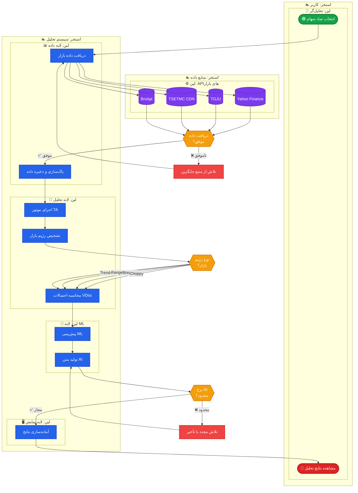
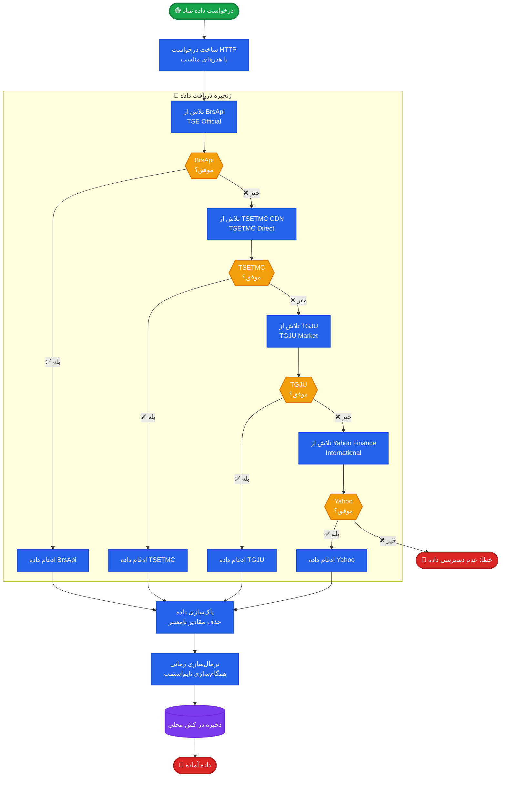
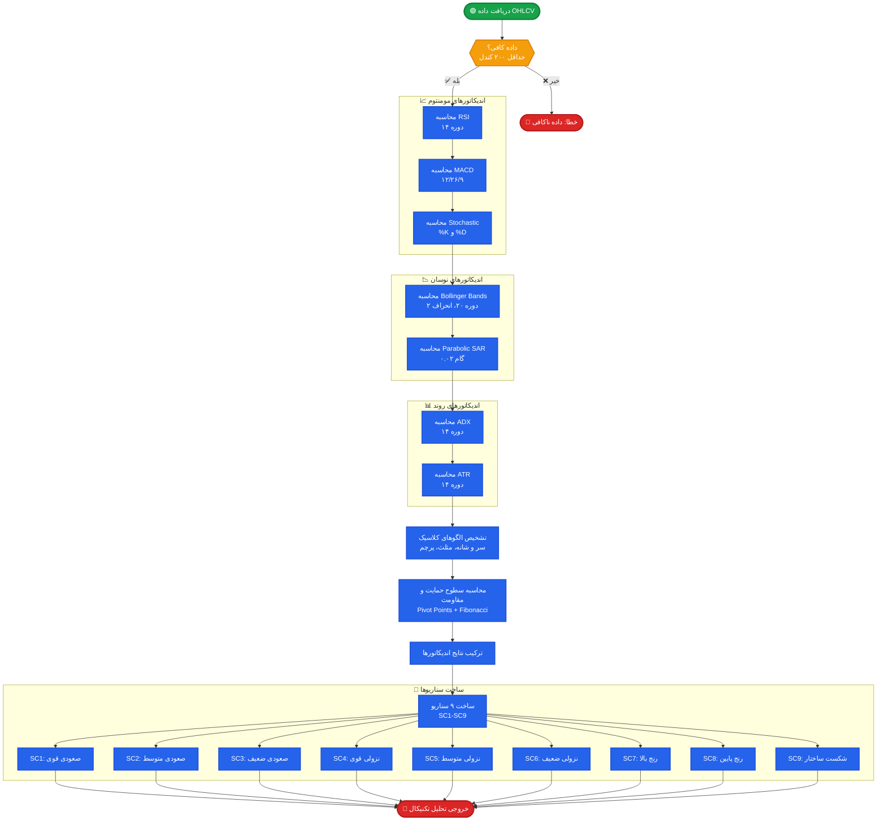
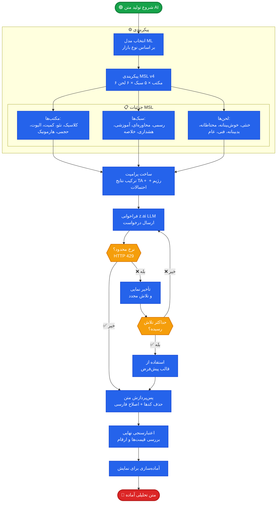
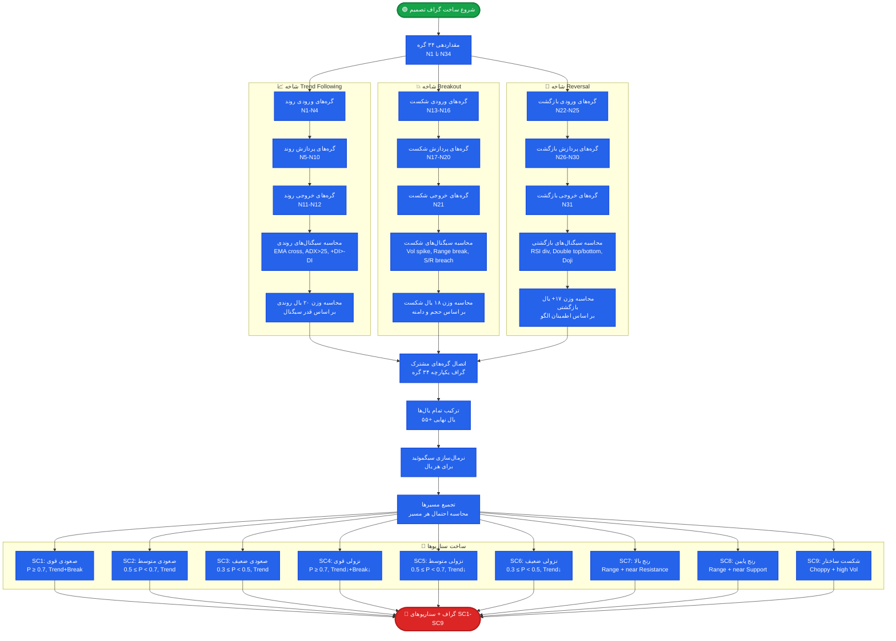

# سامانه تحلیل تکنیکال مالی ایران - نمودارهای BPMN 2.0

> Persian Financial Technical Analysis System — Comprehensive BPMN 2.0 Process Diagrams
> 
> Generated: 2025-03-04 | Diagrams: 8 | Levels: 3

---

===DIAGRAM_START===

## Diagram 1 of 8

- **id**: `BPMN-L1-001`
- **title**: نمای کلی فرآیند تحلیل تکنیکال مالی
- **level**: 1
- **description**:
  این نمودار نمای کلی فرآیند اصلی سامانه تحلیل تکنیکال مالی ایران را نشان می‌دهد.
  فرآیند از انتخاب نماد توسط تحلیل‌گر آغاز شده و با دریافت داده از منابع مختلف ادامه می‌یابد.
  پس از اجرای موتور تحلیل تکنیکال، رژیم بازار تشخیص داده می‌شود و احتمالات سناریوها محاسبه می‌گردد.
  در نهایت متن تحلیلی توسط هوش مصنوعی تولید و نتایج به کاربر نمایش داده می‌شود.
  سه دروازه تصمیم‌گیری کلیدی شامل موفقیت در دریافت داده، نوع رژیم بازار و محدودیت نرخ AI وجود دارد.
  شش لایه معماری سیستم در سه استخر با لین‌های مجزا نمایش داده شده‌اند.
- **happyPath**:
  تحلیل‌گر نماد را انتخاب می‌کند ← داده با موفقیت از BrsApi دریافت می‌شود ← تحلیل تکنیکال اجرا می‌گردد ← رژیم Trend تشخیص داده می‌شود ← احتمالات سناریوها محاسبه می‌شود ← متن AI بدون محدودیت نرخ تولید می‌شود ← نتایج نمایش داده می‌شود
- **exceptionFlows**:
  ۱) خطا در دریافت داده: BrsApi ناموفق → تلاش از TSETMC → تلاش از TGJU → تلاش از Yahoo Finance → اگر همه ناموفق ← نمایش خطا به کاربر
  ۲) رژیم Range/Choppy: مسیر تحلیل متفاوت با استراتژی Reversal فعال می‌شود
  ۳) محدودیت نرخ AI: سیستم با تأخیر مجدد تلاش می‌کند یا نسخه کش‌شده را نمایش می‌دهد



===DIAGRAM_END===

---

===DIAGRAM_START===

## Diagram 2 of 8

- **id**: `BPMN-L2-001`
- **title**: فرآیند دریافت داده از منابع بازار
- **level**: 2
- **description**:
  این فرآیند اجرایی جزئیات دریافت داده از چهار منبع مختلف بورس ایران را نشان می‌دهد.
  فرآیند با درخواست داده برای نماد انتخاب‌شده آغاز می‌شود و ابتدا از BrsApi (منبع اصلی TSE) تلاش می‌کند.
  در صورت ناموفق بودن، به ترتیب از TSETMC CDN، TGJU و در نهایت Yahoo Finance تلاش می‌شود.
  هر منبع موفق داده را با منابع قبلی ادغام کرده و در صورت موفقیت هر منبع، داده پاک‌سازی و ذخیره می‌شود.
  مکانیزم fallback زنجیره‌ای تضمین می‌کند که حتی در صورت قطعی برخی منابع، داده قابل دسترسی باشد.
  پس از ادغام نهایی، داده‌ها نرمال‌سازی و در کش محلی ذخیره می‌گردند.
- **happyPath**:
  درخواست داده → BrsApi موفق → ادغام داده → پاک‌سازی → نرمال‌سازی → ذخیره در کش → خروج
- **exceptionFlows**:
  ۱) BrsApi ناموفق → تلاش TSETMC → اگر موفق ادغام و ادامه
  ۲) TSETMC ناموفق → تلاش TGJU → اگر موفق ادغام و ادامه
  ۳) TGJU ناموفق → تلاش Yahoo Finance → اگر موفق ادغام و ادامه
  ۴) همه منابع ناموفق → بازگرداندن خطا → نمایش پیام عدم دسترسی به داده



===DIAGRAM_END===

---

===DIAGRAM_START===

## Diagram 3 of 8

- **id**: `BPMN-L2-002`
- **title**: فرآیند تحلیل تکنیکال
- **level**: 2
- **description**:
  این فرآیند اجرایی جزئیات موتور تحلیل تکنیکال را نشان می‌دهد که داده OHLCV را پردازش کرده و خروجی تحلیلی تولید می‌کند.
  فرآیند در چند مرحله اجرا می‌شود: ابتدا اندیکاتورهای مومنتوم (RSI, MACD, Stochastic) محاسبه می‌شوند.
  سپس اندیکاتورهای volatility شامل Bollinger Bands و Parabolic SAR محاسبه می‌گردند.
  مرحله بعدی شامل محاسبه اندیکاتورهای روند (ADX, ATR) و تشخیص الگوهای کلاسیک است.
  در نهایت سطوح حمایت و مقاومت محاسبه شده و ۹ سناریو (SC1-SC9) بر اساس سیگنال‌ها ساخته می‌شوند.
  هر مرحله خروجی خود را به مرحله بعدی ارسال کرده و نتایج نهایی برای تشخیص رژیم آماده می‌شود.
- **happyPath**:
  داده OHLCV → محاسبه RSI/MACD/Stochastic → محاسبه Bollinger/SAR → محاسبه ADX/ATR → تشخیص الگوها → محاسبه S/R → ساخت سناریوها → خروجی تحلیلی
- **exceptionFlows**:
  ۱) داده ناکافی: تعداد کندل کم از حد نیاز → بازگرداندن خطا با پیام "داده ناکافی"
  ۲) خطای محاسبه اندیکاتور: مقادیر نامعتبر (مثل تقسیم بر صفر) → استفاده از مقدار پیش‌فرض و ثبت هشدار
  ۳) عدم تشخیص الگو: هیچ الگویی یافت نشد → ادامه با سیگنال خنثی



===DIAGRAM_END===

---

===DIAGRAM_START===

## Diagram 4 of 8

- **id**: `BPMN-L2-003`
- **title**: فرآیند محاسبه احتمالات VDss
- **level**: 2
- **description**:
  این فرآیند اجرایی سیستم احتمال ۷ لایه VDss را با گراف تصمیم ۳۴ گره و ۵۵+ یال نشان می‌دهد.
  فرآیند با ساخت گراف تصمیم آغاز می‌شود: ۳۴ گره مقداردهی و ۳ شاخه استراتژی متصل می‌گردند.
  سپس وزن یال‌ها بر اساس سیگنال‌های تحلیلی محاسبه شده و نرمال‌سازی سیگموئیدی اعمال می‌شود.
  احتمالات مسیرها با پیمایش گراف محاسبه شده و احتمالات تجمعی برای هر سناریو تعیین می‌گردد.
  در نهایت تحلیل روند کلی انجام شده و خروجی احتمالات برای تولید متن AI آماده می‌شود.
  هر شاخه استراتژی (Trend Following, Breakout, Reversal) وزن‌دهی مجزایی دارد.
- **happyPath**:
  ساخت گراف ۳۴ گره → محاسبه وزن یال‌ها → نرمال‌سازی سیگموئید → محاسبه احتمالات مسیر → احتمالات تجمعی SC1-SC9 → تحلیل روند → خروجی
- **exceptionFlows**:
  ۱) گراف ناقص: یال‌های معلق → تکمیل با وزن پیش‌فرض و ثبت هشدار
  ۲) احتمالات غیرنرمال: مجموع ≠ ۱ → بازنرمال‌سازی اجباری
  ۳) گراف چرخه‌ای: حلقه بی‌نهایت → حذف یال‌های چرخه‌ای و ادامه

```mermaid
flowchart TB
    START([🟢 شروع محاسبه احتمالات]):::startNode

    subgraph GRAPH["🏗️ ساخت گراف تصمیم"]
        INIT[مقداردهی ۳۴ گره]:::activityNode

        subgraph BRANCHES["🌿 شاخه‌های استراتژی"]
            TREND["شاخه Trend Following\n۱۲ گره، ۲۰ یال"]:::activityNode
            BREAK["شاخه Breakout\n۱۱ گره، ۱۸ یال"]:::activityNode
            REVERSAL["شاخه Reversal\n۱۱ گره، ۱۷+ یال"]:::activityNode
        end

        CONNECT[اتصال شاخه‌ها\nگراف نهایی ۳۴ گره، ۵۵+ یال]:::activityNode
    end

    subgraph WEIGHTS["⚖️ محاسبه وزن‌ها"]
        EDGE[محاسبه وزن یال‌ها\nبر اساس سیگنال‌ها]:::activityNode
        SIGMOID[نرمال‌سازی سیگموئید\nσx = 1/(1+e^(-x))]:::activityNode
        GW_NORM{{احتمالات\nنرمال؟}}:::decisionNode
        RENORM[بازنرمال‌سازی اجباری]:::activityNode
    end

    subgraph PROB["📊 محاسبه احتمالات"]
        PATH[پیمایش مسیرها\nمحاسبه احتمال هر مسیر]:::activityNode
        CUM[احتمالات تجمعی\nبرای SC1 تا SC9]:::activityNode
        ANALYSIS[تحلیل روند کلی\nغالب‌ترین سناریو]:::activityNode
    end

    OUT([🔴 خروجی احتمالات VDss]):::endNode

    START --> INIT
    INIT --> TREND & BREAK & REVERSAL
    TREND & BREAK & REVERSAL --> CONNECT
    CONNECT --> EDGE
    EDGE --> SIGMOID
    SIGMOID --> GW_NORM
    GW_NORM -->|✅ بله| PATH
    GW_NORM -->|❌ خیر| RENORM
    RENORM --> PATH
    PATH --> CUM
    CUM --> ANALYSIS
    ANALYSIS --> OUT

    classDef startNode fill:#16a34a,stroke:#15803d,color:#fff,stroke-width:3px
    classDef endNode fill:#dc2626,stroke:#b91c1c,color:#fff,stroke-width:3px
    classDef activityNode fill:#2563eb,stroke:#1d4ed8,color:#fff,stroke-width:2px
    classDef decisionNode fill:#f59e0b,stroke:#d97706,color:#fff,stroke-width:2px
    classDef dataNode fill:#7c3aed,stroke:#6d28d9,color:#fff,stroke-width:2px
```

===DIAGRAM_END===

---

===DIAGRAM_START===

## Diagram 5 of 8

- **id**: `BPMN-L2-004`
- **title**: فرآیند تولید متن تحلیلی AI
- **level**: 2
- **description**:
  این فرآیند اجرایی تولید متن تحلیلی با هوش مصنوعی را نشان می‌دهد.
  فرآیند با انتخاب مدل ML آغاز شده و سپس MSL v4 (مدیریت سبک زبان) پیکربندی می‌شود.
  MSL v4 شامل ۶ مکتب × ۵ سبک × ۶ لحن = ۱۸۰ ترکیب ممکن برای متن تحلیلی است.
  پرامپت بر اساس نتایج تحلیل تکنیکال، رژیم بازار و احتمالات سناریوها ساخته می‌شود.
  سپس درخواست به z.ai LLM ارسال شده و در صورت محدودیت نرخ، تلاش مجدد با تأخیر نمایی انجام می‌گیرد.
  متن تولیدشده پس‌پردازش شده و اعتبارسنجی نهایی قبل از نمایش انجام می‌شود.
- **happyPath**:
  انتخاب مدل ML → پیکربندی MSL v4 → ساخت پرامپت → فراخوانی LLM → متن تولیدشده → پس‌پردازش → اعتبارسنجی → نمایش
- **exceptionFlows**:
  ۱) محدودیت نرخ LLM: HTTP 429 → تأخیر نمایی (1s, 2s, 4s, 8s) → تلاش مجدد حداکثر ۵ بار
  ۲) خطای LLM: پاسخ نامعتبر → استفاده از قالب پیش‌فرض و ثبت خطا
  ۳) نامعتبری پس‌پردازش: قیمت‌های نامعتبر → حذف و ادامه با هشدار



===DIAGRAM_END===

---

===DIAGRAM_START===

## Diagram 6 of 8

- **id**: `BPMN-L3-001`
- **title**: زیرفرآیند تشخیص رژیم بازار
- **level**: 3
- **description**:
  این زیرفرآیند جزئیات سه موتور تشخیص رژیم بازار را نشان می‌دهد.
  سه موتور به صورت موازی اجرا می‌شوند: فازی (وزن ۰.۳)، مارکوف (وزن ۰.۵) و رأی‌گیری وزنی (وزن ۰.۲).
  موتور فازی با محاسبه درجات عضویت فازی، رژیم را بر اساس توابع مثلثی و ذوزنوی تعیین می‌کند.
  موتور مارکوف با محاسبه ماتریس انتقال و ضرب در بردار وضعیت فعلی، رژیم آینده را پیش‌بینی می‌کند.
  رأی‌گیری وزنی با ترکیب سیگنال‌های چندگانه و اعمال وزن‌های تجمعی، تصمیم نهایی را می‌گیرد.
  خروجی سه موتور ترکیب شده و رژیم نهایی با سطح اطمینان تعیین می‌گردد.
- **happyPath**:
  داده تحلیلی → فازی: عضویت ۰.۸ → مارکوف: انتقال ۰.۷۵ → رأی‌گیری: تأیید → ترکیب وزنی → رژیم Trend با اطمینان ۸۵٪
- **exceptionFlows**:
  ۱) تناقض موتورها: فازی Trend vs مارکوف Range → تصمیم بر اساس وزن مارکوف (۰.۵ بالاتر)
  ۲) اطمینان پایین: هر سه موتور < ۵۰٪ → رژیم Unknown با اطمینان پایین
  ۳) خطای ماتریس مارکوف: ماتریس singular → استفاده از موتور فازی و رأی‌گیری فقط

```mermaid
flowchart TB
    START([🟢 داده تحلیلی ورودی]):::startNode
    PAR[تقسیم داده بین سه موتور]:::activityNode

    subgraph FUZZY_ENGINE["🔵 موتور فازی - وزن ۰.۳"]
        F1[محاسبه درجات عضویت\nتوابع مثلثی و ذوزنوی]:::activityNode
        F2[ارزیابی قوانین فازی\nIF-THEN rules]:::activityNode
        F3[استنتاج فازی\ndefuzzification]:::activityNode
        F4[خروجی فازی:\nرژیم + اطمینان]:::activityNode
    end

    subgraph MARKOV_ENGINE["🟠 موتور مارکوف - وزن ۰.۵"]
        M1[محاسبه ماتریس انتقال\nبر اساس تاریخچه]:::activityNode
        M2[ضرب ماتریس در بردار وضعیت\nP × s_t]:::activityNode
        M3[محاسبه توزوع ایستا\nπ = π × P]:::activityNode
        M4[خروجی مارکوف:\nرژیم + احتمال انتقال]:::activityNode
    end

    subgraph VOTE_ENGINE["🟢 رأی‌گیری وزنی - وزن ۰.۲"]
        V1[جمع‌آوری سیگنال‌ها\nاز اندیکاتورهای مختلف]:::activityNode
        V2[اعمال وزن‌های تجمعی\nروی هر سیگنال]:::activityNode
        V3[تجمیع آرا\nMajority Vote]:::activityNode
        V4[خروجی رأی‌گیری:\nرژیم + آرا]:::activityNode
    end

    COMBINE[ترکیب وزنی خروجی‌ها\n0.3×F + 0.5×M + 0.2×V]:::activityNode
    GW_CONFLICT{{تناقض\nبین موتورها؟}}:::decisionNode
    RESOLVE[حل تناقض\nبر اساس وزن بالاتر]:::activityNode
    CLASSIFY[طبقه‌بندی نهایی رژیم\nTrend | Range | Breakout | Choppy]:::activityNode
    CONF[محاسبه سطح اطمینان\n ترکیب سه اطمینان]:::activityNode
    END([🔴 رژیم + اطمینان]):::endNode

    START --> PAR
    PAR --> F1 & M1 & V1
    F1 --> F2 --> F3 --> F4
    M1 --> M2 --> M3 --> M4
    V1 --> V2 --> V3 --> V4
    F4 & M4 & V4 --> COMBINE
    COMBINE --> GW_CONFLICT
    GW_CONFLICT -->|❌ خیر| CLASSIFY
    GW_CONFLICT -->|✅ بله| RESOLVE
    RESOLVE --> CLASSIFY
    CLASSIFY --> CONF
    CONF --> END

    classDef startNode fill:#16a34a,stroke:#15803d,color:#fff,stroke-width:3px
    classDef endNode fill:#dc2626,stroke:#b91c1c,color:#fff,stroke-width:3px
    classDef activityNode fill:#2563eb,stroke:#1d4ed8,color:#fff,stroke-width:2px
    classDef decisionNode fill:#f59e0b,stroke:#d97706,color:#fff,stroke-width:2px
    classDef dataNode fill:#7c3aed,stroke:#6d28d9,color:#fff,stroke-width:2px
```

===DIAGRAM_END===

---

===DIAGRAM_START===

## Diagram 7 of 8

- **id**: `BPMN-L3-002`
- **title**: زیرفرآیند ساخت گراف تصمیم
- **level**: 3
- **description**:
  این زیرفرآیند جزئیات ساخت گراف تصمیم با ۳۴ گره و ۵۵+ یال را نشان می‌دهد.
  فرآیند با مقداردهی ۳۴ گره آغاز شده و سپس سیگنال‌های هر شاخه استراتژی محاسبه می‌گردد.
  شاخه Trend Following شامل ۱۲ گره و ۲۰ یال برای سیگنال‌های روندی است.
  شاخه Breakout شامل ۱۱ گره و ۱۸ یال برای سیگنال‌های شکست است.
  شاخه Reversal شامل ۱۱ گره و ۱۷+ یال برای سیگنال‌های بازگشتی است.
  پس از محاسبه وزن یال‌ها، نرمال‌سازی سیگموئیدی اعمال شده و مسیرها تجمیع می‌گردند.
  در نهایت ۹ سناریو SC1-SC9 بر اساس احتمالات مسیرها ساخته می‌شوند.
- **happyPath**:
  مقداردهی ۳۴ گره → سیگنال‌های Trend → سیگنال‌های Breakout → سیگنال‌های Reversal → وزن یال‌ها → سیگموئید → تجمیع → SC1-SC9
- **exceptionFlows**:
  ۱) گره یتیم: گره بدون یال ورودی → حذف گره و ثبت هشدار
  ۲) یال با وزن منفی → صفر کردن وزن و ادامه
  ۳) شاخه بدون سیگنال → اختصاص احتمال یکنواخت



===DIAGRAM_END===

---

===DIAGRAM_START===

## Diagram 8 of 8

- **id**: `BPMN-L3-003`
- **title**: زیرفرآیند پس‌پردازش متن AI
- **level**: 3
- **description**:
  این زیرفرآیند جزئیات پس‌پردازش متن تولیدشده توسط AI را نشان می‌دهد.
  فرآیند با حذف کدهای تخریبی و نشانه‌گذاری آغاز می‌شود.
  سپس اصلاحات فارسی شامل نیم‌فاصله‌ها، حروف ی و ک فارسی و نقطه‌گذاری انجام می‌گیرد.
  جهت اعداد اصلاح شده تا ارقام و قیمت‌ها از راست به چپ نمایش داده شوند.
  اعتبارسنجی قیمت‌ها با مقایسه قیمت‌های ذکرشده در متن با داده واقعی بازار انجام می‌شود.
  در نهایت بررسی توهم AI (hallucination) انجام شده و در صورت وجود، هشدار ثبت و متن اصلاح می‌شود.
- **happyPath**:
  متن خام AI → حذف کدها → اصلاح فارسی → جهت اعداد → اعتبارسنجی قیمت → بررسی توهم → معتبر → بازگرداندن متن
- **exceptionFlows**:
  ۱) قیمت نامعتبر: قیمت در متن با بازار تطبیق ندارد → حذف قیمت از متن + هشدار
  ۲) توهم AI: ادعای غیر واقعی → ثبت هشدار + سعی حذف بخش توهم‌دار
  ۳) متن خالی: پس‌پردازش نتیجه‌ای نداد → بازگرداندن پیام پیش‌فرض

```mermaid
flowchart TB
    START([🟢 متن خام AI ورودی]):::startNode

    STRIP[حذف کدهای تخریبی\nHTML, Markdown, LaTeX]:::activityNode
    STRIP2[حذف نشانه‌های داخلی\n<|im_start|>, <|end|>]:::activityNode

    subgraph PERSIAN_FIX["🔧 اصلاحات فارسی"]
        ZWNJ[اصلاح نیم‌فاصله‌ها\nمی‌روم vs می روم]:::activityNode
        YE_KE[اصلاح ی و ک\nی→ی، ک→ک]:::activityNode
        PUNCT[اصلاح نقطه‌گذاری و فاصله\nفارسی‌سازی اعداد]:::activityNode
    end

    NUM_DIR[اصلاح جهت اعداد\nراست به چپ برای فارسی]:::activityNode
    NUM_SEP[جداکننده هزارگان\nبه فارسی: ۱٬۲۳۴٬۵۶۷]:::activityNode

    subgraph VALIDATION["✅ اعتبارسنجی"]
        PRICE[بررسی قیمت‌های ذکرشده\nمقایسه با داده بازار]:::activityNode
        GW_PRICE{{قیمت‌ها\nمعتبر؟}}:::decisionNode
        FIX_PRICE[حذف قیمت نامعتبر\nو افزودن هشدار]:::activityNode

        HALLU[بررسی توهم AI\nHallucination Detection]:::activityNode
        GW_HALLU{{توهم\nشناسایی شد؟}}:::decisionNode
        FIX_HALLU[حذف بخش توهم‌دار\nو ثبت هشدار]:::activityNode
    end

    GW_EMPTY{{متن خالی\nبعد از پردازش؟}}:::decisionNode
    DEFAULT[استفاده از پیام پیش‌فرض\n"تحلیل در دسترس نیست"]:::activityNode
    LOG_OK[ثبت لاگ موفقیت\nزمان پردازش و کیفیت]:::activityNode
    END([🔴 متن پردازش‌شده نهایی]):::endNode

    START --> STRIP
    STRIP --> STRIP2
    STRIP2 --> ZWNJ
    ZWNJ --> YE_KE
    YE_KE --> PUNCT
    PUNCT --> NUM_DIR
    NUM_DIR --> NUM_SEP
    NUM_SEP --> PRICE
    PRICE --> GW_PRICE
    GW_PRICE -->|✅ بله| HALLU
    GW_PRICE -->|❌ خیر| FIX_PRICE
    FIX_PRICE --> HALLU
    HALLU --> GW_HALLU
    GW_HALLU -->|❌ خیر| GW_EMPTY
    GW_HALLU -->|✅ بله| FIX_HALLU
    FIX_HALLU --> GW_EMPTY
    GW_EMPTY -->|❌ خیر| LOG_OK
    GW_EMPTY -->|✅ بله| DEFAULT
    DEFAULT --> END
    LOG_OK --> END

    classDef startNode fill:#16a34a,stroke:#15803d,color:#fff,stroke-width:3px
    classDef endNode fill:#dc2626,stroke:#b91c1c,color:#fff,stroke-width:3px
    classDef activityNode fill:#2563eb,stroke:#1d4ed8,color:#fff,stroke-width:2px
    classDef decisionNode fill:#f59e0b,stroke:#d97706,color:#fff,stroke-width:2px
    classDef dataNode fill:#7c3aed,stroke:#6d28d9,color:#fff,stroke-width:2px
```

===DIAGRAM_END===

---

## Summary Table

| # | ID | Level | Title (Persian) | Nodes | Gateways |
|---|-----|-------|-----------------|-------|----------|
| 1 | BPMN-L1-001 | 1 | نمای کلی فرآیند تحلیل تکنیکال مالی | 14 | 3 |
| 2 | BPMN-L2-001 | 2 | فرآیند دریافت داده از منابع بازار | 14 | 4 |
| 3 | BPMN-L2-002 | 2 | فرآیند تحلیل تکنیکال | 19 | 1 |
| 4 | BPMN-L2-003 | 2 | فرآیند محاسبه احتمالات VDss | 14 | 1 |
| 5 | BPMN-L2-004 | 2 | فرآیند تولید متن تحلیلی AI | 15 | 2 |
| 6 | BPMN-L3-001 | 3 | زیرفرآیند تشخیص رژیم بازار | 18 | 1 |
| 7 | BPMN-L3-002 | 3 | زیرفرآیند ساخت گراف تصمیم | 30 | 0 |
| 8 | BPMN-L3-003 | 3 | زیرفرآیند پس‌پردازش متن AI | 16 | 3 |

### Color Legend

| Color | Element Type | Meaning |
|-------|-------------|---------|
| 🟢 Green | Start Events | Process initiation |
| 🔴 Red | End Events | Process termination |
| 🔵 Blue | Activities | Processing steps |
| 🟡 Amber | Gateways | Decision points |
| 🟣 Purple | Data Stores | Data sources/cache |
