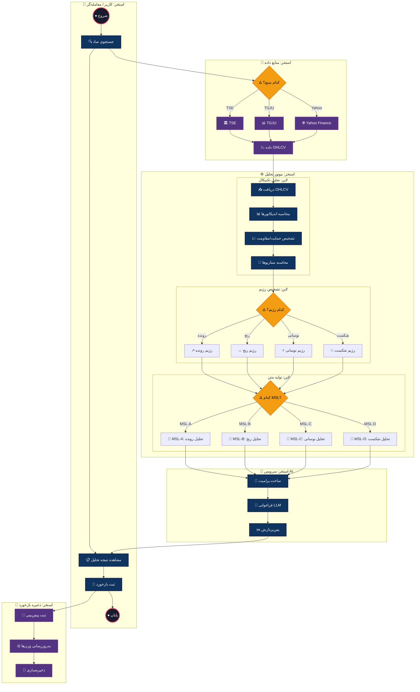
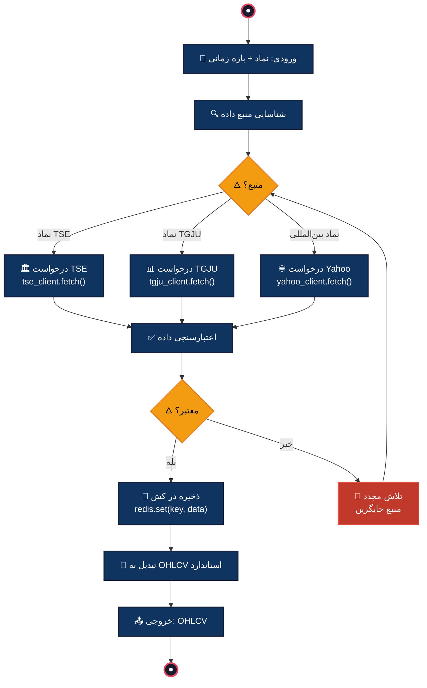
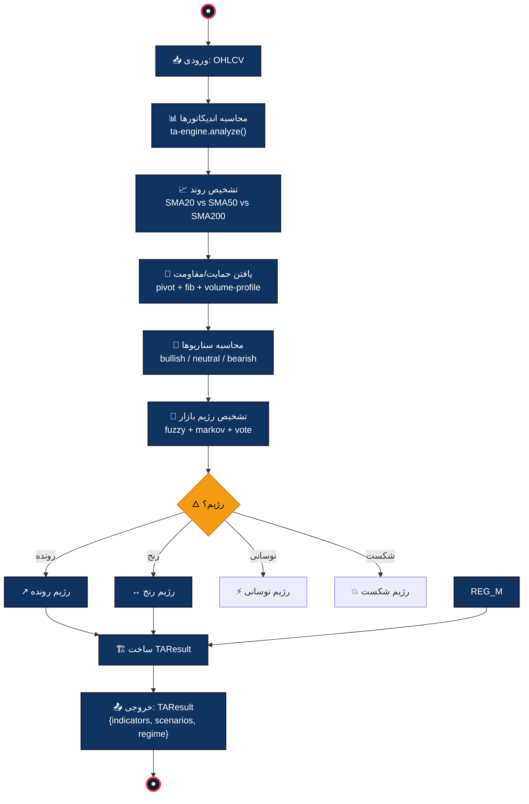
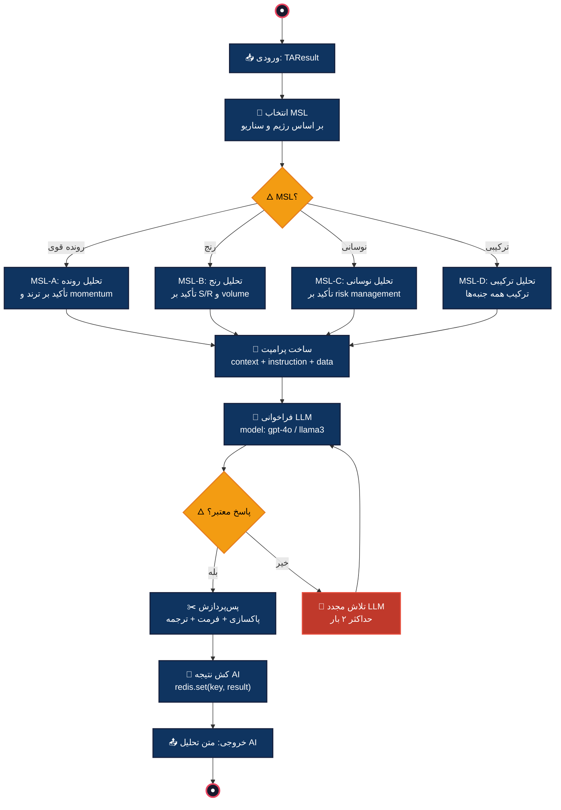
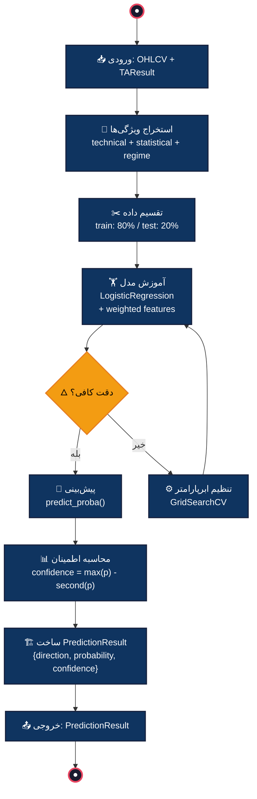
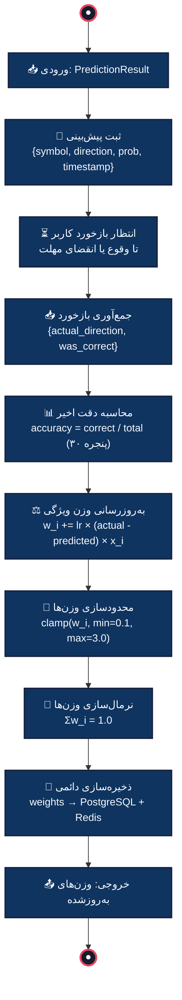
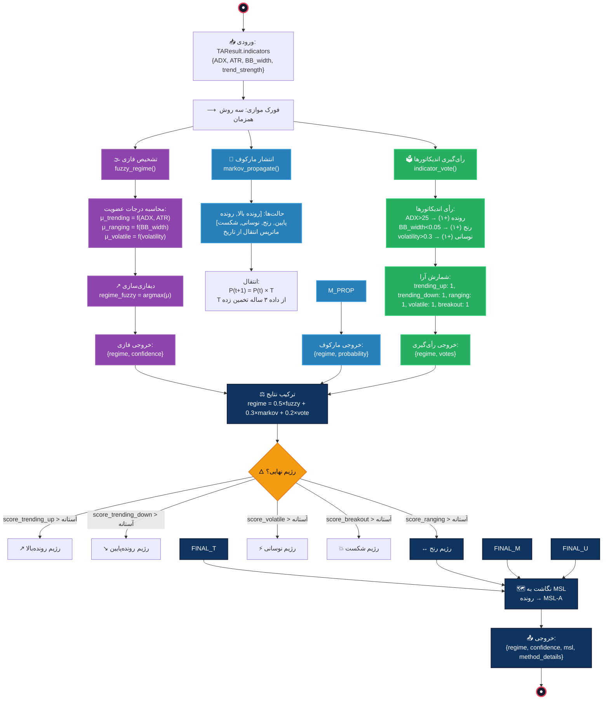
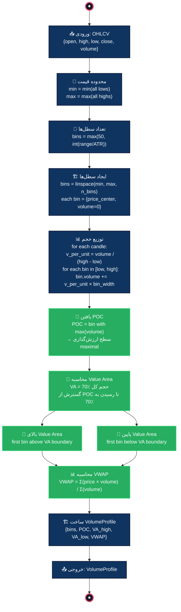

# BPMN — مدل‌سازی فرآیندهای کسب‌وکار

> **سیستم تحلیل تکنیکال بازار بورس ایران**
>
> این بخش فرآیندهای سیستم تحلیل تکنیکال را در سه سطح BPMN مدل‌سازی می‌کند:
> - **سطح ۱:** نمای کلی فرآیند با استخرها و لاین‌ها
> - **سطح ۲:** فرآیندهای قابل اجرا با جداول مسیر شاد و استثنا
> - **سطح ۳:** زیرفرآیندهای تفصیلی با جزئیات کامل الگوریتمی

---

## سطح ۱ — نمای کلی فرآیند (Process Overview)

### نمودار سطح ۱



### توضیح سطح ۱ (فارسی)

۱. این نمودار نمای کلی فرآیند سیستم تحلیل تکنیکال بورس ایران را در سطح بالای BPMN نشان می‌دهد. چهار استخر (Pool) اصلی تعریف شده‌اند: کاربر/معامله‌گر، موتور تحلیل، سرویس AI و منابع داده. هر استخر مسئولیت مشخصی دارد و مرزهای تعاملی بین آن‌ها با فلش‌ها مشخص شده است.

۲. در استخر «موتور تحلیل» سه لاین (Lane) تفکیک شده است: تحلیل تکنیکال، تشخیص رژیم و تولید متن. این تفکیک تضمین می‌کند که هر مرحله از پردازش به‌صورت مستقل و با مسئولیت واحد انجام شود. جریان داده‌ها بین لاین‌ها به‌صورت ترتیبی است.

۳. سه گیت‌وی کلیدی در این سطح وجود دارد: گیت‌وی انتخاب منبع داده (TSE/TGJU/Yahoo)، گیت‌وی تشخیص رژیم (رونده/رنج/نوسانی/شکست) و گیت‌وی انتخاب MSL. هر گیت‌وی بر اساس شرایط ورودی، مسیر مناسب را انتخاب می‌کند و تصمیم‌گیری سیستمی را مدل‌سازی می‌نماید.

۴. استخر «منابع داده» سه منبع خارجی را مدل‌سازی می‌کند که هر یک بسته به نوع نماد و دسترسی، داده OHLCV را تأمین می‌کنند. خروجی یکپارچه این استخر به لاین «تحلیل تکنیکال» وارد می‌شود و فرآیند تحلیل آغاز می‌گردد.

۵. استخر «سرویس AI» فرآیند تولید متن تحلیلی را مدل‌سازی می‌کند: ابتدا پرامپت بر اساس MSL انتخابی ساخته می‌شود، سپس LLM فراخوانی شده و در نهایت خروجی پس‌پردازش می‌گردد. این استخر مستقل از موتور تحلیل عمل می‌کند و تنها نتیجه TAResult را دریافت می‌نماید.

۶. استخر «ذخیره بازخورد» چرخه بازخورد تطبیقی را مدل‌سازی می‌کند: پیش‌بینی ثبت → بازخورد کاربر → به‌روزرسانی وزن‌ها → ذخیره‌سازی. این چرخه تضمین می‌کند که سیستم با گذر زمان یاد بگیرد و دقت پیش‌بینی‌ها افزایش یابد.

---

## سطح ۲ — فرآیندهای قابل اجرا (Executable Processes)

---

### ۲.۱ — جستجوی نماد و دریافت داده (Symbol Search & Data Fetching)

#### نمودار فرآیند



#### توضیح فارسی

۱. این فرآیند مسئول جستجوی نماد و دریافت داده‌های تاریخی از منابع مختلف است. ورودی شامل نماد و بازه زمانی مورد نظر کاربر است.

۲. ابتدا منبع داده مناسب شناسایی می‌شود: نمادهای بورس تهران از TSE، نمادهای commodities از TGJU و نمادهای بین‌المللی از Yahoo Finance دریافت می‌شوند.

۳. پس از دریافت، داده‌ها اعتبارسنجی می‌شوند. در صورت نامعتبر بودن، سیستم به‌صورت خودکار منبع جایگزین را امتحان می‌کند (تلاش مجدد).

۴. داده‌های معتبر در کش Redis ذخیره می‌شوند تا در درخواست‌های بعدی زمان پاسخ‌دهی کاهش یابد.

۵. در نهایت داده‌ها به فرمت OHLCV استاندارد تبدیل شده و به فرآیند تحلیل تکنیکال ارجاع داده می‌شوند.

#### جدول مسیر شاد (Happy Path)

| مرحله | فعالیت | توضیح | خروجی |
|-------|--------|-------|-------|
| ۱ | ورودی نماد | کاربر نماد «فولاد» + بازه ۱ سال وارد می‌کند | `(symbol='فولاد', range='1Y')` |
| ۲ | شناسایی منبع | نماد در لیست TSE شناسایی می‌شود | `source='TSE'` |
| ۳ | درخواست TSE | `tse_client.fetch('فولاد', '1Y')` فراخوانی می‌شود | `raw_data: DataFrame` |
| ۴ | اعتبارسنجی | بررسی: ۲۵۲ ردیف، بدون NaN، بازه صحیح | `is_valid=True` |
| ۵ | ذخیره کش | `redis.set('ohlcv:فولاد:1Y', data, ttl=3600)` | `cached=True` |
| ۶ | تبدیل | استانداردسازی ستون‌ها و انواع | `OHLCV: DataFrame` |

#### جدول جریان استثنا (Exception Flows)

| کد استثنا | شرط | عمل اصلاحی | توضیح فارسی |
|-----------|------|-------------|-------------|
| E-201 | نماد یافت نشد | بازگرداندن خطای ۴۰۴ | نماد در هیچ منبعی موجود نیست |
| E-202 | TSE در دسترس نیست | سعی از TGJU به‌عنوان جایگزین | قطعی سرور TSE |
| E-203 | داده NaN > ۵٪ | درخواست از منبع جایگزین | کیفیت داده ناکافی |
| E-204 | timeout > ۱۰s | تلاش مجدد حداکثر ۳ بار | زمان‌بری درخواست |
| E-205 | بازه زمانی نامعتبر | اصلاح به نزدیک‌ترین بازه معتبر | بازه درخواستی خارج از محدوده |

---

### ۲.۲ — تحلیل تکنیکال (Technical Analysis)

#### نمودار فرآیند



#### توضیح فارسی

۱. این فرآیند هسته اصلی سیستم تحلیل تکنیکال است. ورودی آن داده OHLCV و خروجی شیء TAResult شامل تمام اندیکاتورها، سناریوها و رژیم بازار است.

۲. مرحله محاسبه اندیکاتورها شامل بیش از ۳۰ اندیکاتور متداول (RSI, MACD, BB, ATR, ADX, OBV و غیره) و همچنین اندیکاتورهای اختصاصی بازار ایران است.

۳. تشخیص روند با مقایسه SMAهای مختلف و ADX انجام می‌شود. یافتن سطوح حمایت/مقاومت از سه روش پیوت، فیبوناچی و پروفایل حجم استفاده می‌کند.

۴. سناریوها (bullish/neutral/bearish) بر اساس ترکیب سیگنال‌های اندیکاتورها و فاصله قیمت از سطوح کلیدی محاسبه می‌شوند.

۵. تشخیص رژیم بازار از روش ترکیبی فازی + مارکوف + رأی‌گیری استفاده می‌کند که در سطح ۳ به‌صورت تفصیلی مدل‌سازی شده است.

۶. در نهایت تمام نتایج در شیء TAResult تجمیع شده و به فرآیند تولید متن AI ارجاع داده می‌شود.

#### جدول مسیر شاد (Happy Path)

| مرحله | فعالیت | توضیح | خروجی |
|-------|--------|-------|-------|
| ۱ | ورودی OHLCV | دریافت ۲۵۲ روز داده نماد فولاد | `DataFrame[252×6]` |
| ۲ | محاسبه اندیکاتورها | محاسبه ۴۳ اندیکاتور در ۱۵۰ms | `indicators: Dict` |
| ۳ | تشخیص روند | SMA20>SMA50>SMA200 → روند صعودی | `trend='bullish'` |
| ۴ | یافتن S/R | ۵ سطح حمایت + ۴ سطح مقاومت | `sr_levels: List[Level]` |
| ۵ | محاسبه سناریوها | ۷۰٪ سیگنال صعودی | `scenario='bullish', confidence=0.70` |
| ۶ | تشخیص رژیم | fuzzy=رونده, markov=رونده → رونده | `regime='trending'` |
| ۷ | ساخت TAResult | تجمیع تمام نتایج | `TAResult` |

#### جدول جریان استثنا (Exception Flows)

| کد استثنا | شرط | عمل اصلاحی | توضیح فارسی |
|-----------|------|-------------|-------------|
| E-301 | داده OHLCV خالی | بازگرداندن خطای NO_DATA | هیچ داده‌ای برای تحلیل موجود نیست |
| E-302 | تعداد ردیف < ۵۰ | تحلیل با هشدار DATA_SHORT | داده کافی برای محاسبه SMA200 نیست |
| E-303 | اندیکاتور NaN | حذف اندیکاتور + لاگ هشدار | محاسبه اندیکاتور ناموفق |
| E-304 | رژیم مبهم | پیش‌فرض: رنج + هشدار | فازی و مارکوف نتایج متناقض |
| E-305 | خطای محاسباتي | بازگرداندن جزئیات خطا | سرریز یا تقسیم بر صفر |

---

### ۲.۳ — تولید تحلیل AI (AI Analysis Generation)

#### نمودار فرآیند



#### توضیح فارسی

۱. این فرآیند متن تحلیلی هوشمند را تولید می‌کند. ورودی TAResult از فرآیند تحلیل تکنیکال و خروجی متن تحلیل فارسی ساختاریافته است.

۲. انتخاب MSL (Market-Specific Language) بر اساس رژیم و سناریو انجام می‌شود. پنج MSL تعریف شده: A برای رونده بالا، B برای رونده پایین، C برای نوسانی، D برای شکست و E برای رنج.

۳. هر MSL پرامپت مخصوصی می‌سازد که شامل دستورالعمل تحلیلی، داده‌های عددی کلیدی و زمینه بازار است. ساختار پرامپت برای بهینه‌سازی مصرف token طراحی شده است.

۴. پس از فراخوانی LLM، خروجی اعتبارسنجی می‌شود. در صورت نامعتبر بودن (مثلاً JSON ناقص)، تلاش مجدد انجام می‌گیرد.

۵. پس‌پردازش شامل پاکسازی متن، فرمت‌بندی بخش‌ها، ترجمه اصطلاحات و اضافه کردن هشدارهای ریسک است.

۶. نتیجه نهایی در کش ذخیره می‌شود تا برای درخواست‌های تکراری بدون فراخوانی مجدد LLM بازگردانده شود.

#### جدول مسیر شاد (Happy Path)

| مرحله | فعالیت | توضیح | خروجی |
|-------|--------|-------|-------|
| ۱ | ورودی TAResult | دریافت نتیجه تحلیل فولاد | `TAResult` |
| ۲ | انتخاب MSL | رژیم=رونده، سناریو=bullish → MSL-A | `msl='MSL-A'` |
| ۳ | ساخت پرامپت | تجمیع context + instruction + data | `prompt: str (~800 tokens)` |
| ۴ | فراخوانی LLM | `gpt-4o.chat(prompt)` در ۳s | `raw_text: str` |
| ۵ | پس‌پردازش | پاکسازی + فرمت + هشدار ریسک | `analysis: str` |
| ۶ | کش | `redis.set('ai:فولاد:2024', analysis, ttl=1800)` | `cached=True` |

#### جدول جریان استثنا (Exception Flows)

| کد استثنا | شرط | عمل اصلاحی | توضیح فارسی |
|-----------|------|-------------|-------------|
| E-401 | TAResult ناقص | تکمیل با مقادیر پیش‌فرض | فیلدهای ضروری موجود نیست |
| E-402 | MSL نامشخص | پیش‌فرض MSL-D (ترکیبی) | رژیم شناسایی نشده |
| E-403 | LLM timeout | تلاش مجدد + کاهش token | زمان‌بری پاسخ LLM |
| E-404 | LLM خطای محتوا | استفاده از تحلیل الگویی | خروجی LLM نامعتبر |
| E-405 | هزینه token بالا | سوییچ به مدل کوچکتر | تجاوز از بودجه token |

---

### ۲.۴ — پیش‌بینی یادگیری ماشین (ML Prediction)

#### نمودار فرآیند



#### توضیح فارسی

۱. این فرآیند پیش‌بینی جهت قیمت آینده را با استفاده از رگرسیون لجستیک انجام می‌دهد. ورودی شامل OHLCV و TAResult است.

۲. مرحله استخراج ویژگی‌ها سه دسته ویژگی تولید می‌کند: ویژگی‌های تکنیکال (اندیکاتورها)، آماری (آماره‌های توصیفی) و رژیمی (وضعیت بازار).

۳. داده‌ها به نسبت ۸۰/۲۰ تقسیم می‌شوند. آموزش مدل با رگرسیون لجستیک و ویژگی‌های وزن‌دار (بر اساس بازخورد) انجام می‌شود.

۴. اگر دقت مدل در آستانه مورد نظر نباشد، تنظیم ابرپارامتر با GridSearchCV انجام شده و مدل مجدداً آموزش می‌بیند.

۵. پیش‌بینی نهایی شامل جهت (صعودی/نزولی/خنثی)، احتمال و سطح اطمینان است.

#### جدول مسیر شاد (Happy Path)

| مرحله | فعالیت | توضیح | خروجی |
|-------|--------|-------|-------|
| ۱ | ورودی | دریافت OHLCV فولاد + TAResult | `(OHLCV, TAResult)` |
| ۲ | استخراج ویژگی | ۱۸ ویژگی تکنیکال + ۵ آماری + ۳ رژیمی | `features: ndarray[26]` |
| ۳ | تقسیم داده | ۲۰۲ نمونه آموزش + ۵۰ نمونه آزمون | `(X_train, X_test)` |
| ۴ | آموزش | `LogisticRegression.fit()` → دقت ۶۸٪ | `model: LogisticRegression` |
| ۵ | پیش‌بینی | `predict_proba()` = [0.72, 0.18, 0.10] | `direction='bullish'` |
| ۶ | اطمینان | 0.72 - 0.18 = 0.54 → اطمینان متوسط | `confidence=0.54` |

#### جدول جریان استثنا (Exception Flows)

| کد استثنا | شرط | عمل اصلاحی | توضیح فارسی |
|-----------|------|-------------|-------------|
| E-501 | داده آموزش < ۱۰۰ | هشدار + کاهش حد آستانه | داده کافی برای آموزش نیست |
| E-502 | ویژگی NaN/Inf | حذف ویژگی + لاگ | ویژگی نامعتبر |
| E-503 | دقت < ۵۵٪ | بازگرداندن پیش‌بینی با هشدار عدم اطمینان | مدل ضعیف |
| E-504 | overfitting | اعمال regularisation قویتر | مدل بیش‌برازش |
| E-505 | خطای sklearn | بازگرداندن پیش‌بینی مبتنی بر سناریو | خطای کتابخانه ML |

---

### ۲.۵ — چرخه بازخورد تطبیقی (Feedback Loop)

#### نمودار فرآیند



#### توضیح فارسی

۱. این فرآیند چرخه بازخورد تطبیقی را پیاده‌سازی می‌کند. هدف آن بهبود مستمر پیش‌بینی‌ها با یادگیری از نتایج واقعی بازار است.

۲. پس از ثبت پیش‌بینی، سیستم منتظر وقوع واقعی (یا انقضای مهلت ۵ روز کاری) می‌ماند. سپس بازخورد کاربر یا داده واقعی بازار جمع‌آوری می‌شود.

۳. دقت اخیر در پنجره ۳۰ پیش‌بینی اخیر محاسبه می‌شود. این دقت به‌عنوان معیار عملکرد مدل استفاده می‌گردد.

۴. به‌روزرسانی وزن‌ها بر اساس قانون هب تطبیقی انجام می‌شود: وزن هر ویژگی متناسب با خط پیش‌بینی و مقدار ویژگی تنظیم می‌شود.

۵. پس از محدودسازی (clamp) و نرمال‌سازی وزن‌ها، وزن‌های نهایی به‌صورت دائمی در PostgreSQL و Redis ذخیره می‌شوند.

#### جدول مسیر شاد (Happy Path)

| مرحله | فعالیت | توضیح | خروجی |
|-------|--------|-------|-------|
| ۱ | ورودی | دریافت PredictionResult فولاد | `PredictionResult` |
| ۲ | ثبت پیش‌بینی | ذخیره در جدول predictions | `prediction_id=1234` |
| ۳ | انتظار | ۳ روز کاری تا وقوع | `actual_direction='bullish'` |
| ۴ | جمع‌آوری بازخورد | correct=True (پیش‌بینی درست بود) | `was_correct=True` |
| ۵ | محاسبه دقت | ۲۱/۳۰ = ۷۰٪ | `accuracy=0.70` |
| ۶ | به‌روزرسانی وزن | `w_RSI += 0.01 × 1 × 0.65` | `weights: ndarray` |
| ۷ | ذخیره | `db.save(weights)` | `persisted=True` |

#### جدول جریان استثنا (Exception Flows)

| کد استثنا | شرط | عمل اصلاحی | توضیح فارسی |
|-----------|------|-------------|-------------|
| E-601 | مهلت بازخورد منقضی | علامت‌گذاری به‌عنوان expired | کاربر بازخورد نداد |
| E-602 | داده واقعی ناگرفت | تأخیر ۱ روز + تلاش مجدد | داده بازار در دسترس نیست |
| E-603 | دقت < ۴۰٪ | تنظیم مجدد وزن‌ها به مقدار اولیه | عملکرد سیستم بحرانی |
| E-604 | وزن NaN | بازنشانی به وزن پیش‌فرض | خطای محاسباتي به‌روزرسانی |
| E-605 | خطای ذخیره‌سازی | تلاش مجدد + لاگ خطا | قطعی دیتابیس |

---

## سطح ۳ — زیرفرآیندهای تفصیلی (Detailed Sub-processes)

---

### ۳.۱ — تشخیص رژیم ترکیبی (Combined Regime Detection)

> **زیرفرآیند:** تشخیص رژیم بازار با ترکیب سه روش فازی، مارکوف و رأی‌گیری

#### نمودار زیرفرآیند



#### توضیح فارسی

۱. این زیرفرآیند رژیم بازار را با ترکیب سه روش مستقل تشخیص می‌دهد: منطق فازی، زنجیره مارکوف و رأی‌گیری اندیکاتورها. هر سه روش به‌صورت موازی اجرا می‌شوند تا زمان پردازش بهینه شود.

۲. روش فازی از درجات عضویت استفاده می‌کند: μ_trending تابعی از ADX و ATR است، μ_ranging تابعی از عرض باند بولینگر و μ_volatile تابعی از نوسانیت. دیفازی‌سازی با روش مرکز ثقل انجام می‌شود.

۳. زنجیره مارکوف ماتریس انتقال حالت را از داده تاریخی ۳ ساله تخمین می‌زند. انتشار احتمال با P(t+1) = P(t) × T انجام می‌شود و حالت با بیشترین احتمال انتخاب می‌گردد.

۴. رأی‌گیری هر اندیکاتور یک رأی می‌دهد: ADX>۲۵ رأی به رونده بالا، BB_width<۰.۰۵ رأی به رنج و نوسانی>۰.۳ رأی به نوسانی. رژیم با بیشترین رأی برنده است.

۵. ترکیب نهایی با وزن‌های ۰.۵ (فازی) + ۰.۳ (مارکوف) + ۰.۲ (رأی‌گیری) انجام می‌شود. این وزن‌ها بر اساس backtesting بهینه شده‌اند. در صورت نامشخص بودن رژیم، پیش‌فرض رنج اعمال می‌شود.

۶. رژیم نهایی به MSL متناظر نگاشت داده می‌شود: رونده بالا → MSL-A، رونده پایین → MSL-B، نوسانی → MSL-C، شکست → MSL-D، رنج → MSL-E. جزئیات هر پنج روش برای شفافیت و عیب‌یابی در خروجی حفظ می‌شوند.

---

### ۳.۲ — پروفایل حجم تقریبی (Approximate Volume Profile)

> **زیرفرآیند:** ساخت پروفایل حجم از داده OHLCV برای تشخیص سطوح کلیدی

#### نمودار زیرفرآیند



#### توضیح فارسی

۱. این زیرفرآیند پروفایل حجم تقریبی را از داده OHLCV ساخت می‌دهد. پروفایل حجم توزیع حجم معاملات بر سطوح قیمت را نشان می‌دهد و سطوح حمایت/مقاومت مهم را شناسایی می‌کند.

۲. ابتدا محدوده قیمت (کمینه low تا بیشینه high) و تعداد سطل‌ها محاسبه می‌شود. تعداد سطل‌ها بسته به ATR تطبیق می‌یابد: حداقل ۵۰ سطل یا range/ATR.

۳. توزیع حجم به‌صورت تقریبی انجام می‌شود: حجم هر کندل به‌طور یکنواخت در بازه [low, high] آن توزیع می‌شود. این تقریب برای کندل‌های روزانه دقت قابل قبولی دارد.

۴. POC (Point of Control) سطوری است که بیشترین حجم در آن تجمع یافته. این سطح مهم‌ترین سطح ارزش‌گذاری بازار و عموماً نقاط حمایت/مقاومت قوی است.

۵. Value Area بازه‌ای است که ۷۰٪ حجم کل در آن تجمع شده. گسترش از POC به بالا و پایین انجام می‌شود تا ۷۰٪ حجم پوشش داده شود. حاشیه‌های Value Area سطوح مهمی هستند.

۶. VWAP (Volume-Weighted Average Price) به‌عنوان میانگین موزون حجم محاسبه می‌شود و مرجع مهم برای ارزیابی موقعیت قیمت نسبت به ارزش‌گذاری بازار است.

---

### ۳.۳ — بازخورد تطبیقی (Adaptive Feedback)

> **زیرفرآیند:** مکانیزم بازخورد تطبیقی برای بهبود مستمر وزن‌های ویژگی در مدل ML

#### نمودار زیرفرآیند

```mermaid
flowchart TB
    START_F((●)) --> IN_F["📥 ورودی:\n{prediction_id, actual_result, features}"]
    IN_F --> RECORD["📝 ثبت نتیجه واقعی\nUPDATE predictions\nSET actual = actual_result\nWHERE id = prediction_id"]

    RECORD --> CORRECT{"🜂 پیش‌بینی درست؟"}
    CORRECT -->|بله| INC["➕ افزایش وزن ویژگی‌های مؤثر\nw_i += lr × δ × |x_i|"]
    CORRECT -->|خیر| DEC["➖ کاهش وزن ویژگی‌های گمراه‌کننده\nw_i -= lr × δ × |x_i|"]

    INC --> CALC_LR["📐 محاسبه نرخ یادگیری تطبیقی\nlr = lr_base × (1 + accuracy_recent)\nif accuracy↓ → lr↑ (یادگیری سریع‌تر)"]
    DEC --> CALC_LR

    CALC_LR --> UPD_W["⚖️ به‌روزرسانی وزن‌ها\nfor each feature i:\n  w_i = w_i + Δw_i"]
    UPD_W --> CLAMP_F["🔲 محدودسازی\nfor each w_i:\n  w_i = clamp(w_i, 0.1, 3.0)\n→ جلوگیری از وزن‌دهی بیش از حد"]
    CLAMP_F --> NORM_F["🔄 نرمال‌سازی\nΣw_i = 1.0\nw_i = w_i / Σw_i"]
    NORM_F --> PERSIST_F["💾 ذخیره‌سازی دائمی\nBEGIN TRANSACTION\n  UPDATE model_weights\n  INSERT weight_history\nCOMMIT"]
    PERSIST_F --> NOTIFY["🔔 آگاه‌سازی\nif accuracy < 50%:\n  alert('عملکرد بحرانی')"]
    NOTIFY --> OUT_F["📤 خروجی:\n{weights, accuracy, lr, status}"]
    OUT_F --> END_F((●))

    classDef startEnd fill:#1a1a2e,stroke:#e94560,stroke-width:3px,color:#fff
    classDef gateway fill:#f39c12,stroke:#e67e22,stroke-width:2px,color:#000
    classDef task fill:#0f3460,stroke:#16213*3,stroke-width:2px,color:#fff
    classDef pos fill:#27ae60,stroke:#2ecc71,stroke-width:2px,color:#fff
    classDef neg fill:#c0392b,stroke:#e74c3c,stroke-width:2px,color:#fff
    class START_F,END_F startEnd
    class CORRECT gateway
    class IN_F,RECORD,CALC_LR,UPD_W,CLAMP_F,NORM_F,PERSIST_F,NOTIFY,OUT_F task
    class INC pos
    class DEC neg
```

#### توضیح فارسی

۱. این زیرفرآیند مکانیزم بازخورد تطبیقی را با جزئیات کامل پیاده‌سازی می‌کند. هدف آن بهبود مستمر وزن‌های ویژگی در مدل پیش‌بینی ML بر اساس نتایج واقعی بازار است.

۲. پس از ثبت نتیجه واقعی، سیستم بررسی می‌کند که آیا پیش‌بینی درست بوده است. در صورت درست بودن، وزن ویژگی‌های مؤثر افزایش و در صورت نادرست، وزن ویژگی‌های گمراه‌کننده کاهش می‌یابد.

۳. نرخ یادگیری تطبیقی است: وقتی دقت سیستم کاهش می‌یابد، نرخ یادگیری افزایش می‌یابد تا سیستم سریع‌تر تطبیق یابد. وقتی دقت بالا است، نرخ کاهش می‌یابد تا تغییرات ناگهانی رخ ندهد.

۴. محدودسازی (clamp) وزن هر ویژگی را در بازه [0, 1] نگه می‌دارد. این کار از وزن‌دهی بیش از حد یک ویژگی و ناپایداری مدل جلوگیری می‌کند.

۵. نرمال‌سازی تضمین می‌کند که مجموع وزن‌ها برابر ۱.۰ باشد. این شرط تفسیرپذیری وزن‌ها را به‌عنوان «اهمیت نسبی» حفظ می‌کند.

۶. ذخیره‌سازی در یک تراکنش اتمیک انجام می‌شود: هم وزن‌های فعلی و هم تاریخچه تغییرات ذخیره می‌شوند. در صورت افت دقت به زیر ۵۰٪، هشدار بحرانی صادر می‌گردد.

---

## خلاصه معماری BPMN

| سطح | نمودارها | هدف | مخاطب |
|-----|----------|-----|-------|
| سطح ۱ | ۱ نمودار کلی | درک فرآیند end-to-end | ذینفعان کسب‌وکار |
| سطح ۲ | ۵ فرآیند اجرایی | پیاده‌سازی و تست | توسعه‌دهندگان + QA |
| سطح ۳ | ۳ زیرفرآیند تفصیلی | پیاده‌سازی الگوریتمی | مهندسان داده + ML |

### نگاشت فرآیندها به کد

| فرآیند سطح ۲ | ماژول Python | تابع ورودی | تابع خروجی |
|--------------|-------------|-----------|-----------|
| جستجوی نماد | `data_fetcher` | `fetch_symbol_data()` | `OHLCV: DataFrame` |
| تحلیل تکنیکال | `ta_engine` | `analyze()` | `TAResult` |
| تولید AI | `ai_generator` | `generate_analysis()` | `str` |
| پیش‌بینی ML | `ml_predictor` | `predict()` | `PredictionResult` |
| بازخورد | `feedback_loop` | `update_weights()` | `weights: ndarray` |

### نگاشت زیرفرآیندها به کد

| زیرفرآیند سطح ۳ | ماژول Python | تابع اصلی | پیچیدگی |
|-----------------|-------------|-----------|---------|
| تشخیص رژیم ترکیبی | `regime_detector` | `detect_regime_combined()` | O(n) |
| پروفایل حجم | `volume_profile` | `build_volume_profile()` | O(n × bins) |
| بازخورد تطبیقی | `feedback_loop` | `adaptive_update()` | O(features) |

---

> **نکته:** تمام نمودارها با سینتکس Mermaid flowchart نوشته شده‌اند و مستقیماً در GitHub، GitLab و ابزارهای سازگار قابل رندر هستند. جداول مسیر شاد و استثنا مبنای طراحی تست‌های یکپارچه (Integration Tests) قرار می‌گیرند.
