# نمودارهای جریان داده (Data Flow Diagrams — DFD)

> این بخش نمودارهای جریان داده سامانه تحلیل تکنیکال بورس ایران را در چهار سطح تجزیه نشان می‌دهد. هر سطح جزئیات بیشتری از فرایندها، مخازن داده و جریان‌های بین آن‌ها را آشکار می‌کند.

---

## متغیرهای سبک نمودار

در تمام نمودارهای زیر از کلاس‌های رنگی یکسان استفاده شده است:

| کلاس | رنگ | کاربرد |
|------|------|---------|
| `Entity` | سبز | نهادهای خارجی (منابع/مقاصد داده) |
| `Process` | آبی | فرایندهای تبدیل داده |
| `DataStore` | نارنجی | مخازن ذخیره داده |

---

# ═══════════════════════════════════════════════════════════════════
# سطح ۰: نمودار زمینه (Context Diagram — DFD Level 0)
# ═══════════════════════════════════════════════════════════════════

در سطح ۰، کل سامانه به‌عنوان **یک فرایند واحد** نمایش داده می‌شود که با نهادهای خارجی تبادل داده دارد. این نمودان مرز سیستم و تعاملات آن با محیط خارجی را نشان می‌دهد.

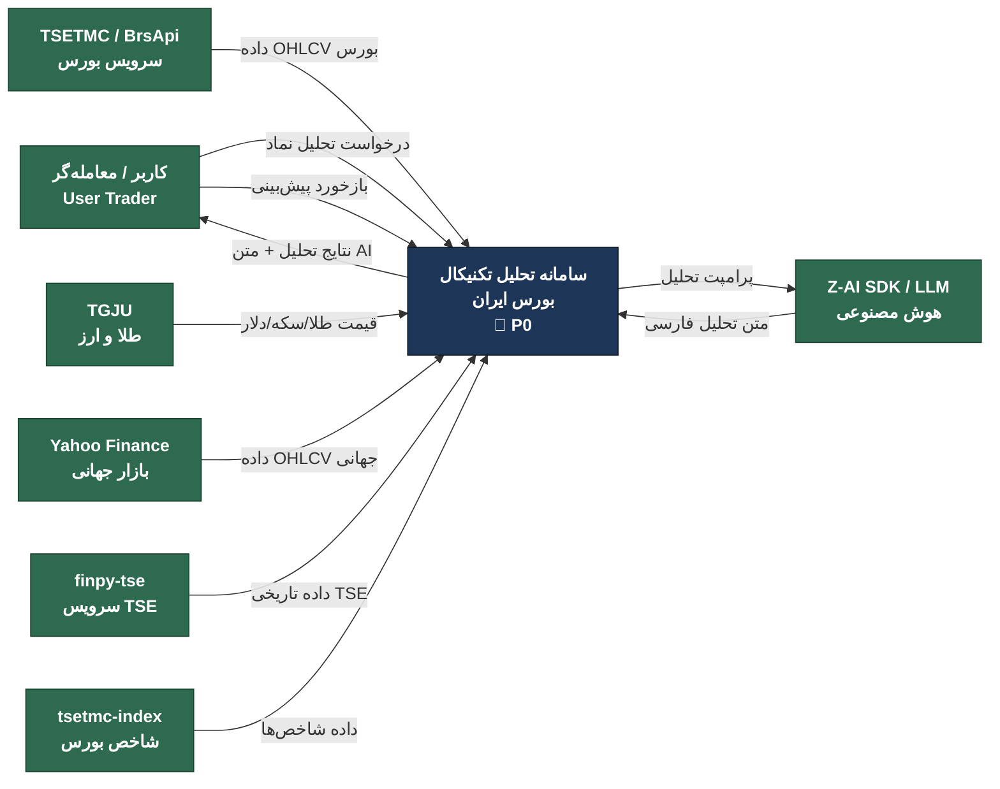

### توضیحات سطح ۰

- **نهادهای خارجی**: هفت منبع/مقصد داده در مرز سیستم وجود دارند. سه نهاد داده‌محور (TSETMC/BrsApi, TGJU, Yahoo Finance) داده‌های خام بازار را تأمین می‌کنند. دو نهاد سرویسی (finpy-tse, tsetmc-index) داده‌های تکمیلی تاریخی و شاخصی ارائه می‌دهند. نهاد Z-AI SDK متن تحلیل هوشمند فارسی تولید می‌کند و کاربر (معامله‌گر) درخواست و بازخورد را ارسال می‌کند.
- **فرایند مرکزی P0**: کل سامانه به‌عنوان یک جعبه سیاه واحد عمل می‌کند که داده‌های خام بازار را دریافت و نتایج تحلیل + متن AI را تولید می‌کند.
- **جریان‌های ورودی**: داده OHLCV (بورس، جهانی)، قیمت طلا/ارز، داده شاخص‌ها، درخواست تحلیل و بازخورد کاربر.
- **جریان‌های خروجی**: نتایج تحلیل تکنیکال، متن تحلیل AI، و پرامپت ارسالی به LLM.
- **مهم‌ترین ویژگی**: هیچ مخزن داده‌ای در سطح ۰ نمایش داده نمی‌شود — ذخیره‌سازی داخلی در سطوح پایین‌تر آشکار می‌شود.

---

# ═══════════════════════════════════════════════════════════════════
# سطح ۱: نمودار فرایندهای اصلی (DFD Level 1)
# ═══════════════════════════════════════════════════════════════════

سطح ۱ فرایند مرکزی را به **۷ فرایند اصلی** و **۶ مخزن داده** تجزیه می‌کند. جریان‌های بین‌فرایندی و دسترسی به مخازن مشخص می‌شود.

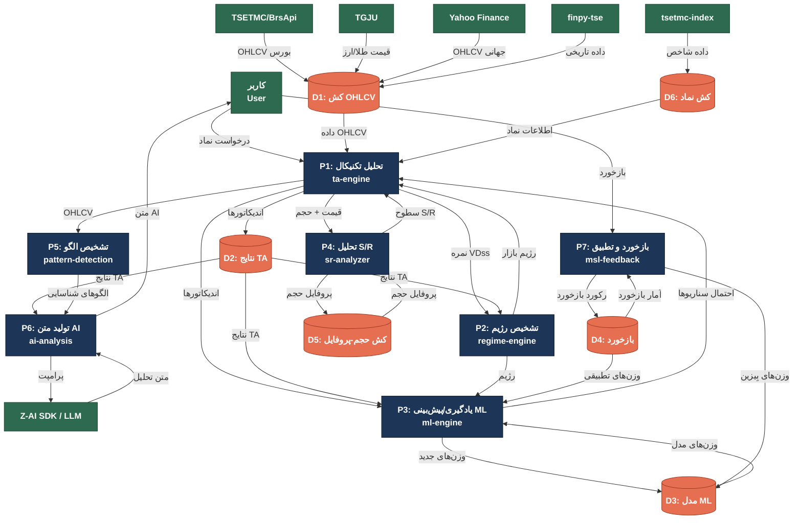

### توضیحات سطح ۱

- **هفت فرایند اصلی**: P1 تحلیل تکنیکال، P2 تشخیص رژیم بازار، P3 یادگیری ماشین و پیش‌بینی، P4 تحلیل حمایت/مقاومت، P5 تشخیص الگو، P6 تولید متن AI و P7 بازخورد و تطبیق — هر یک ماژول مستقل با رابط‌های مشخص هستند.
- **شش مخزن داده**: D1 کش OHLCV (داده خام)، D2 نتایج اندیکاتورها، D3 مدل ML (وزن‌ها و پارامترها)، D4 بازخورد کاربران، D5 کش پروفایل حجم و D6 کش اطلاعات نماد.
- **جریان‌های بین‌فرایندی کلیدی**: P1 نتایج خود را به P2 (نمره VDss)، P3 (اندیکاتورها)، P4 (قیمت/حجم) و P5 (OHLCV) ارسال می‌کند. P2 رژیم را به P1 و P3 بازمی‌گرداند. P3 احتمال سناریوها را به P1 می‌فرستد. P5 الگوها را به P6 می‌دهد و P7 وزن‌های تطبیقی را به D3 ذخیره می‌کند.
- **نهادهای خارجی**: داده‌های خام از TSETMC, TGJU و Yahoo Finance وارد D1 می‌شوند. Z-AI SDK متن تحلیل فارسی تولید می‌کند. کاربر هم درخواست و هم بازخورد ارسال می‌کند.
- **حلقه بازخورد**: D4 ← P7 ← D3 ← P3 یک حلقه تطبیقی بسته است: بازخورد کاربر وزن‌های بیزین را بروزرسانی می‌کند و این وزن‌ها دقت پیش‌بینی ML را بهبود می‌بخشند.

---

# ═══════════════════════════════════════════════════════════════════
# سطح ۲: تجزیه فرایندهای اصلی (DFD Level 2)
# ═══════════════════════════════════════════════════════════════════

## ۲.۱ تجزیه P1 — تحلیل تکنیکال (ta-engine)

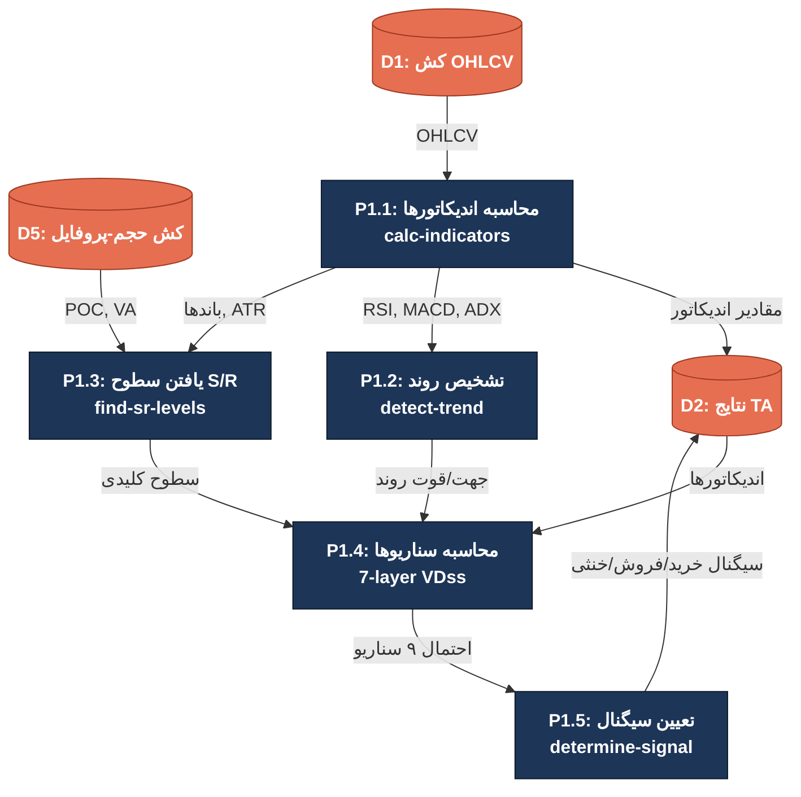

### توضیحات تجزیه P1

- **P1.1 محاسبه اندیکاتورها**: بیش از ۶۰ اندیکاتور (RSI, MACD, ADX, Stochastic, Bollinger, Ichimoku, VWAP و غیره) بر روی داده OHLCV محاسبه و در D2 ذخیره می‌شود.
- **P1.2 تشخیص روند**: با استفاده از ADX, MACD, ایچیموکو و خطوط روند، جهت (صعودی/نزولی/رنج) و قوت روند تعیین می‌شود.
- **P1.3 یافتن سطوح S/R**: سطوح حمایت و مقاومت کلیدی با استفاده از باند‌های بولینگر، ATR و پروفایل حجم (POC/Value Area از D5) شناسایی می‌شود.
- **P1.4 محاسبه سناریوها (VDss 7-layer)**: موتور ۷ لایه‌ای احتمال مسیر، ۹ سناریو قیمتی (از SC1 شوک نزولی تا SC9 شوک صعودی) را محاسبه می‌کند.
- **P1.5 تعیین سیگنال**: با ترکیب احتمال سناریوها و رژیم بازار، سیگنال نهایی (خرید/فروش/خنثی) تولید و در D2 ذخیره می‌شود.

---

## ۲.۲ تجزیه P2 — تشخیص رژیم (regime-engine)

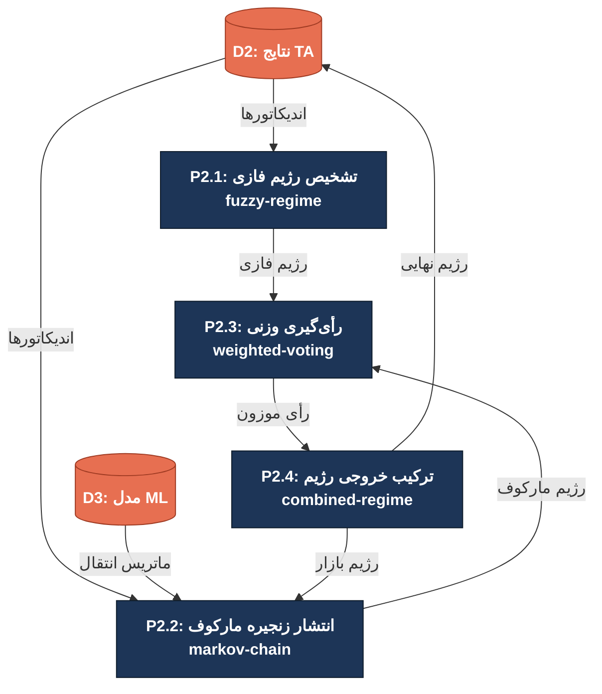

### توضیحات تجزیه P2

- **P2.1 تشخیص رژیم فازی**: با استفاده از مجموعه‌های فازی بر اندیکاتورها (ADX برای قوت روند, RSI برای اشباع, Bollinger برای نوسان)، عضویت فازی در رژیم‌های صعودی/نزولی/رنج محاسبه می‌شود.
- **P2.2 انتشار زنجیره مارکوف**: ماتریس انتقال وضعیت از D3 خوانده شده و با قوانین انتقال مارکوف، احتمال وضعیت‌های بعدی محاسبه و بِیزین بروزرسانی می‌شود.
- **P2.3 رأی‌گیری وزنی**: خروجی فازی و مارکوف با وزن‌های تطبیقی (از D3) ترکیب می‌شود تا رأی موزون نهایی شکل بگیرد.
- **P2.4 ترکیب خروجی رژیم**: رژیم نهایی (صعودی/نزولی/رنج با اطمینان) در D2 ذخیره و به P2.2 بازخورد داده می‌شود تا ماتریس انتقال تطبیق یابد.
- **حلقه تطبیقی مارکوف**: خروجی P2.4 به P2.2 بازمی‌گردد و ماتریس انتقال را بروزرسانی می‌کند — رژیم‌های اخیر وزن بیشتری در پیش‌بینی بعدی دارند.

---

## ۲.۳ تجزیه P3 — یادگیری/پیش‌بینی ML (ml-engine, ml-logistic)

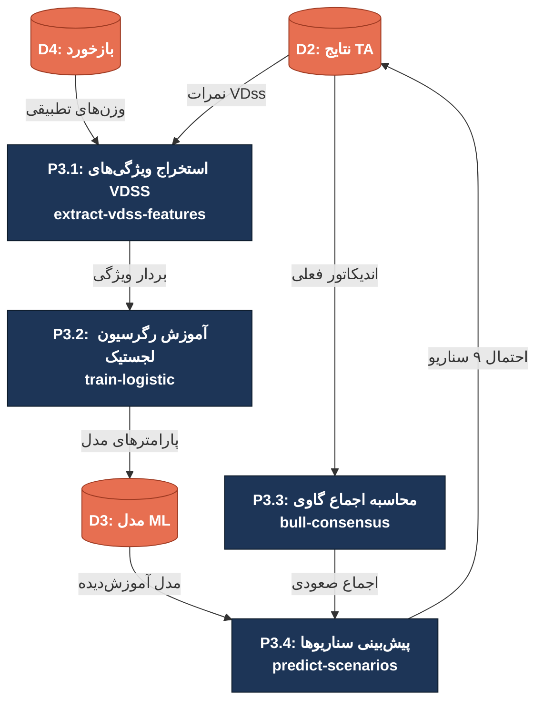

### توضیحات تجزیه P3

- **P3.1 استخراج ویژگی‌های VDSS**: نمرات ۷ لایه VDss به همراه وزن‌های تطبیقی (از D4) به بردار ویژگی تبدیل می‌شوند — هر لایه یک بعد از بردار ویژگی را تشکیل می‌دهد.
- **P3.2 آموزش رگرسیون لجستیک**: بردار ویژگی با برچسب‌های تاریخی (صعودی/نزولی) به رگرسیون لجستیک چندکلاسه تغذیه و پارامترها در D3 ذخیره می‌شود.
- **P3.3 محاسبه اجماع گاوی**: با رأی‌گیری بین اندیکاتورها و وزن‌های تطبیقی، میزان اجماع صعودی (bull consensus) محاسبه می‌شود.
- **P3.4 پیش‌بینی سناریوها**: مدل آموزش‌دیده (از D3) روی داده فعلی اعمال و احتمال هر ۹ سناریو محاسبه و در D2 ذخیره می‌شود.
- **اتصال به بازخورد**: وزن‌های تطبیقی از D4 وارد P3.1 می‌شوند — این وزن‌ها توسط P7 بر اساس بازخورد کاربر بروزرسانی می‌شوند.

---

## ۲.۴ تجزیه P4 — تحلیل حمایت/مقاومت و پروفایل حجم (sr-analyzer, volume-profile)

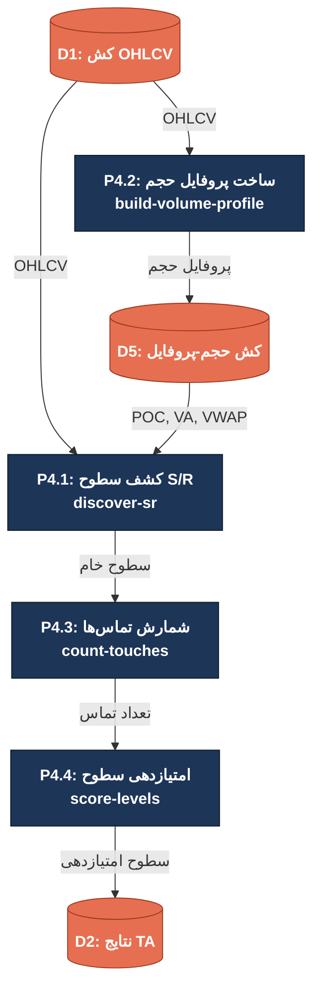

### توضیحات تجزیه P4

- **P4.1 کشف سطوح S/R**: با الگوریتم پنجره‌ای و ترکیب با POC/Value Area (از D5)، سطوح خام حمایت و مقاومت شناسایی می‌شود.
- **P4.2 ساخت پروفایل حجم**: از داده OHLCV، پروفایل حجم تقریبی (بدون تیک‌بای‌تیک) ساخته — حجم بین باز و بسته کندل در بدنه و حجم سایه‌ها در ویگ توزیع می‌شود — نتایج در D5 ذخیره.
- **P4.3 شمارش تماس‌ها**: برای هر سطح، تعداد دفعات تماس قیمت (با تلورانس ATR) شمرده می‌شود — سطوح با تماس بیشتر اعتبار بیشتری دارند.
- **P4.4 امتیازدهی سطوح**: هر سطح بر اساس تعداد تماس، حجم معاملات مجاور و فاصله از قیمت فعلی امتیازدهی و در D2 ذخیره می‌شود.
- **وابستگی حیاتی**: P4.1 به خروجی P4.2 (POC و Value Area) وابسته است — سطوح نزدیک POC وزن بیشتری دارند.

---

## ۲.۵ تجزیه P5 — تشخیص الگو (pattern-detection, candlestick-patterns)

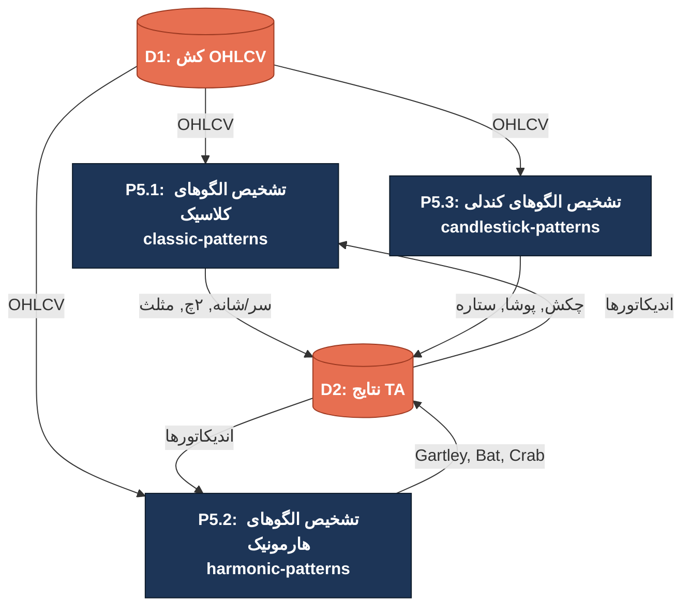

### توضیحات تجزیه P5

- **P5.1 تشخیص الگوهای کلاسیک**: ۱۶ الگوی کلاسیک (سر و شانه، دو قلو، مثلث، پرچم، مستطیل، گوه و غیره) با استفاده از OHLCV و اندیکاتورها شناسایی می‌شود.
- **P5.2 تشخیص الگوهای هارمونیک**: ۶ الگوی هارمونیک (Gartley, Bat, Butterfly, Crab, Shark, Cypher) با نسبتهای فیبوناچی تشخیص داده می‌شود.
- **P5.3 تشخیص الگوهای کندلی**: بیش از ۱۶ الگوی کندلی (چکش، پوشا صعودی/نزولی، ستاره دمش، هارامی، انگالفینگ و غیره) بررسی می‌شود.
- **خروجی مشترک**: هر سه زیرفرایند الگوهای شناسایی‌شده با اطمینان و جهت (صعودی/نزولی) را در D2 ذخیره و به P6 (تولید متن AI) ارسال می‌کنند.
- **ورودی یکسان**: هر سه زیرفرایند از D1 (OHLCV) تغذیه می‌شوند — P5.1 و P5.2 علاوه بر آن از D2 (اندیکاتورها) نیز استفاده می‌کنند.

---

## ۲.۶ تجزیه P6 — تولید متن AI (ai-analysis, vdes-analysis)

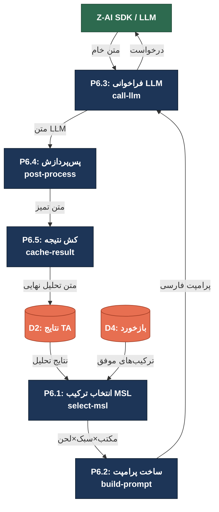

### توضیحات تجزیه P6

- **P6.1 انتخاب ترکیب MSL**: از ترکیب مکتب تحلیلی (تکنیکال‌گر، جریان‌گر، ریسک‌گریز) × سبک (رسمی، محاوره‌ای، آموزشی) × لحن (خنثی، خوش‌بینانه، محتاطانه)، بهترین ترکیب بر اساس بازخورد تاریخی (D4) انتخاب می‌شود.
- **P6.2 ساخت پرامپت**: نتایج تحلیل (اندیکاتورها، رژیم، سناریوها، الگوها، سطوح S/R) در قالب پرامپت ساختاریافته فارسی قالب‌بندی می‌شود.
- **P6.3 فراخوانی LLM**: پرامپت به Z-AI SDK ارسال و متن خام تحلیل دریافت می‌شود.
- **P6.4 پس‌پردازش**: متن خام از نظر سلامت (حذف تکرار، اصلاح فرمت، اطمینان از فارسی‌بودن) پس‌پردازش می‌شود.
- **P6.5 کش نتیجه**: متن نهایی تحلیل در D2 کش می‌شود تا در درخواست‌های بعدی بدون فراخوانی مجدد LLM بازگردانده شود.

---

## ۲.۷ تجزیه P7 — بازخورد و تطبیق (msl-feedback, bayesian-weights)

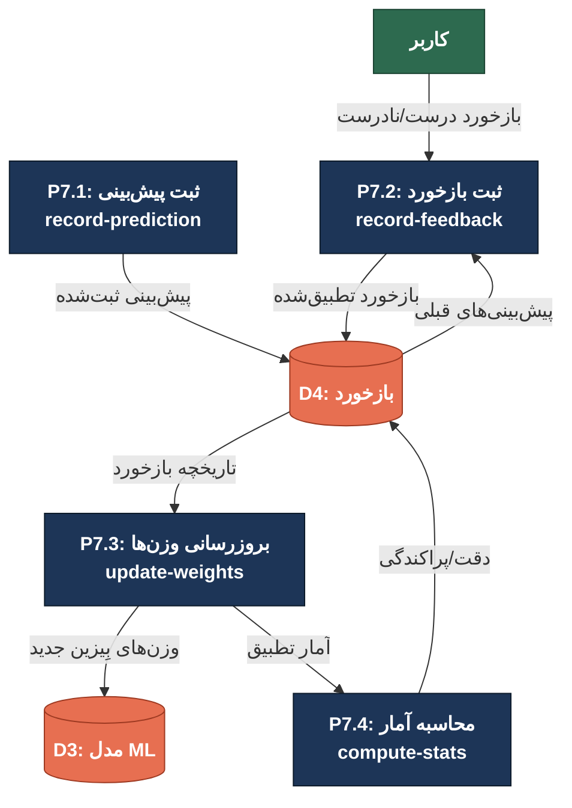

### توضیحات تجزیه P7

- **P7.1 ثبت پیش‌بینی**: هر پیش‌بینی صادرشده (سناریو، رژیم، سیگنال) با برچسب زمانی در D4 ثبت می‌شود تا بعداً با واقعیت مقایسه شود.
- **P7.2 ثبت بازخورد**: کاربر نتیجه واقعی (درست/نادرست/جزئی) را ثبت و با پیش‌بینی ثبت‌شده تطبیق می‌شود.
- **P7.3 بروزرسانی وزن‌ها**: با قاعده بیز، وزن‌های هر اندیکاتور و زیرسیستم بر اساس بازخورد تطبیق و در D3 ذخیره می‌شود.
- **P7.4 محاسبه آمار**: نرخ دقت، ماتریس درهم‌ریختگی و پراکندگی پیش‌بینی‌ها محاسبه و در D4 ذخیره می‌شود.
- **حلقه تطبیقی بسته**: P7.3 وزن‌های جدید در D3 ← P3 در آموزش بعدی از وزن‌های جدید استفاده ← پیش‌بینی بهتر ← بازخورد بهتر ← P7.3 وزن‌ها را مجدداً بروزرسانی.

---

# ═══════════════════════════════════════════════════════════════════
# سطح ۳: عملیات اتمی (DFD Level 3)
# ═══════════════════════════════════════════════════════════════════

سطح ۳ جزئیات عملیات اتمی سه زیرفرایند حیاتی را نشان می‌دهد: موتور ۷ لایه VDss (P1.4)، زنجیره مارکوف (P2.2) و پروفایل حجم (P4.2).

---

## ۳.۱ تجزیه P1.4 — موتور ۷ لایه VDss (7-Layer VDss Engine)

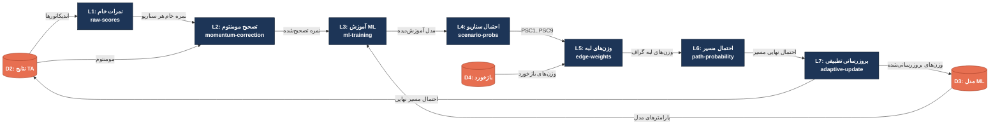

### توضیحات تجزیه P1.4 — ۷ لایه VDss

- **لایه ۱ — نمرات خام**: هر اندیکاتور نمره خام اولیه برای ۹ سناریو تولید می‌کند. مثلاً RSI بالای ۷۰ نمره بالا برای SC8-SC9 (صعودی قوی) و نمره پایین برای SC1-SC2 (نزولی) می‌دهد.
- **لایه ۲ — تصحیح مومنتوم**: نمرات خام بر اساس مومنتوم بازار (قوت و جهت روند) تصحیح می‌شوند — در روند صعودی قوی، سناریوهای نزولی تنزل می‌یابند.
- **لایه ۳ — آموزش ML**: رگرسیون لجستیک بر روی بردار ویژگی‌های VDss آموزش می‌بیند و پارامترها در D3 ذخیره — این لایه یادگیری سیستم را فراهم می‌کند.
- **لایه ۴ — احتمال سناریو**: مدل آموزش‌دیده احتمال هر ۹ سناریو (PSC1...PSC9) را محاسبه — مجموع احتمالات = ۱.
- **لایه ۵ — وزن‌های لبه**: احتمالات سناریو با وزن‌های تطبیقی بازخورد (از D4) ترکیب و وزن لبه‌های گراف سناریو تعیین می‌شود.
- **لایه ۶ — احتمال مسیر**: با پیمایش گراف سناریو و ضرب وزن‌های لبه، احتمال نهایی هر مسیر قیمتی محاسبه می‌شود.
- **لایه ۷ — بروزرسانی تطبیقی**: وزن‌های لبه بر اساس بازخورد تطبیق و در D3 بروزرسانی — حلقه یادگیری بسته می‌شود.

---

## ۳.۲ تجزیه P2.2 — زنجیره مارکوف (Markov Chain Propagation)

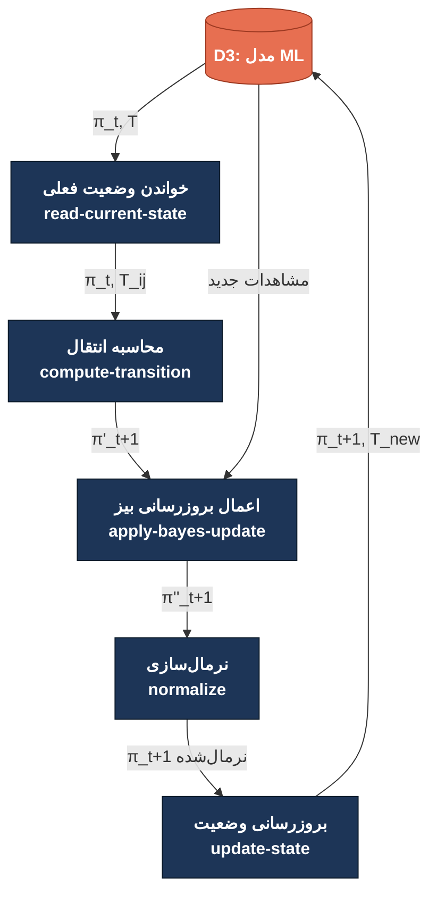

### توضیحات تجزیه P2.2 — زنجیره مارکوف

- **خواندن وضعیت فعلی**: بردار وضعیت فعلی π_t (احتمال هر رژیم) و ماتریس انتقال T از D3 خوانده می‌شود. وضعیت‌ها شامل صعودی، نزولی و رنج هستند.
- **محاسبه انتقال**: بردار وضعیت جدید با ضرب ماتریسسی محاسبه: π′ₜ₊₁ = πₜ × T. هر درایه T_ij احتمال انتقال از رژیم i به j را نشان می‌دهد.
- **اعمال بروزرسانی بیز**: مشاهدات جدید (اندیکاتورهای فعلی) به‌عنوان شواهد بِیزین اعمال: π″ₜ₊₁ = π′ₜ₊₁ × P(مشاهده|رژیم). این مرحله اطلاعات نوین را با مدل تاریخی ترکیب می‌کند.
- **نرمال‌سازی**: بردار وضعیت نرمال‌سازی می‌شود تا مجموع احتمالات = ۱ باشد: πₜ₊₁ = π″ₜ₊₁ / Σπ″ₜ₊₁.
- **بروزرسانی وضعیت**: بردار وضعیت جدید و ماتریس انتقال تطبیق‌یافته در D3 ذخیره می‌شوند — ماتریس انتقال با شمارش انتقال‌های مشاهده‌شده بروزرسانی می‌شود.

---

## ۳.۳ تجزیه P4.2 — ساخت پروفایل حجم (Volume Profile Builder)

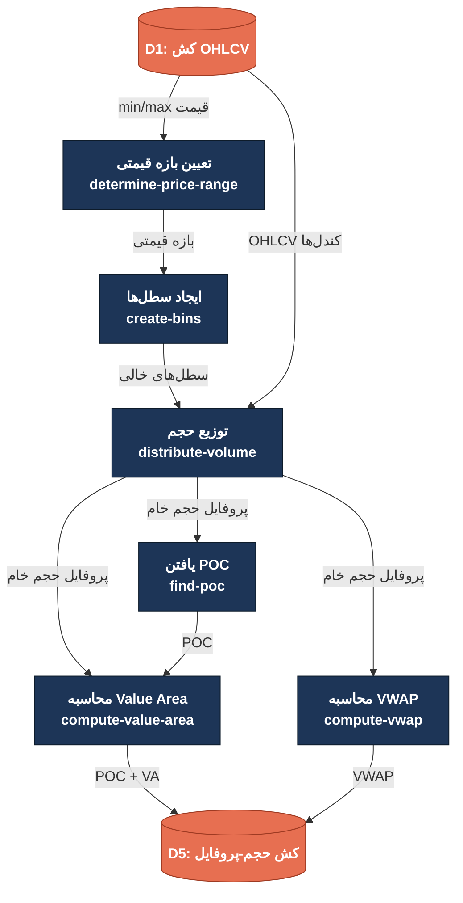

### توضیحات تجزیه P4.2 — پروفایل حجم

- **تعیین بازه قیمتی**: حداقل و حداکثر قیمت در دوره تحلیل محاسبه و بازه قیمتی تعیین می‌شود. معمولاً تعداد سطل‌ها برابر √N (تعداد کندل‌ها) یا عدد ثابت (مثلاً ۵۰) است.
- **ایجاد سطل‌ها**: بازه قیمتی به سطل‌های هم‌عرض تقسیم — هر سطل محدوده قیمتی [low, high) را پوشش می‌دهد.
- **توزیع حجم**: حجم هر کندل بین سطل‌های مربوطه توزیع — حجم بدنه (بین Open و Close) به‌صورت یکنواخت و حجم سایه‌ها (Wick) با وزن کمتر توزیع می‌شود. این تقریب بدون نیاز به داده تیک‌بای‌تیک است.
- **یافتن POC**: سطل با بیشترین حجم تجمعی به‌عنوان Point of Control (POC) شناسایی — این مهم‌ترین سطح پروفایل حجم است.
- **محاسبه Value Area**: با شروع از POC و افزودن سطل‌های مجاور بر اساس حجم نزولی، ۷۰٪ (یا ۶۸٪) از کل حجم پوشش داده — مرز بالایی (VAH) و پایینی (VAL) تعیین می‌شود.
- **محاسبه VWAP**: میانگین وزنی حجم-قیمت (Volume-Weighted Average Price) محاسبه: VWAP = Σ(قیمت‌典型ی × حجم) / Σحجم — هم POC/VA و هم VWAP در D5 ذخیره.

---

# ═══════════════════════════════════════════════════════════════════
# خلاصه جریان‌های داده اصلی
# ═══════════════════════════════════════════════════════════════════

| جریان داده | از | به | توضیح |
|------------|----|----|-------|
| OHLCV خام | TSETMC/TGJU/Yahoo | D1 | داده‌های خام بازار (قیمت باز/بسته/بالا/پایین + حجم) |
| اندیکاتورها | P1.1 | D2 | مقادیر ۴۳ اندیکاتور تکنیکال |
| رژیم بازار | P2 | P1, P3 | رژیم فعلی بازار (صعودی/نزولی/رنج + اطمینان) |
| احتمال سناریوها | P3/P1.4 | P1 | احتمال هر ۹ سناریو (SC1-SC9) |
| سطوح S/R | P4 | P1 | سطوح حمایت/مقاومت امتیازدهی‌شده |
| الگوها | P5 | P6 | الگوهای شناسایی‌شده (کلاسیک + هارمونیک + کندلی) |
| پرامپت/متن AI | P6 ↔ Z-AI | P6 ↔ E5 | پرامپت ارسالی و متن تحلیل دریافتی |
| بازخورد | کاربر | P7 | نتیجه واقعی پیش‌بینی (درست/نادرست) |
| وزن‌های تطبیقی | P7 | D3 → P3 | وزن‌های بِیزین بروزرسانی‌شده |

---

> **توجه**: تمام برچسب‌های نمودارها به زبان فارسی با نام کد انگلیسی در پرانتز هستند. سبک‌دهی با `classDef` یکنواخت (Entity سبز، Process آبی، DataStore نارنجی) در تمام سطوح حفظ شده است.
