# UML 2.5 Structural Diagrams — Iranian Stock Market Technical Analysis System

> **نکته:** این بخش شامل هفت نوع دیاگرام ساختاری UML 2.5 برای سیستم تحلیل تکنیکال بورس ایران است. هر دیاگرام در سه سطح (مفهومی، طراحی، پیاده‌سازی) ارائه شده و نام کلاس‌ها و متدها دقیقاً با موجودیت‌های DFD و فعالیت‌های BPMN همخوانی دارد. تمام دیاگرام‌ها با PlantUML قابل رندر هستند (به جز پروفایل که به صورت جدول ارائه شده).

---

## 1. Class Diagram

### Level 1 — Domain Model (Conceptual)

> **توضیح فارسی:** این دیاگرام مفهومی، هسته اصلی دامنه مسئله را نشان می‌دهد. کلاس‌های OHLCV و TAResult پایه‌های داده‌ای تحلیل تکنیکال هستند. RegimeResult وضعیت رژیم بازار را بیان می‌کند. VolumeProfileResult توزیع حجم معاملات را نشان می‌دهد و FeedbackStore ذخیره بازخوردها برای یادگیری تطبیقی است. روابط ساده بدون جهت، مفهوم وابستگی دامنه‌ای را منتقل می‌کنند.

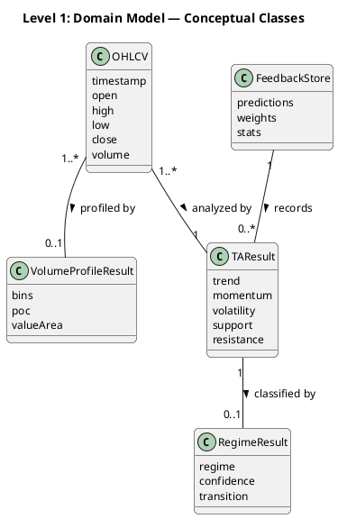

---

### Level 2 — Design Classes with Associations, Aggregations, Compositions

> **توضیح فارسی:** در سطح طراحی، روابط دقیق‌تر مشخص شده‌اند. TAResult از طریق composition شامل ScenarioResult و TrendResult است (چرخه حیاتشان وابسته). RegimeResult شامل MarkovChain و VotingWeights است. VolumeProfileResult شامل TouchCountResult و EnhancedSRStrengthResult به صورت aggregation است (می‌توانند مستقل وجود داشته باشند). FeedbackStore شامل PredictionRecord و WeightRecord و FeedbackStats به صورت composition است. Multiplicity نشان‌دهنده تعداد نمونه‌های ممکن است.

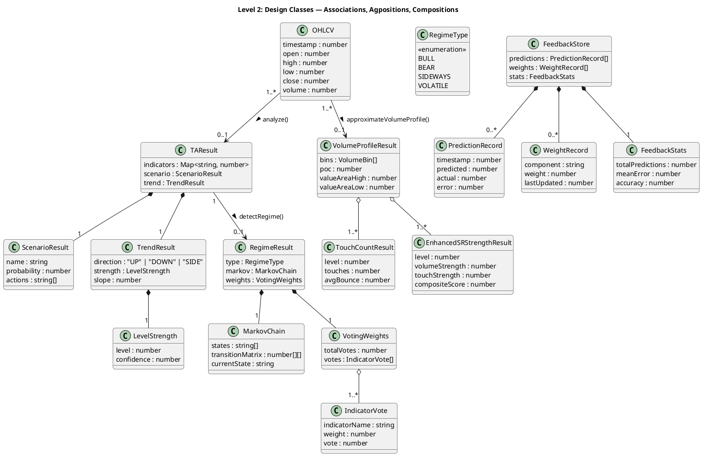

---

### Level 3 — Implementation Classes with Full Methods, Visibility, Return Types

> **توضیح فارسی:** در سطح پیاده‌سازی، تمام متدها با سطح دسترسی (public +، private −)، پارامترها و نوع خروجی مشخص شده‌اند. کلاس‌های ML شامل AdaptiveWeightModel با StandardScaler و LogisticRegressionModel به صورت composition هستند. SRAnalyzer و PatternDetection و DecisionGraph و BayesianWeights و MLNarrative متدهای اصلی سیستم را نشان می‌دهند. تمام نام‌ها دقیقاً با کد منبع همخوانی دارند.

```plantuml
@startuml ClassDiagram_L3_Implementation
skinparam classAttributeIconSize 0
skinparam roundcorner 8

title Level 3: Implementation Classes — Full Methods & Visibility

class OHLCV {
  + timestamp : number
  + open : number
  + high : number
  + low : number
  + close : number
  + volume : number
  + validate() : boolean
}

class TAResult {
  + indicators : Map<string, number>
  + scenario : ScenarioResult
  + trend : TrendResult
  + getIndicator(name: string) : number
  + toJSON() : string
}

class ScenarioResult {
  + name : string
  + probability : number
  + actions : string[]
  + getTopAction() : string
}

class TrendResult {
  + direction : string
  + strength : LevelStrength
  + slope : number
  + isBullish() : boolean
  + isBearish() : boolean
}

class LevelStrength {
  + level : number
  + confidence : number
  + normalize() : number
}

class SRAnalyzer {
  - _mlWeights : MLWeights
  - _cache : Map<string, SRAnalysisResult>
  + analyzeSupportResistance(data: OHLCV[], taResult: TAResult) : SRAnalysisResult
  - _calculateProximity(data: OHLCV[], level: SRLevel) : number
  - _mergeLevels(levels: SRLevel[]) : SRLevel[]
}

class SRLevel {
  + price : number
  + type : "support" | "resistance"
  + strength : number
  + touches : number
}

class SRAnalysisResult {
  + supports : SRLevel[]
  + resistances : SRLevel[]
  + mlWeights : MLWeights
  + getNearest(price: number) : SRLevel
}

class MLWeights {
  + proximity : number
  + volume : number
  + touch : number
  + recency : number
}

class RegimeEngine {
  - _markov : MarkovChain
  - _fuzzyCache : Map<string, FuzzyOutput>
  + detectRegime(input: RegimeInput) : RegimeResult
  + fuzzyRegimeDetector(input: RegimeInput) : FuzzyOutput
  + adaptiveWeightedVote(indicators: IndicatorVote[], weights: VotingWeights) : VoteResult
  - _updateMarkovState(result: RegimeResult) : void
}

class MarkovChain {
  + states : string[]
  + transitionMatrix : number[][]
  + currentState : string
  + nextState() : string
  + probability(from: string, to: string) : number
  + train(sequences: string[][]) : void
}

class VotingWeights {
  + totalVotes : number
  + votes : IndicatorVote[]
  + normalize() : void
  + getWeightedSum() : number
}

class VolumeProfileEngine {
  + approximateVolumeProfile(data: OHLCV[], numBins: number) : VolumeProfileResult
  + countTouch(data: OHLCV[], level: number, tolerance: number) : TouchCountResult
  - _binVolume(data: OHLCV[], numBins: number) : VolumeBin[]
}

class AdaptiveWeightModel {
  - _scaler : StandardScaler
  - _logistic : LogisticRegressionModel
  + trainAdaptiveModel(X: number[][], y: number[]) : TrainingResult
  + predictScore(x: number[]) : number
  + getWeights() : number[]
  - _preprocess(X: number[][]) : number[][]
}

class StandardScaler {
  - _mean : number[]
  - _std : number[]
  + fit(X: number[][]) : void
  + transform(X: number[][]) : number[][]
  + fitTransform(X: number[][]) : number[][]
}

class LogisticRegressionModel {
  - _coefficients : number[]
  - _intercept : number
  + fit(X: number[][], y: number[]) : void
  + predict(X: number[][]) : number[]
  + predictProba(X: number[][]) : number[]
}

class FeedbackStore {
  - _storage : SafeLocalStorage
  - _predictions : PredictionRecord[]
  - _weights : WeightRecord[]
  + addPrediction(record: PredictionRecord) : void
  + getStats() : FeedbackStats
  + updateWeight(component: string, weight: number) : void
  + getWeights() : WeightRecord[]
  + clearHistory() : void
}

class PatternDetection {
  + detectAllPatterns(data: OHLCV[]) : DetectedPatterns
  - _detectCandlestick(data: OHLCV[]) : PatternResult[]
  - _detectChart(data: OHLCV[]) : PatternResult[]
}

class PatternResult {
  + name : string
  + type : string
  + startIndex : number
  + endIndex : number
  + significance : number
}

class DetectedPatterns {
  + candlestick : PatternResult[]
  + chart : PatternResult[]
  + all : PatternResult[]
  + count() : number
}

class DecisionGraph {
  + buildDecisionGraph(input: GraphInput) : GraphData
  - _createNodes(input: GraphInput) : GraphNode[]
  - _createEdges(nodes: GraphNode[]) : GraphEdge[]
}

class GraphData {
  + nodes : GraphNode[]
  + edges : GraphEdge[]
  + toJSON() : string
}

class GraphNode {
  + id : string
  + label : string
  + type : string
  + data : Map<string, any>
}

class GraphEdge {
  + source : string
  + target : string
  + weight : number
  + label : string
}

class BayesianWeights {
  + compute(prior: BayesianWeight[], evidence: number[]) : BayesianSystemResult
  - _posterior(prior: number, likelihood: number) : number
}

class BayesianWeight {
  + name : string
  + prior : number
  + likelihood : number
  + posterior : number
}

class BayesianSystemResult {
  + weights : BayesianWeight[]
  + normalizedPosterior : number[]
  + entropy : number
}

class MLNarrative {
  + dedicatedAIChatCompletion(messages: ChatMessage[]) : Promise<string>
  + selectMSLV4(input: NarrativeInput) : NarrativeCombination
  + postProcessAIOutput(text: string, refs: Reference[]) : PostProcessResult
  - _buildPrompt(input: NarrativeInput) : string
}

class NarrativeCombination {
  + school : SchoolDef
  + style : StyleDef
  + tone : ToneDef
}

class ThemeStore {
  + colors : ThemeColors
  + preset : ThemePreset
  + setTheme(preset: ThemePreset) : void
  + toggleDarkMode() : void
}

class SafeLocalStorage {
  - _isAvailable : boolean
  + getItem(key: string) : string | null
  + setItem(key: string, value: string) : void
  + removeItem(key: string) : void
  + isAvailable() : boolean
}

' Compositions
TAResult *-- "1" ScenarioResult
TAResult *-- "1" TrendResult
TrendResult *-- "1" LevelStrength
SRAnalyzer *-- "1" MLWeights
SRAnalysisResult o-- "0..*" SRLevel
SRAnalysisResult *-- "1" MLWeights
RegimeEngine *-- "1" MarkovChain
AdaptiveWeightModel *-- "1" StandardScaler
AdaptiveWeightModel *-- "1" LogisticRegressionModel
FeedbackStore *-- "0..*" PredictionRecord
FeedbackStore *-- "0..*" WeightRecord
FeedbackStore *-- "1" FeedbackStats
FeedbackStore --> "1" SafeLocalStorage : uses
DecisionGraph *-- "1" GraphData
GraphData o-- "1..*" GraphNode
GraphData o-- "0..*" GraphEdge
DetectedPatterns o-- "0..*" PatternResult
BayesianSystemResult o-- "1..*" BayesianWeight
NarrativeCombination *-- "1" SchoolDef
NarrativeCombination *-- "1" StyleDef
NarrativeCombination *-- "1" ToneDef

' Dependencies
SRAnalyzer ..> TAResult : requires
VolumeProfileEngine ..> OHLCV : requires
PatternDetection ..> OHLCV : requires
DecisionGraph ..> GraphInput : requires
MLNarrative ..> NarrativeCombination : produces
ThemeStore ..> ThemeColors : uses
ThemeStore ..> ThemePreset : uses

@enduml
```

---

## 2. Object Diagram

### Level 1 — Object Instances for Symbol "فولاد" (Foolad Steel)

> **توضیح فارسی:** این دیاگرام نمونه‌های واقعی از کلاس‌ها را برای نماد «فولاد» نشان می‌دهد. شیء fooladData شامل ۵ کندل OHLCV است. شیء fooladResult نمونه‌ای از TAResult با شاخص‌های محاسبه‌شده است. fooladRegime رژیم صعودی با اطمینان ۰.۷۸ را نشان می‌دهد. fooladProfile پروفایل حجم با POC در قیمت ۸۹۵۰ و fooladFeedback ذخیره بازخورد با ۳۲ پیش‌بینی ثبت‌شده است.

```plantuml
@startuml ObjectDiagram_L1_Instances
skinparam objectFontSize 12
skinparam roundcorner 10

title Level 1: Object Instances — Symbol "فولاد"

object fooladData : OHLCV {
  timestamp = 1711929600000
  open = 8850
  high = 9020
  low = 8810
  close = 8950
  volume = 4520000
}

object fooladResult : TAResult {
  indicators = {RSI:62.3, MACD:85.1, ATR:210}
  trend.direction = "UP"
  trend.strength.level = 0.72
}

object fooladRegime : RegimeResult {
  type = RegimeType.BULL
  confidence = 0.78
  markov.currentState = "BULL"
}

object fooladProfile : VolumeProfileResult {
  poc = 8950
  valueAreaHigh = 9120
  valueAreaLow = 8780
  bins.count = 12
}

object fooladFeedback : FeedbackStore {
  predictions.length = 32
  weights.proximity = 0.35
  stats.accuracy = 0.71
}

fooladResult --> fooladData : analyzedFrom
fooladRegime --> fooladResult : classifiedFrom
fooladProfile --> fooladData : profiledFrom
fooladFeedback --> fooladResult : tracks

@enduml
```

---

### Level 2 — Objects During Mid-Process (TAResult Being Computed)

> **توضیح فارسی:** این دیاگرام وضعیت اشیاء در حین محاسبه TAResult را نشان می‌دهد. در حالی که موتور تحلیل در حال اجراست، intermediateResult فقط بخشی از اندیکاتورها را دارد (RSI محاسبه شده اما MACD هنوز در حال محاسبه است). pendingScenario هنوز probability ندارد و pendingTrend فقط direction تعیین شده اما strength خالی است. این دیاگرام برای دیباگ و درک روند محاسبات مفید است.

```plantuml
@startuml ObjectDiagram_L2_MidProcess
skinparam objectFontSize 12
skinparam roundcorner 10

title Level 2: Mid-Process Objects — TAResult Being Computed

object rawData : OHLCV[] {
  length = 250
  [0].close = 8950
  [249].close = 8820
}

object intermediateResult : TAResult {
  indicators = {RSI:62.3, EMA20:8890}
  // MACD: computing...
  // Bollinger: pending
}

object pendingScenario : ScenarioResult {
  name = "breakout_bull"
  probability = undefined
  actions = []
}

object pendingTrend : TrendResult {
  direction = "UP"
  strength = null
  slope = undefined
}

object computingRegime : RegimeResult {
  type = null
  confidence = 0
  // awaiting TAResult
}

object partialFeedback : FeedbackStore {
  predictions.length = 31
  // prediction 32 in progress
}

intermediateResult --> rawData : partialAnalysis
pendingScenario --> intermediateResult : awaiting
pendingTrend --> intermediateResult : awaiting
computingRegime --> intermediateResult : blocked

@enduml
```

---

### Level 3 — Objects at Critical Moment (Markov Chain State Update)

> **توضیح فارسی:** در لحظه بحرانی به‌روزرسانی حالت زنجیره مارکوف، دیاگرام وضعیت دقیق تمام اشیاء مرتبط را نشان می‌دهد. زنجیره مارکوف از حالت SIDEWAYS به BULL منتقل شده و ماتریس انتقال به‌روز شده است. رأی‌گیری وزن‌دار تطبیقی انجام شده و نتیجه نهایی رژیم BULL با اطمینان ۰.۸۳ قطعی شده است. بازخورد در حال ثبت این پیش‌بینی است و مدل لجستیک وزن‌های جدید را دریافت کرده است.

```plantuml
@startuml ObjectDiagram_L3_Critical
skinparam objectFontSize 12
skinparam roundcorner 10

title Level 3: Critical Moment — Markov Chain State Update

object markovBefore : MarkovChain {
  currentState = "SIDEWAYS"
  states = ["BULL","BEAR","SIDEWAYS","VOLATILE"]
}

object markovAfter : MarkovChain {
  currentState = "BULL"
  states = ["BULL","BEAR","SIDEWAYS","VOLATILE"]
  transitionMatrix[2][0] = 0.34
  // P(SIDEWAYS→BULL) updated
}

object voteRSI : IndicatorVote {
  indicatorName = "RSI"
  weight = 0.28
  vote = 1  // bullish
}

object voteMACD : IndicatorVote {
  indicatorName = "MACD"
  weight = 0.35
  vote = 1  // bullish
}

object voteBollinger : IndicatorVote {
  indicatorName = "Bollinger"
  weight = 0.22
  vote = 0  // neutral
}

object votingWeights : VotingWeights {
  totalVotes = 3
  weightedSum = 0.855
}

object finalRegime : RegimeResult {
  type = RegimeType.BULL
  confidence = 0.83
}

object feedbackRecord : PredictionRecord {
  timestamp = 1711929600000
  predicted = 1  // BULL
  actual = null  // pending
  error = null
}

object updatedLogistic : AdaptiveWeightModel {
  _scaler._mean = [0.52, 0.71, 0.34]
  _logistic._coefficients = [1.23, -0.87, 0.45]
}

markovBefore --> markovAfter : transition(SIDEWAYS→BULL)
votingWeights --> voteRSI : includes
votingWeights --> voteMACD : includes
votingWeights --> voteBollinger : includes
finalRegime --> markovAfter : derivedFrom
finalRegime --> votingWeights : basedOn
feedbackRecord --> finalRegime : records
updatedLogistic --> finalRegime : learnsFrom

@enduml
```

---

## 3. Component Diagram

### Level 1 — Top-Level Components

> **توضیح فارسی:** این دیاگرام پنج مؤلفه اصلی سیستم را نشان می‌دهد. TA Engine موتور تحلیل تکنیکال، ML Engine موتور یادگیری ماشین، Regime Engine موتور تشخیص رژیم، AI Service سرویس هوش مصنوعی و Data Layer لایه داده هستند. جریان داده از Data Layer به TA Engine و سپس به سایر مؤلفه‌هاست. AI Service از طریق رابط ZAI-SDK به سرویس خارجی متصل می‌شود.

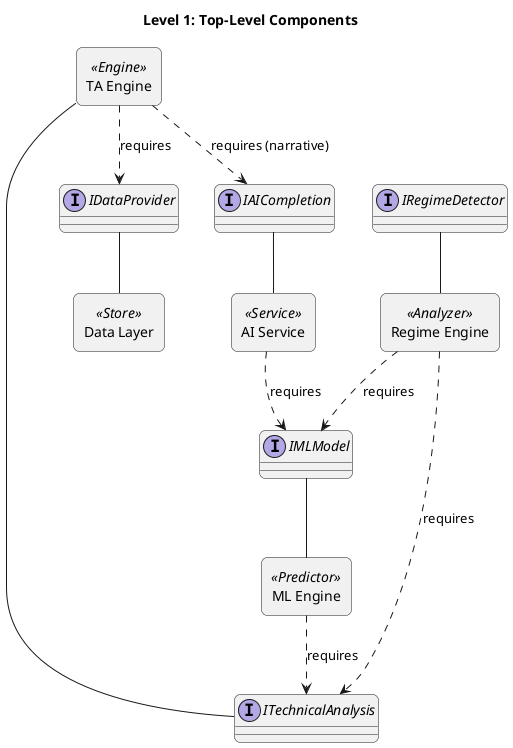

---

### Level 2 — Sub-Components

> **توضیح فارسی:** در سطح زیرمؤلفه، هر مؤلفه اصلی به اجزای خرد شکسته شده است. TA Engine شامل Indicator Calculators، S/R Analyzer و VDSS Engine است. ML Engine شامل Logistic Regression، Bayesian Weights و Adaptive Weight Model است. Regime Engine شامل Fuzzy Detector، Markov Chain و Voting System است. AI Service شامل Chat Completion و Post-Processor و Narrative Selector است. Data Layer شامل TSE API و TGJU API و Safe Storage است.

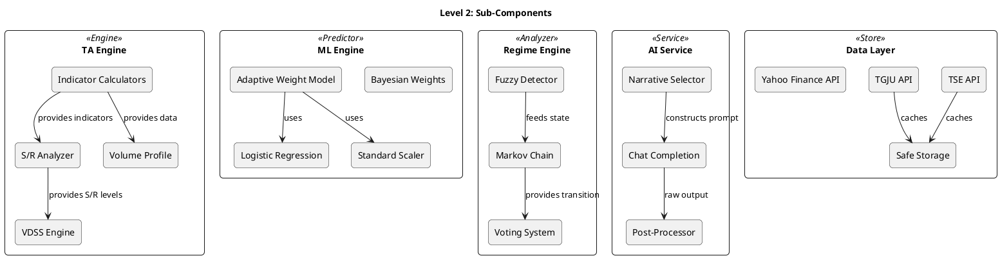

---

### Level 3 — Interface Dependencies with Provided/Required Interfaces and Method Signatures

> **توضیح فارسی:** در سطح تفصیلی، هر مؤلفه رابط‌های ارائه‌شده (Provided) و موردنیاز (Required) را با امضای متدها نشان می‌دهد. مثلاً TA Engine رابط ITechnicalAnalysis با متد analyze را ارائه و IDataProvider با متد fetchOHLCV را نیاز دارد. ML Engine رابط IMLModel با trainAdaptiveModel و predictScore را ارائه می‌دهد. Regime Engine رابط IRegimeDetector با detectRegime و fuzzyRegimeDetector را ارائه می‌دهد. تمام وابستگی‌ها از طریق رابط‌ها برقرار می‌شود، نه ارجاع مستقیم.

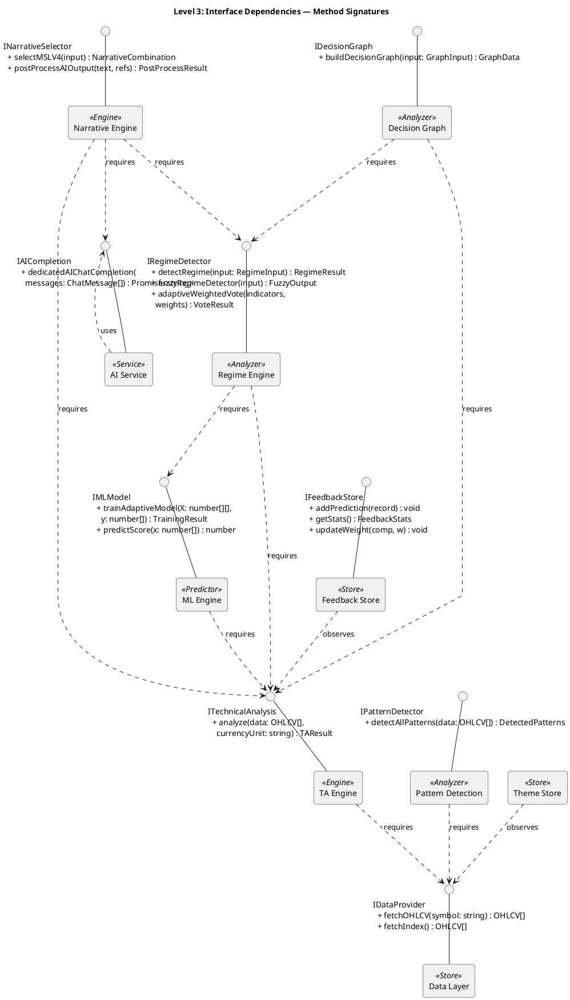

---

## 4. Deployment Diagram

### Level 1 — Physical Nodes

> **توضیح فارسی:** این دیاگرام گره‌های فیزیکی استقرار سیستم را نشان می‌دهد. Browser گره کاربر نهایی است که با Next.js Server ارتباط HTTP دارد. Next.js Server گره اصلی پردازش است. Mini Services گره سرویس‌های خرد (fetcher و health-check) است. Z-AI SDK گره سرویس هوش مصنوعی خارجی است. هر گره با پروتکل مناسب به گره دیگر متصل می‌شود.

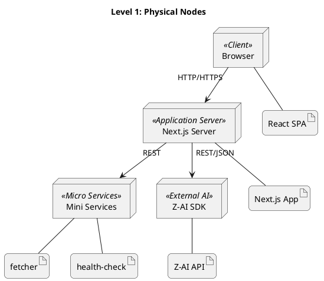

---

### Level 2 — Component Allocation with Protocols

> **توضیح فارسی:** در سطح دوم، مؤلفه‌های نرم‌افزاری روی گره‌های فیزیکی تخصیص داده شده‌اند و پروتکل‌های ارتباطی دقیق‌تر مشخص شده‌اند. روی Browser کامپوننت‌های React UI و Theme Store قرار دارند. روی Next.js Server تمام Engine ها و Analyzer ها و Store ها مستقر هستند. Mini Services شامل TSE Fetcher و TGJU Fetcher است. ارتباط از نوع HTTP، WebSocket و REST با پورت‌های مشخص است.

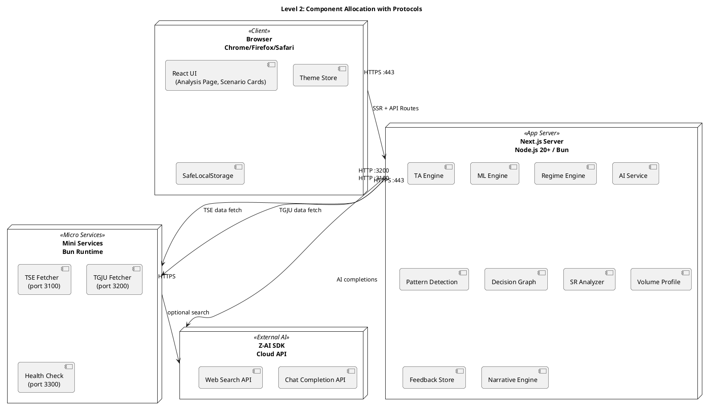

---

### Level 3 — Detailed Config per Node

> **توضیح فارسی:** در سطح تفصیلی، پیکربندی هر گره شامل سیستم‌عامل، پورت، تعداد نمونه، تنظیمات کش و محدودیت‌های نرخ است. Browser روی سیستم‌عامل کاربر اجرا می‌شود. Next.js Server روی لینوکس با پورت ۳۰۰۰، ۲ نمونه و کش ۱۰۰۰ مدخل اجرا می‌شود. Mini Services روی لینوکس با Bun Runtime و هرکدام ۱ نمونه اجرا می‌شوند. Z-AI SDK سرویس ابری با rate-limit ۶۰ درخواست در دقیقه است.

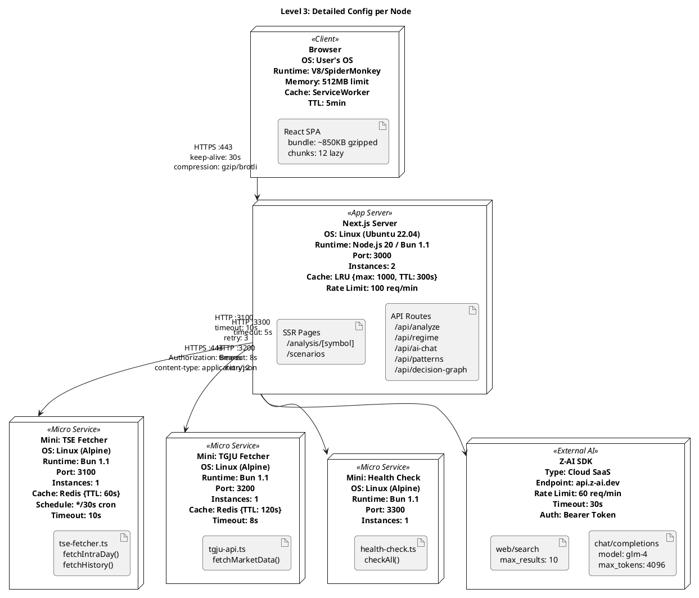

---

## 5. Package Diagram

### Level 1 — Main Packages

> **توضیح فارسی:** دیاگرام بسته‌ها در سطح اول، چهار بسته اصلی را نشان می‌دهد: lib/ شامل تمام منطق کسب‌وکار، components/ شامل کامپوننت‌های رابط کاربری، api/ شامل مسیرهای API و mini-services/ شامل سرویس‌های خرد داده. وابستگی‌ها از components به lib (استفاده از منطق)، از api به lib (فراخوانی موتورها) و از mini-services به منابع خارجی است.

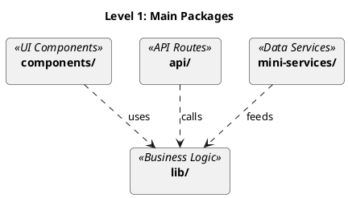

---

### Level 2 — Sub-Packages

> **توضیح فارسی:** در سطح دوم، بسته lib/ به زیربسته‌های ta (تحلیل تکنیکال)، ml (یادگیری ماشین)، regime (رژیم بازار)، sr (سطوح حمایتی/مقاومتی)، pattern (تشخیص الگو)، feedback (بازخورد)، data (داده) و ui (رابط کاربری) شکسته شده است. بسته components/ شامل analysis، scenarios و common است. بسته api/ شامل analyze، regime و ai-chat است. mini-services/ شامل tse-fetcher و tgju-fetcher است.

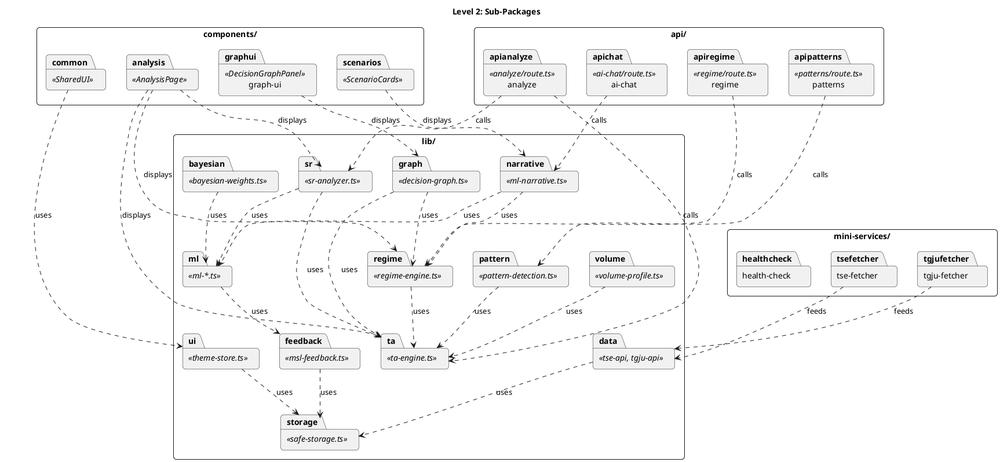

---

### Level 3 — Class-Level Dependencies Between Packages

> **توضیح فارسی:** در سطح سوم، وابستگی‌های کلاس‌به‌کلاس بین بسته‌ها نشان داده شده است. مثلاً TAResult (در lib/ta) توسط SRAnalyzer (در lib/sr)، RegimeEngine (در lib/regime) و DecisionGraph (در lib/graph) استفاده می‌شود. AdaptiveWeightModel (در lib/ml) توسط SRAnalyzer و RegimeEngine استفاده می‌شود. FeedbackStore (در lib/feedback) توسط AdaptiveWeightModel به‌روزرسانی می‌شود. تمام وابستگی‌ها جهت‌دار و بدون چرخه هستند.

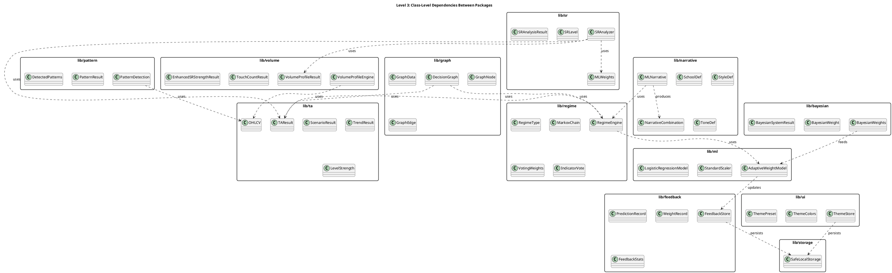

---

## 6. Composite Structure Diagram

### Level 1 — Internal Structure of TA Engine Component

> **توضیح فارسی:** دیاگرام ساختار مرکب، ساختار داخلی مؤلفه TA Engine را نشان می‌دهد. این مؤلفه شامل بخش‌های IndicatorCalculator (محاسبه اندیکاتورها)، TrendAnalyzer (تحلیل روند)، ScenarioEvaluator (ارزیابی سناریوها) و VolumeProfiler (پروفایل حجم) است. پورت‌های ورودی dataInput و currencyInput و پورت خروجی resultOutput ارتباط داخلی و خارجی را فراهم می‌کنند. بخش‌ها از طریق کانکتورهای داخلی به هم متصل هستند.

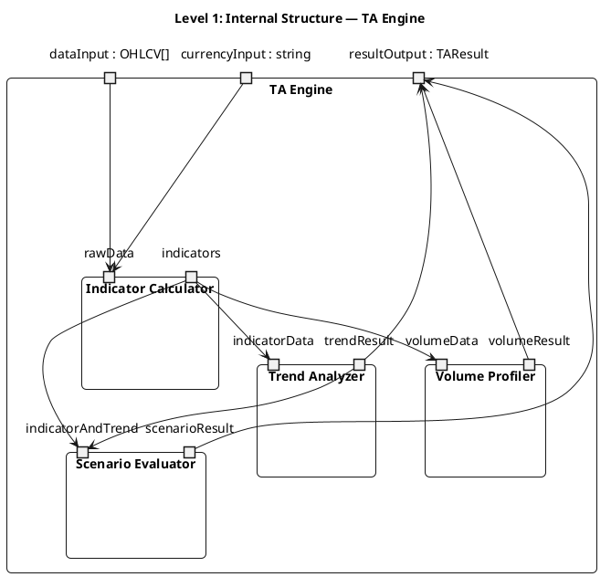

---

### Level 2 — Collaboration within AdaptiveWeightModel

> **توضیح فارسی:** این دیاگرام همکاری داخلی AdaptiveWeightModel را نشان می‌دهد. این مدل از سه بخش تشکیل شده: StandardScaler (نرمال‌سازی ویژگی‌ها)، LogisticRegressionModel (مدل لجستیک رگرسیون) و TimeSeriesSplit (تقسیم سری زمانی برای اعتبارسنجی). جریان کار: داده‌های ورودی ابتدا توسط StandardScaler نرمال‌سازی می‌شوند، سپس توسط TimeSeriesSplit به مجموعه‌های آموزش و آزمون تقسیم می‌شوند و در نهایت LogisticRegressionModel روی داده‌های آموزشی آموزش می‌بیند. برای پیش‌بینی، داده‌ها ابتدا نرمال‌سازی و سپس به مدل لجستیک داده می‌شوند.

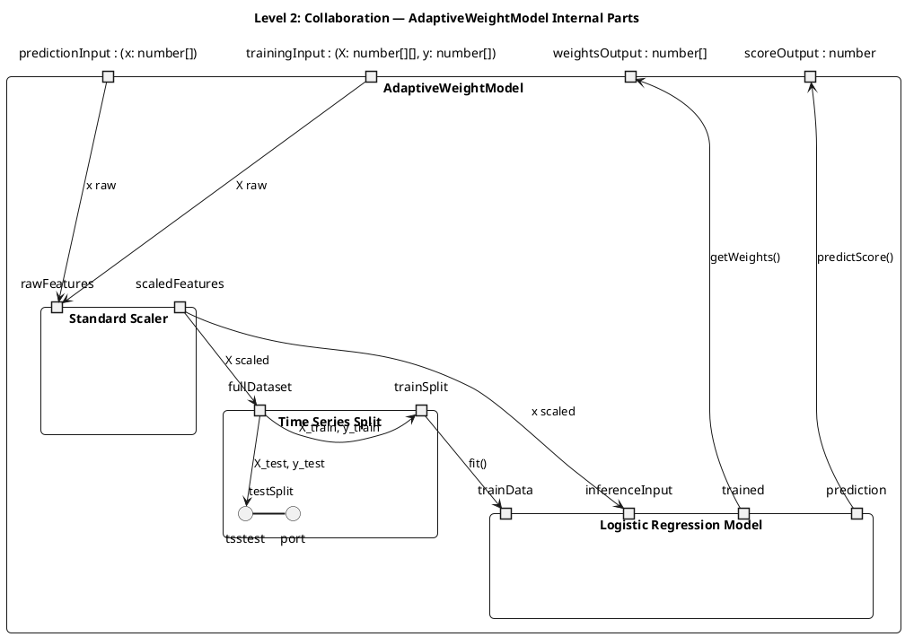

---

### Level 3 — Connectors and Roles During Regime Detection

> **توضیح فارسی:** در لحظه تشخیص رژیم، دیاگرام کانکتورها و نقش‌ها را بین بخش‌های داخلی نشان می‌دهد. RegimeEngine نقش هماهنگ‌کننده را دارد. FuzzyDetector نقش classifier اولیه را دارد و خروجی fuzzy را به MarkovChain می‌فرستد. MarkovChain نقش stateTracker را دارد و احتمال انتقال حالت را محاسبه می‌کند. VotingSystem نقش aggregator را دارد و رأی‌های وزن‌دار اندیکاتورها را تجمیع می‌کند. AdaptiveWeightModel نقش weightOptimizer را دارد و وزن‌ها را بر اساس بازخورد به‌روزرسانی می‌کند. کانکتورها جریان داده در لحظه تشخیص را نشان می‌دهند.

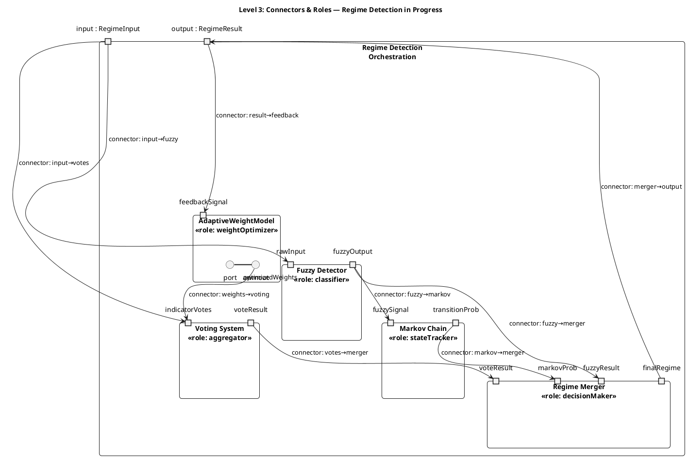

---

## 7. Profile Diagram

> **توضیح فارسی:** دیاگرام پروفایل UML 2.5 استریوتایپ‌ها، تگ‌ها و محدودیت‌های OCL را تعریف می‌کند. از آنجا که PlantUML پشتیبانی محدودی از پروفایل دارد، این بخش به صورت جدول‌های ساختاریافته ارائه شده است. هر استریوتایپ نشان‌دهنده یک الگوی معماری در سیستم است و تگ‌ها ویژگی‌های پیکربندی و محدودیت‌های OCL قوانین یکپارچگی را تضمین می‌کنند.

### Level 1 — Main Stereotypes

> **توضیح فارسی:** چهار استریوتایپ اصلی سیستم عبارتند از: «Engine» برای مؤلفه‌های پردازشی اصلی (TA Engine، ML Engine، Regime Engine)، «Analyzer» برای مؤلفه‌های تحلیلی (SR Analyzer، Pattern Detection، Volume Profile)، «Predictor» برای مؤلفه‌های پیش‌بینی (AdaptiveWeightModel، BayesianWeights، LogisticRegressionModel) و «Store» برای مؤلفه‌های ذخیره‌سازی (FeedbackStore، SafeLocalStorage، ThemeStore).

| Stereotype | Base Metaclass | Description | Applied to |
|---|---|---|---|
| `<<Engine>>` | Component | Processing engine with deterministic output for given input | TA Engine, ML Engine, Regime Engine, Narrative Engine |
| `<<Analyzer>>` | Component | Analytical component that extracts structured information from data | SR Analyzer, Pattern Detection, Volume Profile, Decision Graph |
| `<<Predictor>>` | Component | Probabilistic prediction component with train/predict lifecycle | AdaptiveWeightModel, BayesianWeights, LogisticRegressionModel |
| `<<Store>>` | Component | State persistence component with CRUD operations | FeedbackStore, SafeLocalStorage, ThemeStore |

---

### Level 2 — Extended Stereotypes with Tags

> **توضیح فارسی:** استریوتایپ‌های اصلی با تگ‌های `{cached}` (کش با TTL)، `{rateLimited}` (محدودیت نرخ درخواست) و `{adaptive}` (یادگیری تطبیقی با بازخورد) بسط داده شده‌اند. هر تگ ویژگی‌های اضافی روی مؤلفه تعریف می‌کند. مثلاً تگ cached شامل ttl و maxSize است. تگ rateLimited شامل maxRequests و windowMs است. تگ adaptive شامل learningRate و minSamples است. این تگ‌ها در پیکربندی زمان اجرا استفاده می‌شوند.

| Extended Stereotype | Tags | Tag Types | Default Values | Description |
|---|---|---|---|---|
| `<<Engine>>` + `{cached}` | `ttl` | number (seconds) | 300 | Engine results are cached with time-to-live |
| | `maxSize` | number | 1000 | Maximum cache entries |
| | `strategy` | "LRU" \| "TTL" | "LRU" | Cache eviction strategy |
| `<<Engine>>` + `{rateLimited}` | `maxRequests` | number | 100 | Maximum requests per window |
| | `windowMs` | number | 60000 | Rate limit window in milliseconds |
| `<<Analyzer>>` + `{cached}` | `ttl` | number (seconds) | 120 | Analyzer results are cached |
| | `maxSize` | number | 500 | Maximum cache entries |
| `<<Predictor>>` + `{adaptive}` | `learningRate` | number | 0.01 | Learning rate for weight updates |
| | `minSamples` | number | 30 | Minimum samples before adaptation kicks in |
| | `maxIterations` | number | 1000 | Maximum training iterations |
| | `convergenceThreshold` | number | 1e-6 | Convergence threshold for training |
| `<<Store>>` + `{cached}` | `ttl` | number (seconds) | 0 | Store cache TTL (0 = no cache) |
| | `persistent` | boolean | true | Whether store survives page reload |
| `<<Store>>` + `{rateLimited}` | `maxRequests` | number | 1000 | Maximum read/write operations per window |
| | `windowMs` | number | 60000 | Rate limit window in milliseconds |

---

### Level 3 — Application of Stereotypes to Specific Elements with OCL Constraints

> **توضیح فارسی:** در سطح سوم، استریوتایپ‌ها روی عناصر خاص اعمال شده و محدودیت‌های OCL یکپارچگی را تضمین می‌کنند. مثلاً TA Engine دارای محدودیت «نتایج کش نباید منقضی TTL شوند» است. AdaptiveWeightModel دارای محدودیت «نرخ یادگیری باید مثبت و کوچک‌تر از ۱ باشد» و «تعداد نمونه‌ها باید حداقل minSamples باشد» است. FeedbackStore دارای محدودیت «وزن‌ها باید نرمال‌شده باشند» است. RegimeEngine دارای محدودیت «مجموع احتمال‌های انتقال مارکوف باید ۱ باشد» است.

| Element | Stereotype + Tags | Tag Values | OCL Constraint | Constraint Description |
|---|---|---|---|---|
| `TA Engine` | `<<Engine>>` + `{cached}` + `{rateLimited}` | `ttl=300, maxSize=1000, strategy="LRU", maxRequests=100, windowMs=60000` | `context TAEngine inv: self.cache.entries->forAll(e | e.age <= self.ttl)` | Cache entries must not exceed TTL |
| `Regime Engine` | `<<Engine>>` + `{cached}` + `{rateLimited}` | `ttl=120, maxSize=500, maxRequests=50, windowMs=60000` | `context RegimeEngine inv: self.markov.transitionMatrix->forAll(row | row->sum() = 1.0)` | Markov transition probabilities must sum to 1.0 per row |
| `ML Engine` | `<<Engine>>` + `{rateLimited}` | `maxRequests=30, windowMs=60000` | `context MLEngine inv: self.model.isTrained implies self.model.weights->size() > 0` | Trained model must have non-empty weights |
| `SR Analyzer` | `<<Analyzer>>` + `{cached}` | `ttl=180, maxSize=800` | `context SRAnalyzer inv: self.result.supports->forAll(s | s.strength >= 0 and s.strength <= 1)` | Support strength must be in [0, 1] |
| `Pattern Detection` | `<<Analyzer>>` + `{cached}` | `ttl=60, maxSize=200` | `context PatternDetection inv: self.result.all->forAll(p | p.significance >= 0 and p.significance <= 1)` | Pattern significance must be in [0, 1] |
| `Volume Profile` | `<<Analyzer>>` + `{cached}` | `ttl=240, maxSize=300` | `context VolumeProfile inv: self.result.bins->size() > 0 and self.result.poc > 0` | Must have bins and valid POC |
| `AdaptiveWeightModel` | `<<Predictor>>` + `{adaptive}` | `learningRate=0.01, minSamples=30, maxIterations=1000, convergenceThreshold=1e-6` | `context AdaptiveWeightModel inv: self.learningRate > 0 and self.learningRate < 1 and self.feedbackStore.predictions->size() >= self.minSamples` | Learning rate in (0,1) and sufficient samples |
| `BayesianWeights` | `<<Predictor>>` + `{adaptive}` | `learningRate=0.05, minSamples=20, maxIterations=500, convergenceThreshold=1e-4` | `context BayesianWeights inv: self.result.normalizedPosterior->sum() = 1.0` | Posterior probabilities must be normalized |
| `LogisticRegressionModel` | `<<Predictor>>` + `{adaptive}` | `learningRate=0.001, minSamples=50, maxIterations=2000, convergenceThreshold=1e-8` | `context LogisticRegression inv: self.predict(X)->forAll(p | p >= 0 and p <= 1)` | Predictions must be probabilities in [0, 1] |
| `FeedbackStore` | `<<Store>>` + `{cached}` + `{rateLimited}` | `persistent=true, ttl=0, maxRequests=1000, windowMs=60000` | `context FeedbackStore inv: self.weights->forAll(w | w.weight >= 0) and self.weights->collect(w | w.weight)->sum() = 1.0` | Weights must be non-negative and sum to 1.0 |
| `SafeLocalStorage` | `<<Store>>` + `{rateLimited}` | `persistent=true, maxRequests=500, windowMs=60000` | `context SafeLocalStorage inv: self.isAvailable() implies self.getItem('theme') <> null` | If available, must have theme stored |
| `ThemeStore` | `<<Store>>` | `persistent=true` | `context ThemeStore inv: self.preset <> null and self.colors <> null` | Must always have a valid preset and colors |

---

## Cross-Diagram Coherence Summary

> **توضیح فارسی:** جدول زیر همخوانی بین دیاگرام‌های ساختاری و دیاگرام‌های رفتاری (BPMN) و دیاگرام‌های جریان داده (DFD) را تضمین می‌کند. نام کلاس‌ها در Class Diagram دقیقاً با موجودیت‌های DFD مطابقت دارد. متدها در Class Diagram دقیقاً با فعالیت‌های BPMN مطابقت دارند. مؤلفه‌ها در Component Diagram با فرآیندهای DFD مطابقت دارند. گره‌های Deployment با گره‌های فیزیکی DFD مطابقت دارند.

| Structural Diagram | Maps to DFD | Maps to BPMN | Key Traceability |
|---|---|---|---|
| Class Diagram | Data stores & flows | Activities & gateways | OHLCV → DFD:D1, analyze() → BPMN:A1 |
| Object Diagram | Snapshot of data flows | Snapshot of activity states | fooladResult → DFD:F3 (TAResult flow) |
| Component Diagram | Processes (P1-P5) | Pools & lanes | TA Engine → DFD:P1, ML Engine → DFD:P2 |
| Deployment Diagram | External entities | Participant nodes | Browser → DFD:EE1, Z-AI → DFD:EE2 |
| Package Diagram | Data store grouping | Activity grouping | lib/ta → DFD:D1+P1, lib/ml → DFD:D2+P2 |
| Composite Structure | Internal process flows | Sub-process structure | FuzzyDetector → BPMN:A3.1 |
| Profile Diagram | Constraints on flows | Business rules | OCL constraints → BPMN:Rule nodes |

---

*End of UML 2.5 Structural Diagrams Section*
