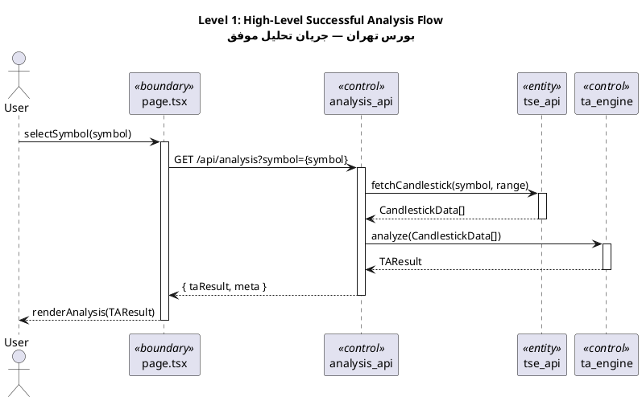
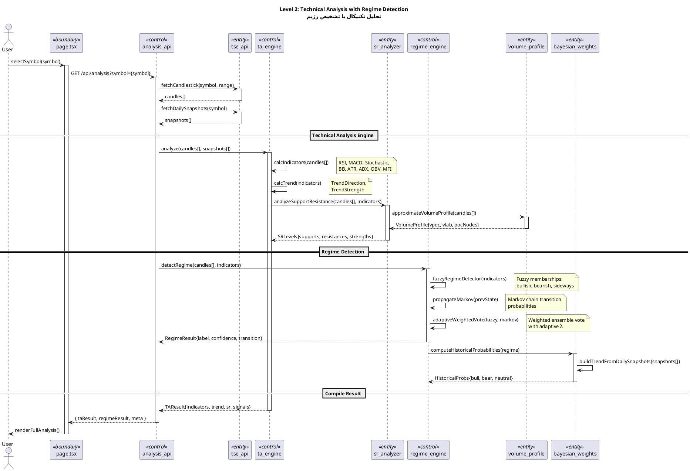
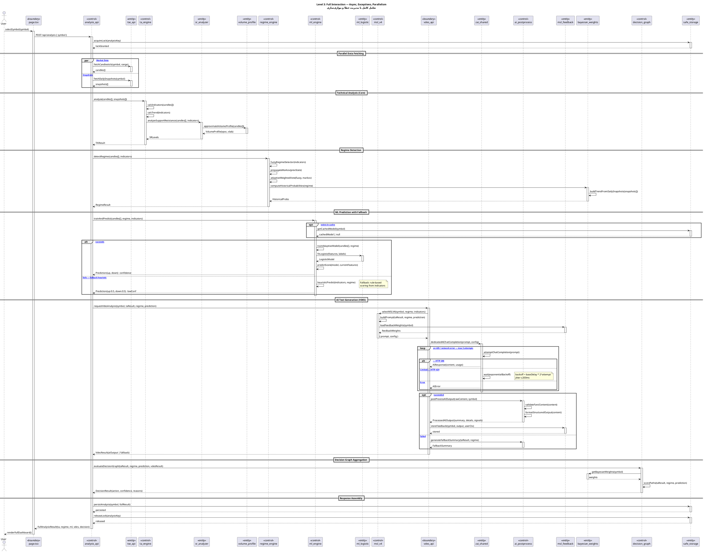
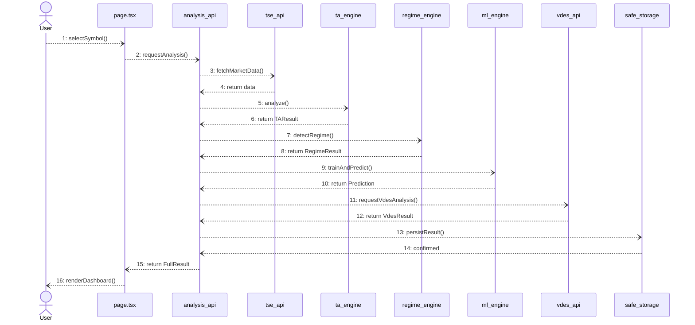

# UML 2.5 Interaction Diagrams — Iranian Stock Market Technical Analysis System

> **Section Reference:** UML 2.5 Superstructure §17 — Interaction Diagrams  
> **System:** بورس تهران — سامانه تحلیل تکنیکال (Tehran Stock Exchange — Technical Analysis System)  
> **Diagram Types:** Sequence (§17.2), Communication (§17.3), Interaction Overview (§17.4), Timing (§17.5)  
> **Levels:** L1 — High-level overview · L2 — Detailed subsystem interaction · L3 — Full specification with exception handling, parallelism, and timing constraints

---

## Participants & Key Objects

| Stereotype | Object | Responsibility |
|---|---|---|
| `«actor»` | **User** | End-user selecting symbols, viewing analysis |
| `«boundary»` | **page.tsx** | Next.js client page — UI rendering & event handling |
| `«control»` | **analysis_api** | API route orchestrating full analysis pipeline |
| `«control»` | **ta_engine** | Technical analysis engine — indicators, trend, S/R |
| `«control»` | **regime_engine** | Market regime detection (fuzzy + Markov + vote) |
| `«entity»` | **sr_analyzer** | Support/Resistance level analyzer |
| `«entity»` | **volume_profile** | Volume profile approximation & VPOC/VLAB calculation |
| `«control»` | **ml_engine** | Adaptive ML model training & prediction |
| `«entity»` | **ml_logistic** | Logistic regression sub-model |
| `«control»` | **msl_v4** | MSL v4 prompt builder & AI orchestrator |
| `«boundary»` | **vdes_api** | VDES AI analysis API endpoint |
| `«entity»` | **zai_shared** | ZAI shared utilities — AI chat completion with retry |
| `«control»` | **ai_postprocess** | AI output post-processor (Farsi, formatting, validation) |
| `«entity»` | **msl_feedback** | MSL feedback store & weight adjustment |
| `«entity»` | **bayesian_weights** | Bayesian weight computation & prior updates |
| `«control»` | **decision_graph** | Decision graph traversal & path scoring |
| `«entity»` | **tse_api** | TSE data fetcher (candlestick, daily snapshots) |
| `«entity»` | **safe_storage** | Safe async storage with versioned persistence |

---

## 11. Sequence Diagram (UML §17.2)

> **نمودار دنباله‌ای (Sequence Diagram)** یکی از مهم‌ترین نمودارهای رفتاری UML است که ترتیب زمانی تبادل پیام‌ها بین اشیاء را نشان می‌دهد. در سامانه تحلیل تکنیکال بورس تهران، این نمودار چگونگی تعامل کاربر، رابط کاربری، موتور تحلیل، و سرویس‌های هوش مصنوعی را در جریان تحلیل یک نماد بورسی مشخص می‌کند.

---

### 11.1 Level 1 — High-Level Successful Analysis Flow

> **سطح اول:** جریان اصلی موفق تحلیل از انتخاب نماد توسط کاربر تا نمایش نتایج در صفحه. این نمودار نگاهی سطح‌بالا به تعاملات اصلی سیستم ارائه می‌دهد و مسیر پردازش داده از TSE API تا پاسخ نهایی را نشان می‌دهد.



| Step | Message | From → To | Semantics |
|---|---|---|---|
| 1 | `selectSymbol(symbol)` | User → page.tsx | User initiates analysis |
| 2 | `GET /api/analysis?symbol=` | page.tsx → analysis_api | HTTP request to API route |
| 3 | `fetchCandlestick(symbol, range)` | analysis_api → tse_api | Fetch market data from TSE |
| 4 | return `CandlestickData[]` | tse_api → analysis_api | OHLCV data returned |
| 5 | `analyze(CandlestickData[])` | analysis_api → ta_engine | Run technical analysis |
| 6 | return `TAResult` | ta_engine → analysis_api | Indicators, trend, S/R results |
| 7 | return `{ taResult, meta }` | analysis_api → page.tsx | JSON response to client |
| 8 | `renderAnalysis(TAResult)` | page.tsx → User | UI renders analysis |

---

### 11.2 Level 2 — Detailed Technical Analysis with Regime Detection

> **سطح دوم:** جزئیات تعاملات داخلی موتور تحلیل تکنیکال شامل محاسبه اندیکاتورها، تشخیص رژیم بازار، و تحلیل سطوح حمایت/مقاومت. در این سطح، فراخوانی‌های داخلی ta_engine و regime_engine با ترتیب دقیق نشان داده می‌شوند و نحوه ترکیب نتایج توسط تصمیم‌گیرنده بیزی مشخص می‌گردد.



| Phase | Internal Calls | Output |
|---|---|---|
| **Indicator Calculation** | `calcIndicators()` → RSI, MACD, Stoch, BB, ATR, ADX, OBV, MFI | `IndicatorMap` |
| **Trend Calculation** | `calcTrend(indicators)` | `TrendDirection + TrendStrength` |
| **S/R Analysis** | `analyzeSupportResistance()` → `approximateVolumeProfile()` | `SRLevels + VolumeProfile` |
| **Regime Detection** | `fuzzyRegimeDetector()` + `propagateMarkov()` + `adaptiveWeightedVote()` | `RegimeResult{label, confidence}` |
| **Historical Probabilities** | `computeHistoricalProbabilities()` → `buildTrendFromDailySnapshots()` | `HistoricalProbs` |

---

### 11.3 Level 3 — Full Interaction with Async, Exceptions, and Parallelization

> **سطح سوم:** کامل‌ترین نمودار دنباله‌ای شامل بلوک‌های همزمان (par)، جایگزین (alt)، اختیاری (opt)، و مدیریت استثناها. این سطح شامل تولید متن هوش مصنوعی با منطق تلاش مجدد (retry)، پیش‌بینی یادگیری ماشین با بازگشت به روش اکتشافی در صورت شکست، و همه تعاملات سیستم برای یک تحلیل کامل است.



**Key Interaction Patterns:**

| Pattern | UML Construct | Application |
|---|---|---|
| Concurrent data fetching | `par` / `else` | Candlestick + Snapshots fetched simultaneously |
| ML model fallback | `alt` / `else` | `trainAdaptiveModel()` → success, or `heuristicPredict()` → fallback |
| AI rate-limit retry | `loop` + `alt` / `else` | 429 → exponential backoff with jitter |
| Optional caching | `opt` | Cached model lookup before training |
| AI success/failure | `opt` + `alt` | Post-process on success, fallback summary on failure |
| Lock management | `acquireLock` / `releaseLock` | Prevents concurrent analysis for same symbol |

---

## 12. Communication Diagram (Collaboration Diagram) (UML §17.3)

> **نمودار ارتباطی (Communication Diagram)** مشابه نمودار دنباله‌ای است اما بر ارتباطات ساختاری بین اشیاء تأکید دارد تا بر ترتیب زمانی. در این سامانه، نمودار ارتباطی نشان می‌دهد که هر شیء با کدام اشیاء دیگر ارتباط دارد و پیام‌ها با شماره‌گذاری مشخص ترتیب اجرا را نشان می‌دهند.

---

### 12.1 Level 1 — Main Architectural Links

> **سطح اول:** ارتباطات اصلی بین اشیاء کلیدی معماری سیستم. این نمودار ساختار اتصال بین لایه‌های مختلف (رابط کاربری، کنترلر، سرویس، و داده) را نشان می‌دهد.



**Link Topology:**

```
User ────────── page.tsx ────────── analysis_api ─┬── tse_api
                                                  ├── ta_engine
                                                  ├── regime_engine
                                                  ├── ml_engine
                                                  ├── vdes_api
                                                  └── safe_storage

ta_engine ──── sr_analyzer ──── volume_profile
regime_engine ──── bayesian_weights
ml_engine ──── ml_logistic
vdes_api ──── msl_v4 ──── zai_shared ──── ai_postprocess
msl_v4 ──── msl_feedback
analysis_api ──── decision_graph ──── bayesian_weights
```

---

### 12.2 Level 2 — Message Ordering During Regime Detection

> **سطح دوم:** ترتیب پیام‌ها بین زیرسیستم‌های تشخیص رژیم بازار. این نمودار نحوه ترکیب نتایج فازی، مارکوف، و رأی‌گیری وزنی تطبیقی را با شماره‌گذاری دقیق پیام‌ها نشان می‌دهد.

```mermaid
sequenceDiagram
    participant api as analysis_api
    participant regime as regime_engine
    participant ta as ta_engine
    participant bw as bayesian_weights
    participant sr as sr_analyzer
    participant vp as volume_profile

    Note over api,regime: Regime Detection Sub-Interaction

    api-))regime: 1: detectRegime(candles, indicators)
    regime-))regime: 1.1: fuzzyRegimeDetector(indicators)
    Note right of regime: 1.1a: compute memberships<br/>μ(bullish), μ(bearish), μ(sideways)

    regime-))regime: 1.2: propagateMarkov(prevState)
    Note right of regime: 1.2a: transition matrix T<br/>1.2b: P(state_t | state_{t-1})

    regime-))regime: 1.3: adaptiveWeightedVote(fuzzy, markov)
    Note right of regime: 1.3a: λ_fuzzy * fuzzy + λ_markov * markov<br/>1.3b: argmax → regime label

    regime-))bw: 1.4: computeHistoricalProbabilities(regime)
    bw-))bw: 1.4.1: buildTrendFromDailySnapshots(snapshots)
    bw-))bw: 1.4.2: applyBayesianPriors(probs)
    bw-))regime: 1.4.3: return HistoricalProbs

    regime-))api: 2: RegimeResult{label, confidence, transition, histProbs}
```

**Numbered Message Summary:**

| # | Message | Link |
|---|---|---|
| 1 | `detectRegime()` | api → regime_engine |
| 1.1 | `fuzzyRegimeDetector()` | regime_engine → self |
| 1.2 | `propagateMarkov()` | regime_engine → self |
| 1.3 | `adaptiveWeightedVote()` | regime_engine → self |
| 1.4 | `computeHistoricalProbabilities()` | regime_engine → bayesian_weights |
| 1.4.1 | `buildTrendFromDailySnapshots()` | bayesian_weights → self |
| 1.4.2 | `applyBayesianPriors()` | bayesian_weights → self |
| 2 | `RegimeResult` | regime_engine → api |

---

### 12.3 Level 3 — Volume Profile Calculation with Precise Links

> **سطح سوم:** پیام‌های شماره‌گذاری شده با لینک‌های دقیق برای محاسبه پروفایل حجم. این نمودار جزئیات فراخوانی‌های داخلی approximateVolumeProfile و نحوه محاسبه VPOC، VLAB و گره‌های POC را با شماره‌گذاری تودرتو نشان می‌دهد.

```mermaid
sequenceDiagram
    participant ta as ta_engine
    participant sr as sr_analyzer
    participant vp as volume_profile
    participant store as safe_storage

    Note over ta,store: Volume Profile Sub-Interaction

    ta-))sr: 1: analyzeSupportResistance(candles, indicators)

    sr-))vp: 1.1: approximateVolumeProfile(candles)
    Note right of vp: Input: OHLCV candle array<br/>Process: TPO + Volume approximation

    vp-))vp: 1.1.1: slicePriceRanges(candles, numBins=50)
    Note right of vp: Partition price space into<br/>50 equal-width bins

    vp-))vp: 1.1.2: accumulateVolumePerBin(candles, bins)
    Note right of vp: Sum volume per bin<br/>using linear interpolation<br/>within candle range

    vp-))vp: 1.1.3: calculateTPOs(candles, bins)
    Note right of vp: Time-Price Opportunity count<br/>per bin (market profile)

    vp-))vp: 1.1.4: findPOC(bins)
    Note right of vp: POC = bin with max(volume)<br/>→ Point of Control

    vp-))vp: 1.1.5: computeValueArea(pocBin, bins, pct=70)
    Note right of vp: Expand from POC until<br/>70% volume captured<br/>→ VA_High, VA_Low

    vp-))vp: 1.1.6: identifyVPOCandVLAB(bins)
    Note right of vp: VPOC = Volume POC<br/>VLAB = Value Area Low/High Bands

    vp-))vp: 1.1.7: buildVolumeProfileResult(bins, poc, va, vpoc, vlab)
    Note right of vp: Assemble final result object

    vp-))sr: 1.2: VolumeProfile{bins, poc, vpoc, vlab, vaHigh, vaLow}

    sr-))sr: 1.3: mergeSRWithVolumeProfile(srLevels, volumeProfile)
    Note right of sr: Weight S/R levels by<br/>volume confirmation

    sr-))sr: 1.4: rankSupportResistanceLevels(mergedLevels)
    Note right of sr: Sort by strength score<br/>(touch count × volume weight)

    sr-))ta: 2: SRLevels{supports, resistances, strengths, volumeProfile}

    ta-))store: 3: cacheVolumeProfile(symbol, volumeProfile)
    store-))ta: 4: cached
```

**Detailed Link Specification:**

| Link | From | To | Messages |
|---|---|---|---|
| L1 | ta_engine | sr_analyzer | 1, 2(return) |
| L2 | sr_analyzer | volume_profile | 1.1, 1.2(return) |
| L3 | volume_profile | self | 1.1.1–1.1.7 (internal) |
| L4 | sr_analyzer | self | 1.3, 1.4 (internal) |
| L5 | ta_engine | safe_storage | 3, 4(return) |

---

## 13. Interaction Overview Diagram (UML §17.4)

> **نمودار کلی تعامل (Interaction Overview Diagram)** ترکیبی از نمودار فعالیت و نمودار دنباله‌ای است که جریان کلی تعاملات را با نقاط تصمیم و ارجاع به نمودارهای دنباله‌ای فرعی نشان می‌دهد. در این سامانه، این نمودار جریان تحلیل کامل را با شاخه‌های مختلف (موفق/ناموفق، کش/بدون کش) نشان می‌دهد.

---

### 13.1 Level 1 — High-Level Flow with Sequence References

> **سطح اول:** جریان سطح‌بالا با ارجاع به نمودارهای دنباله‌ای فرعی. هر گره یک تعامل فرعی (sd) را نشان می‌دهد و جریان بین آن‌ها با فلش‌های جریان مشخص شده است.

```
┌─────────────────────────────────────────────────────────────────────┐
│              Interaction Overview — Level 1                         │
│              نمودار کلی تعامل — سطح اول                            │
├─────────────────────────────────────────────────────────────────────┤
│                                                                     │
│   ● Start                                                           │
│   │                                                                 │
│   ▼                                                                 │
│  ┌──────────────────────┐                                           │
│  │  sd FetchData        │  ← Ref: Seq L1 steps 1-4                  │
│  │  User→page→api→tse   │                                           │
│  └──────────┬───────────┘                                           │
│             │                                                       │
│             ▼                                                       │
│  ┌──────────────────────┐                                           │
│  │  sd AnalyzeTechnical  │  ← Ref: Seq L2 "Technical Analysis"      │
│  │  ta_engine.analyze()  │                                           │
│  └──────────┬───────────┘                                           │
│             │                                                       │
│             ▼                                                       │
│  ┌──────────────────────┐                                           │
│  │  sd DetectRegime     │  ← Ref: Seq L2 "Regime Detection"         │
│  │  regime_engine       │                                           │
│  └──────────┬───────────┘                                           │
│             │                                                       │
│             ▼                                                       │
│  ┌──────────────────────┐                                           │
│  │  sd PredictML        │  ← Ref: Seq L3 "ML Prediction"            │
│  │  ml_engine           │                                           │
│  └──────────┬───────────┘                                           │
│             │                                                       │
│             ▼                                                       │
│  ┌──────────────────────┐                                           │
│  │  sd GenerateAI       │  ← Ref: Seq L3 "AI Text Generation"       │
│  │  vdes_api → zai      │                                           │
│  └──────────┬───────────┘                                           │
│             │                                                       │
│             ▼                                                       │
│  ┌──────────────────────┐                                           │
│  │  sd AggregateResult  │  ← Ref: Seq L3 "Decision Graph"           │
│  │  decision_graph      │                                           │
│  └──────────┬───────────┘                                           │
│             │                                                       │
│             ▼                                                       │
│   ◉ End                                                             │
│                                                                     │
└─────────────────────────────────────────────────────────────────────┘
```

**Sequence Reference Mapping:**

| Ref ID | Sequence Fragment | Level | Steps |
|---|---|---|---|
| sd FetchData | Data acquisition from TSE | L1 | Steps 1–4 |
| sd AnalyzeTechnical | Indicator + Trend + S/R calculation | L2 | ta_engine internal |
| sd DetectRegime | Fuzzy + Markov + Weighted Vote | L2 | regime_engine internal |
| sd PredictML | ML training + prediction + fallback | L3 | alt block |
| sd GenerateAI | VDES + MSL v4 + AI completion | L3 | loop + opt block |
| sd AggregateResult | Decision graph + Bayesian weights | L3 | Final aggregation |

---

### 13.2 Level 2 — Decision Points Referencing Sequence Diagrams

> **سطح دوم:** نقاط تصمیم‌گیری در جریان تعامل که بر اساس شرایط مختلف، نمودارهای دنباله‌ای متفاوتی فراخوانی می‌شوند. شاخه‌های اصلی شامل وضعیت کش مدل ML، موفقیت/شکست فراخوانی AI، و نوع رژیم بازار هستند.

```
┌─────────────────────────────────────────────────────────────────────────┐
│              Interaction Overview — Level 2                             │
│              نمودار کلی تعامل — سطح دوم                                │
├─────────────────────────────────────────────────────────────────────────┤
│                                                                         │
│   ● Start                                                               │
│   │                                                                     │
│   ▼                                                                     │
│  ┌──────────────────────┐                                               │
│  │  sd FetchData        │                                               │
│  └──────────┬───────────┘                                               │
│             │                                                           │
│             ▼                                                           │
│         ◇ Data Valid?                                                   │
│        ╱          ╲                                                     │
│      Yes           No                                                   │
│      │              │                                                   │
│      ▼              ▼                                                   │
│  ┌──────────┐  ┌───────────────────┐                                    │
│  │ sd       │  │ sd HandleDataError │                                    │
│  │ Analyze  │  │ → retry or abort   │                                    │
│  │ Technical│  └─────────┬─────────┘                                    │
│  └───┬──────┘            │                                              │
│      │                   ▼                                              │
│      ▼                 ◉ End (error)                                    │
│  ┌──────────────┐                                                       │
│  │ sd Detect    │                                                       │
│  │ Regime       │                                                       │
│  └──────┬───────┘                                                       │
│         │                                                               │
│         ▼                                                               │
│     ◇ Cached ML Model?                                                  │
│    ╱              ╲                                                      │
│  Yes               No                                                   │
│  │                 │                                                    │
│  ▼                 ▼                                                    │
│ ┌─────────────┐ ┌──────────────┐                                        │
│ │ sd Predict  │ │ sd TrainNew  │                                        │
│ │ WithCache   │ │ MLModel      │                                        │
│ └──────┬──────┘ └──────┬───────┘                                        │
│        │               │                                                │
│        ╲              ╱                                                  │
│         ▼                                                             │
│     ◇ Training Success?                                                │
│    ╱              ╲                                                      │
│  Yes               No                                                   │
│  │                 │                                                    │
│  ▼                 ▼                                                    │
│ ┌─────────────┐ ┌───────────────────┐                                   │
│ │ sd Predict  │ │ sd Fallback       │                                   │
│ │ Normal      │ │ HeuristicPredict  │                                   │
│ └──────┬──────┘ └─────────┬─────────┘                                   │
│        │                   │                                             │
│        ╲                  ╱                                              │
│         ▼                                                               │
│  ┌──────────────┐                                                       │
│  │ sd GenerateAI│                                                       │
│  └──────┬───────┘                                                       │
│         │                                                               │
│         ▼                                                               │
│     ◇ AI Success?                                                       │
│    ╱          ╲                                                          │
│  Yes           No                                                        │
│  │             │                                                        │
│  ▼             ▼                                                        │
│ ┌───────────┐ ┌────────────────────┐                                    │
│ │ sd Post   │ │ sd FallbackSummary │                                    │
│ │ ProcessAI │ │ → generateBasic    │                                    │
│ └─────┬─────┘ └─────────┬──────────┘                                    │
│       │                  │                                               │
│       ╲                ╱                                                 │
│        ▼                                                               │
│  ┌──────────────────────┐                                               │
│  │  sd AggregateResult  │                                               │
│  └──────────┬───────────┘                                               │
│             │                                                           │
│             ▼                                                           │
│   ◉ End                                                                 │
│                                                                         │
└─────────────────────────────────────────────────────────────────────────┘
```

**Decision Point Table:**

| Decision Point | Condition | True Branch | False Branch |
|---|---|---|---|
| ◇ Data Valid? | `candles.length > 0 && !error` | → sd AnalyzeTechnical | → sd HandleDataError |
| ◇ Cached ML Model? | `store.getCachedModel(symbol) !== null` | → sd PredictWithCache | → sd TrainNewMLModel |
| ◇ Training Success? | `model !== null && loss < threshold` | → sd PredictNormal | → sd FallbackHeuristicPredict |
| ◇ AI Success? | `aiResponse.status === 200` | → sd PostProcessAI | → sd FallbackSummary |

---

### 13.3 Level 3 — Loop, Parallel, and Conditional Constructs

> **سطح سوم:** ساختارهای حلقه، موازی‌سازی و شرطی با ارجاع به نمودارهای دنباله‌ای سطح سوم. این سطح شامل حلقه تلاش مجدد AI، بلوک موازی برای دریافت داده‌ها، و همه شاخه‌های شرطی با محدودیت‌های زمانی است.

```
┌──────────────────────────────────────────────────────────────────────────────┐
│              Interaction Overview — Level 3                                  │
│              نمودار کلی تعامل — سطح سوم                                     │
├──────────────────────────────────────────────────────────────────────────────┤
│                                                                              │
│   ● Start                                                                    │
│   │                                                                          │
│   ▼                                                                          │
│  ╔══════════════════════════════════════╗                                    │
│  ║  par — Parallel Data Fetching         ║                                    │
│  ║  ┌─────────────────────────┐         ║                                    │
│  ║  │ sd FetchCandlestick     │         ║  ← Seq L3: par block (left)       │
│  ║  │ tse_api.fetchCandlestick│         ║                                    │
│  ║  └─────────────────────────┘         ║                                    │
│  ║  ‖                                  ║                                    │
│  ║  ┌─────────────────────────┐         ║                                    │
│  ║  │ sd FetchSnapshots       │         ║  ← Seq L3: par block (right)      │
│  ║  │ tse_api.fetchDaily      │         ║                                    │
│  ║  └─────────────────────────┘         ║                                    │
│  ╚══════════════════════════╤═══════════╝                                    │
│                              │                                               │
│                              ▼                                               │
│  ┌───────────────────────────────────────┐                                   │
│  │  sd AnalyzeTechnical (L2)             │                                   │
│  │  {duration ≤ 500ms}                   │                                   │
│  └───────────────────┬───────────────────┘                                   │
│                      │                                                       │
│                      ▼                                                       │
│  ┌───────────────────────────────────────┐                                   │
│  │  sd DetectRegime (L2)                 │                                   │
│  │  {duration ≤ 50ms}                    │                                   │
│  └───────────────────┬───────────────────┘                                   │
│                      │                                                       │
│                      ▼                                                       │
│                  ◇ Cached?                                                   │
│                 ╱       ╲                                                    │
│              Yes         No                                                  │
│               │          │                                                  │
│               ▼          ▼                                                  │
│  ┌──────────────┐  ╔══════════════════════════╗                              │
│  │ sd UseCache  │  ║ loop [max 3 retries]      ║                              │
│  └──────┬───────┘  ║ → sd TrainAdaptiveModel   ║  ← Seq L3: loop block      │
│         │          ║ → if fails: retry/backoff ║                              │
│         │          ╚══════════════╤═══════════╝                              │
│         │                       │                                             │
│         │                       ▼                                             │
│         │                 ◇ Training OK?                                     │
│         │                ╱          ╲                                        │
│         │             Yes           No                                       │
│         │              │            │                                        │
│         │              ▼            ▼                                        │
│         │     ┌────────────┐ ┌───────────────────┐                         │
│         │     │sd Predict  │ │sd FallbackHeuristic│                         │
│         │     │Normal      │ │{up:0.5, down:0.5} │                         │
│         │     └─────┬──────┘ └────────┬──────────┘                         │
│         │           │                 │                                      │
│         ╲          ╱                 │                                      │
│          ▼         ▼                 │                                      │
│         ╲          ╱                  │                                      │
│          ▼                            │                                      │
│  ╔════════════════════════════════════════════╗                            │
│  ║  loop [Retry AI — max 3 attempts]          ║                            │
│  ║  ┌────────────────────────────────────┐    ║  ← Seq L3: AI retry loop  │
│  ║  │ sd CallAICompletion                │    ║                            │
│  ║  │ zai_shared.dedicatedAIChatCompletion│   ║                            │
│  ║  │ {duration: 5-30s per attempt}      │    ║                            │
│  ║  └────────────────────────────────────┘    ║                            │
│  ╚══════════════════════════╤═════════════════╝                            │
│                              │                                               │
│                              ▼                                               │
│                  ◇ AI Response?                                              │
│                 ╱          ╲                                                 │
│            200 OK        429/Error                                           │
│               │              │                                              │
│               ▼              ▼                                              │
│  ┌──────────────────┐ ┌─────────────────────┐                               │
│  │ sd PostProcessAI │ │ sd AIErrorHandling  │                               │
│  │ ai_postprocess   │ │ → backoff & retry   │                               │
│  │ {≤500ms}         │ │ → or fallback       │                               │
│  └────────┬─────────┘ └─────────┬───────────┘                               │
│           │                     │                                            │
│           ╲                   ╱                                              │
│            ▼                                                               │
│  ┌───────────────────────────────────────┐                                  │
│  │  sd AggregateDecision (L3)            │                                  │
│  │  decision_graph + bayesian_weights    │                                  │
│  └───────────────────┬───────────────────┘                                  │
│                      │                                                      │
│                      ▼                                                      │
│  ┌───────────────────────────────────────┐                                  │
│  │  sd PersistAndRespond                 │                                  │
│  │  safe_storage + page render           │                                  │
│  └───────────────────┬───────────────────┘                                  │
│                      │                                                      │
│                      ▼                                                      │
│   ◉ End                                                                    │
│                                                                             │
└──────────────────────────────────────────────────────────────────────────────┘
```

**Construct Mapping to Sequence Level 3:**

| Construct | Type | Sequence L3 Reference | Timing |
|---|---|---|---|
| `par` FetchCandlestick ∥ FetchSnapshots | Parallel | `par` block | ~200ms each |
| `loop` TrainAdaptiveModel [max 3] | Loop | ML training with retry | ≤2s per attempt |
| `loop` AI Completion [max 3] | Loop | 429 retry with backoff | 5-30s per attempt |
| `◇` Cached? | Conditional | `opt` cache lookup | ≤10ms |
| `◇` Training OK? | Conditional | `alt` train/fallback | — |
| `◇` AI Response? | Conditional | `alt` 200/429 handling | — |

---

## 14. Timing Diagram (UML §17.5)

> **نمودار زمان‌بندی (Timing Diagram)** تغییرات وضعیت اشیاء را در طول محور زمان نشان می‌دهد. این نمودار برای تحلیل عملکرد سیستم حیاتی است زیرا محدودیت‌های زمانی بحرانی مثل سرعت تشخیص رژیم و تأخیر فراخوانی هوش مصنوعی را مشخص می‌کند.

---

### 14.1 Level 1 — Analysis Session State Changes (0-30s Timeline)

> **سطح اول:** تغییرات وضعیت نشست تحلیل در بازه زمانی ۰ تا ۳۰ ثانیه. این نمودار وضعیت‌های اصلی نشست (idle، fetching، analyzing، detecting، predicting، generating، aggregating، rendering) را در طول زمان نشان می‌دهد.

| Time (s) | 0 | 2 | 4 | 6 | 8 | 10 | 15 | 20 | 25 | 30 |
|---|---|---|---|---|---|---|---|---|---|---|
| **User** | Selecting | Waiting | Waiting | Waiting | Waiting | Waiting | Waiting | Waiting | Viewing | Idle |
| **page.tsx** | Idle | Loading | Loading | Loading | Loading | Loading | Loading | Loading | Rendering | Idle |
| **analysis_api** | Idle | Fetching | Analyzing | Detecting | Predicting | Generating | Generating | Aggregating | Responding | Idle |
| **ta_engine** | Idle | Idle | **Active** | Idle | Idle | Idle | Idle | Idle | Idle | Idle |
| **regime_engine** | Idle | Idle | Idle | **Active** | Idle | Idle | Idle | Idle | Idle | Idle |
| **ml_engine** | Idle | Idle | Idle | Idle | **Active** | Idle | Idle | Idle | Idle | Idle |
| **vdes_api** | Idle | Idle | Idle | Idle | Idle | **Active** | **Active** | Idle | Idle | Idle |

**State Timeline Visualization:**

```
Time →   0s      2s      4s      6s      8s      10s     15s     20s     25s     30s
         ├───────┼───────┼───────┼───────┼───────┼───────┼───────┼───────┼───────┤

User     │Select │──── Waiting ───────────────────────────────────│View  │Idle
         │       │       │       │       │       │       │       │       │       │

page     │Idle   │── Loading ─────────────────────────────────────│Render │Idle
         │       │       │       │       │       │       │       │       │       │

api      │Idle   │Fetch  │Analyze│Detect │Predict│── Generate ──│Aggreg │Respond
         │       │       │       │       │       │       │       │       │       │

ta       │Idle   │Idle   │▓▓▓▓▓▓│Idle   │Idle   │Idle   │Idle   │Idle   │Idle
         │       │       │≤500ms │       │       │       │       │       │       │

regime   │Idle   │Idle   │Idle   │▓▓▓▓▓▓│Idle   │Idle   │Idle   │Idle   │Idle
         │       │       │       │≤50ms  │       │       │       │       │       │

ml       │Idle   │Idle   │Idle   │Idle   │▓▓▓▓▓▓│Idle   │Idle   │Idle   │Idle
         │       │       │       │       │≤2s    │       │       │       │       │

vdes     │Idle   │Idle   │Idle   │Idle   │Idle   │▓▓▓▓▓▓▓▓▓▓▓▓│Idle   │Idle
         │       │       │       │       │       │── 5-30s ──────│       │       │
```

**Legend:** `▓▓▓` = Active processing, `────` = Waiting/Loading, `│` = State transition

---

### 14.2 Level 2 — ML Model and Regime State Changes on Specific Events

> **سطح دوم:** تغییرات وضعیت مدل یادگیری ماشین و رژیم بازار در پاسخ به رویدادهای مشخص. این نمودار چرخه حیات مدل ML (untrained → training → trained → predicting → stale) و وضعیت رژیم (bullish → bearish → sideways) را نشان می‌دهد.

**ML Model Lifecycle States:**

| State | Description | Entry Event | Exit Event | Duration |
|---|---|---|---|---|
| `Untrained` | No model available | System startup | `trainAdaptiveModel()` called | Until first analysis |
| `Training` | Model being fitted | `trainAdaptiveModel()` start | Training complete/fails | ≤2s (success) / ≤1s (fail) |
| `Trained` | Model ready for prediction | Training success | `predictScore()` called | Until prediction needed |
| `Predicting` | Computing prediction | `predictScore()` start | Returns `Prediction` | ≤100ms |
| `Cached` | Model stored in safe_storage | `cacheModel()` | Symbol changes / TTL expires | TTL = 5 min |
| `Stale` | Model outdated | TTL exceeded / market shift | `trainAdaptiveModel()` called | Until retraining |
| `Fallback` | Using heuristic | Training failure | Next successful training | Until recovery |

**ML Model Timeline:**

```
Event →  Startup   Train     Trained  Predict  Cache   TTL     Stale   Retrain  Trained
        │         │         │        │        │       │       │       │        │
State   │Untained │Training │Trained │Predict │Cached │Cached │Stale  │Training │Trained
        │         │≤2s      │        │≤100ms  │       │5min   │       │≤2s     │
```

**Regime State Transitions:**

```
Event →  Open    Indicators  Fuzzy   Markov  Vote    Final   NewDay   Rebuild
        │       │           │       │       │       │       │        │
State   │Unknown│Computing   │Fuzzy  │Markov │Voting │Bullish│Bearish │Sideways
        │       │           │~5ms   │~10ms  │~15ms  │       │        │
```

| Transition | Trigger | Method | Duration |
|---|---|---|---|
| Unknown → Computing | `detectRegime()` called | — | 0ms (immediate) |
| Computing → Fuzzy | `fuzzyRegimeDetector()` | Indicator membership calc | ~5ms |
| Fuzzy → Markov | `propagateMarkov()` | State transition probabilities | ~10ms |
| Markov → Voting | `adaptiveWeightedVote()` | λ_fuzzy·fuzzy + λ_markov·markov | ~15ms |
| Voting → {Bullish, Bearish, Sideways} | `argmax(voteScores)` | Final regime label | ~2ms |
| Bullish → Bearish | Market regime shift | Daily close + indicators | Next session |
| Bearish → Sideways | Volatility decrease | ATR + ADX threshold | Next session |

---

### 14.3 Level 3 — Duration Constraints and Delay Times for Critical Interactions

> **سطح سوم:** محدودیت‌های زمانی دقیق و تأخیرهای بحرانی برای تمام تعاملات مهم سیستم. این اطلاعات برای تأیید عملکرد (performance validation) و شناسایی گلوگاه‌ها حیاتی است. تأخیر فراخوانی هوش مصنوعی بزرگ‌ترین عامل تأخیر کلی سیستم است.

**Critical Path Duration Constraints:**

| Interaction | Caller → Callee | Min Time | Max Time | Typical | Constraint | SLA |
|---|---|---|---|---|---|---|
| `ta_engine.analyze()` | analysis_api → ta_engine | 50ms | **500ms** | 200ms | `≤500ms` | ✅ P95 |
| `detectRegime()` | analysis_api → regime_engine | 5ms | **50ms** | 25ms | `≤50ms` | ✅ P99 |
| `approximateVolumeProfile()` | sr_analyzer → volume_profile | 10ms | **100ms** | 40ms | `≤100ms` | ✅ P95 |
| `analyzeSupportResistance()` | ta_engine → sr_analyzer | 20ms | 300ms | 80ms | `≤300ms` | ✅ P95 |
| `dedicatedAIChatCompletion()` | vdes_api → zai_shared | **5s** | **30s** | 12s | `5-30s` | ⚠️ Variable |
| `postProcessAIOutput()` | vdes_api → ai_postprocess | 50ms | 500ms | 150ms | `≤500ms` | ✅ P95 |
| `trainAdaptiveModel()` | ml_engine → self | 500ms | 2s | 1s | `≤2s` | ✅ P95 |
| `predictScore()` | ml_engine → self | 5ms | 100ms | 20ms | `≤100ms` | ✅ P99 |
| `evaluateDecisionGraph()` | analysis_api → decision_graph | 5ms | 50ms | 15ms | `≤50ms` | ✅ P99 |
| `fetchCandlestick()` | analysis_api → tse_api | 100ms | 2s | 400ms | `≤2s` | ✅ P95 |
| `fetchDailySnapshots()` | analysis_api → tse_api | 100ms | 2s | 500ms | `≤2s` | ✅ P95 |
| `selectMSLV4()` | vdes_api → msl_v4 | 1ms | 10ms | 3ms | `≤10ms` | ✅ P99 |
| `buildPrompt()` | msl_v4 → self | 5ms | 50ms | 15ms | `≤50ms` | ✅ P99 |
| `computeHistoricalProbabilities()` | regime_engine → bayesian_weights | 10ms | 200ms | 50ms | `≤200ms` | ✅ P95 |
| `getBayesianWeights()` | decision_graph → bayesian_weights | 1ms | 20ms | 5ms | `≤20ms` | ✅ P99 |
| `persistAnalysis()` | analysis_api → safe_storage | 10ms | 100ms | 30ms | `≤100ms` | ✅ P99 |

**429 Retry Delay Model:**

```
dedicatedAIChatCompletion() retry timing:

  Attempt 1:  t=0s     → HTTP 429 → backoff
  Wait:       baseDelay × 2^0 + jitter = 1000ms + rand(0,200ms) ≈ 1.0-1.2s
  Attempt 2:  t≈1.1s   → HTTP 429 → backoff
  Wait:       baseDelay × 2^1 + jitter = 2000ms + rand(0,200ms) ≈ 2.0-2.2s
  Attempt 3:  t≈3.3s   → HTTP 200 → success

  Total with retries:  3.3s + AI inference time (5-30s) = 8.3-33.3s
  Without retries:     0s + AI inference time (5-30s) = 5-30s
```

**End-to-End Timing Budget:**

| Path | Computation | Time Budget |
|---|---|---|
| **Fast path** (cache hit, no AI retry) | Fetch(0.4s) + TA(0.2s) + Regime(0.025s) + ML_cache(0.01s) + ML_pred(0.02s) + AI(12s) + Post(0.15s) + Decision(0.015s) + Persist(0.03s) | **≈12.85s** |
| **Slow path** (no cache, 2 AI retries) | Fetch(0.5s) + TA(0.5s) + Regime(0.05s) + ML_train(2s) + ML_pred(0.1s) + AI_retry(3.3s+20s) + Post(0.5s) + Decision(0.05s) + Persist(0.1s) | **≈27.1s** |
| **Fallback path** (ML fail, AI fail) | Fetch(0.5s) + TA(0.5s) + Regime(0.05s) + ML_fail(1s) + Heuristic(0.01s) + AI_fail(3.3s) + FallbackSummary(0.1s) + Decision(0.05s) + Persist(0.1s) | **≈5.61s** |

**Timing Constraint Visualization (Critical Path):**

```
┌─────────────────────────────────────────────────────────────────────────────┐
│  End-to-End Analysis Timing — Fast Path (no retries, cache miss)           │
│  ◄────────────────────────────── ~12.85s ──────────────────────────────►   │
│                                                                             │
│  ├── Fetch ──┤                                                              │
│  │  0.4s     │                                                              │
│  ├── TA ─────┤                                                              │
│  │  0.2s     │                                                              │
│  ├── Regime ─┤                                                              │
│  │  0.025s   │                                                              │
│  ├── ML ─────┤                                                              │
│  │  0.03s    │                                                              │
│  ├── AI ────────────────────────────────────────┤   ← BOTTLENECK           │
│  │  12s (typical)                                │                          │
│  ├── Post ──┤                                                              │
│  │  0.15s    │                                                              │
│  ├── Decision┤                                                              │
│  │  0.015s   │                                                              │
│  └── Persist┤                                                              │
│     0.03s   │                                                              │
└─────────────────────────────────────────────────────────────────────────────┘

  ██ Fetch    ██ TA       ██ Regime   ██ ML
  ██ AI       ██ Post     ██ Decision ██ Persist
```

---

## Cross-Reference: Coherence with Other Diagrams

> **انسجام بین نمودارها:** نمودارهای تعاملی بالا باید با نمودارهای جریان داده (DFD)، نمودارهای فرآیند کسب‌وکار (BPMN)، و نمودارهای ساختاری (کلاس و مؤلفه) سازگار باشند. هر شیء در نمودارهای دنباله‌ای باید در نمودار ساختاری وجود داشته باشد و هر جریان داده در DFD باید در نمودار تعاملی متناظر باشد.

| This Diagram | DFD Correspondence | BPMN Correspondence | Structural Correspondence |
|---|---|---|---|
| Seq L1: FetchData | DFD Process 1.0 — Acquire Data | BPMN Task: Fetch Market Data | `tse_api` class methods |
| Seq L2: AnalyzeTechnical | DFD Process 2.0 — Analyze | BPMN Sub-Process: Technical Analysis | `ta_engine` + `sr_analyzer` + `volume_profile` |
| Seq L2: DetectRegime | DFD Process 3.0 — Detect Regime | BPMN Sub-Process: Regime Detection | `regime_engine` + `bayesian_weights` |
| Seq L3: PredictML | DFD Process 4.0 — Predict | BPMN Task: ML Prediction | `ml_engine` + `ml_logistic` |
| Seq L3: GenerateAI | DFD Process 5.0 — Generate | BPMN Sub-Process: AI Generation | `msl_v4` + `zai_shared` + `ai_postprocess` |
| Seq L3: AggregateResult | DFD Process 6.0 — Aggregate | BPMN Task: Decision Aggregation | `decision_graph` + `bayesian_weights` |
| Timing: 429 retry | — | BPMN: Error Boundary Event | `zai_shared` retry logic |
| Timing: ML fallback | DFD: 4.0a — Heuristic | BPMN: Compensation Handler | `ml_engine.heuristicPredict()` |

**Data Flow Verification:**

| Data Store (DFD) | Producing Interaction | Consuming Interaction | Storage Object |
|---|---|---|---|
| D1: CandlestickData | FetchData (Seq L1) | AnalyzeTechnical (Seq L2) | `tse_api` → `ta_engine` |
| D2: DailySnapshots | FetchData (Seq L1) | DetectRegime (Seq L2) | `tse_api` → `regime_engine` |
| D3: TAResult | AnalyzeTechnical (Seq L2) | AggregateResult (Seq L3) | `ta_engine` → `analysis_api` |
| D4: RegimeResult | DetectRegime (Seq L2) | PredictML, AggregateResult | `regime_engine` → `analysis_api` |
| D5: Prediction | PredictML (Seq L3) | GenerateAI, AggregateResult | `ml_engine` → `analysis_api` |
| D6: VdesResult | GenerateAI (Seq L3) | AggregateResult (Seq L3) | `vdes_api` → `analysis_api` |
| D7: CachedModel | PredictML (cache write) | PredictML (cache read) | `safe_storage` |
| D8: FeedbackWeights | MSL Feedback (Seq L3) | MSL Prompt Build (Seq L3) | `msl_feedback` → `msl_v4` |

---

## Summary

| Diagram Type | Level | Primary Purpose | Key UML Constructs |
|---|---|---|---|
| **Sequence** | L1 | Happy-path analysis flow | `→`, `activate`, `deactivate` |
| **Sequence** | L2 | Internal TA + Regime details | Nested calls, `note` |
| **Sequence** | L3 | Full flow with exceptions | `par`, `alt`, `opt`, `loop` |
| **Communication** | L1 | Architecture links topology | Numbered messages, links |
| **Communication** | L2 | Regime detection ordering | Nested numbering (1.1, 1.2…) |
| **Communication** | L3 | Volume profile precise links | Deep numbering (1.1.1–1.1.7) |
| **Interaction Overview** | L1 | Sequence diagram references | `sd` fragments, sequential flow |
| **Interaction Overview** | L2 | Decision points + branches | `◇` decision, conditional `sd` |
| **Interaction Overview** | L3 | Loop + parallel constructs | `par`, `loop`, timing constraints |
| **Timing** | L1 | Session states over 0-30s | State timeline table |
| **Timing** | L2 | ML/Regime lifecycle | State transition table |
| **Timing** | L3 | Duration constraints + budget | Timing budget, retry model |

> **نتیجه‌گیری:** مجموعه نمودارهای تعاملی فوق، رفتار پویای سامانه تحلیل تکنیکال بورس تهران را از سه سطح انتزاع توصیف می‌کند. نمودارهای دنباله‌ای ترتیب پیام‌ها، نمودارهای ارتباطی ساختار اتصال، نمودارهای کلی تعامل جریان شرطی و موازی، و نمودارهای زمان‌بندی محدودیت‌های عملکرد را مشخص می‌کنند. ترکیب این چهار نوع نمودار، تصویر کاملی از رفتار سیستم ارائه می‌دهد که با نمودارهای ساختاری و جریان داده نیز سازگار است.
